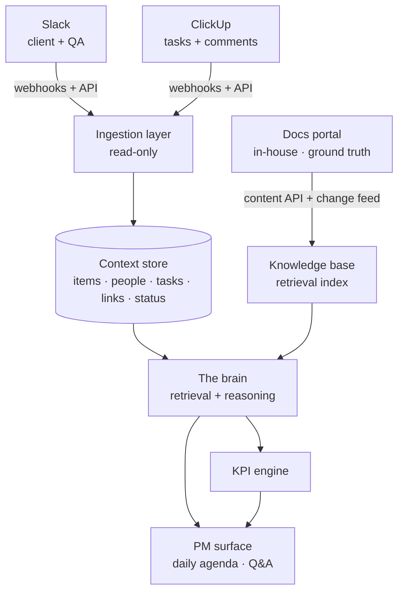

# Keystone — System Architecture

**Version:** 0.1 (draft)
**Companion to:** Keystone PRD v0.1

---

## 1. Overview

Keystone has three logical layers:

1. **Senses** — read-only connectors that pull live activity from Slack and ClickUp, plus a document ingestor for the project docs.
2. **Memory** — a context store (the externalized project state) and a retrieval index over the documentation.
3. **Brain** — a reasoning layer that fuses memory + live signal to answer questions, generate the daily agenda, compute KPIs, and detect drift.

The PM is the only user and interacts through a single surface (a web view and/or a Slack DM).

---

## 2. Components

### 2.1 Ingestion layer (connectors)
- **Slack:** Events API for real-time messages/threads/mentions; Web API for backfill and user lookups. Read-only OAuth scopes.
- **ClickUp:** webhooks for task/comment/status changes; REST API for backfill and detail. Read-only.
- Each connector normalizes its payload into the common `Item` shape (see §3) before it touches the store. Connectors are the only place that knows a vendor's data format — everything downstream is vendor-agnostic.

### 2.2 Document ingestor and knowledge base
- The documentation lives in the team's **in-house docs portal**, so the ingestor is an internal integration the team controls — not a third-party connector. This is a meaningful advantage: the portal can be designed *ingestion-first*.
- The portal exposes a **content API** (fetch a doc with its sections, IDs, and metadata) and emits a **change feed / webhook** on every edit. The ingestor consumes the change feed to re-index incrementally and to trigger drift checks (F7) — no polling, no guesswork about what changed.
- The ingestor chunks and embeds documents into a retrieval index (vector + keyword/hybrid). Because the portal supplies stable doc and section IDs, citations can deep-link straight back to the exact section.
- This index is the brain's *ground truth*: the source it reasons against. The portal's own version history is what makes drift detection cheap (you get diffs for free).

### 2.3 Context store
- The durable, normalized record of project state. Source of truth for "what is open, who is waiting, what links to what."
- Relational store (Postgres) is sufficient at single-project scale. The retrieval index sits alongside it.

### 2.4 The brain (reasoning layer)
- Retrieval-augmented reasoning: given a question (or a scheduled job like "build today's agenda"), it retrieves the relevant docs from the knowledge base and the relevant live items from the context store, then reasons over both with an LLM.
- Always returns answers with citations to the underlying message/task/doc.
- Stateless per request; all state lives in the store and index.

### 2.5 KPI engine
- Derives developer signals from structured events rather than free text where possible (assignments, status transitions, reopen events from ClickUp; escalation mentions from Slack).
- Produces aggregates (escalation load, cycle time, reopen rate) and exposes them to the brain and the PM surface. See PRD F6 caveat — these are PM-only, context-paired signals, not public scorecards.

### 2.6 PM surface
- A thin web view (briefing + chat-style Q&A) and/or a scheduled Slack DM to the PM.
- Read-only in v1: it displays and answers, it does not write back.

---

## 3. Data model (core entities)

- **Item** — normalized unit of activity. Fields: `id`, `source` (slack|clickup), `type` (message|comment|task|status_change), `author` (→ Person), `body`, `timestamp`, `links[]` (→ Task / Doc), `raw_ref` (deep link to source).
- **Person** — `id`, `name`, `role` (client|qa|developer|pm), `source_ids{}`. Capacity fields (current load, estimate) added in Phase 2.
- **Task** — `id`, `clickup_id`, `title`, `status`, `assignee` (→ Person), `linked_items[]`, `linked_docs[]`.
- **Doc** — `id`, `source_ref`, `title`, `chunks[]` (indexed), `version`/`updated_at`.
- **Link** — the correlation between an Item and a Task/Doc. In MVP this is explicit (a task URL pasted in a thread); later it can be inferred.
- **KpiEvent** *(Phase 2)* — `developer`, `event_type` (escalation|reopen|resolution), `task`, `timestamp` — the raw substrate KPIs are aggregated from.

---

## 4. How the brain answers a question (walkthrough)

1. PM asks: *"What's the status of the login work?"*
2. Brain retrieves: relevant doc chunks ("login flow" spec section) from the knowledge base, and relevant live items (recent QA messages, the linked ClickUp task and its status) from the context store.
3. Brain reasons over both and answers: *"QA reports the login bug is still open (Task 47, status In Progress, last update 2 days ago). It maps to section 3 of the spec, which the client approved last month."*
4. Every clause links back to its source item/doc.

The daily agenda is the same flow run as a scheduled job over "open items needing the PM," grouped by person and task.

---

## 5. KPI engine (signals → metrics)

| Signal source | Raw event | Derived metric |
|---|---|---|
| ClickUp status transitions | task reopened | reopen rate per developer |
| ClickUp timestamps | created → done | cycle time |
| Slack escalation mentions | developer pulled into incident | escalation load ("who's getting called") |
| Task ownership + code-ownership (later) | bug filed in owned area | bug responsibility |

Compute on a schedule, store aggregates, never block the live path on KPI computation.

---

## 6. Technology choices (suggested, not prescriptive)

- **Backend:** Node.js (TypeScript) or Python — pick what you'll maintain fastest.
- **Datastore:** Postgres for the context store.
- **Retrieval:** a vector index (pgvector keeps it in Postgres; or a dedicated store) with hybrid keyword search.
- **Reasoning:** an LLM via API for the brain. Keep prompts and retrieval logic in one well-tested module.
- **Connectors:** isolated workers per source, behind a common interface.
- **Scheduler:** a simple cron/worker for the daily agenda and KPI rollups.

At single-project scale this is deliberately boring infrastructure — that's correct. Complexity should live in the brain, not the plumbing.

---

## 7. Security and privacy

- **Read-only scopes** everywhere in v1 — Keystone cannot modify Slack or ClickUp.
- **Client data is present** (the client is in Slack and ClickUp). Treat the store and index as sensitive; encrypt at rest, restrict access to the PM, and keep it single-tenant.
- **KPI data is sensitive** — visible to the PM only.
- When the brain calls an external LLM, be deliberate about what context leaves the system and choose a provider/terms appropriate for client data.

---

## 8. Future (Phase 3)

- **Write-back:** connectors gain scoped write actions (reply, comment, update, assign), each gated by explicit PM confirmation.
- **Inferred linking:** replace manual task-URL linking with model-assisted correlation.
- **Doc updates from drift:** when F7 detects divergence, the brain proposes a documentation edit for the PM to approve — closing the loop between live reality and ground truth. Because the docs portal is in-house, this write-back is a first-party API call against your own system rather than a fragile third-party integration, so it is the *easiest* write path to add — likely before Slack/ClickUp write-back.
