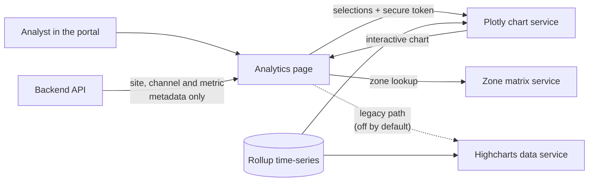

# Analytics

Analytics is the platform's **charting workbench** — where you visualize solar production, irradiance, and performance over time. You can chart at three levels: a single data **channel** (one inverter or sensor), a whole **site**, or a **portfolio** of sites. Pick a chart type, set a date range, choose which metrics and channels to include, adjust the sampling interval, and an interactive chart renders.

One thing worth knowing up front: **the platform's own backend doesn't draw these charts.** It only supplies the metadata (which sites, channels, and metrics exist). The actual time-series charts are produced by separate external charting services. From the user's point of view this is invisible — you just get a chart — but it shapes how the feature behaves (and what can break).

> **Reading this doc:** use the **Business / Developer** switch at the top. *Business* explains what you can chart and how it works. *Developer* adds the three external services, the data feeds, the Dash/Plotly embed mechanics, the component map, the metadata API, file references, and a solar-terminology primer.

---

## Why this matters

A monitoring platform lives or dies on whether people can *see* what their plants are doing. Analytics is that window. It lets an analyst:

- Compare a site's actual production against what it should produce.
- Drill into a single inverter or sensor channel to find the under-performer.
- Roll a whole fleet up into one performance table.
- Pull irradiance, weather, availability, and energy onto the same timeline to explain *why* a number moved.

Because it's flexible, it's also the feature with the most "why is my chart empty?" questions — most of which come down to the rules below (interval vs date range, which metrics are actually available, picking a specific sub-chart).

---

## What you can chart

You choose from a tree of chart types organized by level:

- **Channel charts** — one or more individual channels (e.g. inverter power, sensor irradiance).
- **Site charts** — whole-site views like power analysis, energy, irradiance, availability.
- **Portfolio charts** — multiple sites at once, including a fleet KPI table.
- **Tools** — utility/diagnostic views.

For each you control:

- **Date range** — any window you like, interpreted in the site's local timezone.
- **Metrics** — what's plotted (kWh, EPI, irradiation, availability, …). The list is filtered to what's actually available for that chart and site.
- **Channels / zones** — for channel charts, which channels (optionally grouped into "zones" by orientation/array).
- **Interval** — how finely the data is sampled (raw, 5-minute, hourly, daily, monthly).
- **Auto-refresh** — keep a "today" chart updating live.

---

## How the data flows

The backend supplies only the *metadata*; the chart itself is produced by the external services reading the stored time-series directly.

---

## How charting works

The flow is simple from the outside:

1. Open Analytics, pick a site (or several) and a chart type.
2. Set the date range, metrics, channels, and interval.
3. The chart renders — interactive, zoomable, exportable.

Behind that simplicity, the chart itself is drawn by an external charting service that reads the platform's stored time-series data directly. The platform passes that service your selections (plus a secure token proving who you are) and embeds the result in the page. You can even turn a spot on a chart into an Event (e.g. flag an anomaly) without leaving the view.

There's also an **embeddable** version of any chart — a standalone URL that renders a single chart, used to drop charts into reports and other pages.

---

## Multi-site & fleet charting

Portfolio chart types let you select **several sites at once**. The external service aggregates across them and shows fleet-level results — so you see the combined picture, not per-site breakdowns (drill into a single site for those). The **Fleet KPI table** is a special portfolio view: it filters sites by their service status, then shows a fixed set of performance KPIs (baseline/actual EPI, availability, insolation) at a daily or monthly cadence.

---

## Who can see analytics

Like the rest of the portal, analytics is scoped to your company — you can only chart sites you're entitled to see (SUPER_ADMINs see all). The main Analytics page requires a company; the standalone embedded-chart URL is the one exception (any signed-in user can load an embed).

---

## The rules that matter

- **Interval limits how long a range you can chart.** Finer sampling = shorter maximum window (raw ≈ 7 days, 5-minute ≈ a month, daily ≈ a year, monthly unbounded). Pick too long a range for the interval and it's auto-trimmed.
- **A chart only renders once you've picked everything it needs** — e.g. a channel chart needs both channels and metrics; the bare "portfolio" parent does nothing until you pick a specific sub-chart.
- **Only genuinely available metrics are offered** — the metric list is validated against what the charting service actually has for that site and range, and stale selections are dropped.
- **Dates are always in the site's local time.**
- **Auto-refresh only applies when you're viewing today.**
- **Analytics needs a company** (SUPER_ADMINs excepted); the embedded-chart URL does not.

---

## Entry points & routes {dev}

Sidebar "Analytics" → route `/analytics/:siteId?` (`denowatts-portal/src/router.tsx:260`); also reused inside Site → Energy Accounting tab (`:212`). Stand-alone embed at `/analytics/embedded` (`:617`). The main route is wrapped in `CompanyRequiredRoute` (SuperAdmin bypass); the embedded route is **not** company-gated.

---

## Chart service architecture {dev}

**Three distinct external services**, all authenticated with the portal JWT (`auth.accessToken`), none part of the NestJS backend:

| Service | Env var | Used by | Mechanism |
|---|---|---|---|
| Chart data (legacy) | `VITE_CHART_URL` | `chartApi` RTK Query — POST returns Highcharts dashboard JSON | `store/api/chartApi.ts:7,13,38` |
| Plotly/Dash app (current default) | `VITE_PLOTLY_URL` | `DashApp` from `dash-embedded-component` — renders the full interactive dashboard in-page | `analytics/components/PlotlyDash/PlotlyDash.tsx:255` |
| Zone/metric matrix | `VITE_MATRIX_URL` | `zoneApi` POST `/data/zones` — channel→zone tree + per-zone metrics | `store/api/zoneApi.ts:19,24` |

### Rendering: two paths gated by `enableBetaCharts` {dev}
`AnalyticsPage` picks the engine on `analyticsSettings.enableBetaCharts` (defaults **`true`** — Plotly is live) — `headerSlice.ts:221`, `AnalyticsPage.tsx:148`:
- **`true` → `<PlotlyDash />`** — embeds a Dash app via `DashApp` (`PlotlyDash.tsx:253-260`); Dash fetches the data, the portal does **not** (RTK `getChart` skipped, `AnalyticsPage.tsx:70`).
- **`false` → `<Dashboard config={template(chartData)} />`** — legacy Highcharts: `useGetChartQuery` against `VITE_CHART_URL`, mapped through per-chart templates (`AnalyticsPage.tsx:51-76,94-142`).

### Dash embed (`VITE_PLOTLY_URL`) {dev}
`PlotlyDash` mounts `<DashApp>` with `config = { url_base_pathname: VITE_PLOTLY_URL, auth_token: accessToken, request_refresh_jwt }` and `value = { params: { site, startDate, endDate, channels, metrics, interval, refresh, timezone, print, kpis?, zonesWithMetrics? }, meta: { chart, theme } }` (`:253-260`). `auth_token` is the live JWT; on expiry Dash calls `request_refresh_jwt` → `REFRESH_TOKEN` mutation → `refreshTokens`, else `logout()` (`:29-44`). `value` is memoized; arrays serialized in the dep list (`:85-121`). Dates re-interpreted in site tz: `dayjs.tz(startDate, timezoneToUse).toISOString()` (default `America/New_York`) (`:77-81`). Dash → portal via `window.postMessage` `{ type: 'DASH_EVENT', action: 'create_event' }` opens the Create-Event modal pre-filled from the chart (`:181-234`).

### Embedded variant (`/analytics/embedded`) {dev}
`EmbeddedAnalyticsPage` → `PlotlyEmbeddedDash`: reads params from the **URL query string** via `prepareDashData` (`:36-100,107`); looks up site tz via `GET_SITE` (`:109-127`); `url_base_pathname` = `VITE_PLOTLY_URL` with `my-analytics`→`embedding` (`:141-144`). A third embed (Tests reports) lives at `tests/components/PlotlyDashReport/PlotlyDashReport.tsx:176` — see [[tests]].

---

## Data feeds {dev}

The portal never reads the rollup collections directly; the external services do. See [[data-out]] for storage.

### Legacy Highcharts feed — `VITE_CHART_URL` {dev}
`chartApi.getChart` POSTs `{ type, site, start, end, channels, metrics: [metrics], interval, print }` and receives a dashboard spec (`chartApi.ts:26-53`). `type` = chart value (`sitePowerAnalysis`, `channelPower`, …); `site` = single id or comma-joined; `start`/`end` = `startOf('day')`/`endOf('day')`. **GOTCHA:** wraps the already-array `metrics` in another array (`metrics: [metrics]`, `chartApi.ts:46`) — UNCLEAR if intentional; legacy path only. Result → per-chart template under `analytics/data/templates/`.

### Available-metrics feed — `VITE_CHART_URL/metrics` {dev}
`chartApi.getAvailableMetrics` POSTs `{ type, site, start, end, channels, interval }` → `{ metrics: string[] }` (`chartApi.ts:10-25`). `type` collapses to `'site'` for site/portfolioTable else `'channel'`; skipped for `tools*` and channel charts with no channels (`AnalyticsSettings.tsx:147-159`). Result intersected with GraphQL metrics; stale selections pruned (`:207-218,417-418`).

### Zone feed — `VITE_MATRIX_URL/data/zones` {dev}
`zoneApi.getZones` POSTs `{ site, channels, start, end, interval }` → `{ metrics, zones: Record<zoneKey, metricNames[]> }` (`zoneApi.ts:24-37`). Only when site + ≥1 channel + dates + interval are set (`useZone.ts:33-34`). Zone keys (`zone.1`, `zone.1.1`, …) natural-sorted into a 3-level tree (`:46-70`); selected zones' union of metrics → `zonesWithMetrics` → Plotly (`AnalyticsSettings.tsx:184-220`).

### KPI feed (portfolio table) {dev}
`portfolioTable` uses a fixed KPI set `['rBepi','rEpi','rEpiInService','rAvailabilityEnergy','rAvailabilityEquipment','rBaselineInsolation']` (`data/kpis.ts:1-8`); added to Plotly `params.kpis` when present (`PlotlyDash.tsx:97`).

### Underlying storage (served by external services) {dev}
Per [[data-out]]: `channelrollup`, `siterollup`, `sitedailyrollup` (`nrgProducedPred` noted "used by Plotly fleet summary"). Fleet-table data overlaps the report fleet-summary pipeline ([[report]] `POST /api/report/fleet/summary`). UNCLEAR whether the chart services proxy that endpoint or compute independently — both external from the portal's view.

---

## Frontend components {dev}

- **AnalyticsPage** (`analytics/AnalyticsPage.tsx`) — picks PlotlyDash vs Dashboard (`:144-160`); pre-fetches `GET_CHANNELS` for channel charts (`:42-49`); legacy `useGetChartQuery` with conditional polling (`:51-76`); render gate via `shouldRenderChart` (`:147`, `utils/index.ts:30-58`).
- **AnalyticsSettings** (`components/AnalyticsSettings.tsx`, ≈2,359 lines) — the control panel: site/chart-type/date/channel/zone/metric/interval selectors, auto-refresh, print, fault modal. Fires `GET_SITES`/`GET_CHANNELS`/`GET_METRICS`, `useGetAvailableMetricsQuery`, `useZone`; persists to Redux + URL. Chart catalog with `channelPatterns` regex in `data/analytics-charts.ts:13-206`.
- **PlotlyDash** / **PlotlyEmbeddedDash** — the Dash embeds (above).
- **Dashboard** (legacy Highcharts) — used only when `enableBetaCharts === false`; chart components under `components/Dashboard/components/charts/`.
- **Supporting** — `MultiSelectDropdown/`, `FaultDescriptions/`, `utils/searchParams.ts`, `utils/zonePatternParser.ts`, `hooks/useZone.ts`, `data/templates/*.ts`.

---

## GraphQL / data API surface {dev}

The NestJS backend serves **only metadata** — there is **no backend analytics resolver or chart-data endpoint** (`find … -path "*analytics*"` returns only the unrelated Lattigo type).

| Operation | Input | Output | Resolver |
|---|---|---|---|
| `metrics` (`GET_METRICS`) | `GetMetricsInput` (default `{}`) | `[Metric]` (`name`, `displayName`, `unit`, `tags`, `channelPrefixes`, `zone`, `isKpi`, …) | `metrics.resolver.ts`; see [[metrics]] |
| `sites` (`GET_SITES`) | none | site list incl. `timezone` | company-scoped; see [[site]] |
| `site(id)` (`GET_SITE`) | `id` | single site incl. `timezone` | used by the embedded page to localize dates |
| `channels(filter)` (`GET_CHANNELS`) | `{ sites: [...] }` | channel list | company-scoped; see [[channels]] |
| `REFRESH_TOKEN` | refresh token | new access token | Dash `request_refresh_jwt` + RTK reauth — `PlotlyDash.tsx:29-44`, `baseApi.ts:59-71` |

GraphQL metric definitions also drive per-company display-name translation (`companyWiseName`) — see [[metrics]].

---

## Multi-site charting (detailed) {dev}

Multi-site is enabled for `portfolio*` charts: the site selector becomes multi-select and `site` is a **string array** in Redux; other charts collapse it to a single string (`AnalyticsSettings.tsx:761-861`). URL handling mirrors this (`:1464-1474`). Legacy request joins sites with commas (`AnalyticsPage.tsx:58`); Plotly passes the array in `params.site` (`PlotlyDash.tsx:90,115`). `portfolioTable` filters sites by service status first (no status → no sites), uses the fixed KPI set, default interval `1d`, 7-day default range (`AnalyticsSettings.tsx:670-673,1403-1413`). The external service aggregates; per-site breakdown isn't shown in aggregated charts.

---

## Business rules (cited) {dev}

- **No company → no analytics** — `/analytics/:siteId?` in `CompanyRequiredRoute` (SuperAdmin bypass), `router.tsx:260-261`; `/analytics/embedded` not company-gated (`:617`).
- **Defaults:** chart `sitePowerAnalysis`, range last 7 days (ending yesterday), interval `5m`, beta ON — `headerSlice.ts:203-226`.
- **Render guard per family** — `utils/index.ts:30-58`: `channel` needs channels+metrics; `channel*` needs channels; `site` needs metrics; bare `portfolio` never renders.
- **Interval → max date span** — `AnalyticsSettings.tsx:465-482`: raw 7d, 5m 31d, 1h 31d, 15m 180d, 1d 365d, 1mo unbounded; over-long ranges auto-clamped (`:566-575`).
- **Default span by family+interval** — `:487-509`. **Interval options by family** — `:514-558` (channel {raw,5m,1h}; site {5m,15m,1h,1d}; portfolio {1d,1mo}).
- **Metrics server-validated** — intersection of `GET_METRICS` and the chart service `/metrics`; stale pruned (`:132-218`).
- **Channel availability filtered client-side by regex** from `analytics-charts.ts` `channelPatterns` via `testPattern` (`:22-55`, `utils/index.ts:14-26`).
- **Auto-refresh only when viewing today** — `AnalyticsPage.tsx:71-74`; Plotly `setInterval` (`PlotlyDash.tsx:123-137`).
- **Dates tz-localized to site, stored UTC ISO** — `PlotlyDash.tsx:77-81` (fallback `America/New_York`).
- **External-service auth** — all three get the JWT; 401 → refresh or logout (`baseApi.ts:51-71`, `PlotlyDash.tsx:29-44`).

---

## Edge cases & gotchas {dev}

- **`metrics: [metrics]` double-nesting** in legacy `getChart` — `chartApi.ts:46`. UNCLEAR; legacy path only.
- **Two render engines, one defaulting on** — `enableBetaCharts` defaults `true`, so the legacy path + templates are dormant unless beta is turned off — `headerSlice.ts:221`, `AnalyticsPage.tsx:70,148`.
- **Three single points of failure** — `VITE_CHART_URL`/`VITE_PLOTLY_URL`/`VITE_MATRIX_URL` are independent externals with no in-portal cache/fallback; legacy shows "Something went wrong!" on error (`AnalyticsPage.tsx:88-90`).
- **Embedded base path is a string substitution** — `my-analytics`→`embedding` assumes that substring exists in `VITE_PLOTLY_URL` (`PlotlyEmbeddedDash.tsx:141-144`).
- **"Today" data is non-deterministic** — rollups finalize over time (handled by the external services).
- **Metrics not validated against chart semantics** — availability only; an available-but-irrelevant metric can yield an odd chart.
- **Portfolio aggregation hides per-site values** — pick a single site for those.
- **State lives in Redux + URL** (main page) vs URL-only (embedded); URL parsing supports comma-separated and legacy repeated params (`utils/searchParams.ts`).
- **Token expiry → forced logout** if `REFRESH_TOKEN` fails (`PlotlyDash.tsx:41-43`, `baseApi.ts:69`).

---

## Solar & platform terminology {dev}

- **Channel** — one measured data stream from the site (an inverter's output, a sensor reading). The finest charting level. See [[channels]].
- **Zone** — a group of channels sharing orientation/array, used to chart by physical grouping rather than individual channel.
- **Metric** — a named measured quantity (kWh, AC power, POA irradiance, EPI, availability). See [[metrics]].
- **Irradiance vs irradiation** — instantaneous sunlight power (W/m²) vs energy accumulated over time (kWh/m²).
- **POA** — Plane-Of-Array: irradiance measured in the plane the panels actually face (the meaningful one for performance).
- **EPI / BEPI** — Energy Performance Index (actual ÷ expected) and its baseline variant; central KPIs in the fleet table.
- **Availability** — the share of time equipment (or energy capacity) was up and producing.
- **Interval / resolution** — how finely time-series is sampled (raw, 5-minute, hourly, daily, monthly); trades detail for range.
- **Rollup** — pre-aggregated time-series (per channel, per site, daily) that the charting services read instead of raw points. See [[data-out]].

For the full domain vocabulary, see [[solar-glossary]].

---

**Related flows:** [[data-out]] · [[report]] · [[metrics]] · [[site]] · [[portfolio]] · [[channels]] · [[tests]] · [[solar-glossary]]
