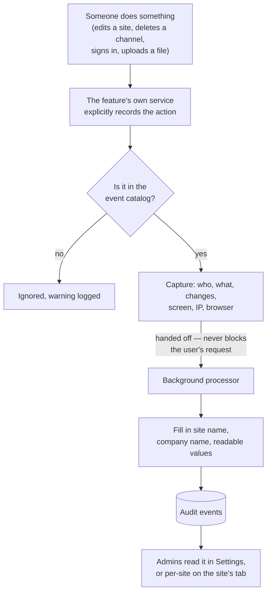

# Audit Trail

The **Audit Trail** is the platform's business-readable accountability record: a plain-English feed of the things people actually *did* — "Sarah changed the alarm threshold on Osgood Solar from 5 kW to 8 kW", "a channel was deleted", "a user's role changed". Each entry names who did it, what they touched, what changed from what to what, and from which screen.

> **Reading this doc:** use the **Business / Developer** switch at the top. *Business* explains what is recorded, who can read it, and the rules that govern it. *Developer* adds the event catalog, the record/emit/persist pipeline, name resolution, access scoping, schema and index design, file references, and a terminology primer.

> **Not the same thing as [[system-logs]].** The Audit Trail is a curated, human-facing record of ~53 named business actions. System Logs is the exhaustive *developer* log of every database write, request error, email and integration call. The two are deliberately separate features with separate pages, separate collections, and separate audiences — `denowatts-backend/src/system-logs/events/system-log.events.ts:14-23`.

---

## Why this matters

When a site's configuration suddenly looks wrong, an alarm threshold changed, or a user account disappeared, this is the feed that answers *who changed this, when, from what, and from where*. It is the layer support and compliance reach for first, and — unlike the developer log — it is readable by a customer's own admins, not just Denowatts staff.

---

## What replaced what

This feature is **new**, and it arrived alongside a rename that matters for anyone reading older docs:

- The old `activity-logs` module was **renamed** to `system-logs`; its Mongo collection was renamed `activitylogs` → `systemlogs` by a one-time idempotent migration — `denowatts-backend/src/system-logs/migrations/rename-collection.migration.ts:1-12`.
- The Audit Trail described here is a **separate, purpose-built feature** added on top, not a rename of that module — `denowatts-backend/src/audit-trail/audit-trail.module.ts:15-19`.

The previous `activity-logs.md` doc described the old module and is superseded by [[system-logs]] plus this doc.

---

## How an entry is created



Two properties are deliberate: **recording never blocks or breaks the action** being audited, and **entries are only created where a developer explicitly asked for one** — there is no blanket "log everything" hook.

---

## What gets recorded

**Sixty-five** named actions, grouped into twelve categories — `denowatts-backend/src/audit-trail/audit-event.catalog.ts`:

| Category | Examples |
|---|---|
| Site configuration | site created / updated / deleted, **workflow deployed** |
| Energy model | energy model + predicted model created / updated / deleted, energy block updated |
| Hardware | channel created / updated / deleted; asset registered / updated / calibrated / retired; **gateway firmware updated / rebooted / config written / config write failed / SIM state changed** |
| Alarms | alarm rule created / updated / deleted |
| Reports | report template created / updated / deleted, report exported |
| Users & access | user invited / signed up / updated / role changed / removed; site access granted / revoked |
| Company | company updated |
| Sign-in | signed in, password changed |
| Billing | API key generated / revoked, quote created / deleted |
| Files | Denobox file added / updated / moved / deleted, folder created |
| Tickets & notes | ticket opened / updated / commented / deleted; event created / updated / commented / deleted |
| System | notification sent / failed |

Each action carries a **severity** — `info`, `warning`, or `critical`. Deletions and revocations are the ones marked warning or critical, so "show me only the risky things" is one filter click. `gateway.config_write_failed` is a `warning`: a *failed* gateway write is itself an auditable event, not just a silent error — `denowatts-backend/src/audit-trail/audit-event.catalog.ts:125-129`. `site.workflow_deployed` records the channel-mapping count alongside the deployment — `:45-49`.

Fourteen backend services record into the trail today: auth, sites, energy models, channels, assets, users, companies, alarm config, events, comments, report templates, storage (Denobox), and quotes.

---

## What an entry tells you

- **Who** — the person's name, email, role and company, *snapshotted at the time* so the trail stays readable even if they are later renamed or removed — `denowatts-backend/src/audit-trail/schemas/audit-event.schema.ts:5-8`.
- **What** — the resource type, its id and its name.
- **Where in the product** — the screen the request came from and which app (Portal, Mobile App, or "API"), plus IP and browser.
- **What changed** — a field-by-field before/after list, with references shown as names rather than raw ids.
- **Which site** — when the thing belongs to one, which drives the per-site tab.

---

## Who can see it

- **Denowatts SuperAdmins** see everything.
- **Company admins** see their own company's events plus events on any site their company owns or has access to — `denowatts-backend/src/audit-trail/audit-trail.service.ts:321-333`.
- **Plain users see nothing** — the queries are restricted to Admin and SuperAdmin roles — `denowatts-backend/src/audit-trail/audit-trail.resolver.ts:14`.
- A user with **no company** sees an empty trail (deliberately, not accidentally — the scope resolves to `{ _id: { $exists: false } }`, a query that matches nothing) — `denowatts-backend/src/audit-trail/audit-trail.service.ts:338-340`.

### The visibility model {dev}

Access is **stamped at write time and widened at read time** — two different mechanisms, and the split matters.

**At write time** the processor computes a `visibility[]` array on the event: one entry per company allowed to see it, each tagged with *why* — `denowatts-backend/src/audit-trail/audit-trail.processor.ts:67-92`.

| `reason` | Which company |
|---|---|
| `actor` | The company of whoever performed the action — always stamped |
| `subject` | The company acted **upon**, added only when the resource is a company (the resource id *is* the company) or a user (looked up to find their company) |

Entries are de-duplicated by company id, so a user acting within their own company yields a single entry. `RESOURCE_REF_TYPES[event.resource.type]` decides whether a subject company applies at all.

**Site visibility is deliberately *not* stamped.** It resolves at read time instead:

```
{ $or: [ { "visibility.company": user.company },
         { site: { $in: <sites the company currently owns or accesses> } } ] }
```

— `denowatts-backend/src/audit-trail/audit-trail.service.ts:331-346`.

That asymmetry is the design: **site history follows the site.** If a site moves to a different company, the new owner immediately sees its whole audit history, and the old owner stops seeing it — without rewriting a single stored event. Company-scoped visibility, by contrast, is frozen at the moment of the action.

**The indexes follow the same shape.** Every index ends with `{ createdAt: -1, _id: -1 }` — the list sort, with `_id` breaking same-millisecond ties. There is a `visibility.company` compound index for each portal filter (category, severity, actor) plus unscoped equivalents for the super-admin view and the site tab — `denowatts-backend/src/audit-trail/schemas/audit-event.schema.ts:195-205`.

`visibility` is **not exposed over GraphQL** — it is an internal access-control field — `denowatts-backend/src/audit-trail/schemas/audit-event.schema.ts:168-173`.

---

## Names are shown as they are *today*

A subtle but important reading rule: people, sites and equipment are displayed under their **current** names, not the names they had when the event was recorded. The stored snapshot is only used as a fallback when the referenced record no longer exists — `denowatts-backend/src/audit-trail/audit-trail.service.ts:201-207`.

Values that are *not* references — a renamed site's old and new name, a threshold that moved from 5 to 8 — are history and stay exactly as recorded.

The swap is all-or-nothing per value: if a field references three users and one has been deleted, the stored text is kept rather than showing a partly-resolved list — `:248-257`.

The lookups themselves live in `AuditRefNameService` — `denowatts-backend/src/audit-trail/audit-ref-name.service.ts`. It exposes `name(ref, id)` for a single reference and `names(ref, ids)` for a batch, resolving **one query per entity type** rather than one per reference, so a page of events costs a bounded number of round trips. `AuditRefType` enumerates the catalog resource types that name a lookup-able document.

---

## The rules that matter

- **Auditing never breaks the thing being audited.** Both the recording call and the background write catch and swallow their own errors (logged, and reported to Sentry) — `denowatts-backend/src/audit-trail/audit-trail.service.ts:183-187`, `denowatts-backend/src/audit-trail/audit-trail.processor.ts:52-55`.
- **Entries are append-only by convention.** No code path updates or deletes an audit event — `denowatts-backend/src/audit-trail/schemas/audit-event.schema.ts:117-121`. This is a convention, not a database constraint — see the gotchas.
- **An unknown event type is dropped**, with a warning — the catalog is the whitelist — `denowatts-backend/src/audit-trail/audit-trail.service.ts:94-98`.
- **The originating screen is client-declared, never guessed.** The portal sends `x-source-page` and `x-source-client`; a request with neither is honestly labeled "API" rather than being attributed to a screen — `:135-152`, `denowatts-portal/src/apolloClient.ts:54-55`.
- **Passwords are never a recorded field.** The diff helper ignores `_id`, `__v`, `createdAt`, `updatedAt` and `password` outright — `denowatts-backend/src/audit-trail/audit-change.util.ts:4`.
- **Failed sign-ins are not in this trail.** Only successful logins are recorded here (`auth.signed_in`); failures go to the developer [[system-logs]] only — an explicit product decision — `denowatts-backend/src/auth/interceptors/auth-audit.interceptor.ts:42-43`.
- **Audit events do not audit themselves.** The `auditevents` collection is excluded from System Logs' own hooks, so creating an audit entry doesn't generate a second log row about it — `denowatts-backend/src/system-logs/events/system-log.events.ts:14-23`.
- **A page of results is capped at 100** — `denowatts-backend/src/audit-trail/audit-trail.service.ts:194`.

---

## Entry points {dev}

| Surface | Route | Guard | File |
|---|---|---|---|
| Settings → Audit Trail | `/settings/audit-trail` | `requireAdminOrSuperAdmin` | `denowatts-portal/src/routes/_dashboard/settings/audit-trail.tsx:5-9` |
| Site → Audit Trail tab | `/site/:siteId/audit-trail` | `requireNonUser` | `denowatts-portal/src/routes/_dashboard/site/{-$siteId}/_tabs/audit-trail.tsx:5-11` |

Portal feature: `denowatts-portal/src/features/audit-trail/` — pages `AuditTrailPage.tsx` / `SiteAuditTrailPage.tsx`, data boundary `hooks/useAuditEvents.ts`, presentation catalog `utils/eventCatalog.ts`, sentence rendering `utils/humanize.ts`, server→UI mapping `utils/mapServerEvent.ts`, detail drawer `components/AuditDetailDrawer.tsx`.

> **The portal keeps its own mirror of the event catalog** for presentation (sentences, pills). The two catalogs must be kept in sync by hand when an event type is added — `denowatts-backend/src/audit-trail/audit-event.catalog.ts:1-5`, `denowatts-portal/src/features/audit-trail/utils/eventCatalog.ts`.

---

## API surface {dev}

`denowatts-backend/src/audit-trail/audit-trail.resolver.ts` — the whole resolver is `@Roles(UserType.SUPER_ADMIN, UserType.ADMIN)` and is **read-only**; there is no mutation to write or delete an audit event.

```graphql
query auditEvents(filter: AuditEventFilterInput!): AuditEventPaginateResponse!
query auditEventFilterOptions: AuditEventFilterOptions!
```

`AuditEventFilterInput` — `denowatts-backend/src/audit-trail/dto/audit-event.input.ts:6-56`: `page` (≥1, default 1), `limit` (1–100, default 25), `search`, `category`, `severity`, `actorId`, `siteId`, `startDate`, `endDate`.

`severity` accepts the pseudo-value **`issues`**, which expands to `warning` **or** `critical` — `denowatts-backend/src/audit-trail/audit-trail.service.ts:345-347`.

`auditEventFilterOptions` returns the distinct actors and sites present in the caller's *scoped* slice of the trail, so the dropdowns never leak the existence of entities the user can't see — `:282-319`.

Client documents: `denowatts-portal/src/features/audit-trail/api/auditTrailQueries.ts:3,46`. The single data boundary is `useAuditEvents`, which does server-side filtering and pagination with `cache-and-network` and falls back to `previousData` to avoid a flash of empty state — `denowatts-portal/src/features/audit-trail/hooks/useAuditEvents.ts:16-49`.

---

## Recording pipeline {dev}

**1 — `AuditTrailService.record(input)`** — synchronous, `void`-returning, never throws — `denowatts-backend/src/audit-trail/audit-trail.service.ts:92-188`.

- Looks the `eventType` up in `AUDIT_EVENT_CATALOG`; unknown → warn and return — `:94-98`.
- Resolves the actor from the current request via `nestjs-request-context` (AsyncLocalStorage). An explicit `actor` overrides it — needed for failed sign-ins and background jobs. With no request user at all, the actor is **"Denowatts System"** with role `SYSTEM` — `:100-130`.
- Builds `context`: `ip` (falling back to `socket.remoteAddress`), `user-agent`, and the client-declared page/client headers. Header values are stripped of non-printable characters and truncated to 64 chars — `:139-152`.
- Formats each change's `before`/`after` through `formatAuditValue` — `:167-173`.
- Emits `AUDIT_EVENT_CAPTURED` and returns. **The caller is not awaited on persistence** — `:182`.

`RecordAuditEventInput` — `:38-60`: `eventType`, `resource` (`name` required, `type` defaults from the catalog), optional `site`, `target` (secondary sentence subject — a folder path, a company name), `changes`, a `severity` override, and an `actor` override.

**2 — `AuditTrailProcessor`** — `@OnEvent(AUDIT_EVENT_CAPTURED, { async: true })` — `denowatts-backend/src/audit-trail/audit-trail.processor.ts:32-56`.

- Fills in the site name and the actor's company name when the capture site didn't have them.
- Resolves reference changes: ids marked with a `ref` become readable names **while the ids themselves are kept** in `beforeIds` / `afterIds`, so a later rename or deletion never loses the value — `:58-92`.
- An id with no known entity type can't be named, so the display value is nulled and only the id kept — `:69-80`.
- Values may be a single id or a comma-joined list; both are handled — `:94-104`.
- Persists, then swallows any error.

**Value formatting** — `formatAuditValue` — `denowatts-backend/src/audit-trail/audit-event.catalog.ts`: `null`/empty → `—`, booleans → `Enabled`/`Disabled`, dates → `YYYY-MM-DD`, empty arrays → `None`, objects → their `name` (or `(object)`), and underscored ALL_CAPS strings → Title Case. Single-word ALL_CAPS (serials, state codes) are **not** humanized unless the field is listed in `AuditDiffOptions.enums`.

**Reference inference** — when a call site doesn't declare `ref`, `refTypeForField` infers it from the field name via `REF_FIELD_HINTS` (`managers`/`assignee`/`createdBy` → user, `owner`/`parentCompany` → company, `gateway` → channel, `radio` → asset, …), matching on the leaf of a dotted path — `denowatts-backend/src/audit-trail/audit-change.util.ts:26-55`.

---

## Read pipeline {dev}

`paginate()` builds the query, paginates (sorted `createdAt: -1`, `lean`), then post-processes through `withCurrentNames()` — `denowatts-backend/src/audit-trail/audit-trail.service.ts:190-199`.

`withCurrentNames()` collects every referenced id across the page (actor user, actor company, site, resource, and each change's before/after ids), batches one lookup per entity type via `AuditRefNameService`, and swaps in current names — `:208-279`. Legacy rows recorded before ids were stored still resolve, because ids are re-extracted from the display text when `beforeIds`/`afterIds` are empty — `:217-221`.

`buildQuery()` composes an `$and` of the access scope plus each supplied filter. **Search is a case-insensitive regex with the user input escaped** (`escapeRegex`), matched across actor name/email, resource name, site name, event type and target — `:335-377`, `:73`.

---

## Schema {dev}

`denowatts-backend/src/audit-trail/schemas/audit-event.schema.ts` — collection **`auditevents`**, `timestamps: true`.

| Field | Notes |
|---|---|
| `eventType` | Catalog key, e.g. `channel.deleted` |
| `category`, `severity` | Denormalized from the catalog at record time |
| `actor` | Sub-doc: `user`, `name`, `email`, `role`, `company`, `companyName` — snapshotted — `:5-35` |
| `resource` | Sub-doc: `type`, `id`, `name`. **`id` is a String, not ObjectId** — some resources are S3 paths or composite ids — `:45` |
| `site`, `siteName` | Owning site; drives the site tab |
| `company` | Actor's company at record time; drives org-scoped reads |
| `target` | Secondary sentence subject |
| `changes[]` | `field`, `kind` (`updated`/`added`/`removed`), `before`, `after`, `ref`, `beforeIds[]`, `afterIds[]` — `:55-88` |
| `context` | `ip`, `userAgent`, `page`, `client` — `:90-110` |

Six indexes, each `createdAt: -1` compound — `:182-190`: `{createdAt}`, `{site, createdAt}`, `{company, createdAt}`, `{category, createdAt}`, `{severity, createdAt}`, `{"actor.user", createdAt}`.

**The module is `@Global()`** so any service can inject `AuditTrailService` without module wiring — `denowatts-backend/src/audit-trail/audit-trail.module.ts:20`.

---

## Data touched {dev}

- `auditevents.*` — inserted by the processor, read by the resolver. Never updated or deleted by application code.
- `sites._id` — `distinct()` lookup to resolve a company admin's accessible sites for scoping — `denowatts-backend/src/audit-trail/audit-trail.service.ts:329-331`.
- `users`, `companies`, `sites`, `channels`, `assets`, `alarmconfigs` — read-only name lookups via `AuditRefNameService` — `denowatts-backend/src/audit-trail/audit-trail.module.ts:23-31`.

---

## Edge cases & gotchas {dev}

- **Append-only is a convention, not a constraint.** Nothing in the schema or database prevents an update or delete of an audit event; only the absence of such a code path does — `denowatts-backend/src/audit-trail/schemas/audit-event.schema.ts:117-121`. Flag for human review if tamper-evidence is ever a compliance requirement.
- **There is no retention policy or TTL.** `auditevents` grows without bound.
- **Coverage is opt-in, so absence of an entry is not proof of absence of the action.** Only the ~53 catalogued actions at the fourteen call sites are recorded; a code path that forgets to call `record()` leaves no trace here. Some events were deliberately removed after being added — `git log` shows `refactor(audit-trail, channels, sites): remove audit trail recording for specific events`.
- **The two catalogs can drift.** Backend `audit-event.catalog.ts` and portal `utils/eventCatalog.ts` are kept in sync by hand; a new backend event type with no portal entry renders without its sentence/pill.
- **A dropped event is invisible to the caller.** `record()` returns `void` and swallows everything, so a typo'd `eventType` or a failed write is only discoverable in logs/Sentry.
- **Search is an unanchored regex across six fields** with no text index. It scans within the scoped set; fine at current volumes, but it will not use an index — `denowatts-backend/src/audit-trail/audit-trail.service.ts:362-374`.
- **`filterOptions` runs two unbounded aggregations** over the caller's whole scoped slice on every page load, with no limit — `:287-298`.
- **Client-declared source can be spoofed.** `x-source-page` / `x-source-client` are trusted as sent (sanitized and truncated, but not verified), so `context.page` is an honest-caller signal, not evidence — `:135-152`.
- **`resource.id` is a string**, so it cannot be indexed against another collection's `_id` or joined without a cast — `denowatts-backend/src/audit-trail/schemas/audit-event.schema.ts:45`.
- **Failed sign-ins are absent by design** — an admin investigating a break-in attempt must use [[system-logs]], which they can only reach as a SuperAdmin — `denowatts-backend/src/auth/interceptors/auth-audit.interceptor.ts:42-43`.

---

## Solar & platform terminology {dev}

- **Audit trail** — the business-readable record of who did what; here, a curated set of catalogued actions, distinct from the exhaustive developer log.
- **Actor** — the person (or "Denowatts System") who performed the action, snapshotted at record time.
- **Resource** — the thing acted upon: a site, channel, asset, alarm rule, report template, file, user, quote.
- **Event type** — the catalog key (`site.updated`, `channel.deleted`) that determines category, severity and resource type.
- **Severity** — `info` / `warning` / `critical`; `issues` is the filter shorthand for the latter two.
- **Reference change** — a changed field whose value is an id; stored with both the readable name and the id so renames and deletions don't lose it.
- **Denobox** — the site's gateway file library; its file/folder actions are audited under the *files* category. See [[storage]].
- **Site access** — a company's granted access to a site it doesn't own; both the grant and the revoke are audited, and access drives who can read the trail. See [[site]] and [[companies]].
- **Energy block** — a component of a site's energy model (soiling, vegetation, degradation …); block edits are audited separately from the model itself. See [[energy-model]].
- **Alarm rule** — an [[alarm-config]] definition; creating, editing or deleting one is audited.
- **API key** — the credential for the [[data-out]] device-data API; generation and revocation are audited under billing.

For the full domain vocabulary, see [[solar-glossary]].

---

**Related flows:** [[system-logs]] · [[authentication]] · [[users]] · [[companies]] · [[site]] · [[channels]] · [[assets]] · [[alarm-config]] · [[energy-model]] · [[events]] · [[report]] · [[storage]] · [[quote]] · [[settings]] · [[deno-ai]] · [[solar-glossary]] · [[email]]
