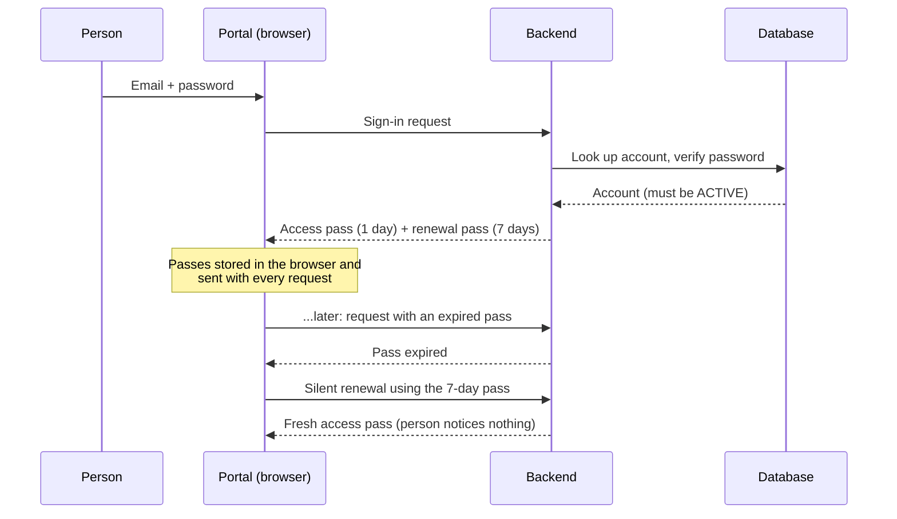

# Authentication

Authentication is the front door to the DenoWatts portal. It decides **who gets in, what they're allowed to see, and for how long**. Everything else in the product sits behind it.

In plain terms: a person creates an account, proves they own their email, and then signs in. From that point on they carry a short-lived "pass" that the system checks on every request. Their **role** and their **company** decide what they can actually do once inside.

> **Reading this doc:** use the **Business / Developer** switch at the top. *Business* shows the plain-language logic only. *Developer* adds the implementation — API calls, tokens, services, schemas, file references — plus a solar-terminology primer.

---

## Why this matters

Authentication isn't just "security tech." It's how DenoWatts guarantees four things the business depends on:

- **Customers see only their own data** — Acme Corp can never see Beta Inc's sites, energy data, or invoices.
- **Technicians get the right access** — a field tech can see live data and edit configs, but can't delete sites or create users.
- **Owners can delegate without losing control** — an account owner invites admins who manage users, but can't spin up new companies.
- **Everything is auditable** — every login, export, and settings change is recorded (see the Activity Logs feature).

---

## How the data flows

---

## Roles: three levels of access

Every person has exactly one role. It travels with them everywhere in the portal.

**USER — read-only**
- Can view portfolio, sites, status, and analytics.
- Cannot change anything, and cannot open Settings or user management.
- *Typical person:* a customer's executive checking monthly production numbers.

**ADMIN — manages their own company**
- Sees everything their company can access.
- Can edit site configuration, add notes, and manage site managers.
- Cannot create or delete users, change roles, or touch system-wide settings (modules, inverters, templates, remote management).
- *Typical person:* a company operations manager coordinating technicians.

**SUPER_ADMIN — runs the platform**
- Full access across every company.
- Can create and edit users, manage companies, and configure system defaults.
- Can view or export any company's data.
- *Typical person:* a DenoWatts support engineer or system integrator.

> A SUPER_ADMIN always passes any permission check, anywhere, by design.

---

## Company scoping: tenant isolation

**The rule:** unless you are a SUPER_ADMIN, you only ever see your own company's data.

- Alice (ADMIN at Acme) logs in → sees Acme's 50 sites, nothing else.
- Bob (ADMIN at Beta) logs in → sees Beta's 30 sites, nothing else.
- Charlie (SUPER_ADMIN) logs in → sees all 80, can switch between companies, and can export.

This boundary is enforced on the server, not just hidden in the screens — so there is no way to "peek" at another company by editing a URL.

---

## Account states

An account is always in one of three states:

- **PENDING** — the person signed up but hasn't clicked the email verification link yet. They cannot log in. If they try, the system quietly re-sends the link instead of letting them in.
- **ACTIVE** — verified and good to go. This is the normal state. Company auto-assignment happens at the moment of verification.
- **DELETED** — deactivated. The person can't log in even with the right password, but the record is kept for audit and compliance. They're simply told the account no longer exists.

Only **ACTIVE** accounts can sign in.

---

## Sessions, in plain terms

Once you're in, you stay in without re-typing your password all day:

- Your "pass" is **short-lived** — about a day. Every action you take silently presents it.
- When it expires, the browser **silently renews it** in the background using a longer-lived (about a week) renewal credential. You never see a "session expired" message unless you've been gone for over a week.
- The short life of the pass is deliberate: if one is ever stolen, it's only useful briefly.

---

## The rules that matter

The *why* behind the screens — worth knowing before anything else:

- **Accounts start locked.** New accounts are PENDING until the email link is clicked; trying to log in before that re-sends the link rather than letting the person through.
- **Only ACTIVE users can log in.** PENDING and DELETED are both turned away.
- **Everyone is scoped to their company** unless they're a SUPER_ADMIN — enforced on the server.
- **Passwords are held to a standard.** Minimum 8 characters, always stored scrambled (never as plain text). Older accounts on a legacy scrambling method are silently upgraded to the modern one the next time they log in successfully — security improves with no action from anyone.
- **We don't reveal who has an account.** "Forgot password" always gives the same success message, even when no account uses that email, so outsiders can't fish for valid addresses.
- **Verification emails can't be spammed.** A person can re-request the confirmation email only on a back-off schedule — 2, then 5, then 15, then 60 minutes — capped at 5 times a day.
- **Joining a company can be automatic.** When someone verifies their email, if their email domain belongs to a known company, they're auto-assigned to it — no manual invite needed.
- **Each link knows its job.** A password-reset link can only reset a password; an email-verification link can only verify email. One can't be used in place of another.

---

## Where it lives

The screens a person actually touches:

- **Sign in**
- **Sign up**
- **"Check your email" holding page**
- **Email verification** (opened from the link in the email)
- **Forgot password**
- **Set a new password** (opened from the reset link)

---

## Who can open what

Signing in is only the first gate. The portal also fences off whole areas by role and company, quietly redirecting anyone who isn't allowed:

- **Platform-only areas** (system settings, user management) are visible to SUPER_ADMINs only. Everyone else is bounced to a "not found" page.
- **Admin-and-up areas** turn away read-only USER accounts.
- **Company-required areas** need a company assigned to your account — with two exceptions: SUPER_ADMINs (who aren't tied to one company) and the Quote Management screen (deliberately open without one).

In every case, a signed-out visitor has their intended destination remembered, so after signing in they land exactly where they were headed.

---

## GraphQL / REST API surface {dev}

The entire auth surface is **GraphQL mutations** on `AuthResolver` (`denowatts-backend/src/auth/auth.resolver.ts`). The whole resolver class carries `@Public()` (`:20`), so the global `JwtAuthGuard` skips it by default — except the two mutations marked `@Private()`, which require a valid JWT. There are no auth REST endpoints; the JWT strategy reads the `Authorization: Bearer <token>` header on every other (protected) request.

### Mutations {dev}

| Mutation | Input | Returns | Guard | Resolver |
|----------|-------|---------|-------|----------|
| `login(loginInput: LoginInput!)` | `email`, `password` | `LoginResponse` | Public | `auth.resolver.ts:25-28` |
| `refreshToken(refreshTokenInput: RefreshTokenInput!)` | `token` (JWT) | `LoginResponse` | Public | `auth.resolver.ts:30-33` |
| `signUp(signUpInput: SignUpInput!)` | see `SignUpInput` | `String` (message) | Public | `auth.resolver.ts:35-38` |
| `confirmEmail` | none | `String` (message) | **`@Private()`** | `auth.resolver.ts:40-44` |
| `forgetPassword(forgetPasswordInput: ForgetPasswordInput!)` | `email` | `String` (message) | Public | `auth.resolver.ts:46-49` |
| `changePassword(changePasswordInput: ChangePasswordInput!)` | `newPassword`, `confirmPassword` | `String` (message) | **`@Private()`** | `auth.resolver.ts:51-58` |
| `requestForOtp(requestForOtpInput: RequestForOtpInput!)` | `email` | `String` (message) | Public | `auth.resolver.ts:60-63` |
| `verifyOtp(verifyOtpInput: VerifyOtpInput!)` | `otp`, `email` | `String` (message) | Public | `auth.resolver.ts:65-68` |
| `resendVerification(email: String!)` | `email` | `String` (message) | Public | `auth.resolver.ts:70-73` |
| `updateEmailForVerification(updateEmailForVerificationInput: UpdateEmailForVerificationInput!)` | `email`, `newEmail` | `String` (message) | Public | `auth.resolver.ts:75-81` |

### Input / output types {dev}

Defined in `denowatts-backend/src/auth/dto/auth.input.ts`:

- **`LoginInput`** (`:30-43`): `email` (lowercased via `@Transform`, `@IsEmail`), `password` (`@MinLength(8)`).
- **`RefreshTokenInput`** (`:66-73`): `token` (`@IsJWT`, non-empty).
- **`SignUpInput`** (`:45-64`): picks `email`, `firstName`, `lastName`, `phone` from the `User` schema (`PickType`), plus `password` (`@MinLength(8)`), `phone` (string), optional `recaptchaToken`.
- **`ForgetPasswordInput`** (`:6-13`): `email`.
- **`ChangePasswordInput`** (`:15-28`): `newPassword`, `confirmPassword` (both `@MinLength(8)`).
- **`RequestForOtpInput`** (`:87-94`): `email`.
- **`VerifyOtpInput`** (`:95-106`): `otp`, `email`.
- **`UpdateEmailForVerificationInput`** (`:108-121`): `email`, `newEmail` (both `@IsEmail`).
- **`LoginResponse`** (`:75-85`): `accessToken: String`, `refreshToken: String`, `user: User`. There is **no** `expiry`/`expiresIn` field; the frontend never reads expiry — it relies on a `401`/`UNAUTHENTICATED` round-trip to learn the token expired. The portal's `Login` query also selects `user.themePreference`, `user.lastLoginAt`, etc. (`denowatts-portal/src/graphql/mutations/auth.ts:5-23`).

> Phone is validated as "8–15 digits" in the UI only. The backend `SignUpInput.phone` enforces only `@IsString()` (`auth.input.ts:56-58`) and `User.phone` only `@MaxLength(20)` (`user.schema.ts:69-74`). UNCLEAR whether server-side digit validation was intended — flag for review.

---

## Token model {dev}

There are **three** distinct JWTs, all signed with `JwtService`. Their `type` claim (`JWTType` enum, `denowatts-backend/src/auth/enums/auth.enum.ts`) keeps each from being used for the wrong purpose: `JwtStrategy.validate` rejects any token whose `type` isn't a known `JWTType` (`jwt.strategy.ts:17-18`, `:49-51`).

### Access token — `JWTType.AUTH` {dev}
- **Payload:** `{ sub: user._id, email: user.email, type: 'AUTH' }` — `auth.service.ts:227` / `:260` / `:299`.
- **Secret:** `ACCESS_TOKEN_SECRET`, the default `JwtModule` secret (`auth.module.ts:31`), read by the passport strategy via `secretOrKey` (`jwt.strategy.ts:9-15`, `:29`). Required env var (`denowatts-backend/src/config/env.validation.ts:7`).
- **Algorithm:** default `HS256` (symmetric) — no override is passed to `JwtService.sign`.
- **TTL:** `1h` in development, `1d` otherwise (`auth.service.ts:229`, `:262`, `:301`). The `JwtModule` default `expiresIn: '5m'` (`auth.module.ts:34`) is dead config — every real `sign()` passes an explicit `expiresIn`.
- **Transport:** `Authorization: Bearer <token>` (`jwt.strategy.ts:27`), set on the frontend by the Apollo `authLink` (`denowatts-portal/src/main.tsx:42-53`) and RTK Query `baseApi` (`denowatts-portal/src/store/api/baseApi.ts:19-21`).

### Refresh token {dev}
- **Payload:** `{ sub: user._id }` only — **no `type`, no `email`** (`auth.service.ts:232-238`, `:266-272`).
- **Secret:** a **different** secret, `REFRESH_TOKEN_SECRET` (`auth.service.ts:236`, `:270`; verified at `:288`). Required env var (`env.validation.ts:8`). Different secret + no `JWTType` means it can never pass `JwtStrategy` as an access token.
- **TTL:** `7d` (`auth.service.ts:235`, `:269`).
- **Storage:** **not stored server-side** — no refresh-token collection or user field. The token is stateless and self-validating by signature + expiry, so **there is no server-side revocation list**.
- **Rotation:** **none.** `refreshToken()` returns `refreshToken: input.token` unchanged (`auth.service.ts:308`).

### Email / reset tokens {dev}
- **`CONFIRM_EMAIL`:** `{ sub, type: 'CONFIRM_EMAIL' }`, TTL `1d`, signed with `ACCESS_TOKEN_SECRET` (`auth.service.ts:78-83`, `:107-112`, `:165-170`, `:206-211`). Embedded in `${FRONTEND_URL}/signup/verify/?token=...`; sent as a Bearer token to the `@Private() confirmEmail` mutation.
- **`RESET_PASSWORD`:** `{ sub, type: 'RESET_PASSWORD' }`, TTL `1d`, signed with `ACCESS_TOKEN_SECRET` (`auth.service.ts:340-345`). Embedded in `${FRONTEND_URL}/reset-password/verify/?token=...`; the Bearer token for the `@Private() changePassword` mutation.

### Where tokens live on the frontend {dev}
- **`localStorage`** keys `accessToken` and `refreshToken`. Written on login (`LoginForm.tsx:96-97`), read by Apollo `authLink` (`main.tsx:44`), RTK `baseApi` (`baseApi.ts:19`), and the upload helper (`uploadWithRefresh.ts:43`, `:108`). Mirrored into Redux `authSlice` (`authSlice.ts:18-32`, `:41-49`).
- Logout calls `localStorage.clear()` and redirects to `/signin` (`authSlice.ts:50-57`).

---

## Services {dev}

### AuthService — `denowatts-backend/src/auth/auth.service.ts` {dev}

Class constants: `RESEND_DELAYS = [2,5,15,60]` minutes and `DAILY_LIMIT = 5` (`:34-35`). Injected: `UsersService`, `JwtService`, `ConfigService`, `EmailService`, `CompaniesService`, `GoogleRecaptchaValidator`, and the `Otp` model (`:37-45`).

#### `signUp(signUpInput): Promise<string>` — `:47-92` {dev}
- If `recaptchaToken` present, validate via `GoogleRecaptchaValidator`; on failure → `BadRequestException('reCAPTCHA verification failed')` (`:51-59`). No token → reCAPTCHA skipped.
- `usersService.findOne({ email })`; if exists → `BadRequestException('Email already exists')` (`:62-66`). **This leaks email existence on sign-up** (contradicts the anti-enumeration rule — see gotchas).
- Hash password with `argon2.hash` (`:69`); create user with `type: UserType.USER`, status defaults to `PENDING` (`:72-76`).
- Sign a `CONFIRM_EMAIL` JWT and send the verify email (`:78-89`). **Fire-and-forget** (not awaited).

#### `updateEmailForVerification(input): Promise<string>` — `:94-122` {dev}
- Find a still-`PENDING` user by old email; if none → plain `Error('User not found')` (`:97-102`). Overwrite `email`, save, re-issue token + email (`:104-119`). Only works while PENDING.

#### `resendVerification(email): Promise<string>` — `:124-179` {dev}
- Throw if user missing or already ACTIVE (`:127-133`).
- **Daily limit:** `verificationAttempts >= 5` within 24h → throw; ≥24h → reset counter (`:140-149`).
- **Back-off:** required wait = `RESEND_DELAYS[min(attempts, 3)]` (2/5/15/60 min) (`:151-158`). Increment counter, set `lastVerificationSent`, re-issue token + email (`:161-176`).

#### `login(loginInput): Promise<{ accessToken, refreshToken, user }>` — `:181-283` {dev}
Order matters:
1. `usersService.findOne({ email }, undefined, '+password')` — `+password` overrides `select:false` (`:182-188`; `user.schema.ts:43`).
2. **DELETED branch** (`:190-198`): verify password; wrong → `'Invalid credentials'`; right → `'This account has been deleted'` (so a correct password reveals the account exists-but-deleted).
3. **PENDING branch** (`:200-219`): wrong → `'Invalid credentials'`; right → re-send `CONFIRM_EMAIL` email + throw `'Please verify your email first'`.
4. **ACTIVE / argon2 branch** (`:221-245`): if hash starts `$argon2`, `argon2.verify`; on success sign `AUTH` + `7d` refresh token, set `lastLoginAt` and `lastActiveAt`, save, return.
5. **Legacy MD5 branch** (`:246-279`): else compute `md5(MD5_SALT + password)`; on match call `usersService.updatePassword` to **upgrade to argon2** (not awaited, `:258`), issue tokens, set `lastLoginAt` only.
6. Fallthrough → `BadRequestException('Invalid credentials')` (`:282`).

#### `refreshToken(input): Promise<{...}>` — `:285-309` {dev}
- `verifyAsync(token, { secret: REFRESH_TOKEN_SECRET })`; failure → `BadRequestException('Session Expired')` (`:286-292`).
- Load user by `sub`; missing → `BadRequestException('Invalid token')` (`:294-296`). **No status check** — a DELETED user's refresh token still mints an access token (see gotchas).
- Sign new `AUTH` token, set `lastActiveAt`, save (`:298-306`); return the **same** refresh token (no rotation).

#### `validateUser(id, type): Promise<User | null>` — `:311-324` {dev}
Called by `JwtStrategy.validate` on every protected request. `CONFIRM_EMAIL` → allow `status ∈ {PENDING, ACTIVE}`; otherwise → `status != DELETED`. `null` → request rejected.

#### `forgetPassword(input): Promise<string>` — `:326-355` {dev}
Find user with `status != DELETED`. **If not found, still return `'Email sent successfully'`** — anti-enumeration (`:332-338`). If found, sign `RESET_PASSWORD` token + email (`:340-352`).

#### `confirmEmail(user): Promise<string>` — `:357-383` {dev}
`user` resolved from the `CONFIRM_EMAIL` Bearer token. Find still-PENDING user by `_id`; already confirmed → `'Email is already confirmed'`. **Company auto-assignment:** match a company whose `verifiedDomains` contains the email domain (`:367-369`), then `usersService.update(_id, { company, status: ACTIVE }, user, true)` — the `true` (`isConfirmEmail`) bypasses the normal status guard (`:371-380`).

#### `changePassword(input, user): Promise<string>` — `:385-395` {dev}
Reject if `newPassword !== confirmPassword`; else `usersService.updatePassword` (argon2 re-hash). `user` comes from the `@Private()` JWT.

#### `requestForOtp` / `verifyOtp` — `:397-436` {dev}
`requestForOtp`: delete any existing OTP for the email, `generateOTP(6)` (6 digits, first 1–9), store `{ email, otp, expireDate: now+5min }`, email it. `verifyOtp`: `findOneAndDelete({ email, otp })` — atomically consumes; not found → `BadRequestException('Invalid OTP')`.

---

## Guards & decorators {dev}

### `JwtAuthGuard` — `denowatts-backend/src/common/guards/auth.guard.ts` {dev}
Global via `APP_GUARD` (`app.module.ts:178-181`); extends passport `AuthGuard('jwt')`. `getRequest` unwraps the GraphQL context to the raw `req` (`:36-39`). Precedence (`:14-34`): `@Private()` → always require JWT (even on a `@Public()` class); else `@Public()` → allow; else → require JWT. This is why `confirmEmail`/`changePassword` are protected despite the `@Public()` class.

### `RolesGuard` — `denowatts-backend/src/common/guards/roles.guard.ts` {dev}
Global via `APP_GUARD` (`app.module.ts:182-185`), runs after `JwtAuthGuard` so `request.user` is set. **Short-circuit** (`:23-25`): `@AllRoles()` present **or** `@Roles()` absent → allow (so an endpoint with no `@Roles()` is open to any authenticated user). Otherwise SUPER_ADMIN always passes (`:34`); else the user's `type` must be in the list or `ForbiddenException` (`:36-42`). `@AllRoles()` exists to override a class-level `@Roles()` on one method.

### Decorators & strategy {dev}
- **`@Public()`** / **`@Private()`** — `SetMetadata('isPublic'/'isPrivate', true)`.
- **`@Roles(...)`** / **`@AllRoles()`** — role metadata.
- **`@CurrentUser(field?)`** — pulls `req.user` (what `validate` returned) from the GraphQL context (`current-user.decorator.ts:5-12`).
- **`JwtStrategy`** (`jwt.strategy.ts`) — extracts the bearer token, does **not** ignore expiration, verifies with `ACCESS_TOKEN_SECRET`; `validate` coerces `sub` to ObjectId, checks `type`, delegates to `validateUser`; anything malformed → `null` → rejected.

---

## Schemas {dev}

### User (auth-relevant fields) — `denowatts-backend/src/users/schemas/user.schema.ts` {dev}

| Field | Type | Required | Indexed | Notes |
|-------|------|----------|---------|-------|
| `_id` | ObjectId | yes | PK | GraphQL `ID` |
| `email` | String | yes | **unique** | `lowercase: true`; identity key (`:38-41`) |
| `password` | String | no | — | `select: false`; argon2 or legacy MD5 (`:43`) |
| `firstName` | String | yes | text | text index `{firstName, lastName}` (`:115`) |
| `lastName` | String | no | text | text index |
| `company` | ObjectId → `Company` | no | — | set during `confirmEmail` domain match (`:56-62`) |
| `type` | enum `UserType` | yes | — | `SUPER_ADMIN`/`ADMIN`/`USER`/`SYSTEM` (`:64-67`) |
| `phone` | String | no | — | `@MaxLength(20)` (`:69-74`) |
| `lastLoginAt` | Date | no | — | set on login (`:76-78`) |
| `lastActiveAt` | Date | no | — | login (argon2 branch) + every refresh (`:80-82`) |
| `status` | enum `UserStatus` | yes (default `PENDING`) | — | `ACTIVE`/`PENDING`/`DELETED`; gates login (`:88-91`) |
| `verificationAttempts` | Number (default 0) | no | — | resend rate-limit counter (`:93-94`) |
| `lastVerificationSent` | Date | no | — | resend back-off timestamp (`:96-97`) |
| `themePreference` | enum `ThemePreference` | no (default `LIGHT`) | — | applied at login (`:99-104`) |

> A fourth `UserType.SYSTEM` (`:10`) is a non-human/system actor — never a login role; `signUp` always creates `UserType.USER` (`auth.service.ts:75`).

### Otp — `denowatts-backend/src/auth/schemas/otp.schema.ts` {dev}

| Field | Type | Required | Indexed | Purpose |
|-------|------|----------|---------|---------|
| `email` | String | yes | — | who the code is for |
| `otp` | String | yes | — | the 6-digit code |
| `expireDate` | Date | yes | **TTL `expires: 300`** | Mongo auto-deletes ~5 min after `expireDate` (`:16-17`) |

`timestamps: false` (`:5`). There is **no** refresh-token/session collection — refresh tokens are stateless JWTs.

---

## Edge cases & gotchas {dev}

- **Wrong password on a PENDING account still sends a verification email**, and the message is "please verify your email," not "wrong password" (`auth.service.ts:200-219`).
- **Tokens live in `localStorage`** — readable by JavaScript, so XSS is the main risk to guard against (`LoginForm.tsx:96-97`).
- **Refresh token isn't rotated** — each refresh returns the same refresh token (`:308`). SECURITY: flag if unintended.
- **No server-side refresh-token revocation** — logout only clears `localStorage` (`authSlice.ts:50-57`); a leaked refresh token stays valid for its full 7 days.
- **`refreshToken()` doesn't re-check status** — only that the user exists (`:294-296`); a soft-deleted user can mint access tokens until `validateUser` rejects them on the next protected request (`:320-323`).
- **Sign-up leaks account existence** ("Email already exists", `:66`) even though forgot-password is carefully anti-enumeration. Inconsistent.
- **Email sends are fire-and-forget** throughout `AuthService` — a failed SendGrid call won't fail the mutation (`:85`, `:172`, `:213`, `:348`, `:414`).
- **MD5-login branch doesn't update `lastActiveAt`** (only `lastLoginAt`) (`:274` vs `:240-241`).
- **Company auto-assignment runs only at verification** — adding a matching company later won't back-fill existing users (`:367-380`).
- **Silent refresh has no mutex** — concurrent `UNAUTHENTICATED` errors can each fire a `refreshToken` (harmless only because the token isn't rotated) (`main.tsx:80-101`, `baseApi.ts:51-67`).
- **The OTP flow isn't wired to login** — `requestForOtp`/`verifyOtp` return only a message, no session. UNCLEAR which screen triggers it; no caller component found.

---

## Solar & platform terminology {dev}

Terms that appear above, for readers new to the solar-monitoring domain:

- **Company (tenant)** — an organization that owns sites and users. The hard data-isolation boundary; everything a non-SUPER_ADMIN sees is filtered to their company. See [[companies]].
- **Site** — one physical solar installation (a plant/array) being monitored. Access is granted per user via site-access records. See [[site]].
- **Portfolio** — the collection of all sites a person can see, presented as a map + rollups. Auth + company scoping decide which sites land in it. See [[portfolio]].
- **Gateway / Denobox** — the on-site hardware that reports measurements back to the platform. Not an auth concept, but "field tech" access exists to set these up.
- **SUPER_ADMIN / ADMIN / USER** — the three platform roles above; in solar-ops terms, roughly *platform operator*, *asset/operations manager*, and *viewer/stakeholder*.
- **Verified domain** — an email domain a company has claimed, so new sign-ups from that domain auto-join the company at email-verification time.

For the full domain vocabulary (irradiance, POA, performance ratio, kWh/kWp, inverter, etc.), see [[solar-glossary]].

---

**Related flows:** [[portfolio]] · [[site]] · [[users]] · [[companies]] · [[solar-glossary]]
