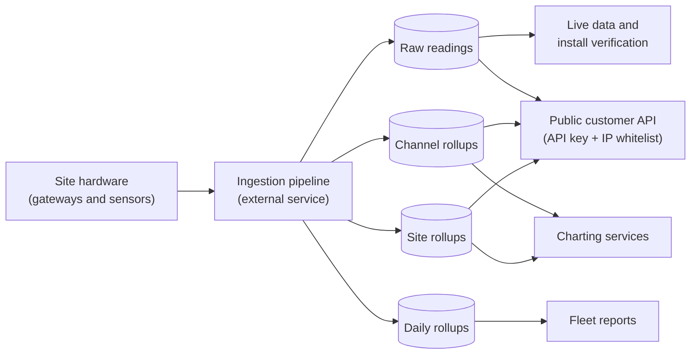

# Data Out (Data Export)

Every sensor, inverter, and meter at a solar site produces a steady stream of measurements. **Data Out** is the layer that serves that data back out — both the live raw readings an installer watches while verifying hardware in the field, and the summarized "rollup" series (per device, per site, and per day) that charts and reports are built on.

It also gives customers a way to pull their own data into their own tools: a public data API where each company gets an API key, locked down to the company's approved network addresses, so third-party systems can fetch raw readings and rollups directly.

> **Reading this doc:** use the **Business / Developer** switch at the top. *Business* explains what data is available, how customers pull it, and the access rules. *Developer* adds the full GraphQL and REST surface, the services and aggregation pipelines, every schema and DTO, the guards and metric-name translation, file references, and a solar-terminology primer.

---

## Why this matters

This module is the product's data faucet. If the rollups are wrong or slow, every chart and report downstream is wrong or slow. If the public API leaks, a customer could see another company's plant data. And in the field, the live-data view is how an installer proves a freshly mounted sensor is actually reporting before they leave the site — it's the last checkpoint between "installed" and "trusted."

---

## How the data flows



---

## The four data feeds

Data is available at four levels of detail:

- **Raw channel data** — every individual reading from a single device (irradiance, temperature, signal strength, voltage), stamped to the second. The most detailed and the most voluminous.
- **Channel rollups** — summarized readings per device over short periods (irradiance, insolation, soiling statistics, temperatures, energy comparisons).
- **Site rollups** — whole-site summaries over short periods: energy and power from inverters and meters, expected power, module temperature.
- **Daily site rollups** — one record per site per day, covering produced vs. expected energy under several models, weather (precipitation, snow), temperatures, and a breakdown of energy losses by cause (outage, shading, snow, systemic).

---

## Pulling data with the public API

Customers can fetch all four feeds from outside the platform:

- Each company is issued an **API key**; every request must present it.
- Requests are only accepted from the company's **whitelisted IP addresses** — key and address must both check out.
- A key can only read sites its company **owns or has been granted access to**.
- Requests are **rate-limited** (150 per minute per key-and-site combination) and results come back in pages of at most 1,000 records.
- **History windows** apply: raw data can be queried up to 30 days back, channel rollups 90 days, site rollups one year; daily rollups have no limit.
- Callers can ask for just the measurements they want by name, and all numbers are rounded to four decimal places.

---

## Live data for field verification

During field setup, the portal shows readings arriving in near-real time so an installer can confirm each sensor is alive:

- A **live data view** lists the latest raw readings for a sensor, refreshed every minute, with timestamps shown in the site's local timezone.
- A **verification step** counts how many readings each sensor has sent in a time window, per serial number, so the installer can see at a glance which units are reporting.
- Sensors that haven't been wired to a channel yet still appear — the platform matches them back to their hardware identity, so brand-new equipment shows up before configuration is finished.

---

## The rules that matter

- **API key + IP whitelist together** gate every external request; either one failing means no data.
- **Site access is checked per request** — the key's company must own the site or appear in its access list.
- **History limits protect the system**: 30 days raw / 90 days channel rollup / 365 days site rollup for external callers. An "internal" flag can bypass these limits, and the doc flags that nothing extra protects that flag — any key holder can set it (flagged for review).
- **The in-portal raw-data queries have no role checks** — any signed-in user can query any site's raw data by its id. This is a flagged security concern awaiting human review.
- **The "copy API URL" button always points at the production data server**, regardless of which environment you're in (also flagged).
- All values are rounded to four decimals, and page size is capped at 1,000 records no matter what is requested.

---

## Entry points {dev}
- **Live Data page** (field-setup wizard step) — `denowatts-portal/src/pages/dashboard/field-setup/live-data/LiveDataPage.tsx`, route `/field-setup/gateway-setup/gateway-live-data`
- **Verify Installation step** — `denowatts-portal/src/pages/dashboard/field-setup/verify-installation/VerifyInstallationPage.tsx`, route `/field-setup/gateway-setup/verify-installation`
- **Live Data Modal** — `denowatts-portal/src/pages/dashboard/field-setup/components/LiveDataModal.tsx` (modal, shown during verification)
- **Channel Map API URL copy** — `denowatts-portal/src/pages/dashboard/site/channel-map/ChannelMapPage.tsx` (clipboard copy of the external REST URL)
- **Data Mining page** — `denowatts-portal/src/pages/dashboard/data-mining/components/DataMining.tsx` (static placeholder, no live API calls yet)

---

## GraphQL API surface {dev}

### Query: `channelRaw`

**Resolver:** `denowatts-backend/src/data-out/device-data.resolver.ts:14`

```graphql
query ChannelRaw($filter: ChannelRawFilterInput!) {
  channelRaw(filter: $filter) {
    channelRawData {
      _id
      timestamp
      irrDeno1
      irrDeno2
      irrDeno3
      tempBom
      dbRssi
      vCap
      serialNumber
    }
    site {
      _id
      name
      timezone
    }
  }
}
```

**Input type:** `ChannelRawFilterInput` (see DTOs section)

**Return type:** `ChannelRawResponse`
- `channelRawData: [ChannelRawWithAggregate]` — array of sensor records with `serialNumber` attached (derived from asset/channel lookup)
- `site?: ChannelRawSite` — nullable; site info (`_id`, `name`, `timezone`) from the first matching document's site, used by the portal to format timestamps in local timezone

**Frontend consumers:**
- `denowatts-portal/src/pages/dashboard/field-setup/live-data/components/LiveDataView.tsx` — `useLazyQuery(GET_CHANNEL_RAW)`, `fetchPolicy: 'network-only'`, passes `serialNumber` or `channel` from URL search params
- `denowatts-portal/src/pages/dashboard/field-setup/components/LiveDataModal.tsx` — `useQuery(GET_CHANNEL_RAW)`, passes `channel` from `ChannelDataCountResponse`, auto-refetches every minute

---

### Query: `channelDataCount`

**Resolver:** `denowatts-backend/src/data-out/device-data.resolver.ts:19`

```graphql
query ChannelDataCount($filter: ChannelDataCountFilterInput!) {
  channelDataCount(filter: $filter) {
    serialNumber
    count
    channel
  }
}
```

**Input type:** `ChannelDataCountFilterInput` (see DTOs section)

**Return type:** `[ChannelDataCountResponse]`
- `serialNumber: String` — DENO device serial number
- `count: Int` — number of raw records in the time window
- `channel: String` — channel ID (MongoDB `channelId` field)

**Frontend consumer:**
- `denowatts-portal/src/pages/dashboard/field-setup/verify-installation/components/VerifyInstallationForm.tsx` — `useQuery(GET_CHANNEL_DATA_COUNT)`, skipped until timer starts; refetches every minute; displays count per serial number; opens `LiveDataModal` on "Live data" button click

---

## REST API surface {dev}

**Controller:** `denowatts-backend/src/data-out/device-data.controller.ts`

All REST endpoints are under `@Controller('api/v3')`, decorated `@Public()` (bypasses JWT auth), and guarded by `@UseGuards(ApiGuard, ApiKeyThrottlerGuard)`.

### `GET /api/v3/channel-raw`

**Handler:** `findChannelRawData`  
**Query params:** `ChannelDataFilterInput` fields (`channel`, `site`, `start`, `end`, `metrics`, `order`, `page`, `limit`, `internal`)  
**Service call:** `DeviceDataService.findChannelRawData(filter)` — applies `getMetricsString` mapping on `metrics`, then paginates `channelraw` collection, then applies `renameDocumentProperties` on each document  
**Used by:** External third-party integrations. The portal copies an example URL to clipboard at `denowatts-portal/src/pages/dashboard/site/channel-map/ChannelMapPage.tsx:600` using the hardcoded base `https://data.denowatts.com`

### `GET /api/v3/channel-rollup`

**Handler:** `findChannelRollupData`  
**Query params:** `ChannelDataFilterInput` (requires `channel` and `site`)  
**Service call:** `DeviceDataService.findChannelRollupData(filter)` — paginates `channelrollup` collection

### `GET /api/v3/site-rollup`

**Handler:** `findSiteRollupData`  
**Query params:** `SiteRollupFilterInput` (`site`, `start`, `end`, `metrics`, `order`, `page`, `limit`, `internal` — no `channel`)  
**Service call:** `DeviceDataService.findSiteRollupData(filter)` — paginates `siterollup` collection

### `GET /api/v3/site-daily-rollup`

**Handler:** `findDailyRollupData`  
**Query params:** `SiteDailyRollupFilterInput` (same fields as `SiteRollupFilterInput`)  
**Service call:** `DeviceDataService.findSiteDailyRollupData(filter)` — appends `,date` to the `metrics` string before paginating `sitedailyrollup` collection

---

## Services {dev}

### `DeviceDataService` — `denowatts-backend/src/data-out/device-data.service.ts`

#### `paginateQuery(model, filter): Promise<PaginatedResponse>`

Core paginated read used by `findChannelRollupData`, `findSiteRollupData`, and `findSiteDailyRollupData` (and internally by `findChannelRawData`).

**Logic steps:**

1. **Date-range enforcement (external callers only):** When `filter.internal` is falsy:
   - `channelraw` model: start must be within 30 days of today — `BadRequestException` otherwise (`device-data.service.ts:83`)
   - `channelrollup` model: 90-day limit (`device-data.service.ts:85`)
   - `siterollup` model: 365-day limit (`device-data.service.ts:87`)
   - `sitedailyrollup` model: no limit enforced
2. **Query construction:**
   - `SiteDailyRollup`: filters on `date` field (`$gte`/`$lte`) — `device-data.service.ts:93`
   - All other models: filters on `timestamp` field — `device-data.service.ts:95`
   - Adds `metadata.site` filter when `site` is provided (cast to `ObjectId`) — `device-data.service.ts:99`
   - Adds `metadata.channel` filter when `channel` is provided — `device-data.service.ts:102`
   - When `serialNumber` is provided: requires `metadata.denoMac != null`, `metadata.channel != null`, and `metadata.dgwMac` matching `serialNumber` as case-insensitive regex — `device-data.service.ts:107-110`
3. **Projection construction:**
   - When `metrics` is provided: splits on comma, adds each trimmed metric as `1`, always includes `timestamp: 1`, excludes `_id` — `device-data.service.ts:116-126`
   - When no `metrics`: excludes `createdAt`, `updatedAt`, `metadata`; `_id` always excluded — `device-data.service.ts:127-130`
4. **Mongoose `paginate` call:** Uses `mongoose-paginate-v2`. Default page 1, default limit 1000 (capped), sort by `timestamp` ascending unless `order = SortOrder.reverse` (-1). Returns lean documents — `device-data.service.ts:132-138`
5. **Numeric rounding:** Every numeric value in each doc is rounded to 4 decimal places (`Math.round(value * 10000) / 10000`) — `device-data.service.ts:141-148`
6. **Returns** the full paginate result (includes `docs`, `totalDocs`, `limit`, `totalPages`, `page`, `pagingCounter`, `hasPrevPage`, `hasNextPage`, `prevPage`, `nextPage`)

**Throws:** `BadRequestException` for out-of-range dates (external callers); re-throws any other error after logging.

---

#### `findChannelRawData(filter: ChannelRawAggregateFilter)`

Used by the **REST endpoint only** (`GET /api/v3/channel-raw`).

1. If `filter.metrics` is set, calls `getMetricsString(filter.metrics.split(','))` to translate public-facing metric names to internal DB field names — `device-data.service.ts:162`
2. Calls `paginateQuery(channelRawModel, filter)` for paginated results
3. Maps each doc through `renameDocumentProperties(doc)` to translate internal DB names back to canonical public names — `device-data.service.ts:168`
4. Returns the paginated result with renamed docs

---

#### `findChannelRawDataWithAggregate(filter: ChannelRawAggregateFilter)`

Used by the **GraphQL query** `channelRaw`. Returns DENO sensor data with device serial numbers attached.

**Logic steps:**

1. Builds a base Mongoose query from `site`, `start`, `end`, `channel`, `serialNumber` — `device-data.service.ts:188-197`
2. **Site lookup:** Fetches one matching `channelraw` document (adding `metadata.site != null` when no site filter) to get a site ID; then calls `SitesService.findOne({ _id: channelRaw.metadata.site }, undefined, true)` to load site details — `device-data.service.ts:200-213`
3. **Aggregate branch A — channel data (with `channel` or `serialNumber`):**
   Runs a MongoDB aggregation pipeline on `channelraw`:
   - `$match` on the base query
   - `$lookup` from `channels` collection on `metadata.channel = channelId` (field name), aliased as `channelInfo`
   - `$unwind` `channelInfo`
   - `$group` by `{ serialNumber: channelInfo.config.serialNumber, timestamp }` — first values for `irrDeno1`, `irrDeno2`, `irrDeno3`, `tempBom`, `dbRssi`, `vCap`, `serialNumber`
   - `$addFields` to restore `_id` from `itemId`
   - `$project` to remove `itemId`
   - `$sort` by `timestamp: -1` (newest first)
   — `device-data.service.ts:215-264`

4. **Aggregate branch B — unassigned DENO data (when no `channel` filter):**
   Sets `query["metadata.channel"] = null` and runs a second aggregation:
   - `$match` on modified query
   - `$group` by `{ timestamp, denoMac: metadata.denoMac }` — first values for all sensor fields plus `denoMac` and `vDenoCap`
   - `$lookup` from `assets` collection: finds asset by `macAddress = denoMac`, then nested `$lookup` from `assets` again joining on `radio = _id` to get the parent device's `serialNumber`
   - `$unwind` `assetInfo`
   - `$addFields` to set `serialNumber = assetInfo.serialNumber`, restore `_id`
   - `$project` to remove `assetInfo`, `denoMac`, `itemId`
   — `device-data.service.ts:266-372`

5. Merges results from both branches with `push(...rawDataWithoutChannel)`, then re-sorts combined array by `timestamp` descending — `device-data.service.ts:372-377`
6. Returns `{ channelRawData, site }` — `device-data.service.ts:379-382`

**Note:** The two-branch design handles DENO devices that have not yet been assigned to a channel (unlinked inventory): branch A covers linked devices, branch B covers unlinked DEノs.

---

#### `getChannelLastRawRecord(channelId: string, site: Types.ObjectId)`

Returns the most recently created raw document for a given channel/site pair.

1. Queries `channelraw` with `{ metadata.channel: channelId, metadata.site: site }`
2. Sorts by `createdAt: -1`, returns single document (lean)
3. **Consumed by:** `denowatts-backend/src/assets/metrics.service.spec.ts` (test mock); no resolver or controller exposes this directly — it is an internal helper

---

#### `findChannelRollupData(filter: ChannelDataFilterInput)`

Delegates directly to `paginateQuery(channelRollupModel, filter)`. Full `ChannelDataFilterInput` is accepted (requires `channel` and `site`).

---

#### `findSiteRollupData(filter: SiteRollupFilterInput)`

Delegates directly to `paginateQuery(siteRollupModel, filter)`. `SiteRollupFilterInput` omits `channel`.

---

#### `findSiteDailyRollupData(filter: SiteDailyRollupFilterInput)`

1. Appends `,date` to `filter.metrics` if metrics is provided — ensures the `date` field is always returned from daily rollup — `device-data.service.ts:395`
2. Delegates to `paginateQuery(dailyRollupModel, filter)`

---

#### `findChannelDataCount(input: ChannelDataCountFilterInput)`

Returns record counts per DENO serial number for a given gateway serial number and time window.

**Aggregation pipeline on `channelraw`:**

1. `$match`:
   - `metadata.denoMac != null`
   - `metadata.channel != null`
   - `metadata.dgwMac` matches `input.serialNumber` as case-insensitive regex
   - `timestamp` in `[start, end]`
2. `$group` by `metadata.channel` → `count: { $sum: 1 }`
3. `$project` → renames `_id` to `channel`, keeps `count`
4. `$lookup` from `channels` collection: matches `channelId = channel` AND `source = "DENO"`
5. `$unwind` `channelInfo`
6. `$addFields` `serialNumber = channelInfo.config.serialNumber`
7. `$project` removes `channelInfo`
8. `$sort` by `serialNumber: 1`

Returns array of `{ serialNumber, count, channel }`.

---

## Schemas {dev}

### `ChannelRaw` — `denowatts-backend/src/data-out/schemas/channel-raw.schema.ts`

MongoDB **time series collection** (native MongoDB timeseries feature):
- `timeField: 'timestamp'`
- `metaField: 'metadata'`
- `granularity: 'seconds'`

| Field | Type | Required | Notes |
|---|---|---|---|
| `_id` | `ObjectId` | auto | GraphQL `ID` type |
| `timestamp` | `Date` | Yes | Time series time field; indexed by MongoDB automatically |
| `metadata.site` | `ObjectId` | Yes | Reference to `sites` collection |
| `metadata.channel` | `String` | Yes | Channel ID string (matches `channels.channelId`); `null` for unlinked DEノs |
| `metadata.denoMac` | String (implicit) | No | DENO MAC address; used in `dgwMac`-based queries |
| `metadata.dgwMac` | String (implicit) | No | Gateway MAC; used as filter key for `serialNumber`-based lookup |
| `irrDeno1` | `Number` | No | Irradiance sensor 1 (W/m²) |
| `irrDeno2` | `Number` | No | Irradiance sensor 2 (W/m²); IRR display = avg of irrDeno1 + irrDeno2 |
| `irrDeno3` | `Number` | No | Auxiliary irradiance sensor (W/m²) |
| `tempBom` | `Number` | No | Back-of-module temperature (°C) |
| `dbRssi` | `Number` | No | RSSI signal strength (dBi) |
| `vCap` | `Number` | No | Capacitor voltage (V) |
| `vDenoCap` | Number (implicit) | No | DENO capacitor voltage; appears in unlinked-DENO aggregate branch |
| `createdAt` | `Date` | auto | Set by `timestamps: true` |
| `updatedAt` | `Date` | auto | Set by `timestamps: true` |

---

### `ChannelRollup` — `denowatts-backend/src/data-out/schemas/channel-rollup.schema.ts`

Standard (non-timeseries) MongoDB collection. No `@ObjectType()` — not exposed via GraphQL directly, only via the REST endpoint.

| Field | Type | Required | Notes |
|---|---|---|---|
| `_id` | `ObjectId` | auto | |
| `metadata.site` | `ObjectId` | Yes | Reference to `sites` |
| `metadata.channel` | `String` | Yes | Channel ID |
| `timestamp` | `Date` | No | Rollup period timestamp (implicit, not declared via `@Prop({ required })`) |
| `dbRssi` | `Number` | No | RSSI |
| `insDeno` | `Number` | No | Insolation on DENO |
| `irrDeno1` | `Number` | No | Irradiance 1 |
| `irrDeno2` | `Number` | No | Irradiance 2 |
| `irrDeno3` | `Number` | No | Irradiance aux |
| `nrgCompared` | `Number` | No | Compared energy |
| `nrgDenoExpected` | `Number` | No | DENO-expected energy |
| `statAcrylic` | `Number` | No | Acrylic soiling stat |
| `statTeflon` | `Number` | No | Teflon soiling stat |
| `statWeighting1` | `Number` | No | Weighting stat 1 |
| `statWeighting2` | `Number` | No | Weighting stat 2 |
| `tempBom` | `Number` | No | Back-of-module temperature |
| `tempCellDeno` | `Number` | No | DENO cell temperature |
| `vDenoBat` | `Number` | No | DENO battery voltage |
| `vDenoCap` | `Number` | No | DENO capacitor voltage |
| `createdAt` | `Date` | auto | |

---

### `SiteRollup` — `denowatts-backend/src/data-out/schemas/site-rollup.schema.ts`

Site-level sub-hourly rollup data. Standard collection.

| Field | Type | Required | Notes |
|---|---|---|---|
| `_id` | `ObjectId` | auto | |
| `metadata.site` | `ObjectId` | Yes | Reference to `sites` |
| `timestamp` | `Date` | No | Rollup period timestamp |
| `nrgNetInv` | `Number` | No | Net energy from inverter |
| `nrgNetPmtr` | `Number` | No | Net energy from meter |
| `pwrAcActiveInv` | `Number` | No | Active AC power from inverter |
| `pwrAcActivePmtr` | `Number` | No | Active AC power from meter |
| `pwrExpected` | `Number` | No | Expected power |
| `tempBom` | `Number` | No | Back-of-module temperature |
| `createdAt` | `Date` | auto | |

---

### `SiteDailyRollup` — `denowatts-backend/src/data-out/schemas/site-daily-rollup.schema.ts`

Daily aggregated site performance data. Standard collection. Queried on `date` field (not `timestamp`) — `device-data.service.ts:93`.

| Field | Type | Required | Notes |
|---|---|---|---|
| `_id` | `ObjectId` | auto | |
| `metadata.site` | `ObjectId` | Yes | Reference to `sites` |
| `timestamp` | `Date` | No | Period start timestamp (also present alongside `date`) |
| `date` | `Date` (implicit) | No | The date field used for `$gte`/`$lte` query filtering — not declared in schema but referenced in service |
| `dptPrecip24h` | `Number` | No | 24h precipitation depth |
| `dptSnow24h` | `Number` | No | 24h snow depth |
| `insHorRef` | `Number` | No | Horizontal irradiance (reference) |
| `insPoaRef` | `Number` | No | Plane-of-array irradiance (reference) |
| `nrgAcActivePmtr` | `Number` | No | AC active energy from meter |
| `nrgCommissioned` | `Number` | No | Commissioned energy |
| `nrgCommissionedAged` | `Number` | No | Aged commissioned energy |
| `nrgDenoExpected` | `Number` | No | DENO-model expected energy |
| `nrgExpected` | `Number` | No | Standard expected energy |
| `nrgExpectedCloud` | `Number` | No | Cloud-model expected energy |
| `nrgLearned` | `Number` | No | Learned-model energy |
| `nrgProducedPred` | `Number` | No | Predicted production (from learned/commissioned-aged or written by pipeline); used by Plotly fleet summary |
| `nrgLssOutage` | `Number` | No | Energy loss — outage |
| `nrgLssShade` | `Number` | No | Energy loss — shading |
| `nrgLssSnow` | `Number` | No | Energy loss — snow |
| `nrgLssSystemic` | `Number` | No | Energy loss — systemic |
| `nrgNetPmtr` | `Number` | No | Net energy from meter |
| `tempAmb` | `Number` | No | Ambient temperature |
| `tempBom` | `Number` | No | Back-of-module temperature |
| `tempCell` | `Number` | No | Cell temperature |
| `tempCellBom` | `Number` | No | Cell BOM temperature |
| `tempCellDeno` | `Number` | No | DENO cell temperature |
| `updatedAt` | `Date` | auto | |

---

## DTOs {dev}

### `ChannelDataFilterInput` — `denowatts-backend/src/data-out/dto/raw-data-filter.dto.ts:33`

Base input type for channel-level paginated queries.

| Field | Type | Validation | Default | Purpose |
|---|---|---|---|---|
| `channel` | `String` | `@IsString()` | required | Channel ID string |
| `site` | `ID` (MongoId) | `@IsMongoId()` | required | Site ObjectId |
| `start` | `Date` | `@IsDate()`, `@Transform(new Date(value))` | required | Range start |
| `end` | `Date` | `@IsDate()`, `@Transform(new Date(value))` | required | Range end |
| `metrics` | `String` | `@IsString()`, `@IsNotEmpty()`, `@IsOptional()`, `@Transform(value.trim())` | optional | Comma-separated list of field names to project |
| `order` | `SortOrder` enum | `@IsEnum(SortOrder)`, `@IsOptional()` | optional | If `'reverse'`, sorts timestamp descending |
| `page` | `Number` | `@IsNumber()`, `@IsOptional()`, `@Transform(Number(value) \|\| 1)` | 1 | Pagination page |
| `limit` | `Number` | `@IsNumber()`, `@IsOptional()`, `@Transform(capped at 1000)` | 1000 | Records per page (hard cap 1000) |
| `internal` | `Boolean` | `@IsBoolean()`, `@IsOptional()`, `@Transform(bool parse)` | false | Bypasses date-range enforcement when true |

### `SiteRollupFilterInput` — `denowatts-backend/src/data-out/dto/raw-data-filter.dto.ts:99`

`OmitType(ChannelDataFilterInput, ['channel'])` — same as above but without `channel`. Used for site-level rollup and daily rollup REST endpoints.

### `SiteDailyRollupFilterInput` — `denowatts-backend/src/data-out/dto/raw-data-filter.dto.ts:100`

Identical to `SiteRollupFilterInput` — separate class for future differentiation.

### `ChannelRawFilterInput` — `denowatts-backend/src/data-out/dto/raw-data-filter.dto.ts:103`

`PartialType(ChannelDataFilterInput)` — all `ChannelDataFilterInput` fields become optional, plus:

| Field | Type | Validation | Purpose |
|---|---|---|---|
| `start` | `Date` | Required (overrides PartialType) | Range start |
| `end` | `Date` | Required (overrides PartialType) | Range end |
| `pagination` | `Boolean` | `@IsBoolean()`, `@IsOptional()` | Reserved; not used in current service logic |
| `serialNumber` | `String` | `@IsString()`, `@IsOptional()` | Gateway serial number for dgwMac-based lookup |

### `ChannelDataCountFilterInput` — `denowatts-backend/src/data-out/dto/raw-data-filter.dto.ts:126`

`PickType(ChannelDataFilterInput, ['start', 'end'])` plus:

| Field | Type | Validation | Purpose |
|---|---|---|---|
| `start` | `Date` | Required | Range start |
| `end` | `Date` | Required | Range end |
| `serialNumber` | `String` | `@IsString()`, `@IsNotEmpty()` | Gateway serial number (matched against `metadata.dgwMac`) |

### `SortOrder` enum — `denowatts-backend/src/data-out/dto/raw-data-filter.dto.ts:27`

| Value | Effect |
|---|---|
| `reverse` | Sort `timestamp: -1` (newest first) |
| (absent) | Sort `timestamp: 1` (oldest first, default) |

### `ChannelRawResponse` — `denowatts-backend/src/data-out/dto/raw-data-filter.dto.ts:157`

GraphQL return type for `channelRaw` query:
- `channelRawData: [ChannelRawWithAggregate]`
- `site?: ChannelRawSite` (nullable)

### `ChannelRawWithAggregate` — `denowatts-backend/src/data-out/dto/raw-data-filter.dto.ts:139`

`PickType(ChannelRaw, ['_id', 'timestamp', 'irrDeno1', 'irrDeno2', 'irrDeno3', 'tempBom', 'dbRssi', 'vCap'])` plus:
- `serialNumber: String` — derived from asset/channel lookup in the aggregation pipeline

### `ChannelRawSite` — `denowatts-backend/src/data-out/dto/raw-data-filter.dto.ts:154`

`PickType(Site, ['_id', 'name', 'timezone'])` — minimal site info returned alongside raw data for timezone-aware frontend display.

### `ChannelDataCountResponse` — `denowatts-backend/src/data-out/dto/raw-data-filter.dto.ts:167`

| Field | Type | Purpose |
|---|---|---|
| `serialNumber` | `String` | DENO device serial number |
| `count` | `Number` | Record count in time window |
| `channel` | `String` | Channel ID string |

---

## Guards {dev}

### `ApiGuard` — `denowatts-backend/src/data-out/guards/api.guard.ts`

Applied to all REST endpoints (`@UseGuards(ApiGuard, ...)`). Enforces:

1. `x-api-key` header must be present — `ForbiddenException("API key not provided")` otherwise
2. Looks up company by `apiKey` in the companies collection — `ForbiddenException("Invalid API key")` if not found
3. Checks requester IP against `company.whitelistedIPs` — `ForbiddenException("IP not whitelisted")` if not in list. Strips IPv6 prefix (`::ffff:`) from IP before comparison.
4. Validates `site` query param is a valid `ObjectId` — `ForbiddenException("Invalid site")` otherwise
5. Loads site and checks: either `site.owner._id == company._id`, or company appears in `site.accesses[].company` — `ForbiddenException("Invalid site")` if neither matches
6. On success, attaches `company` to the Express request object

### `ApiKeyThrottlerGuard` — `denowatts-backend/src/data-out/guards/api-key-throttler.guard.ts`

Extends NestJS `ThrottlerGuard`. Overrides `getTracker` to use a composite throttle key of `x-api-key header + site query param` (rather than IP). This ensures rate limiting is per API-key+site pair.

**Throttle config** (from `device-data.module.ts:27-33`):
- `ttl: 60000ms` (1 minute window)
- `limit: 150` requests per window per key+site

---

## Metrics name translation (`data/metrics-data.ts`) {dev}

The `metrics-data.ts` file (`denowatts-backend/src/data-out/data/metrics-data.ts`) defines a bidirectional name mapping between canonical public-facing field names and internal DB field names used in the `channelraw` collection.

**Two exported data structures:**

### `metricsUpdatedPropertiesObject` (lines 1692–2061)

`Record<publicName, internalDbName>` — used by `getMetricsString()` to translate a caller-requested metrics list to the corresponding DB field names for the MongoDB projection.

Examples:
- `'nrgNet'` → `'nrgNetPmtr'`
- `'pwrAcActive'` → `'pwrAcActivePmtr'`
- `'vCap'` → `'vDenoCap'`
- `'irrDeno1'` → stays as-is (no entry means pass-through)

### `metricsOldPropertiesObject` (lines 2063–2486)

`Record<internalDbName, publicName>` — inverse mapping, used by `renameDocumentProperties()` to translate documents returned from MongoDB back to public names before serving them to REST API consumers.

### `getMetricsString(searchStrings?: readonly string[]): string` (line 2488)

Accepts an array of requested metric names. For each, if a mapping exists in `metricsUpdatedPropertiesObject`, substitutes the DB name; otherwise passes the name through unchanged. Joins results with commas. Used before paginate query to build the projection.

### `renameDocumentProperties(doc: Record<string, unknown>): Record<string, unknown>` (line 2505)

Iterates over every key in a document. If a key exists in `metricsOldPropertiesObject`, renames it to the public canonical name and deletes the old key. Used after paginate query on the REST channel-raw endpoint to normalize field names.

**Coverage:** The mapping table covers ~400+ named metrics across device types: tracker angles (`angActualZ1`–`Z6`), inverter/meter currents/voltages/energies, temperature sensors, status flags, and DENO-specific sensors.

---

## Module wiring {dev}

**Module:** `denowatts-backend/src/data-out/device-data.module.ts`

**Mongoose models registered:**
- `ChannelRaw` / `ChannelRawSchema`
- `SiteRollup` / `SiteRollupSchema`
- `ChannelRollup` / `ChannelRollupSchema`
- `SiteDailyRollup` / `SiteDailyRollupSchema`

**Imported modules:**
- `CompaniesModule` — provides `CompaniesService` for `ApiGuard` API key lookup
- `SitesModule` (forwardRef) — provides `SitesService` for site ownership check in `ApiGuard` and site data fetch in `findChannelRawDataWithAggregate`
- `AssetsModule` (forwardRef) — available but not directly consumed by the service (no `AssetsService` injected)
- `ThrottlerModule.forRoot` — configures 150 req/min/key+site throttle

**Exports:** `DeviceDataService` — consumed by `AssetsModule` (metrics service references `getChannelLastRawRecord`)

---

## Business rules (cited) {dev}

- External REST callers (where `internal = false`) are limited to raw data within 30 days, rollup data within 90 days, site rollup within 365 days — `device-data.service.ts:83-89`
- All numeric values are rounded to 4 decimal places before being returned — `device-data.service.ts:141-148`
- The `limit` query parameter is hard-capped at 1000 regardless of the requested value — `dto/raw-data-filter.dto.ts:79-82`
- REST endpoints require both a valid API key and the caller's IP to be in the company's `whitelistedIPs` list — `guards/api.guard.ts:34-36`
- A site must be owned by or accessible to the API key's company — `guards/api.guard.ts:49-56`
- Daily rollup queries always include the `date` field, even if `metrics` is specified — `device-data.service.ts:395`
- The `channelRaw` GraphQL query always returns newest-first (timestamp descending) regardless of the `order` field — the aggregate pipeline uses `$sort: { timestamp: -1 }` — `device-data.service.ts:262`
- DENO devices not yet assigned to a channel (where `metadata.channel = null`) are still included in the `channelRaw` GraphQL response via the unlinked branch, resolved to their serial number via asset → radio lookup — `device-data.service.ts:266-372`
- IRR display value shown in the portal = `(irrDeno1 + irrDeno2) / 2`, rounded — `denowatts-portal/src/pages/dashboard/field-setup/live-data/components/LiveDataView.tsx:92`

---

## Data touched {dev}

- `channelraw` (timeseries collection) — read by all four service methods and both guards; never written by this module
- `channelrollup` — read by `findChannelRollupData`
- `siterollup` — read by `findSiteRollupData`
- `sitedailyrollup` — read by `findSiteDailyRollupData`
- `channels` — read via `$lookup` in `findChannelRawDataWithAggregate` (both aggregate branches) and in `findChannelDataCount` to join `channelId` → `config.serialNumber`; also filtered by `source = "DENO"` in the count query
- `assets` — read via nested `$lookup` in the unlinked-DENO branch of `findChannelRawDataWithAggregate`: first lookup finds asset by `macAddress`, second finds parent radio device by `_id`
- `sites` — read by `SitesService.findOne` in `findChannelRawDataWithAggregate` to retrieve timezone; also read by `ApiGuard` to validate site ownership
- `companies` — read by `ApiGuard` via `CompaniesService.findOne({ apiKey })` to validate the API key and retrieve `whitelistedIPs`

---

## Edge cases & gotchas {dev}

- **`SiteDailyRollup` schema is incomplete, but the `date` query works.** The schema declares `timestamp` and not `date`, yet the query at `device-data.service.ts:93` filters on `date`. **Verified:** Mongoose 8's default `strictQuery: false` passes the undeclared path through, and three shipping consumers query this externally-written collection by `date` (`report.service.ts:1389,2018`, `fleet-aggregation.util.ts:116,186`) — so the documents contain `date` and the query matches. Fix is documentation-level: add `@Prop() date: Date` to the schema so it reflects reality.
- **`pagination` field on `ChannelRawFilterInput` is unused:** The `pagination?: boolean` field is declared in the DTO but referenced nowhere in the service logic. Its intended purpose is unclear.
- **`AssetsModule` is imported but not injected:** `device-data.module.ts` imports `AssetsModule` via `forwardRef()`, but `DeviceDataService` does not inject any `AssetsService`. The import may exist to resolve a circular dependency for the `$lookup` against the `assets` collection (which is a raw Mongoose aggregate, not via a service).
- **Hardcoded production URL in portal:** `ChannelMapPage.tsx:600` hardcodes `https://data.denowatts.com` for the API URL clipboard copy rather than using `VITE_BACKEND_URL`. This means the copied URL always points to production regardless of environment.
- **No authentication on GraphQL queries:** The `channelRaw` and `channelDataCount` GraphQL resolvers have no `@UseGuards` or role checks. Any authenticated portal user can query any site's raw data by providing a `site` ObjectId.
- **Date-range bypass via `internal: true`:** When `internal = true` is passed to any REST endpoint, all date-range enforcement is disabled. There is no secondary authorization check for this flag — any API key holder can set it.
- **`limit` cap only on REST, not GraphQL aggregate:** `paginateQuery` caps `limit` at 1000, but `findChannelRawDataWithAggregate` (GraphQL path) runs unbounded MongoDB aggregations with no limit applied. High-volume requests could return very large result sets.
- **Two-way metric renaming adds complexity:** The REST `channel-raw` endpoint applies `getMetricsString` before querying (translates public → DB names) and `renameDocumentProperties` after querying (translates DB → public names). The GraphQL path does neither — it returns DB field names directly. Consumers of the two transports see different field names for the same data.
- **`SortOrder` only has `reverse`:** The enum has a single value. Ascending is the implicit default (no enum value). This means there is no way to request ascending sort explicitly via the enum — it is triggered only by the absence of `order`.

---

## Solar & platform terminology {dev}

- **Channel** — one configured data stream from a single piece of hardware (sensor, inverter, meter, gateway). The `metadata.channel` string here matches `channels.channelId`. See [[channels]].
- **Raw data** — individual second-granularity sensor readings as they arrive, stored in the `channelraw` time-series collection. The most detailed feed; limited to 30 days back for external callers.
- **Rollup** — pre-aggregated summary data over an interval. Three tiers here: per-channel (`channelrollup`), per-site (`siterollup`), and per-site-per-day (`sitedailyrollup`).
- **Interval / timestamp** — each rollup row is stamped with its period's timestamp; daily rollups are additionally keyed by a `date` field.
- **Irradiance** — solar power arriving per unit area (W/m²); `irrDeno1`/`irrDeno2` are the two primary sensors (displayed as their average), `irrDeno3` the auxiliary.
- **Insolation** — irradiance accumulated over time (energy per area); `insDeno`, `insHorRef`, `insPoaRef`.
- **Back-of-module (BOM) temperature** — temperature measured behind the PV panel (`tempBom`); feeds cell-temperature models.
- **DENO sensor** — a Denowatts reference sensor (irradiance + temperature); identified by MAC (`denoMac`) and serial number.
- **Gateway (dgwMac)** — the on-site data-acquisition box; raw records carry its MAC, which is how serial-number lookups find a gateway's readings.
- **API key** — the per-company secret presented in the `x-api-key` header to use the public REST API.
- **IP whitelist** — the company's list of approved caller addresses; requests from any other IP are rejected even with a valid key.
- **Rate limiting (throttle)** — 150 requests per minute per API-key+site pair on the REST endpoints.
- **Pagination** — results are returned in pages (default and hard cap of 1,000 records), with total/next/previous page metadata.

For the full domain vocabulary, see [[solar-glossary]].

---

**Related flows:** [[field-setup]] · [[site]] · [[analytics]] · [[assets]] · [[channels]] · [[metrics]] · [[solar-glossary]]
