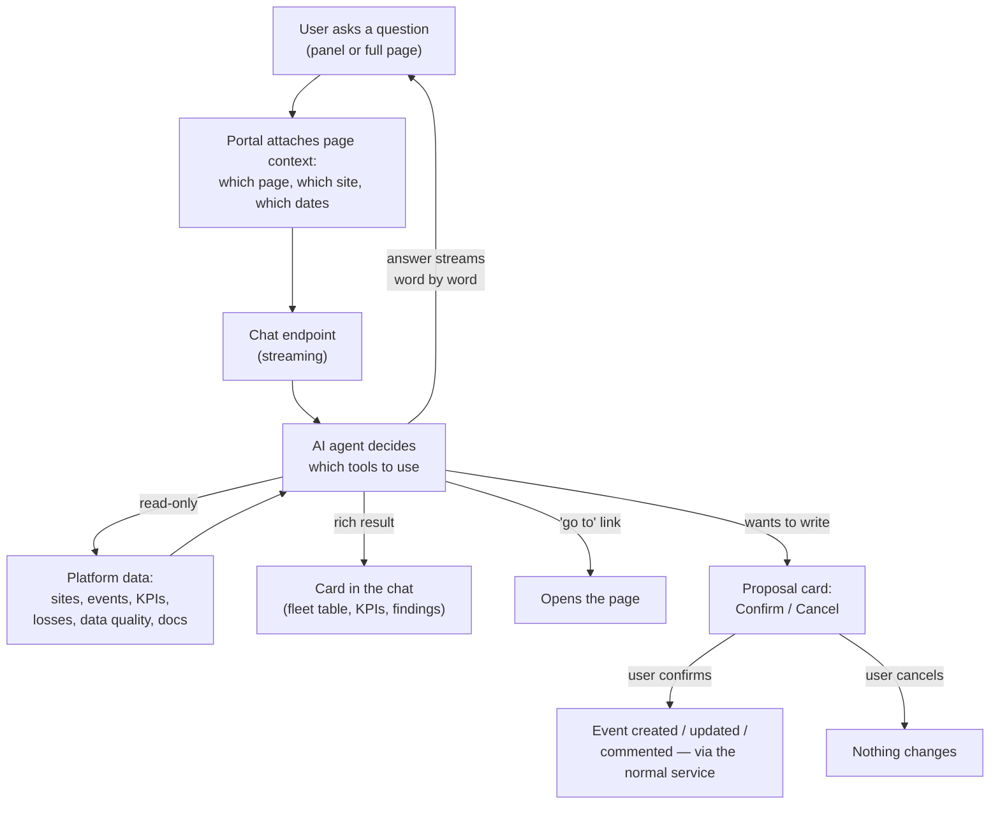

# DenoAI (in-portal AI assistant)

**DenoAI** is a chat assistant built into the portal. A user asks a question in plain English — *"which of my sites are disconnected?"*, *"why is Osgood underperforming?"*, *"log a maintenance event at Palmer Creek"* — and the assistant answers using the platform's own live data, opens the right page for them, or proposes a change for them to approve. It is **read-only except for three event actions**, and even those never happen without an explicit click.

> **Reading this doc:** use the **Business / Developer** switch at the top. *Business* explains what the assistant can and cannot do, how the confirmation step protects data, and who may use it. *Developer* adds the SSE protocol, the LangGraph agent loop, all fourteen tools, the human-in-the-loop interrupt/resume mechanism, the docs RAG index, schemas, guards, rate limits, and file references.

---

## Why this matters

The portal holds a lot of data spread across many screens — fleet status, events, energy models, channel configs, benchmark quality. Answering "is this site actually broken?" normally means visiting five pages and knowing which numbers matter. DenoAI collapses that into one question, and — importantly — it answers **from the same access-scoped services the screens use**, so a user can never see a site through the assistant that they couldn't see by clicking.

It is also a deliberate experiment in *safe* AI writes: the assistant may propose an event, but a human always commits it.

---

## Who can use it

DenoAI is currently **SuperAdmin-only**. The route guard and the floating launcher both check the same thing, so non-SuperAdmins see no entry point at all — `denowatts-portal/src/routes/_dashboard/deno-ai.tsx:6`, `denowatts-portal/src/features/deno-ai/hooks/useDenoAIAccess.ts:6-9`.

---

## How a conversation flows



The assistant never writes on the same pass that proposes. The run is **suspended** at the proposal and only resumes — and commits — after the user clicks Confirm.

---

## What it can do

**Answer from live platform data.** Fleet health across every site the user can access (who is disconnected, where the critical alarms and open tickets are), one site's performance KPIs, where energy was lost and why, which sites are missing an energy model, and searches over events and alarms — `denowatts-backend/src/deno-ai/services/system-prompt.service.ts:41-45`.

**Run the two quality audits (DQMS).**
- **Data Ingest Checker** — audits a site's data acquisition: completeness gaps, stuck or sentinel registers, scaling and multiplier errors, meter-vs-inverter energy balance, **tracker alignment on NCU channels**, template drift, raw-vs-rollup reconciliation, and recent config edits — `denowatts-backend/src/deno-ai/tools/check-data-ingest.tool.ts`, `denowatts-backend/src/deno-ai/data-ingest/data-ingest-checks.ts`.
- **Benchmark Checker** — grades whether a site's benchmark can be *trusted*: Deno sensor health (irradiance pair agreement, Tbom probe, supercap, comms, calibration age, recurring shadows) plus model alignment, returning an A/B/C grade with an ordered fix list — `denowatts-backend/src/deno-ai/tools/check-benchmark.tool.ts`, `denowatts-backend/src/deno-ai/benchmark/benchmark-checks.ts`.

**Answer product-knowledge questions** from the public Knowledge Base at `docs.denowatts.com` — how to install hardware, how a capacity test works, what a portal feature means — citing the source pages, and refusing to invent an answer when the docs don't cover it — `denowatts-backend/src/deno-ai/tools/search-docs.tool.ts`.

**Take the user somewhere.** It knows the portal's page map and can offer a "Go to …" button that lands on the right page, tab, and (for the events feed) pre-applied filters — `denowatts-backend/src/deno-ai/page-catalog.ts`, `denowatts-backend/src/deno-ai/tools/navigate.tool.ts`.

**Propose three kinds of event change** — create an event, edit an existing one, or add a comment. Each opens a confirmation card.

---

## What it deliberately cannot do

- **It cannot delete anything.** There is no delete tool.
- **It cannot set severity, subcategory, or status** on a created event — those are not user-authorable fields — `denowatts-backend/src/deno-ai/services/system-prompt.service.ts:36`.
- **It cannot touch system, alarm, or loss events.** The categories it may use are exactly the ones the manual Create Event modal offers; `AERIAL_SCAN`, `GRID_LOSS`, `RESOURCE_LOSS`, `SYSTEM_LOSS` and `DATA_REPAIR` are excluded by construction — `denowatts-backend/src/deno-ai/tools/event-capability.ts:17-25`.
- **It cannot see data the user cannot see.** Every site read goes through `SitesService.find(user)` — the same access control the GraphQL resolvers use — `denowatts-backend/src/deno-ai/tools/search-sites.tool.ts:20`, `denowatts-backend/src/deno-ai/tools/tool.types.ts:9-13`.
- **It cannot be talked into acting on data.** Tool results are treated as data, never instructions, so text inside an event title or site name cannot redirect the assistant — `denowatts-backend/src/deno-ai/services/system-prompt.service.ts:50`.

---

## The rules that matter

- **Nothing is written until the user confirms.** The proposing tool suspends the run and returns a card; only a Confirm resumes it and commits — `denowatts-backend/src/deno-ai/tools/propose-create-event.tool.ts:101-137`.
- **A confirmation can only be used once.** Re-confirming an already-resolved action is rejected, so a reload or double-click cannot double-create — `denowatts-backend/src/deno-ai/services/pending-action.service.ts:56-58`.
- **What you approved is what gets saved.** The confirmed proposal is stored in absolute terms and replayed on commit, so a relative date like "yesterday" cannot drift between the card and the write — `denowatts-backend/src/deno-ai/services/deno-ai-chat.service.ts:210-212`, `denowatts-backend/src/deno-ai/tools/propose-create-event.tool.ts:114-116`.
- **Site access is re-checked at commit time**, not just at proposal time — `denowatts-backend/src/deno-ai/tools/propose-create-event.tool.ts:117-120`.
- **Every event the assistant creates is stamped** "Created with DenoAI" in its description, so its origin is auditable — `denowatts-backend/src/deno-ai/tools/event-capability.ts:31`.
- **Conversations are private to their owner.** Every read, resume and delete is filtered by `user` — `denowatts-backend/src/deno-ai/services/conversation.service.ts:37-42`.
- **Deleting a conversation is a soft delete** — the record is marked, not removed — `denowatts-backend/src/deno-ai/services/conversation.service.ts:118-127`.
- **20 messages per user per minute.** Over that, the request is rejected — `denowatts-backend/src/deno-ai/deno-ai.constants.ts:41-43`.
- **The assistant is capped at 6 tool-calling rounds per question**, as a runaway-loop backstop — `denowatts-backend/src/deno-ai/deno-ai.constants.ts:39`.
- **Only the last 10 messages of a conversation are replayed** to the model — older turns are visible on screen but not in the assistant's working memory — `denowatts-backend/src/deno-ai/deno-ai.constants.ts:49`, `denowatts-backend/src/deno-ai/services/conversation.service.ts:92-104`.

---

## Page context — how "this site" works

The portal tells the assistant what the user is currently looking at, so an under-specified question resolves correctly. It sends the page label and path, the site in view, the selected date range, and the active view/filters — assembled per page from Redux and the route match — `denowatts-portal/src/features/deno-ai/hooks/usePageContext.ts:42-89`, `denowatts-portal/src/features/deno-ai/lib/pageContextRegistry.ts:55-150`.

Per-page extractors exist for Analytics, Events Feed, Status, Capacity Test, Tests, Audit Trail and System Logs — `denowatts-portal/src/features/deno-ai/lib/pageContextRegistry.ts:55-150`.

Two guardrails apply: the context is collapsed to one line each so client text cannot forge extra prompt lines, and the model is told explicitly that the context is **data, not instructions**, and must not be read back to the user — `denowatts-backend/src/deno-ai/services/system-prompt.service.ts:17-20`, `denowatts-backend/src/deno-ai/services/system-prompt.service.ts:102-103`.

---

## Entry points {dev}

| Surface | Location | File |
|---|---|---|
| Full-page chat | `/deno-ai` (SuperAdmin) | `denowatts-portal/src/routes/_dashboard/deno-ai.tsx:5-9` |
| Floating launcher + slide-over panel | every dashboard page except `/deno-ai` | `denowatts-portal/src/features/deno-ai/DenoAIGlobal.tsx:7-19` |
| Page component | — | `denowatts-portal/src/features/deno-ai/DenoAIPage.tsx` |
| Redux slice (persisted) | `denoAi` | `denowatts-portal/src/features/deno-ai/store/denoAiSlice.ts`, registered `denowatts-portal/src/store/index.ts:20,48-49,67-68,84` |

The route guard is `requireSuperAdmin` in `beforeLoad`, matching the TanStack Router convention for this codebase — `denowatts-portal/src/routes/_dashboard/deno-ai.tsx:6`.

---

## API surface {dev}

**Streaming chat is REST/SSE, not GraphQL** — the only such surface in this feature. Conversation management is GraphQL.

### SSE endpoints — `denowatts-backend/src/deno-ai/deno-ai.controller.ts`

| Method | Path | Purpose |
|---|---|---|
| `GET` | `/deno-ai/ping` | Smoke endpoint proving the REST guard + current-user decorator work — `:33-40` |
| `POST` | `/deno-ai/chat` | Send a message; streams the answer — `:42-58` |
| `POST` | `/deno-ai/resume` | Confirm/cancel a proposed write; streams the continuation — `:61-76` |

Frontend URLs: `denowatts-portal/src/common/constants/urls.ts:57-58`.

The controller is decorated `@Public()` to bypass the **GraphQL-context** global JWT guard (which cannot read a REST request), then applies `DenoAiJwtGuard` explicitly to do the real authentication — `denowatts-backend/src/deno-ai/deno-ai.controller.ts:26-28`. That guard reuses the same registered Passport `jwt` strategy but reads the request from the HTTP context — `denowatts-backend/src/deno-ai/guards/deno-ai-jwt.guard.ts:17-21`.

SSE plumbing sets `text/event-stream`, `no-cache, no-transform`, `keep-alive` and `X-Accel-Buffering: no`, and aborts the run when the client disconnects (`res.on("close")` → `AbortController.abort()`) — `denowatts-backend/src/deno-ai/deno-ai.controller.ts:79-106`.

**Rate limiting is per user, on its own isolated throttler.** The controller also applies `DenoAiThrottlerGuard` — `denowatts-backend/src/deno-ai/guards/deno-ai-throttler.guard.ts`. It subclasses Nest's `ThrottlerGuard` but is injected with DenoAI's **private** options and storage tokens (`DENO_AI_THROTTLER_OPTIONS`, `DENO_AI_THROTTLER_STORAGE`), because `ThrottlerModule` is `@Global()` and a second registration would clobber the first module's providers. `getTracker` buckets by authenticated user id — all of a user's SSE traffic shares one path, so an IP or path bucket would be useless — falling back to a normalized IP, then `"anonymous"`. Wiring: `denowatts-backend/src/deno-ai/deno-ai.module.ts:96-104`.

**Request bodies are validated, not trusted** — `denowatts-backend/src/deno-ai/dto/chat-request.dto.ts`:
- `ChatRequestDto` — `message` (required, ≤ 4000 chars), `conversationId?` (`@IsMongoId`), `pageContext?` (nested-validated). `currentSiteId` / `currentSiteName` are **deprecated**, kept only for older clients that predate `pageContext`.
- `PageContextDto` — every field optional and length-capped (`pageLabel` ≤ 120, `path` ≤ 200, `siteName` ≤ 200, `view` ≤ 200, `filters` ≤ 400, dates ≤ 40); `siteId` must be a Mongo id. These caps bound what a client can inject into the prompt.
- `ResumeChatDto` — `actionId` (`@IsMongoId`) + `confirm` (boolean).

**`@CurrentUser()` does not work here.** The standard decorator reads `req` from the GraphQL context and returns `undefined` on a REST controller, so these endpoints use `@RestCurrentUser()`, which reads the user `DenoAiJwtGuard` populated on the HTTP request — `denowatts-backend/src/deno-ai/decorators/rest-current-user.decorator.ts`.

### GraphQL — `denowatts-backend/src/deno-ai/deno-ai.resolver.ts`

```graphql
query    denoAiConversations: [Conversation!]!
query    denoAiMessages(conversationId: ID!): [Message!]!
mutation deleteDenoAiConversation(conversationId: ID!): Boolean!
```

Client documents: `denowatts-portal/src/features/deno-ai/lib/denoAiQueries.ts`.

---

## Stream protocol {dev}

Each frame is written as `data: ${JSON.stringify(event)}\n\n` — `denowatts-backend/src/deno-ai/deno-ai.controller.ts:92-94`. The union is defined in `denowatts-backend/src/deno-ai/types/stream-events.types.ts`.

| Event | Payload | Meaning |
|---|---|---|
| `conversation` | `{ conversationId }` | Conversation resolved/created (first frame) |
| `token` | `{ text }` | Streamed model text |
| `tool_call` | `{ name, label, status }` | Tool chip started/completed |
| `card` | rich card object | Structured tool result to render |
| `navigate` | `{ path, params?, query?, label?, eventFilters? }` | "Go to …" deep link |
| `action_result` | `{ actionId, status, resultEventId? }` | Proposal resolved |
| `error` | `{ message }` | Generic failure message |
| `done` | `{ conversationId }` | Turn finished |

The frontend cannot use native `EventSource` (it can't set an `Authorization` header), so it reads the body stream with `fetch` + `ReadableStream` and parses `data:` frames itself — `denowatts-portal/src/features/deno-ai/lib/sseClient.ts:17-90`. Malformed frames are skipped rather than aborting the stream — `:82-84`.

A `401` throws `UnauthorizedError`, which the chat hook handles with **one** refresh-token retry before logging out — `denowatts-portal/src/features/deno-ai/lib/sseClient.ts:52-54`, `denowatts-portal/src/features/deno-ai/hooks/useDenoAIChat.ts:248-291`.

Chat state is a reducer over turns; `DONE` only finalizes a still-streaming turn so it can never override an error — `denowatts-portal/src/features/deno-ai/hooks/useDenoAIChat.ts:100-104`.

---

## Agent architecture {dev}

**LangGraph prebuilt ReAct agent, built per request** — `denowatts-backend/src/deno-ai/services/agent.factory.ts:21-37`.

- Model: `ChatOpenAI`, `temperature: 0`, `streaming: true`. Default `gpt-5.4`, overridable via `DENO_AI_MODEL` — `denowatts-backend/src/deno-ai/deno-ai.constants.ts:37-38`.
- Provider-swappable: when `OPENAI_BASE_URL` is set the client targets that host (e.g. an Azure OpenAI-compatible v1 endpoint, with `DENO_AI_MODEL` as the deployment name) — `denowatts-backend/src/deno-ai/services/agent.factory.ts:9-12,27-29`.
- `recursionLimit` is `maxIterations * 2 + 1` — `denowatts-backend/src/deno-ai/services/deno-ai-chat.service.ts:299`.

**Checkpointer** — `MongoDBSaver` over the *existing* Mongoose driver client (no second connection pool), writing `deno_ai_checkpoints` and `deno_ai_checkpoint_writes` — `denowatts-backend/src/deno-ai/services/checkpointer.provider.ts:14-23`.

**Threading model.** A fresh `thread_id` (`randomUUID()`) is minted per turn; the checkpointer stores only *suspended* runs, and conversation history is fed from Mongo instead — `denowatts-backend/src/deno-ai/services/deno-ai-chat.service.ts:131-133`. Completed and failed threads are deleted; cleanup failure is non-fatal and only logged — `:446-453`.

**Isolated throttler wiring.** `@nestjs/throttler`'s `ThrottlerModule` is `@Global()`, so two registrations clobber each other's shared tokens. DenoAI owns private DI tokens (`DENO_AI_THROTTLER_OPTIONS` / `DENO_AI_THROTTLER_STORAGE`) — as `data-out` does — and buckets **per authenticated user id**, not per IP, since all of a user's SSE traffic shares one path — `denowatts-backend/src/deno-ai/deno-ai.constants.ts:24-33`, `denowatts-backend/src/deno-ai/guards/deno-ai-throttler.guard.ts:28-45`, `denowatts-backend/src/deno-ai/deno-ai.module.ts:93-106`.

> Same caveat as the data-out guard: storage is in-memory per worker, so in a clustered deploy the effective limit is `limit × workers`. That only loosens the cap, never a false 429 — `denowatts-backend/src/deno-ai/guards/deno-ai-throttler.guard.ts:23-26`.

---

## Tools {dev}

Fourteen tools, built **per request** and each bound to the authenticated user via `ToolContext` — tenant isolation by construction — `denowatts-backend/src/deno-ai/tools/tool-registry.ts:43-60`, `denowatts-backend/src/deno-ai/tools/tool.types.ts:9-13`.

| Tool | Kind | Purpose | File |
|---|---|---|---|
| `search_sites` | read | Resolve a name/partial to accessible site ids | `tools/search-sites.tool.ts` |
| `query_events` | read | Events/alarms, incl. loss events | `tools/query-events.tool.ts` |
| `get_fleet_overview` | read | Fleet-wide health, no site id needed | `tools/fleet-overview.tool.ts` |
| `get_site_performance` | read | One site's EPI/benchmark/availability | `tools/site-performance.tool.ts` |
| `diagnose_losses` | read | Where energy was lost (outage/shade/snow/derate/undetermined) | `tools/diagnose-losses.tool.ts` |
| `diagnose_site` | read | Ranked root-cause verdict: ok / watch / underperforming | `tools/diagnose-site.tool.ts` |
| `check_energy_models` | read | Energy-model coverage across sites | `tools/check-energy-models.tool.ts` |
| `check_data_ingest` | read | DQMS Data Ingest Checker | `tools/check-data-ingest.tool.ts` |
| `check_benchmark` | read | DQMS Benchmark Checker (A/B/C grade) | `tools/check-benchmark.tool.ts` |
| `search_docs` | read | RAG over docs.denowatts.com | `tools/search-docs.tool.ts` |
| `navigate` | UI | Emit a deep-link; fetches nothing | `tools/navigate.tool.ts` |
| `propose_create_event` | **write (HITL)** | Propose a new event | `tools/propose-create-event.tool.ts` |
| `propose_update_event` | **write (HITL)** | Propose edits to an existing event | `tools/propose-update-event.tool.ts` |
| `propose_add_comment` | **write (HITL)** | Propose a comment on an event | `tools/propose-add-comment.tool.ts` |

All paths above are under `denowatts-backend/src/deno-ai/`.

**Tool chips.** Read tools emit `started` / `completed` chips with human labels from `TOOL_LABELS` — `denowatts-backend/src/deno-ai/services/deno-ai-chat.service.ts:61-72`. The three proposing tools are `SILENT_TOOLS`: they emit no chip (it would never complete, since the run suspends mid-tool) and their JSON output is captured on resume instead — `:74-82,335,352-355`.

**Sentry breadcrumbs record the tool name only — never the input**, which may contain PII — `denowatts-backend/src/deno-ai/services/deno-ai-chat.service.ts:337-338`.

**`navigate` is pure route knowledge.** Site-specific destinations require a valid `siteId` (already access-scoped via `search_sites`); the tool validates the ObjectId and refuses otherwise — `denowatts-backend/src/deno-ai/tools/navigate.tool.ts:27-32`.

**Relative dates are resolved deterministically, not by the model.** `DateResolver.resolve(phrase, tz)` turns "last 7 days", "3 days ago", "yesterday", "this/last week", "this/last month" into UTC `Date` boundaries computed **in the site's timezone**, and returns `{}` for anything it does not recognise rather than guessing — `denowatts-backend/src/deno-ai/tools/date-resolver.ts`. An invalid timezone silently falls back to UTC (`safeZone`).

---

## DQMS engines {dev}

The two audit tools are thin wrappers. The analysis lives in two read-only service layers under `denowatts-backend/src/deno-ai/`, both tenant-scoped by the calling tool rather than by themselves.

### Data Ingest Checker — `data-ingest/`

`DataIngestService.analyzeSite(...)` (~1,040 lines) — `data-ingest/data-ingest.service.ts`. One aggregation per channel produces total stats plus hourly buckets with per-metric min/max/avg, riding the `{metadata.site, metadata.channel, timestamp}` index. Around that it layers:

- **Metric-path discovery** — numeric paths are extracted from a sample `channelraws` document, recursing into nested objects (`zone.Zone1.*`) and skipping metadata/ids/dates, so the checker adapts to whatever a channel actually reports.
- **Local-hour → UTC mapping** using the site timezone, so daylight-window checks mean the same thing at every longitude.
- **A future-timestamp sanity check** across the whole site (a cheap indexed query).
- **Config/template checks** over the channel set; API-sourced channels are detected by `configType`/`source` being `API` and treated differently.
- **Recent configuration changes** pulled from the `systemlogs` audit trail — anything touching the site, its channels, or their Modbus templates within the window plus a lookback, via the `{documentId, createdAt}` index. See [[system-logs]].

`data-ingest/data-ingest-reconcile.ts` handles **raw-vs-rollup reconciliation**. Its stated premise matters: `channelrollups` are the corrected source of truth, so divergences are *characterized rather than flagged*, and verdicts come from aggregate agreement across the range rather than from any single bucket. `inferGranularityMinutes(rollups)` derives the rollup cadence; `reconcileChannel(input)` produces the per-channel verdict; `relDiff(a, b)` is the shared relative-difference helper.

**Tracker alignment (`checkTracker`)** — new. On single-axis-tracker sites the NCU channel reports, per motor/row,
both the angle it was *commanded* to (`angSet`) and the angle it actually reached (`angActual`). Comparing the two
finds rows that are silently losing production while every other check passes.

- **Detection is by shape, not by configuration.** A channel is treated as a tracker when any motor under its `zone`
  object carries both `angActual` and `angSet` as numbers — no template flag or channel role is required.
  `fetchTrackerStats` then runs a `$objectToArray` → `$unwind` → `$group` aggregation over `channelraws` to get
  per-motor sample count, mean and max absolute deviation, and the observed range of both the actual and the
  commanded angle. A channel that yields motors is tagged `role: "tracker"`.
  — `denowatts-backend/src/deno-ai/data-ingest/data-ingest.service.ts:139-147`, `:687-747`
- **Motors with fewer than 12 samples in the window are ignored** — too little data to call.
- **Stuck rows** — measured angle moved less than **1°** across the whole window while the setpoint swept more than
  **20°**. Reported as a `warning`. The doc text is deliberately two-sided: a frozen reading is equally consistent
  with a dead angle encoder as with a jammed drive, and the suggestion says to check both.
- **Miscalibrated rows** — mean absolute deviation ≥ **3°**, excluding anything already reported as stuck (so one
  row never produces two findings). Severity escalates to `critical` at ≥ **15°**, where the row is described as
  effectively not tracking. Findings are sorted worst-first and list at most 10 motors.
- **Estimated loss is quoted as `1 − cos(deviation)`** of the row's beam irradiance, computed by `cosLossPct(deg)`.
  This gives the reader a number to weigh the finding by: 3° is ~0.14%, 15° is ~3.4%.
- **A clean tracker emits a `good` finding**, naming the motor count and the average and worst deviation, so a
  passing tracker is visible as a confirmed check rather than as silence.
- All findings are filed under `category: "readings"`.
— `denowatts-backend/src/deno-ai/data-ingest/data-ingest-checks.ts:517-609`,
  types in `denowatts-backend/src/deno-ai/data-ingest/data-ingest.types.ts:89-104`

> **The domain rule that keeps this honest:** deviation is measured against the NCU's *own* commanded setpoint, so
> wind stow and night stow are never deviations — the setpoint moves too. The tool description states this
> explicitly so the model cannot describe stow behaviour as miscalibration.
> — `denowatts-backend/src/deno-ai/tools/check-data-ingest.tool.ts:165`

`data-ingest/metric-labels.ts` is a **process-global** label map — metric definitions are not site-specific, so `DataIngestService` populates it once per process and it refreshes only on restart. `metricLabel(path)` renders "AC Power", keeping the prefix on nested paths for disambiguation ("DC Current (zone.11)") and falling back to the raw path when unknown.

### Benchmark Checker — `benchmark/`

`BenchmarkService.analyzeSite(...)` (~886 lines) — `benchmark/benchmark.service.ts`. Grades data acquisition and benchmark/model alignment A/B/C with sub-scores. The parts worth knowing:

- **The current OWNER energy model supplies block geometry; `sites.blocks` is the deprecated fallback.** `resolveGeometryBlocks(siteBlocks, ownerBlocks)` returns the owner model's blocks whenever the site has a current OWNER doc carrying any, and only falls back to `sites.blocks` when it does not (no owner model, or an owner model with no blocks); with neither it returns an empty list. Everything downstream — mount types, the module temperature coefficient, `summarizeModel`, and the alignment checks — reads the resolved list, so a site with an owner model is graded against the filed expectation rather than against whatever is still sitting on the site document. — `denowatts-backend/src/deno-ai/benchmark/benchmark.service.ts:117-124`, `:190-191`. See [[energy-model]].
- **The `energymodels` registry has two layers:** `OWNER` is the filed expectation (pro-forma + design blocks); `OPERATOR` is the learned, date-versioned layer. A null `endDate` marks the current version. `fetchEnergyModels` now returns `{ summary, ownerBlocks }` so the current owner doc's block geometry is available to the resolver above, and its projection pulls `blocks.module` and `blocks.inverter` alongside `blocks.info`. — `denowatts-backend/src/deno-ai/benchmark/benchmark.service.ts:402-425`
- **The owner-model-vs-site-blocks drift check was removed.** `checkEnergyModels` used to compare the owner model's blocks against `sites.blocks` field by field (AC max, nameplate, DC, tilt, azimuth, max angle) and deduct 10 points on any difference. With the owner model now *being* the geometry source rather than a second opinion on it, the two sides can no longer disagree and the check was deleted. — `denowatts-backend/src/deno-ai/benchmark/benchmark-checks.ts`
- **Metered production** is hourly average AC power per revenue meter (`5.2.*`) integrated to energy, with reclosers and BESS meters excluded and hierarchies resolved to the billing tier.
- **Tracker arbitration:** hourly mean absolute tracking angle from the site's tracker controller channels adjudicates Deno-vs-model max-angle exceedances — a *stable* offset indicates sensor mounting bias rather than a model error.
- **Portal-accurate site series** come from `siterollups` — shade/snow-adjusted expected, and produced with the meter → `pwrNet` → inverter fallback applied, as hourly averages (kW ≈ kWh per hour).
- **Calibration dates** are read from the `assets` collection (present on roughly half the Deno fleet), mapping serial → latest calibration date. See [[assets]].


---

### How DQMS results must be reported {dev}

Both checkers return far more findings than belong in an answer, and the raw list has no inherent priority — a
frequency register and a meter-vs-inverter imbalance arrive as peers. The system prompt therefore carries an
explicit ranking, on the premise that Denowatts is an **energy-accounting** platform and these checks exist to
establish whether a site's energy accounting can be trusted. Everything else is supporting evidence.

| Rank | Class | How it may be used |
|---|---|---|
| 1 | Energy accounting — active power (kW), energy (kWh), meter-vs-inverter balance, counter integrity, scaling proofs | Ranked first in every section |
| 2 | Electrical measurements — AC/DC voltage and current | To localize and explain an energy problem; never a standalone finding |
| 3 | Weather reference — Deno irradiance, insolation, ambient/module temperature | To judge whether production was plausible for the conditions |
| 4 | Tracker data | To attribute actual-vs-expected deltas to miscalibration or stow |
| 5 | Everything else — frequency, power factor, reactive/apparent power, fault/status registers, gateway health | Diagnostic only; must never lead the assessment or drive an action unless it corrupts energy accounting |

Alongside the ranking, several rules exist to stop specific, observed failure modes:

- **A `good` finding is a passing check, never a problem.** In particular, once a channel's
  energy-counter-vs-integrated-power check passes, its energy scaling is *proven* — the model must not then
  hypothesize a unit or multiplier error on that channel's energy registers.
- **Readings the checks deliberately treat as normal are off-limits for speculation:** `stat*` and `rCustom*` hold
  raw control/status values where a constant reading is expected; `insDeno` is cumulative kWh/m² judged on its
  delta, not an instantaneous W/m² reading; `irrDeno3` constantly 0 means no auxiliary sensor is configured, not a
  fault. Unit and scale conversions between templates are fixed Denowatts settings, not findings.
- **Inverters de-energize when idle**, so their AC/DC readings legitimately fall to 0 — that is the offline state,
  not a fault. Grid-tied meters stay energized, so 0 Hz or 0 V *on a meter* is a real finding.
- **Third-party API weather feeds are context, not site equipment** — their lag or cadence must never be reported
  as broken hardware.
- **Recommended actions are ordered by energy-accounting impact**, quantify the kWh or kW at stake where the data
  allows, and name the specific channel and what to check in the field or in config.
- **Metric names appear in prose in their human-readable form**, not as raw database field names.
- **Coincident config edits are stated either way** — "this changed on the same channel yesterday" or "no changes
  recorded", which rules out a recent edit as the cause.

— `denowatts-backend/src/deno-ai/services/system-prompt.service.ts:56-69`

---

## Human-in-the-loop write flow {dev}

The full create path, end to end:

1. **Propose.** The tool resolves and validates purely — site access, allowed category, dates in the site's timezone — then calls LangGraph's `interrupt()`. The first pass throws; the graph checkpoints and the run ends — `denowatts-backend/src/deno-ai/tools/propose-create-event.tool.ts:52-104`.
2. **Detect.** The chat service reads the suspended run's state and pulls the interrupt payload — `denowatts-backend/src/deno-ai/services/deno-ai-chat.service.ts:380-427`.
3. **Record.** A `DenoAiAction` row is created (`PENDING`) mapping the confirmation back to its `threadId`, storing the **resolved, absolute** payload — `:150-156`, `denowatts-backend/src/deno-ai/services/pending-action.service.ts:29-44`.
4. **Card.** A proposal card is emitted *and persisted on the assistant message*, so a reloaded conversation renders the same card — `:157-163`.
5. **Checkpoint is kept** (not cleaned up) — confirming resumes it — `:171`.
6. **Resume.** `POST /deno-ai/resume` loads the still-pending action owned by the user, re-verifies conversation ownership, and resumes with `new Command({ resume: { confirm, payload: action.payload } })` — `:203-212`.
7. **Commit.** The tool picks up where it left off, re-checks site access, appends the `Created with DenoAI` marker, and writes through the normal `EventsService.create` — `denowatts-backend/src/deno-ai/tools/propose-create-event.tool.ts:106-143`.
8. **Settle.** The action is marked `CREATED` or `CANCELLED`, and the **persisted card is updated in place** so a reloaded chat shows the final state instead of a live Confirm button — `denowatts-backend/src/deno-ai/services/pending-action.service.ts:62-84`.

A commit counts as successful only when `confirm` is true **and** the tool reported a terminal status (`created` / `updated` / `added`) **and** an `eventId` came back — `denowatts-backend/src/deno-ai/services/deno-ai-chat.service.ts:84-85,225-231`.

---

## Docs knowledge base (RAG) {dev}

`search_docs` is backed by an in-memory vector index with a durable Mongo embedding cache — `denowatts-backend/src/deno-ai/services/docs-index.service.ts:173-193`.

**Why a search index and not a crawler:** the docs host serves a SPA shell (pages render client-side), so the service ingests the static Docusaurus local-search index at `/search-index.json` instead of crawling HTML — `:176-179`.

**Lifecycle** — `:199-226`
- On boot: load the Mongo cache; if empty or stale, kick off an ingest **fire-and-forget** (boot never blocks on embedding).
- Daily cron at 4 AM: re-ingest, or — on a read-only node — just reload what the ingesting node wrote.
- Multi-instance: set `DENO_AI_DOCS_INGEST=false` on all but one node.

**Ingest** — fetch → parse → embed only new/changed chunks (keyed by `contentHash`) → upsert, then sweep stale rows. Upsert-before-sweep keeps the cache valid even mid-crash — `:314-360`. Long sections are split at paragraph boundaries, preferring sentence ends — `:131-171`.

**Ranking** — cosine similarity plus an exact-term boost (embeddings under-rank model numbers and error codes), then a relevance floor that is *both* an absolute minimum and a fraction of the best hit's score, then a per-page diversity cap backfilled from the overflow — `:228-312`.

**Model-space safety.** `contentHash` covers the embedding model name, so changing models can't mix vector spaces; chunks whose embedding dimension differs from the query's are skipped and a warning logged — `:28`(schema), `:254-270`.

**Failure honesty.** The outcome type distinguishes `empty-index` / `embedding-failed` from "nothing matched", and the system prompt instructs the model **not** to claim the docs lack a topic when search was merely unavailable — `:23-26`, `denowatts-backend/src/deno-ai/services/system-prompt.service.ts:48`.

---

## Schemas {dev}

**`Conversation`** — `denowatts-backend/src/deno-ai/schemas/conversation.schema.ts`
`user` (indexed ref), `title` (first 60 chars of the first user message), `lastMessageAt`, `deletedAt` (soft delete), timestamps. Compound index `{ user: 1, updatedAt: -1 }` — `:36`.

**`Message`** — `denowatts-backend/src/deno-ai/schemas/message.schema.ts`
`conversation` (indexed ref), `role` (`USER` | `ASSISTANT`), `content` (defaults `""` — assistant turns may be empty, e.g. navigation-only replies — `:38-46`), `toolCalls`, `cards`, `navigate`. Compound index `{ conversation: 1, createdAt: 1 }` — `:79`.
> `toolCalls` deliberately **omits the tool input** — it can contain PII and is never read back — `:14-22`.
> `cards` and `toolCalls` are persisted so a resumed chat renders identically to the live one, but are **not** replayed to the model — `:48-62`.

**`DenoAiAction`** — `denowatts-backend/src/deno-ai/schemas/deno-ai-action.schema.ts`
`conversation`, `user`, `threadId` (the suspended LangGraph run), `type` (`CREATE_EVENT` | `UPDATE_EVENT` | `ADD_COMMENT`), `payload` (resolved absolute proposal), `status` (`PENDING` | `CREATED` | `CANCELLED`, indexed), `resultId`. This is the control **and idempotency** layer — `:4-11`.

**`DocChunk`** — collection `deno_ai_doc_chunks` — `denowatts-backend/src/deno-ai/schemas/doc-chunk.schema.ts`
`url`, `pageTitle`, `breadcrumbs`, `heading`, `content`, `contentHash`, `embedModel`, `embedding`. A durable embedding cache, not the query path — `:4-9`.

**LangGraph collections** (managed by `MongoDBSaver`, no Mongoose schema): `deno_ai_checkpoints`, `deno_ai_checkpoint_writes` — `denowatts-backend/src/deno-ai/services/checkpointer.provider.ts:21-22`.

---

## Configuration {dev}

Parsed and validated once at boot — `denowatts-backend/src/deno-ai/services/deno-ai-config.service.ts:23-61`. Keys: `denowatts-backend/src/deno-ai/deno-ai.constants.ts:7-22`.

| Env var | Default | Notes |
|---|---|---|
| `DENO_AI_MODEL` | `gpt-5.4` | Agent model / Azure deployment name |
| `DENO_AI_MAX_ITERATIONS` | `6` | Tool-call rounds per request |
| `DENO_AI_DEBUG` | off | Agent trace + full LangChain console trace |
| `DENO_AI_DOCS_BASE_URL` | `https://docs.denowatts.com` | Trailing slash stripped |
| `DENO_AI_DOCS_INDEX_PATH` | `/search-index.json` | Docusaurus local-search index |
| `DENO_AI_EMBED_MODEL` | `text-embedding-3-large` | On Azure must be a **dedicated embeddings deployment** |
| `DENO_AI_DOCS_INGEST` | `true` | Set false on all but one node |
| `OPENAI_API_KEY` | — | **Required** (`getOrThrow`) — `:51` |
| `OPENAI_BASE_URL` | — | Optional; switches provider host |

Parsing is defensive: booleans accept `1/true/yes/on` and `0/false/no/off`; integers must be ≥ 1 or the default is used, so a NaN/zero/negative env value can never propagate — `:5-20`. Setting `OPENAI_BASE_URL` without `DENO_AI_EMBED_MODEL` logs a targeted warning about Azure embeddings deployments — `:54-60`.

Fixed code-level constants (not env-tunable): rate limit `RATE_LIMIT` 20 per `RATE_TTL_MS` 60s **per user** (see the throttler note under *API surface*; in a clustered deploy the in-memory effective limit is `limit × workers`), `MAX_EVENT_RESULTS` 20, `MAX_SITE_RESULTS` 8, `HISTORY_MESSAGES` 10, and the docs tuning values (`DOCS_SEARCH_RESULTS` 5, `DOCS_MIN_SCORE` 0.25, `DOCS_MIN_SCORE_RATIO` 0.7, `DOCS_KEYWORD_BOOST` 0.1, `DOCS_PAGE_CAP` 2, `DOCS_FETCH_RETRIES` 3, `DOCS_REFRESH_HOURS` 24, `DOCS_MAX_CHUNK_CHARS` 2000) — `denowatts-backend/src/deno-ai/deno-ai.constants.ts:35-72`.

---

## Data touched {dev}

- `conversations.*` — created/read/soft-deleted per user — `denowatts-backend/src/deno-ai/services/conversation.service.ts`
- `messages.*` — one row per turn, plus persisted cards/toolCalls/navigate — same file
- `denoaiactions.*` — one row per proposed write; `status` and `resultId` settled on resume — `denowatts-backend/src/deno-ai/services/pending-action.service.ts`
- `deno_ai_doc_chunks.*` — upserted by the docs ingest; stale rows swept — `denowatts-backend/src/deno-ai/services/docs-index.service.ts:314-360`
- `deno_ai_checkpoints.*`, `deno_ai_checkpoint_writes.*` — suspended runs; deleted after a turn settles — `denowatts-backend/src/deno-ai/services/deno-ai-chat.service.ts:446-453`
- `events.*` / event comments — **only** via `EventsService` on a confirmed proposal. See [[events]].

Read-only reads span `sites`, `channels`, `metrics`, `modbustemplates`, `channelraws`, `channelrollups`, `siterollups`, `sitedailyrollups`, `energymodels`, `energymodellearneds`, `assets`, `systemlogs` and `users` — registered in `denowatts-backend/src/deno-ai/deno-ai.module.ts:67-86`.

---

## Observability {dev}

`AgentLogger` records a turn's start and finish with outcome (`done` / `interrupt` / `error`), the tools invoked (including silent ones), the reply, and accumulated input/output token usage summed across the ReAct loop from `on_chat_model_end` frames — `denowatts-backend/src/deno-ai/services/agent-logger.service.ts`, `denowatts-backend/src/deno-ai/services/deno-ai-chat.service.ts:318-329,164-170`. Per-tool timing is keyed by `run_id` — `:330-351`. `DENO_AI_DEBUG` additionally attaches LangChain's full chain callbacks — `:302-303`.

Errors go to Sentry at both the controller and service level; the user always sees a generic message, never an internal error — `denowatts-backend/src/deno-ai/deno-ai.controller.ts:98-102`, `denowatts-backend/src/deno-ai/services/deno-ai-chat.service.ts:188-195`.

---

## Edge cases & gotchas {dev}

- **A client disconnect aborts the run** and suppresses both the error frame and the persisted assistant message — the turn simply vanishes — `denowatts-backend/src/deno-ai/services/deno-ai-chat.service.ts:145,189,251`.
- **An interrupted turn keeps its checkpoint indefinitely** if the user never confirms or cancels. There is **no TTL or sweeper** for orphaned `deno_ai_checkpoints` rows or `PENDING` `DenoAiAction`s — flag for human review.
- **Conversation history is capped at 10 messages** replayed to the model, while the UI shows the whole thread — a long conversation's early context is silently dropped — `denowatts-backend/src/deno-ai/deno-ai.constants.ts:49`.
- **Rate limiting is per worker.** In a clustered deploy the effective cap is `20 × workers` — `denowatts-backend/src/deno-ai/guards/deno-ai-throttler.guard.ts:23-26`.
- **`search_sites` filters in memory** after loading all accessible sites — fine at current fleet size, but it is an O(n) scan per call, capped at 8 results — `denowatts-backend/src/deno-ai/tools/search-sites.tool.ts:20-24`.
- **The docs index lives in process memory.** Every instance holds the full vector list, and a cold instance with an empty Mongo cache answers `found:false` until the fire-and-forget ingest completes — `denowatts-backend/src/deno-ai/services/docs-index.service.ts:199-212`.
- **`DENO_AI_DOCS_INGEST` must be disabled on all but one node**, or every instance re-crawls and re-embeds the same corpus daily — `denowatts-backend/src/deno-ai/deno-ai.constants.ts:20-21`.
- **`gpt-5.4` is the hardcoded default model.** If that id is unavailable to the configured key/deployment, every chat fails at the model call — `denowatts-backend/src/deno-ai/deno-ai.constants.ts:37-38`.
- **Access is SuperAdmin-only in two independent places** (route guard and launcher hook). They are kept in sync by a comment, not by a shared constant — a divergence would silently expose or hide the feature — `denowatts-portal/src/features/deno-ai/hooks/useDenoAIAccess.ts:5`.
- **`getState` is reached through a cast.** The `CompiledReactAgent` alias doesn't surface `getState`; the underlying compiled graph (a Pregel) does. A LangGraph upgrade could break interrupt detection silently — `denowatts-backend/src/deno-ai/services/deno-ai-chat.service.ts:386-391`.
- **`streamEvents` input is cast** because a resume `Command` is a valid runtime input but not in the declared type — same upgrade risk — `:296-305`.
- **Checkpoint cleanup failure is swallowed** (warn only), so orphan checkpoints accumulate quietly — `:446-453`.

---

## Solar & platform terminology {dev}

- **DenoAI** — the in-portal assistant described here; distinct from [[prompts]], the older OpenAI helper module.
- **Agent / ReAct loop** — the model repeatedly reasons, calls a tool, reads the result, and continues until it answers; capped at `MAX_ITERATIONS` rounds.
- **Tool** — a typed function the model may call. Here each is built per request and bound to the caller's identity.
- **Human-in-the-loop (HITL)** — the pattern where a proposed write suspends the run until a person confirms.
- **`interrupt()` / checkpointer / thread** — LangGraph's suspend-and-resume primitives: `interrupt()` pauses a run, the checkpointer persists it in Mongo under a `thread_id`, and a `Command({ resume })` continues it.
- **SSE (Server-Sent Events)** — one-way streaming over HTTP; how tokens, chips and cards reach the browser.
- **Card** — a structured tool result the UI renders richly (fleet table, KPI panel, findings list) instead of prose.
- **RAG** — retrieval-augmented generation; here, embedding the public docs and feeding the top-ranked sections to the model so answers are grounded and citable.
- **Embedding / cosine similarity** — a text-to-vector encoding and the angle-based measure used to rank doc chunks.
- **DQMS** — Data Quality Management System; the umbrella for the two audits (Data Ingest Checker and Benchmark Checker).
- **EPI / BEPI** — Energy Performance Index and its benchmark variant; the headline performance ratios. See [[solar-glossary]].
- **Benchmark** — the Deno reference-cell-derived expectation a site's actual production is graded against. An EPI over 100% usually means the *expected* is too low (bad irradiance sensor, stale Deno parameters, model gap), **not** over-performance — `denowatts-backend/src/deno-ai/services/system-prompt.service.ts:47`.
- **Tbom** — back-of-module temperature probe, one of the sensor checks in the Benchmark Checker.
- **Loss categories** — outage, shade, snow, systemic derate, undetermined; how `diagnose_losses` attributes missing energy. See [[energy-model]].

For the full domain vocabulary, see [[solar-glossary]].

---

**Related flows:** [[events]] · [[site]] · [[metrics]] · [[energy-model]] · [[channels]] · [[data-out]] · [[audit-trail]] · [[system-logs]] · [[prompts]] · [[authentication]] · [[solar-glossary]]
