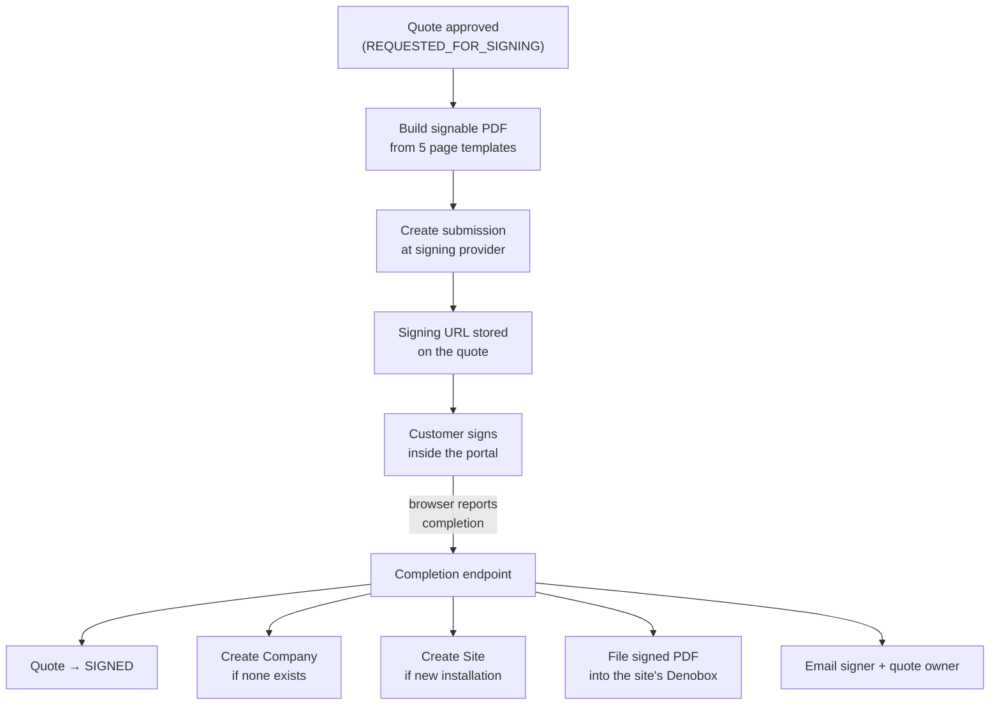

# E-Signature (DocuSeal)

When a quote is approved, the customer has to sign it. This module builds the signable document — a multi-page PDF assembled from the quote's own data — sends it to the external signing provider, embeds the signing ceremony inside the portal, and then handles what happens the moment the signature lands. That last part is the important one: **completing a signature is what turns a prospect into a customer.** It flips the quote to `SIGNED`, and if the deal was for a company or a site the platform had never heard of, it creates them.

> **Reading this doc:** use the **Business / Developer** switch at the top. *Business* explains what gets signed, what the signature creates, and where the flow can stall. *Developer* adds the submission payload, the Handlebars document pipeline, the completion endpoint and its authentication model, the auto-provisioning branches, and the gotchas.

---

## Why this matters

The signature is the commercial hand-off. Everything before it is a proposal; everything after it is an obligation — an invoice will be raised, hardware will ship, and a monitoring subscription will start. Because the platform also **creates the Company and the Site at this moment**, the signature is the origin point for records that the rest of the product depends on for years. A quote that never completes its signing step leaves no customer, no site, and no order.

---

## How the data flows

---

## What gets signed

The document is generated fresh from the quote — nothing is uploaded or stored in advance. It is assembled from **five pages**: a cover page, an introduction, the products-and-pricing table, purchase terms (which carries the signature field), and terms & conditions. Company logos and marketing imagery are embedded directly into the file so it renders identically wherever it is opened.

For a **group quote** (several sites renewed together), the child quotes are pulled in so the single signable document covers every site in the group.

The submission **expires 30 days** after it is created.

---

## What the signature creates

This is the part with the most business consequence. On completion, in order:

1. **The quote becomes `SIGNED`** — the signing URL is cleared, the signature image and timestamp are stored.
2. **A Company is created if the quote has none** — named after the quote's project owner, with the site address as its billing address. If the quote's owner had no company of their own, they are attached to this new one. An existing company with the same name is reused rather than duplicated.
3. **A Site is created if this was not an existing site** — named from the quote, with `serviceStatus = ORDERED`, owned by the company from step 2, tagged `Capacity Test` when the quote included capacity testing, and **geocoded** so it lands in the right place on the portfolio map. An existing site of the same name is reused.
4. **Documents are filed** — any quote attachments are copied into the site's Denobox `Plans/` folder, and the signed PDF itself is stored under `Admin/`. See [[storage]].
5. **Both the signer and the quote owner are emailed.** See [[email]].

---

## The rules that matter

- **Only a quote awaiting signature can be signed.** Completion is rejected unless the quote is in `REQUESTED_FOR_SIGNING`, so a signature cannot be replayed onto an already-signed or withdrawn quote.
- **Company and site creation are idempotent by name.** Both look for an existing record of the same name first, so re-running the flow does not create duplicates — but it also means two genuinely different customers with the same company name would be merged.
- **A new site is always created as `ORDERED`**, never active. Activation happens later, when hardware ships. See [[quote]].
- **Document filing is best-effort.** If copying attachments or storing the signed PDF fails, the failure is logged but the quote is still saved as signed. The commercial record is never lost because a file copy failed.
- **Completion is reported by the customer's browser, not by the signing provider.** This is the single most consequential design fact in the module — see the gotcha below.

---

## Where the flow can stall

- **The signer closes the tab before completion is reported.** The signature exists at the provider, but the platform never hears about it, and the quote stays "Waiting for Signing" indefinitely. Nothing reconciles this automatically.
- **The signer is not logged into the portal.** The completion step is authenticated, so signing has to happen inside a portal session.
- **The submission expires after 30 days** and must be re-sent.

---

## Entry points {dev}

- Completion endpoint — `POST /api/docuseal/signing/completed` — `denowatts-backend/src/shared/docuseal/docuseal.controller.ts:17-33`
- Service — `denowatts-backend/src/shared/docuseal/docuseal.service.ts`
- Submission creation is called from `QuoteService.processQuoteForSigning` — `denowatts-backend/src/quote/quote.service.ts:1172`
- Portal signing modal — `denowatts-portal/src/features/quote-management/quote-view/components/DocusealSigningModal.tsx` (wraps `DocusealForm` from `@docuseal/react`)
- Portal completion call — `denowatts-portal/src/common/utils/docusealApi.ts` → `DOCUSEAL_SIGNING_COMPLETED_URL` (`denowatts-portal/src/common/constants/urls.ts:51`)

### The completion endpoint is **not** a webhook {dev}

> **Correcting two sources.** The module's own `README.md` claims `POST /api/docuseal/webhooks` and *"Processes DocuSeal webhook events"*, and [[quote]] previously assumed a provider-side webhook. Neither is what the code does.

The controller takes `@CurrentUser() user: User` and carries no `@Public()` decorator, while `JwtAuthGuard` is registered globally as an `APP_GUARD` (`denowatts-backend/src/app.module.ts:200-203`). **The endpoint therefore requires a logged-in portal user and the provider's servers cannot call it.**

The real path is browser-driven: `DocusealForm`'s `onComplete` fires in the customer's browser → `handleSigningComplete` (`QuoteViewPage.tsx:102-126`) → `sendDocusealSigningCompleted` POSTs the provider's payload with the user's access token via `fetchWithAuthRetry`.

Consequences: there is **no server-side reconciliation** of signatures completed but never reported, and the signer must hold a valid portal session. The README's documented endpoints do not exist in `docuseal.controller.ts` — **flag for human review** as to whether a real webhook was intended.

---

## Creating the submission {dev}

`createSubmission(input)` — `docuseal.service.ts:75-140`:

1. Load the quote via `quoteService.getQuoteById`; throw if missing.
2. `generateHtmlFromHbs(quote)` builds the document HTML (below).
3. POST to the provider's HTML API with:
   - `name: "Quote <referenceId> - <siteName>"`, document `quote-<referenceId>-signed-document.pdf`, `size: "A4"`
   - one submitter, `role: "First Party"`, carrying **`metadata: { quoteId, siteName, projectOwner }`** — `quoteId` is how the completion callback later finds the quote
   - `source: "api"`, `submitters_order: "random"`, `expire_at: now + 30 days`
4. Audit `target: "docuseal"`, `action: INTEGRATION`, event *"Sent a quote for e-signature"*.
5. Return `{ submissionId, signingUrl: submitters[0].embed_src, slug }`; the caller stores these as `dsEnvelopeId` / `dsSigningUrl`.

Any failure is wrapped in `InternalServerErrorException`.

### Document pipeline {dev}

`generateHtmlFromHbs` — `:143-347` — compiles five Handlebars templates from `shared/docuseal/templates/`:

`quote-first-page.hbs` · `quote-introduction-page.hbs` · `quote-products-page.hbs` · `purchase-terms.hbs` · `terms-and-conditions.hbs`

**Each template except the first is wrapped in its own try/catch that substitutes a placeholder** (`"
Error loading products page
"`) on failure. A broken products template therefore yields a signable document with no pricing rather than an error — **flag for human review**.

`prepareHbsTemplateData` — `:398-486` — flattens owner (`firstName`, `lastName`, `email`, `phone`), company (falling back to `quote.projectOwner` when absent), quote fields and products, and for a group quote pulls children via `quoteService.getQuotesByGroupId`. Three images are inlined as data URIs through `getImageAsDataUrl` (`:487-508`): `deno.png`, `Blog-Image-Masterss-Ilac-PJLA.png`, `100-performance.png`.

Handlebars helpers registered at `:366-396`: `formatCurrency` (USD via `Intl.NumberFormat`, `"$0.00"` for non-numbers), `formatDate` (`MMMM DD, YYYY`), `multiply`, `subtract`, `and`, `or`.

> Templates are read from disk by filename at runtime, so they are invisible to import-graph analysis. They are live.

---

## Handling completion {dev}

`handleSigningCallback(payload, user)` — `docuseal.service.ts:509-714`. Guard clauses return `{ success: false }` (never throw) when:

| Condition | Message |
|---|---|
| `payload.status !== "completed"` | "Submission not completed, no action taken" |
| submission not found at provider | "Submission not found" |
| `payload.metadata.quoteId` missing | "No quote ID found in submission metadata" |
| quote not found | "Quote not found" |
| `quote.status !== REQUESTED_FOR_SIGNING` | "Quote is not in requested for signing status" |

Then, in order:

1. `status = SIGNED`; `dsSigningUrl = undefined`; `dsSignImage ←submission.submitters[0].values[0].value` (only when a string); `signedAt = new Date()`.
2. **Company branch** (`:577-597`) — when `!quote.company._id`, `createCompanyAfterSigning` (`:720-746`) does `companiesService.findOne({ name })` and returns the existing record if found, else creates one with `billingInfo` from the quote's site address and `verifiedDomains: []`. If the quote owner has no company, `usersService.updateById` attaches it.
3. **Site branch** (`:599-625`) — when `!quote.isExistingSite`, `createSiteAfterSigning` (`:748-786`) does `sitesService.findOne({ name }, undefined, true)` first, else creates with `serviceStatus: SiteServiceStatus.ORDERED`, `owner: company`, `tags: ["Capacity Test"]` when `epcAndCapacityTest`, and geocodes `"<address>, <city>, <state> <zip>"` through `googleMapsService.getCoordinates`, writing `location.coordinates = [lng, lat]` when resolved.
4. **Documents** (`:626-673`) — quote attachments copied to `denobox/{site}/Plans/{name}` with the `^\d+-` upload prefix stripped; the signed PDF downloaded and uploaded to `denobox/{site}/Admin/quote-<referenceId>-signed.pdf` inside `process.nextTick` (deliberate — its rejections cannot reach the enclosing try/catch, so it carries its own handler).
5. `quote.save()`, then email signer + owner, subject `"Quote signed: <siteName>"`.
6. Return `{ success: true, redirectUrl: <FRONTEND_URL>/settings/quote-management/<id> }`.

The outer `catch` returns `{ success: false, message: "Error processing signing callback" }` — **the underlying error is discarded, not logged** (`:710-714`). **Flag for human review.**

---

## Callback payload {dev}

`interfaces/docuseal-callback.interface.ts`. Fields the code actually reads: `status`, `submission_id`, `metadata.quoteId`. `DocuSealSubmitterMetadata` is `{ quoteId, siteName, projectOwner }`; `values[]` supplies the signature image. The rest (`ip`, `ua`, `declined_at`, `decline_reason`, `audit_log_url`, `preferences`) is typed but unused — notably **`declined_at` / `decline_reason` are never handled**, so a declined signature is indistinguishable from an unfinished one.

---

## Configuration {dev}

`DOCUSEAL_BASE_PATH`, `DOCUSEAL_API_KEY` (README), plus `FRONTEND_URL` for the email button and redirect.

Injected dependencies: `ConfigService`, `QuoteService` (via `forwardRef` — circular with `quote.module.ts`), `CompaniesService`, `UsersService`, `SitesService`, `StorageService`, `EmailService`, `GoogleMapsService`, `AuditService`.

---

## Data touched {dev}

- `quotes.status` → `SIGNED`; `quotes.dsSigningUrl` cleared; `dsSignImage`, `signedAt` written; `company` / `site` back-filled when auto-created.
- `companies` — a new document when the quote had no company (`createCompanyAfterSigning`).
- `sites` — a new document with `serviceStatus: ORDERED` when `!isExistingSite`; `location.coordinates` from geocoding.
- `users.company` — set when the quote owner had none.
- S3 — `denobox/{site}/Plans/*` (attachments) and `denobox/{site}/Admin/quote-*-signed.pdf`.
- `systemlogs` — `INTEGRATION` record on submission creation. See [[audit-trail]].

---

## Edge cases & gotchas {dev}

- **No server-side reconciliation.** Completion depends entirely on the browser POST. A signature completed at the provider but never reported leaves the quote stuck in `REQUESTED_FOR_SIGNING` with no sweeper to fix it.
- **Name-based idempotency merges distinct customers.** Company and site lookup is by `name` only, so two different customers sharing a company name — or two sites with the same name — are silently treated as one.
- **A declined signature is a no-op.** Only `status === "completed"` is handled; `declined_at` and `decline_reason` are parsed but ignored, so a decline looks identical to a signature that never happened.
- **The outer catch swallows the error.** Callers get a generic message and nothing is logged or sent to Sentry, making a mid-callback failure (e.g. site creation throwing) very hard to diagnose.
- **Partial completion is possible.** Company and site creation happen *before* `quote.save()`. If site creation throws, a company may already exist while the quote is still unsigned; a retry then reuses that company by name.
- **Template failures degrade silently** into placeholder text inside an otherwise signable document.
- **Geocoding failure is tolerated** — the site is created without coordinates and will not place on the map.
- **The README is out of date** — it documents a `GET /signing/callback/:id` and `POST /webhooks` pair that does not exist in the controller.

---

## Solar & platform terminology {dev}

- **Submission** — one signing ceremony at the provider; its id is stored on the quote as `dsEnvelopeId`.
- **Group quote** — one signable parent covering several sites, each a child quote. See [[quote]].
- **Denobox** — the site's private file area where the signed PDF is filed. See [[storage]].
- **`serviceStatus: ORDERED`** — a site that exists commercially but is not yet monitoring. See [[site]].

**Related flows:** [[quote]] · [[companies]] · [[site]] · [[storage]] · [[email]] · [[audit-trail]] · [[authentication]] · [[solar-glossary]]
