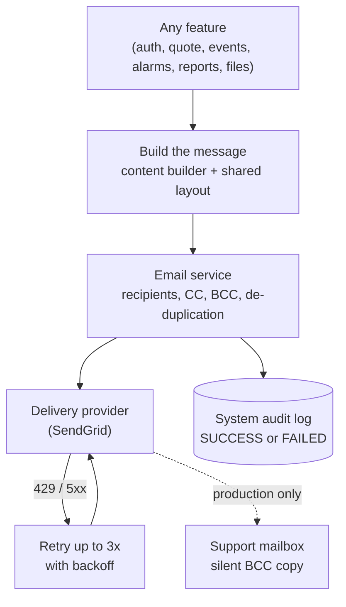

# Email Delivery

Almost every meaningful action on the platform tells somebody about it by email: a new account is verified, a password is reset, a quote is approved, an alarm opens or closes, a ticket gets a comment, a report is ready, a file lands in a site's Denobox. This module is the single pipe all of those go through. It builds the message, decides who is on **To / CC / BCC**, hands it to the delivery provider, retries when the provider is briefly unavailable, and records every attempt — succeeded or failed — in the system audit log.

> **Reading this doc:** use the **Business / Developer** switch at the top. *Business* explains what the platform emails people about, who receives a copy, and what happens when delivery fails. *Developer* adds the service API (four send methods and when to use each), recipient de-duplication, retry policy, audit payloads, configuration, and the full catalogue of senders.

---

## Why this matters

Email is where the product meets people who are not looking at the screen. A signed quote that never reaches the salesperson, or an alarm that never reaches the operator, is indistinguishable from the thing not happening at all. Two design choices in this module carry most of the business consequence: **most sends are fire-and-forget** (a failure to email never rolls back the action that caused it), and **every send is audited** (so a "we never got that email" question is answerable from the System Logs rather than from guesswork).

---

## How the data flows



---

## What the platform emails people about

| Area | Trigger |
|---|---|
| **Accounts** | Sign-up verification, re-send verification, sign-up confirmation, password reset, one-time passcode |
| **Quotes** | Quote created, approved for signing, signed, withdrawn, order confirmation, bulk-create summary, renewal created / updated |
| **Events & tickets** | New event created, ticket raised, ticket updated, comment added to an event or ticket |
| **Alarms** | New alarm opened, alarm closed — subject carries the severity and site name |
| **Reports** | Report ready / daily status delivery |
| **Files** | A file was uploaded to a site's Denobox — sent to the support mailbox |

Message bodies are assembled from **14 content builders** spread across the modules that own each event (`auth` 4, `quote` 6, `webhooks` 2, `storage` 1, `docuseal` 1), then wrapped in one shared Denowatts-branded layout so every email looks the same regardless of which feature sent it.

---

## Who receives a copy

- **To** — the actual recipient(s). Duplicates are removed, so the same address is never listed twice on one message.
- **CC** — a globally configured address list, applied to every email unless the caller overrides it.
- **BCC** — **in production only**, a silent copy goes to the support mailbox on every email that does not already set its own BCC. This is the platform's own paper trail of what customers were told.
- Anyone already on **To** is stripped from CC and BCC, so no one receives the same message twice.

The support mailbox falls back to `support@denowatts.com` when nothing is configured, so the audit copy always has somewhere to land.

---

## The rules that matter

- **Most sends are fire-and-forget.** The common send methods never throw. If delivery fails, the failure is logged, reported to error monitoring, and written to the audit log — but the business action that triggered it (quote approved, ticket created, user registered) still succeeds. A failed email never rolls back work.
- **Transient provider failures are retried** up to 3 attempts with exponential backoff (0.5s, then 1s), but only for rate-limit and server-side errors. A rejected address or malformed message fails immediately without retry.
- **Every attempt is audited**, success or failure, with the recipient list and either the subject or the template id. See [[audit-trail]] and [[system-logs]].
- **Production silently BCCs support** on all mail that does not set its own BCC.
- **A missing provider API key stops the application from starting** — this is deliberate, so a deployment can never come up quietly unable to email anyone.
- **Every message carries a unique reference header** so a mailbox never threads or collapses two near-simultaneous sends that share a BCC address.

---

## Entry points {dev}

This module has no UI and no API surface of its own — it is a shared provider consumed by other services.

- Module — `denowatts-backend/src/shared/email/email.module.ts` (provides `EmailService`, exports it only)
- Service — `denowatts-backend/src/shared/email/email.service.ts`
- Provider client — `denowatts-backend/src/shared/email/sendgrid-client.ts`
- Shared layout — `denowatts-backend/src/shared/email/templates/render-email-layout.ts`

`EmailModule` is imported by `auth`, `events`, `quote`, `report`, `storage`, `webhooks`, plus the `docuseal` and `hubspot` shared integrations.

---

## Service API {dev}

Four public send methods, in two pairs. The distinction matters: **the `sendEmailWith*` pair never throws; the `send*Email` pair does.**

| Method | Body source | On failure | Use when |
|---|---|---|---|
| `sendEmailWithHtml(to, subject, html, opts?)` | backend-rendered HTML | swallows — logs + Sentry | default; the caller's work must not fail because email did |
| `sendHtmlEmail(to, subject, html, opts?)` | backend-rendered HTML | **throws** | the caller must know whether it went out |
| `sendEmailWithTemplate(templateId, to, opts)` | provider dynamic template | swallows — logs + Sentry | template-based sends, fire-and-forget |
| `sendTemplateEmail(templateId, to, opts)` | provider dynamic template | **throws** | template-based, failure must surface |

`sendEmail(recipient, subject, body?, fromEmail?)` — `email.service.ts:70-102` — is a plain-text helper that fires without awaiting; it defaults its body to `"This is a test mail"`.

Nearly every caller in the codebase uses `sendEmailWithHtml`. The awaitable variants are the ones each fire-and-forget wrapper delegates to, so audit and logging happen in exactly one place per body type (`:215-256`, `:274-315`).

### Options

```ts
EmailOptions      { fromEmail?, ccMails?, bccMails?, dynamicTemplateData, attachments? }
HtmlEmailOptions  { fromEmail?, ccMails?, bccMails?, attachments? }
```

### Recipient assembly — `buildTemplateMail` / `buildHtmlMail`

Both builders (`:104-155`, `:158-207`) are line-for-line identical apart from template-vs-HTML body, and apply the same four steps:

1. `from` ← `options.fromEmail` or `SENDGRID_FROM_EMAIL` (**`getOrThrow`** — boot fails if unset), display name hard-coded `"Denowatts"`.
2. `to` de-duplicated via `new Set(...)`.
3. `cc` ← `options.ccMails` or `SENDGRID_CC_EMAILS`. `bcc` ← `options.bccMails`, **else the support list when `NODE_ENV === production`**.
4. CC and BCC are filtered against the final `to` list, and set to `undefined` if nothing survives.

`getSupportEmails()` (`:65-68`) parses `SUPPORT_EMAIL` as a comma-separated list via `parseEmailList` (`common/utils/email.ts`), falling back to `EMAIL.DENOWATTS_SUPPORT` = `support@denowatts.com` (`common/constants/email.ts`).

Every message sets `headers: { "X-Entity-Ref-ID": randomUUID() }`.

---

## Delivery & retry {dev}

`SendGridClient.send` — `sendgrid-client.ts:34-52`:

- `MAX_ATTEMPTS = 3`, `BASE_DELAY_MS = 500`, delay `500 * 2^(attempt-1)` → 500ms, 1000ms.
- `isRetryable` (`:10-17`) retries only when the error carries `code === 429` or `code >= 500`. Anything else — including a 400 for a bad address — breaks out immediately.
- After the final attempt the original error is re-thrown, so the calling send method can audit the failure.
- The constructor throws `"SENDGRID_API_KEY is not configured"` at injection time (`:26-31`), so a misconfigured deployment fails at boot rather than at first send.

---

## Audit records {dev}

`auditEmail(sent, recipients, payload)` — `email.service.ts:48-58` — writes through `AuditService.record` with:

- `target: "email"`, `action: LogActionType.EMAIL`
- `status`: `SUCCESS` / `FAILED`, `statusCode`: `200` / `500`
- `event`: `"Sent an email to <list>"` or `"Couldn't send an email to <list>"`, falling back to `"an unknown recipient"` on an empty list
- `payload`: `{ to: recipients, ...payload }` — recipients spread **first** so a caller's more specific `to` wins while `payload.to` stays populated, which is what the System Logs *Entity* column reads

The success path also logs `to` / `cc` / `bcc` at `log` level; failures additionally go to `Sentry.captureException`.

---

## Configuration {dev}

| Variable | Required | Used for |
|---|---|---|
| `SENDGRID_API_KEY` | **yes** — throws at boot | provider authentication |
| `SENDGRID_FROM_EMAIL` | **yes** — `getOrThrow` per send | default From address |
| `SENDGRID_CC_EMAILS` | no | global CC applied to every email |
| `SUPPORT_EMAIL` | no | support list; comma-separated; falls back to `support@denowatts.com` |
| `NODE_ENV` | — | production gates the silent support BCC |

`SENDGRID_FROM_EMAIL` is declared in `config/env.validation.ts:18`; `SUPPORT_EMAIL` is validated at `:81-85`.

---

## Callers {dev}

| Module | Call sites | Emails |
|---|---|---|
| `auth/auth.service.ts` | `:162`, `:204`, `:262`, `:307`, `:782`, `:865` | sign-up verification (×3 paths), sign-up confirm, password reset, OTP |
| `quote/quote.service.ts` | `:302`, `:405`, `:427`, `:902`, `:1107`, `:1861`, `:2115` | created, approved for signing, withdrawn, bulk summary, order confirmation, renewal created/updated |
| `events/events.service.ts` | `:174`, `:248`, `:952` | new event, ticket raised, ticket updated |
| `events/comments.service.ts` | `:118` | comment on event / ticket / global event |
| `webhooks/webhook.service.ts` | `:541`, `:558`, `:607` | new alarm, closed alarm, order-related template send |
| `storage/storage.service.ts` | `:195` | "A file is uploaded on DenoBox." → support list |
| `shared/docuseal/docuseal.service.ts` | `:698` | "Quote signed: <site>" → signer + quote owner |
| `shared/hubspot/hubspot-crm.service.ts` | `:670` | order-confirmation template send |
| `report/*` | injected in `report.processor.ts:48`, `report-template.service.ts:84`, `report-daily-status.service.ts:73` | report delivery / daily status |

Template ids live in `shared/email/constants/constants.ts`: `EMAIL_QUOTE_TEMPLATE_ID`, `HUBSPOT_ORDER_CONFIRM_EMAIL_TEMPLATE_ID`.

---

## Data touched {dev}

- **No collection of its own.** The module owns no schema and persists nothing directly.
- `systemlogs` (via `AuditService`) — one record per send attempt, `action: EMAIL`, carrying recipients plus subject or template id. This is the only durable trace of an email. See [[system-logs]].

---

## Edge cases & gotchas {dev}

- **A swallowed failure is invisible in the request path.** `sendEmailWithHtml` returns `void` immediately; the caller cannot tell whether the message was delivered. The only evidence is the audit record. Any "the customer never got it" investigation starts in System Logs, not in the feature's own logs.
- **Production BCCs support on nearly every email.** Sends that do not set `bccMails` copy the support mailbox — including account and password-reset mail. Worth knowing before adding a new email type with sensitive content.
- **The two builders are duplicated.** `buildTemplateMail` and `buildHtmlMail` repeat the same CC/BCC de-duplication block; a fix applied to one must be applied to the other.
- **`sendEmail()` defaults its body to `"This is a test mail"`** and does not await — a caller that omits `body` silently sends that literal text.
- **Retry is narrow by design.** Only `429` and `5xx` retry. A malformed recipient fails on the first attempt, which is correct but means bad-address failures surface only in the audit log.
- **De-duplication is exact-string.** `new Set()` on raw addresses — `User@x.com` and `user@x.com` are treated as two different people.
- **No rate limiting or batching.** A bulk quote create or a fan-out alarm issues one provider call per recipient set, back to back.

---

## Solar & platform terminology {dev}

- **Denobox** — a site's private file area; a file landing there triggers a support notification. See [[storage]].
- **Alarm severity** — carried in alarm email subjects (`New Alarm (<severity>): <site> <title>`). See [[alarm-config]].
- **Ticket** — an event escalated to tracked work; comments on one notify participants. See [[events]].

**Related flows:** [[authentication]] · [[quote]] · [[events]] · [[alarm-config]] · [[notification]] · [[report]] · [[storage]] · [[webhooks]] · [[audit-trail]] · [[system-logs]]
