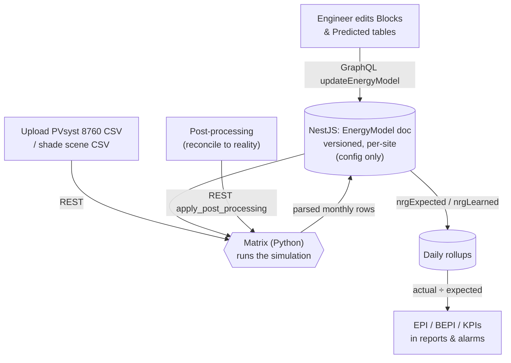

# Energy Model

The **energy model** is the platform's answer to one question: *"How much electricity **should** this solar site produce?"* Once you have that number, you can compare it to what the site **actually** produced and know instantly whether the plant is healthy, underperforming, or broken. It is the yardstick behind every performance score (`{{EPI}}`, `{{BEPI}}`) in the product.

> **Reading this doc:** use the **Business / Developer** switch at the top. *Business* explains — for a solar newcomer — what an energy model is, the two kinds Denowatts keeps, and how a site gets one set up. *Developer* adds the two-service architecture (NestJS config store + external Python simulation), the full GraphQL/REST surface, every schema field, the irradiance math, and the frontend component map.

> **Customer-facing docs:** the public Denowatts Knowledge Base mirrors this feature from the user's side as three pages — [Predicted](https://docs.denowatts.com/Portal/Site%20Overview%20Page/Energy%20Model/Predicted/), [Expected](https://docs.denowatts.com/Portal/Site%20Overview%20Page/Energy%20Model/Expected/), [Learned](https://docs.denowatts.com/Portal/Site%20Overview%20Page/Energy%20Model/Learned/) — plus a [Methodology → Energy Test](https://docs.denowatts.com/Methodology/Energy%20Test/Introduction/) section covering the capacity-test contract methodology. (Structure confirmed from the site's sitemap; the pages themselves are a client-rendered Docusaurus SPA whose content this doc could not fetch — see the note in *Architecture* {dev}.)

---

## Solar in 60 seconds (for the noob)

Before the energy model makes sense, four plain facts about a solar plant:

1. **Sun hits panels.** Sunlight lands on `{{PV Module}}`s. The amount of sunlight is called **irradiance** (`{{Irradiance}}`) — think "how hard the sun is shining, in watts per square meter."
2. **Panels make DC power; inverters make AC power.** Modules produce `{{DC}}` electricity; an `{{Inverter}}` converts it to `{{AC}}` for the grid. A site's size is quoted two ways: **DC capacity** (total panels) and **AC nameplate** (total inverter output).
3. **Reality steals some of it.** Not all sunlight becomes sellable energy. Dirt on panels (*soiling*), heat, shade, wiring resistance, ageing, and mismatched panels all shave a few percent off. These are **losses**.
4. **So "expected energy" = sunlight × capacity − losses.** The energy model is just a careful, hour-by-hour version of that sentence.

The whole point: **expected vs. actual.** If a site was expected to make 45,000 kWh this month and made 45,000, it scored 100% (`{{EPI}}` = 100%). If it made 38,000, something is wrong and someone should look. The energy model produces the "expected" side of that comparison.

---

## Why this matters

Almost every number a customer cares about leans on the energy model:

- **Is my plant healthy?** `{{EPI}}` (actual ÷ expected) only means something if "expected" is trustworthy.
- **Should I send a technician?** Alarms fire when `{{EPI}}` drops below `{{BEPI}}` — the model sets that baseline.
- **How much money will I make?** Revenue forecasting multiplies the model's predicted kWh by a price.
- **Was the plant built correctly?** A formal `{{Capacity Test}}` compares real output to the model under controlled conditions, at handover from builder to owner.

Get the model right and every downstream feature works. Get it wrong and alarms cry wolf, reports miscalculate, and customers lose trust.

---

## The two models: Owner's vs Operator's

A site keeps **two** independent energy models, and it helps a newcomer to hold them apart:

| | **Owner's model (Expected)** | **Operator's model (Learned)** |
|---|---|---|
| Also called | Expected, Design-based | Learned, Data-based |
| Built from | The engineering **design** — panel specs, tilt, inverter ratings, a `{{Bifacial Modules}}` analysis | **Real measured data** after the plant runs for a while |
| When it's used | Commissioning and early life | Once enough real data exists |
| Accuracy | Moderate — design rarely matches reality | Higher — it has *seen* the actual site |
| Where in the UI | "Model Type: **Owner's**" | "Model Type: **Operator's**" |

Both are versioned over time (a site can have "2024 model", "2025 revised model", etc.), and both feed the same comparison against actual production. See the shared `{{Energy Model}}` glossary entry for the longer story.

> **Naming gotcha:** in the backend the "Owner's" type is stored under the enum value spelled **`OWNNER`** (double-N) in places. It's a known typo, not a different concept.

---

## The three ingredients of a model

Whichever type you're looking at, an energy model is built from three things:

1. **Blocks** — the physical description of the plant. A `{{Block}}` is a chunk of panels on one or more inverters. Each block carries its DC capacity, AC nameplate, module & inverter models, tilt/azimuth, tracker settings, and a long list of loss coefficients (soiling, mismatch, ageing, ohmic/wiring loss, and so on). This is the *input* the simulation reasons about.
2. **Predicted (the simulation)** — the *output* of running those blocks through a solar-physics simulator (**PVsyst**). It's a 12-month table of expected energy, plus, under the hood, an **8760** hour-by-hour curve (8,760 = hours in a year). This is what "expected energy" ultimately comes from.
3. **Learned losses** — for the Operator's model, a table of loss factors the platform has calibrated from real data (soiling, vegetation, degradation, open strings, etc.).

---

## The model chain: from sunlight to predicted energy

> *Industry context (general solar knowledge, to make the fields below make sense).* Every solar simulator — **PVsyst** included — turns sunlight into energy through the same ladder of steps. Each step shaves a little off, and each maps onto a field Denowatts stores. Reading top to bottom is *"what the sun offers → what the meter records."*

| # | Step (plain meaning) | Standard term | PVsyst column | Denowatts field |
|---|---|---|---|---|
| 1 | Sun on a **flat** surface | GHI | `GlobHor` | `insHorGlob` |
| 2 | **Tilt** the plane toward the sun (a gain — angled panels catch more) | POA / transposition | `GlobInc` | `insPoaGlob` |
| 3 | Subtract **optical** losses: shading, reflection off the glass (IAM), soiling | Effective irradiance | `GlobEff` | `insPoaEff` |
| 4 | Cells convert light to **DC**; hot cells lose power (temperature coefficient) | Array energy | `EArray` | *(not stored monthly)* |
| 5 | **DC→AC** through the inverter; clip at its limit; subtract wiring/transformer losses | Energy to grid | `E_Grid` | `nrgPredictedRaw` |
| 6 | Subtract **extra real-world losses** (soiling, snow…) to get the number you grade against | — | — | `nrgPredicted` |

Steps 2–5 are the standard **PVsyst "loss diagram."** This is why the Blocks table carries the coefficients it does — mismatch, light-induced degradation, ohmic (wiring) loss, module quality, temperature coefficient, bifaciality — they *are* those loss stages, one per row of the diagram. Step 6 (**post-processing**) is Denowatts' own reconciliation layer bolted on top of the raw PVsyst output. The hour-by-hour drivers behind step 4 (cell temperature from ambient temp + irradiance + wind) are what the 8760 curve stores.

---

## How it flows

The single most important architectural fact: **the heavy physics is not in the main backend.** The NestJS backend *stores the configuration and orchestrates*; the actual 8760 simulation, capacity test, and loss post-processing run in a separate Python service called **Matrix**. The frontend talks to *both* — GraphQL to NestJS for config, REST to Matrix for simulation.

---

## The page: two tabs

The Energy Model lives on a Site tab at **`/site/:siteId/energy-model`**. A shared header at the top lets you pick the **Model Type** (Owner's / Operator's) and the **Version**, and add/edit/delete versions. Below that are two tabs:

- **Model tab** — edit the *inputs*. For Owner's: the **Blocks** table (capacity + coefficients per block). For Operator's: the **Learned** loss-factor table. Also where you load the PVsyst **shade scene** files.
- **Simulation tab** — manage the *outputs*. A list of simulation ("predicted") models across versions, each with a 12-month table (sunlight → raw energy → post-processing → predicted energy), plus the tools to upload the PVsyst 8760 file and reconcile the numbers.

(The Simulation tab is the default landing tab.)

---

## Walkthrough: setting up a site's energy model

A plain-language version of the business process an engineer follows:

1. **Create a version.** Give it a name, pick Owner's or Operator's, set a start date (and mark it "Current" so it stays open-ended).
2. **Describe the hardware (Model tab → Blocks).** Enter each block's DC capacity, AC nameplate, module & inverter models (picked from the shared hardware catalogs), tilt, azimuth, tracker settings, and loss coefficients.
3. **Bring in the simulation (Simulation tab).** Upload the design engineer's **PVsyst 8760 CSV**. Matrix parses it into a 12-month table of expected energy (GHI → POA → effective irradiance → grid energy).
4. **Load shade data if needed (Model tab).** Upload the PVsyst shade-scene CSVs so shading is accounted for.
5. **Post-process (Simulation tab).** Reconcile the raw simulation to reality by subtracting extra known losses month-by-month (soiling, snow, etc.) until the numbers match expectations. Preview live, then save.
6. **The model is now the site's yardstick.** Its monthly/hourly "expected" values flow into the daily rollups, and every `{{EPI}}`/`{{BEPI}}` score compares actual production against it.

---

## Post-processing: making the model match reality

The raw PVsyst simulation ("this is what the panels *could* do") is usually a little optimistic. **Post-processing** is the step where an engineer subtracts additional, named losses so the model matches what the site can *realistically* deliver.

Each post-processing rule is a **loss metric** (e.g. "Soiling", "Snow") applied with a **method** and a **schedule**:

- **Method** — how the loss behaves: *Constant* (flat %), *Linear*, or *Quadratic*.
- **Schedule** — when it applies: *Always*, *Day only*, or *Night only*.
- **Amount** — a single yearly % or twelve monthly %s.

The math: `raw energy − Σ(losses) = predicted energy`. The tool shows a live preview (nothing saved) so you can tune the losses, then persist when the totals look right. There's also a "spread remaining delta" toggle that distributes any leftover difference across months.

---

## Capacity test

A `{{Capacity Test}}` is a formal, one-time exam of a brand-new plant: run it under agreed conditions and check that real output matches the model, typically at handover from the builder (EPC) to the owner. In the energy-model world it uses a dedicated **capacity-test** simulation type and its own 8760 hourly curve. The heavy comparison math (temperature corrections, filtering) runs in Matrix; the result comes back as a downloadable report. See [[tests]] for the full capacity-test wizard.

> *Industry context.* Utility-scale capacity tests usually follow **ASTM E2848** — a regression that predicts power from measured plane-of-array irradiance, temperature, and wind speed, evaluated at agreed "reporting conditions," after **filtering** out low-light/unstable data. That standard is the *why* behind the knobs Denowatts exposes to the test: the temperature-ratio-correction options (`trcOption*`), the irradiance / cell-temperature / power / time min-max **filters**, and the test boundary. Denowatts' methodology write-up lives in the public KB under [Methodology → Energy Test](https://docs.denowatts.com/Methodology/Energy%20Test/Introduction/).

---

## Versioning: one "current" model at a time

A site accumulates models over the years, but at any moment it should have exactly **one current** Owner's model and one current Operator's model (and one current predicted/capacity-test simulation). The platform enforces this automatically: when you create a new model without an end date, the platform **closes the previous current one** by stamping its end date to "now." So "Current" always points at the newest open model, and history is preserved rather than overwritten.

---

## The rules that matter

- **Expected vs actual is the whole game.** The model produces "expected"; `{{EPI}}` = actual ÷ expected.
- **Two models per site** — Owner's (design) and Operator's (learned) — kept and versioned independently.
- **Creating a new current model auto-closes the old one** (end-dates it). One current per type.
- **The main backend never simulates.** It stores config and calls the external Matrix (Python) service for the physics.
- **PVsyst files are the source of the numbers.** The 8760 CSV drives the predicted curve; shade CSVs drive shading.
- **Post-processing only subtracts losses** to bring an optimistic raw simulation down to a realistic predicted value; it never invents energy.
- **`OWNNER` is a real enum typo** for the Owner's type — don't "fix" it without a coordinated migration.
- **The Site-embedded `monthlyEnergyModel` field is effectively unused** in practice; the live model data lives in the dedicated `EnergyModel` / `learned` collections.

---

## What happens behind the scenes

- **A design PDF can be read by AI.** Uploading a monthly energy-model report PDF runs it through an OpenAI extraction step that pulls out the 12 monthly rows (GlobHor, GlobInc, GlobEff, E_Grid, PR, …).
- **The capacity-test upload reshapes the hourly curve.** Uploading an 8760 file replaces the site's predicted hourly rows wholesale — it's destructive by design.
- **Bifacial back-side gain is computed on ingest.** For `{{Bifacial Modules}}`, the rear-side irradiance contribution is calculated (capacity-weighted across blocks) and added to the front-side effective irradiance.

---

## Glossary — energy-model terms

A noob-friendly reference for the terms that show up specifically in this feature. (Common solar terms — `{{DC}}`, `{{AC}}`, `{{kW}}`, `{{kWh}}`, `{{EPI}}`, `{{BEPI}}`, `{{Block}}`, `{{Inverter}}`, `{{PV Module}}`, `{{Irradiance}}`, `{{Bifacial Modules}}`, `{{Capacity Test}}` — live in the shared [[solar-glossary]].)

**Irradiance ladder** — the three "how much sun" numbers, from raw to usable:

- **GHI (Global Horizontal Irradiance)** *(field `insHorGlob`)* — sunlight hitting a **flat, level** surface. The rawest measure. PVsyst column `GlobHor`.
- **POA (Plane-of-Array) / Global Incident** *(field `insPoaGlob`)* — sunlight hitting the **tilted panel** surface. Higher than GHI because panels are angled toward the sun. PVsyst column `GlobInc`.
- **Effective irradiance** *(field `insPoaEff`)* — POA **after** shading/soiling/reflection losses — the sunlight the cells actually use. PVsyst column `GlobEff`.
- **Rear-side / total effective** *(fields `irrRpoaEff`, `irrTpoaEff`)* — for bifacial panels, the extra sunlight bouncing onto the **back** of the panel, added to the front to get a total.

**Energy terms:**

- **8760** — the number of hours in a year (365 × 24). An "8760 file" is an hour-by-hour dataset for a full year — the finest-grained form of the model. *Industry note:* these hourly files are usually built over a **TMY (Typical Meteorological Year)** — a synthetic "average" year stitched from long-term weather records so the prediction reflects a normal year, not one freak sunny/cloudy one.
- **PVsyst** — the de-facto industry-standard software engineers use to design and simulate PV plants. Its "Balances and main results" report is a monthly table of `GlobHor`, `GlobInc`, `GlobEff`, `EArray`, `E_Grid`, and `PR` — exactly the columns Denowatts ingests (and the AI PDF-extractor pulls out).
- **E_Grid / EArray** — PVsyst outputs: energy delivered **to the grid** (`E_Grid`) vs energy leaving the **panel array** before inverter/wiring losses (`EArray`).
- **Raw predicted energy** *(field `nrgPredictedRaw`)* — the simulation's optimistic output *before* post-processing.
- **Predicted energy** *(field `nrgPredicted`)* — the final "expected" number *after* post-processing losses are subtracted. This is what `{{EPI}}` compares against.
- **PR (Performance Ratio)** — a headline efficiency figure: roughly, actual (or modeled) energy ÷ the theoretical maximum for the sunlight received. *Industry standard (IEC 61724):* PR = AC energy ÷ (POA irradiation × DC nameplate ÷ 1000 W/m²); a typical healthy plant sits around **0.75–0.85**. Close cousin of `{{EPI}}`, but note the difference: **PR** normalizes by *irradiance* (how efficient per unit of sun), while **EPI** normalizes by the *model's expectation* (actual ÷ expected). A plant can have a mediocre PR yet a great EPI if the model already expected those losses.

**Loss terms** (the things that shave energy off, entered per block):

*(The percentages below are typical industry ranges to give you a sense of scale — the actual value per site is what's entered in the Blocks table.)*

- **Soiling** — energy lost to dirt/dust/snow on the panels. Very site-dependent: ~1–2% in rainy climates, 5%+ in dry/dusty ones.
- **Mismatch** — loss from panels in a string not being perfectly identical (~1–2%).
- **LID (Light-Induced Degradation)** — a small permanent efficiency drop (~1–2%) that happens in a panel's first weeks of sun exposure.
- **Age derate** — the slow yearly efficiency decline as panels age (commonly ~0.5%/year).
- **Ohmic loss (DC/AC)** — energy lost as heat in the wiring, before (DC) and after (AC) the inverter (~1–3% total).
- **Module quality loss** — the gap between a panel's nameplate rating and its real-world output (small, sometimes a slight gain).
- **Temperature loss** — the biggest environmental loss: power drops ~0.3–0.5% per °C above 25 °C, so hot summer output is lower than the nameplate suggests.
- **Bifaciality factor** — how much of the front-side rating a bifacial panel's back side can add (typically ~65–90% for the cells themselves; the *realized* rear gain is far smaller, a few percent).

**Process terms:**

- **Post-processing** — the reconciliation step that subtracts extra known losses (by method: constant/linear/quadratic; schedule: always/day/night) to turn *raw* predicted energy into *final* predicted energy.
- **TRC (Temperature Ratio Correction)** — an adjustment used in capacity tests to fairly compare output measured at different panel temperatures. *Why it exists:* PV panels lose ~0.3–0.5% of their power for every °C above 25 °C (the temperature coefficient), so a test done on a hot afternoon looks worse than the same plant on a cool morning; TRC corrects both back to a common reference so the pass/fail is fair.
- **Version / Current model** — a dated snapshot of a model; the open-ended one is "Current." Creating a new Current auto-closes the previous.

---

## Architecture: two services {dev}

The feature spans two backends:

- **NestJS backend** (`denowatts-backend/`) — the **system of record for configuration**: models, versions, blocks, predicted tables, learned losses. GraphQL API. Does light math (bifacial irradiance on ingest; PR/KPI aggregation) but **no simulation**.
- **Matrix / Python service** — `https://matrix.denowatts.com`, base constant in `denowatts-backend/src/common/constants/apis.ts:1-2`. Runs the PVsyst-style 8760 simulation, the capacity test, and post-processing. The **frontend calls it directly** over REST (RTK Query), not through NestJS.

There is an authoritative in-repo spec at `denowatts-portal/src/features/site/energy-model/ENERGY_MODEL.md` — read it alongside this doc.

---

## Entry points & routes {dev}

- Route `/site/$siteId/energy-model` — `denowatts-portal/src/routes/_dashboard/site/{-$siteId}/_tabs/energy-model.tsx:4-9`, renders `EnergyModelPage` (default export `EnergyModel`, `denowatts-portal/src/features/site/energy-model/EnergyModelPage.tsx:49-406`).
- Tab registered in the Site nav — `denowatts-portal/src/features/site/components/SiteTabsLayout.tsx:16` (`SITE_TAB_ITEMS`).
- Sidebar "Set up a new site" entry — `denowatts-portal/src/features/home/hooks/use-menu-items.ts:119-123`.
- Deno-AI deep link — `denowatts-portal/src/features/deno-ai/components/cards/ChatCards.tsx:53-60`.
- Page state: active tab syncs to `?source=` (`EnergyModelPage.tsx:58-70,260-263`, default `simulation` at `:61`); model type persists to `?type=` (`:75-97`). The shared header (Model Type + Version selector, Edit/Add/Delete) is rendered once and portaled into the Tabs `tabBarExtraContent` slot (`:270-343`).

---

## GraphQL API surface {dev}

### EnergyModelResolver — `denowatts-backend/src/sites/resolvers/energy-model.resolver.ts` {dev}
All `@AllRoles()` (any authenticated user; the service still scopes by site access).

| Operation | Type | Purpose | Line |
|---|---|---|---|
| `createEnergyModel(createModelInput)` | Mutation | Create a model/version | `:24-30` |
| `energyModelVersions(input)` | Query | Version dropdown by site/type | `:32-38` |
| `updateEnergyModel(updateModelInput)` | Mutation | Deep-merge update (blocks/predicted/learned) | `:40-48` |
| `updateSiteModel(...)` | Mutation | Edit one `predicted[]` item's dates/type/name | `:50-57` |
| `siteModels(input)` | Query | Flatten each model's `predicted[]` into rows | `:59-65` |
| `energyModel(energyModelInput)` | Query | Single model by id/site/type | `:67-73` |
| `deleteEnergyModel(input)` | Mutation | Delete by `{id, site}` | `:75-82` |

### EnergyModelLearnedResolver — `denowatts-backend/src/sites/resolvers/energy-model-learned.resolver.ts` {dev}
Legacy per-site learned snapshots in the standalone `learned` collection: `energyModelLearnedList` (`:16-21`), `createEnergyModelLearned` (`:23-29`), `updateEnergyModelLearned` (`:31-37`), `deleteEnergyModelLearned` (`:39-45`).

### Energy-model-adjacent on SitesResolver — `denowatts-backend/src/sites/resolvers/sites.resolver.ts` {dev}
`getMonthlyEnergyModelReport` (`:69-74`) and `runCapacityTest` (`:77-82`). Module wiring: `denowatts-backend/src/sites/sites.module.ts:34-63`.

### Frontend GraphQL documents {dev}
In `denowatts-portal/src/features/site/api/`:
- Queries (`modelQueries.ts`): `GET_MODEL` → `energyModel` (full doc: `blocks`, `predicted[]` with `monthly[]` + `postProcessing[]`, `learned[]`, `shade`; `:3-130`); `GET_MODEL_VERSIONS` → `energyModelVersions` (`:132-141`); `SITE_MODELS` → `siteModels` (`:143-178`).
- Mutations (`modelMutations.ts`): `CREATE_ENERGY_MODEL` (`:3-9`), `UPDATE_ENERGY_MODEL` (`:11-17`, the workhorse — used by blocks save, learned save, and every predicted-array commit), `DELETE_ENERGY_MODEL` (`:19-27`).
- Legacy learned docs (`energyModelQueries.ts` / `energyModelMutations.ts`), used only by `model/Learned.tsx`: `ENERGY_MODEL_LEARNED_LIST`, `CREATE/UPDATE/DELETE_ENERGY_MODEL_LEARNED`.

---

## REST → Matrix (Python) surface {dev}

Client: `denowatts-portal/src/store/api/matrixApi.ts:24-64` (RTK Query, base `MATRIX_URL`). URLs in `denowatts-portal/src/common/constants/urls.ts:66-77`; bodies typed in `denowatts-portal/src/store/api/types/types.ts`.

| Hook | Endpoint | Body | Fired by |
|---|---|---|---|
| `useUploadPredictedMutation` | `POST /pvsyst_reader/upload_predicted` | `{site_id, predicted_id, type, filepath, soiling?}` (`types.ts:35-43`) | `simulation/LoadPredictedDataModal.tsx:181` |
| `useUploadShadeMutation` | `POST /pvsyst_reader/upload_shade` | `{site_id, energymodel_id, linear_filepath, strings_filepath}` (`types.ts:54-59`) | `model/LoadShadeDataModal.tsx:144` |
| `useApplyPostProcessingMutation` | `POST /post_processing/apply_post_processing` | `{site_id, predicted_id, spread, save?, post_processing?}` (`types.ts:101-112`) | `simulation/PostProcessingModal.tsx` — preview `save:false` (`:220`), persist `save:true` (`:386`) |

The raw PVsyst files themselves are uploaded to the denobox first: `POST ${BACKEND_URL}/storage/denobox/upload` (`STORAGE_DENOBOX_UPLOAD_URL`, `urls.ts:63`), folder `Model`.

---

## Services {dev}

### EnergyModelService — `denowatts-backend/src/sites/services/energy-model.service.ts` {dev}
Mostly CRUD + versioning, not physics.
- `create` (`:35-65`) — on create with no `endDate`, closes the previous current model of the same type (`closeCurrentModel` `:376-385`) and current predicted (`closeCurrentPredicted` `:392-409`). This is how one "current" per type is maintained.
- Reads/updates: `findModelVersionsBySite` (`:67-77`), `findSiteModels` (`:79-93`), `findOne` (`:146-151`), `update` (`:190-238`), `updateSiteModel` (`:95-144`), `delete` (`:359-370`).
- Defensive normalization: `sanitizeDocument` (`:161-172`, drops pre-refactor flat blocks missing `info`, normalizes `postProcessing` so one bad row doesn't null the whole GraphQL field); `sanitizePredictedPostProcessing` (`:180-188`, moves array-valued `factor` into `factorMonthly`).
- Deep-merge helpers for partial updates: `mergeBlocks` (`:248-266`), `mergeMonthly` (`:269-288`), `mergePostProcessing` (`:291-310`), `mergePredicted` (`:342-357`).
- Access control: `assertSiteAccessById` (`:412-418`).

### EnergyModelLearnedService — `denowatts-backend/src/sites/services/energy-mode-learned.service.ts` {dev}
Note the **misspelled filename** (`energy-mode-learned`). `find` (`:24-39`) queries the `learned` collection by `site` and `version = site.energyAccountingVersion || "1.0"`; `create` (`:41-73`) stamps `version` from the site and rejects duplicate site+version+date; `update` (`:75-98`), `delete` (`:101-116`).

### SitesService (orchestration + local math) — `denowatts-backend/src/sites/services/sites.service.ts` {dev}
- `uploadCapacityTest` (`:578-705`) — reads the 8760 XLSX from S3, computes bifacial rear-side irradiance, writes hourly rows into `sitepredicted`. **Destructive:** deletes existing site rows then bulk-inserts.
- `getMonthlyEnergyModelReport` (`:707-728`) — pulls the report PDF from S3, extracts text (`PdfService.extractMonthlyEnergyModelText`, `denowatts-backend/src/shared/pdf/pdf.service.ts:44`), structures it via OpenAI.
- `runCapacityTest` (`:730-798`) — builds a payload and POSTs to `CAPACITY_TEST_API_URL` (`:773`); returns an S3 download link. See [[tests]].

### AI extraction {dev}
`OpenAIService.extractMonthlyEnergyModel` — `denowatts-backend/src/shared/openai/openai.service.ts:21-62` — GPT-4o converts a PVsyst "Balances and main results" table into 12 monthly `{GlobHor, GlobInc, GlobEff, EArray, E_Grid, PR, …}` rows.

### Read/diagnostic tooling (deno-ai) {dev}
- `CheckEnergyModelsTool` — `denowatts-backend/src/deno-ai/tools/check-energy-models.tool.ts` — audits which sites have a Learned model. Its doc comment (`:29-36`) is the operative definition: *"'Energy model' here means the per-site Learned model … The `monthlyEnergyModel` field on the Site schema is NOT populated in practice."*
- `DiagnoseLossesTool` (`denowatts-backend/src/deno-ai/tools/diagnose-losses.tool.ts:99-150`) and `DiagnoseSiteTool` (`denowatts-backend/src/deno-ai/tools/diagnose-site.tool.ts:94-159`) — aggregate `nrgLss*` / `nrgExpected` from `SiteDailyRollup` and compute the EPI-vs-BEPI gap.

---

## Schemas / data model {dev}

MongoDB (Mongoose), dual-decorated as GraphQL.

- **`EnergyModel`** — `denowatts-backend/src/sites/schemas/energy-model.schema.ts:168-247`. Per-site, `timestamps:true`, versioned via `startDate`/`endDate`. `type` = `ModelType` enum `OWNER | OPERATOR` (`:10-13`, stored as `OWNNER` in places). Holds `blocks[]` (`:210-219`), embedded `learned[]` (`:221-227`), `predicted[]` (`:229-235`), `shade` (`:237-243`, references total/irradiance/mismatch shade-profile files, `:39-62`).
- **`EnergyModelBlock` / `EnergyModelBlockInfo`** — `denowatts-backend/src/sites/schemas/energy-model-block.schema.ts:63-332`. Richest input surface: `acMaxOutput`, `dcCapacity`, `acNameplate`, `quantityOfModules`, `modulesPerString`, `rearSideMismatch/Shading/EffectiveFactor`, `stcDcOhmicLoss`, `stcAcOhmicLoss`, `ageDerateFactor`, `lightInducedDegradation`, `mismatch`, `moduleQualityLoss`, `otherLosses`, `staticLosses`, `azimuth` (0–360), `tilt` (0–90), `tracker`/`backtrack`/`maxAngle`/`groundCoverRatio`, `albedo` (0–1), `temperatureCoefficient`, `inverterEfficiency`, `bifacialityFactor` (0–100), `powerFactor`, `transformerLosses`. Nests `module` (`:19-39`) and `inverter` (`:41-61`).
- **`EnergyModelPredicted`** — `denowatts-backend/src/sites/schemas/energy-model-predicted.schema.ts:143-208`. `type` = `PredictedModelType` `OPERATING | CAPACITY_TEST` (`:18-21`). `monthly[]` (`:54-98`): `insHorGlob`, `insPoaGlob`, `insPoaEff`, `nrgPredictedRaw`, `nrgLssPostProcessing`, `nrgPredicted`. `postProcessing[]` (`:100-141`): `metric`, `factor`/`factorMonthly[]`, `method` = `CONSTANT | LINEAR | QUADRATIC` (`:6-10`), `time` = `ALWAYS | DAY_ONLY | NIGHT_ONLY` (`:12-16`).
- **`EnergyModelLearned`** (standalone collection `learned`) — `denowatts-backend/src/sites/schemas/energy-model-learned.schema.ts:87-109`, with `EnergyModelLearnedBlock` (`:7-85`) per-block learned losses: `soiling`, `vegetation`, `rearsideEffectiveFactor`, `stcDcOhmicLoss`, `openStrings`, `moduleIdentifiableFaults`, `moduleQualityLoss`, `ageDerateFactor`, `acMaxOutput`, `mismatch`, `lightInducedDegradation`, `stcAcOhmicLoss`, `otherLosses`, `systemicDcLoss`.
- **`SitePredicted`** (collection `sitepredicted`) — `denowatts-backend/src/sites/schemas/site-predicted.schema.ts:18-57`. Hourly 8760 rows: `irrHorGlob`, `irrPoaEff`, `irrPoaGlob`, `irrRpoaGlob`, `irrRpoaEff`, `irrTpoaEff`, `tempCell`, `tempAmb`, `velWind`, `pwrNetPmtr`, `rShade`.
- **Embedded on `Site`** — `denowatts-backend/src/sites/schemas/site.schema.ts`: `PredictedEnergyModel` (`:209-246`), `MonthlyEnergyModel` (`:180-207`, effectively unused), `energyAccounting` enum `BASIC | ADVANCED` (`:60-63`), `energyAccountingVersion` (`:639-644`), `KPIData` (`:143-178` — `epi`, `epiInService`, `bepi`, `energyAvailability`, `equipmentAvailability`).
- **Rollups** — `denowatts-backend/src/data-out/schemas/site-daily-rollup.schema.ts`: `nrgExpected` (`:40`), `nrgDenoExpected` (`:37`), `nrgExpectedCloud` (`:43`), `nrgLearned` (`:46`), `nrgProducedPred` (`:50`), loss buckets `nrgLssOutage/Shade/Snow/Systemic` (`:53-62`). Metric name aliasing (the closest thing to a migration): `denowatts-backend/src/data-out/data/metrics-data.ts:351-356,1761-1762,2151-2152`.

> **Two "learned" representations** exist: the embedded `EnergyModelLearned` inside `EnergyModel`, and the standalone `learned` collection. Per the deno-ai tool comment, the **standalone collection** is the one used in practice as "the site's energy model."

---

## Formulas & calculations {dev}

**Rear-side / total effective irradiance** (bifacial), computed locally in `uploadCapacityTest` — `denowatts-backend/src/sites/services/sites.service.ts`:
- DC-capacity-weighted averages across blocks (`:588-608`): `avgRearSideShading = Σ(rearSideShading·dcCapacity) / Σ(dcCapacity)` (same for `rearSideEffectiveFactor`).
- Per hourly row (`:671-690`): `irrRpoaEff = (irrRpoaGlob / (1 − avgRearSideShading/100)) · avgRearSideEffectiveFactor / 100`; `irrTpoaEff = irrPoaEff + irrRpoaEff`.

**Capacity-test / expected-energy simulation** — performed **externally** in Matrix. Inputs assembled in `runCapacityTest` (`:741-771`): `soiling`, `shadeAllowance`, `primaryTest`, `tcellFrom`, `testBoundary`, `trcOption`/`trcOptionIrr`/`trcOptionCellTemp` (temperature-ratio-correction), `filterOption` + irradiance/cell-temp/power/time filters, `pwrProduced`. Enums: `denowatts-backend/src/sites/dto/site.input.ts:36-82`.

**Performance Ratio & KPIs** — from stored rollups:
- KPI arithmetic like `"$nrgExpected / $nrgProduced * 100"` is parsed (mathjs) into a Mongo aggregation tree by `buildMongoArithExpr` — `denowatts-backend/src/report/utils/build-mongo-expr.util.ts:22-134` (divide-by-zero guard `:89-101`). Consumed in `denowatts-backend/src/report/report.service.ts:2474-2490` (KPI metrics `isKpi`, deps `:598-635`).
- Loss share: `lossPct = totalLoss / nrgExpected × 100` — `diagnose-losses.tool.ts:124-150`.
- Benchmark gap: `((bepi − epi) / bepi) × 100` — `diagnose-site.tool.ts:156-159`.

---

## Frontend components {dev}

Directory: `denowatts-portal/src/features/site/energy-model/components/`.

**Page-level / shared:**
- `EnergyModelPage.tsx` — shared header + create/update/delete version mutations (`handleCreate:143`, `handleEditSave:182`, `handleDelete:234`).
- `shared/CreateVersionModal.tsx` — create/edit a version (name, model type, start/end date, "Current"; `:18-146`).

**Model tab (`components/model/`):**
- `model/BlocksTab.tsx` — Owner's/Expected editable Blocks table; reads `GET_MODEL`, writes `UPDATE_ENERGY_MODEL` (`handleSave:248-285`); capacity validation (`:288-341`); derived fields `totalStatic`/`rearSideEffectiveFactor` (`:728-791`). Column defs in `denowatts-portal/src/features/site/data/expectedEnergyModelColumns.ts`.
- `model/LearnedVersionTab.tsx` — Operator's/Learned loss-factor table bound to `learned[0].blocks`; writes `UPDATE_ENERGY_MODEL` with a `learned[]` payload (`handleSave:199-231`). Columns in `denowatts-portal/src/features/site/data/learnedColumns.ts`. *(This — not the legacy `Learned.tsx` — is what the page renders for Operator's.)*
- `model/Learned.tsx` — legacy site-level learned-profile editor using the separate `energyModelLearnedList` API (`:33-771`); gated on `site.energyAccountingVersion`.
- `model/LoadShadeDataModal.tsx` — upload/select PVsyst shade-scene CSVs; posts to REST `upload_shade` (`:44-160`).

**Simulation tab (`components/simulation/`):**
- `simulation/PredictedModelLive.tsx` — the live Simulation workspace (default export); lists all predicted models across versions (`SITE_MODELS`), master + detail, add/edit/delete/use-as-type via `UPDATE_ENERGY_MODEL` (`:210-1003`).
- `simulation/PredictedTab.tsx` — 12-month editable predicted table + CSV download/upload template + Totals (`:62-435`).
- `simulation/PostProcessingModal.tsx` — month × metric loss table driving `apply_post_processing` (live preview `save:false`, persist `save:true`), drag-reorderable loss columns, "spread remaining delta" toggle (`:153-627`).
- `simulation/MetricSetupModal.tsx` — configure one post-processing metric (name, method/type, monthly-vs-yearly %) (`:21-185`).
- `simulation/EditSimulationRowModal.tsx` — add/edit a simulation row ("Use as" = Predicted / Capacity Test / Not in Use, dates, notes) (`:22-175`).
- `simulation/LoadPredictedDataModal.tsx` — upload/select the PVsyst 8760 CSV + optional soiling split; posts to REST `upload_predicted` (`:78-347`).
- `simulation/simulationUtils.ts` — `toPostProcessingPayload` (UI→API), `mapPostProcessing` (API→UI), formatters, loss math (`:23-153`).
- `simulation/useMetricOptions.ts` — system metrics tagged "Post Processing" via `GET_METRICS` + `METRIC_TAGS_DROPDOWN` (`:21-49`).
- `simulation/types/types.ts` — simulation domain types (`Metric`, `PredictedMonth`, `DemoModelVersion`, `SimRow`) (`:1-273`).

**Legacy / not wired** (present at `components/` root, not imported by `EnergyModelPage`): `components/EnergyModel.tsx`, `components/ExpectedEnergyModel.tsx`, `components/PredictedEnergyModel.tsx`.

---

## Field mappings {dev}

Predicted table column → `predicted[].monthly` backend field (`PredictedModelLive.tsx:49-59`; `ENERGY_MODEL.md:134-146`):

| UI column | Backend field | Meaning |
|---|---|---|
| GHI | `insHorGlob` | horizontal irradiance |
| POA | `insPoaGlob` | plane-of-array irradiance |
| Effective | `insPoaEff` | effective (post-loss) irradiance |
| EGrid | `nrgPredictedRaw` | raw simulated grid energy |
| Post-processing | `nrgLssPostProcessing` | losses subtracted |
| Predicted | `nrgPredicted` | final expected energy |

Post-processing response monthly fields (`PostProcessingModal.tsx:275-320`; `types.ts:114-125`): EGrid = `nrgProducedRaw`, Predicted = `nrgProduced`, Delta = `nrgDelta`, plus dynamic `nrgLss*` loss columns.

---

## Gotchas {dev}

- **`OWNNER` typo** — the Owner's `ModelType` enum value is misspelled (double-N); flagged in `ENERGY_MODEL.md:45-63`. Don't rename without a data migration.
- **Two learned stores** — embedded `EnergyModel.learned[]` vs standalone `learned` collection; the standalone one is authoritative in practice.
- **`monthlyEnergyModel` on Site is unused** — per `check-energy-models.tool.ts:29-36`. Don't rely on it.
- **Capacity-test upload is destructive** — `uploadCapacityTest` deletes existing `sitepredicted` rows before inserting.
- **TLS off for the Python call** — `runCapacityTest` disables cert verification via a custom agent when calling the capacity-test API (see [[tests]] and [[site]]).
- **`sanitizeDocument` exists for a reason** — pre-refactor documents with flat blocks (missing `info`) or malformed `postProcessing` will null the entire GraphQL field if not normalized (`energy-model.service.ts:161-188`).

---

**Related flows:** [[site]] · [[tests]] · [[analytics]] · [[report]] · [[data-out]] · [[metrics]] · [[storage]] · [[solar-glossary]]
