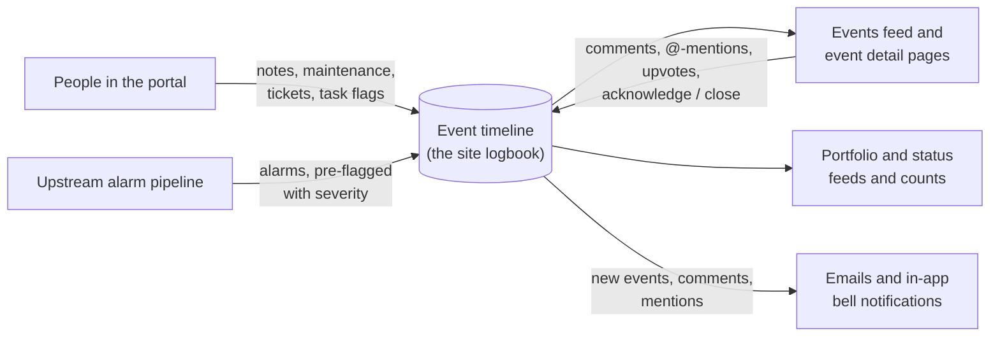

# Events

An **event** is one entry on a solar site's timeline — an operator note, an alarm raised by the monitoring system, a maintenance record, a support ticket, a lesson learned, or a data-correction action. The events feed is the running logbook of everything that happened at a site: when it started, when (or whether) it ended, how serious it was, and what people said about it. Each event can carry photo/document attachments and a threaded comment conversation.

> **Reading this doc:** use the **Business / Developer** switch at the top. *Business* explains what events are, the categories, the comment and acknowledgment workflows, and the rules that govern them. *Developer* adds the full GraphQL surface, the services, every schema and DTO shape, the frontend components, file references, and a solar-terminology primer.

---

## Why this matters

The events feed is the site's institutional memory. When production dips, the first question is always "what happened?" — and the answer lives here: an alarm that opened, a maintenance visit, a grid outage, a note someone left. Tickets routed through events are how customers ask for help, and data-curation events are how operators correct the site's reported numbers. If events are wrong or missing, the story of the site is wrong.

---

## How the data flows



Events enter the timeline two ways — created by people in the portal or arriving pre-flagged from the alarm pipeline — and everything downstream (feeds, rollups, notifications) reads from that one logbook.

---

## What goes on the timeline

Events are classified by **category**. The main kinds:

- **Notes** — free-form operator observations, optionally tied to a specific piece of equipment.
- **Alarms** — raised automatically by the monitoring system, not by people. Open alarms have no end date yet.
- **Maintenance / Malfunction** — planned work and equipment failures.
- **Tickets** — support requests. Tickets carry their own workflow status: *New → In Progress → Awaiting Customer → Closed*.
- **Lessons Learned** — knowledge-base entries; uniquely, platform administrators can create these without tying them to any site (fleet-wide lessons).
- **Data Curation / Data Repair** — actions that correct or recategorize the site's recorded data for a time window.
- **Site Diagnostics, Aerial Scan, loss records, Test reports** — other operational records.

Every event has a title, a start time, an optional end time (no end time = *ongoing*), an optional severity (**Critical / High / Routine**), and optional file attachments. Events can also be **flagged as a task** so they show up in task-focused views.

---

## Comments, mentions, and upvotes

Each event has a comment thread. Inside a comment you can **@-mention** a colleague — they get an in-app notification pointing at the event. Every new comment also emails everyone already involved in the conversation: the event's creator, anyone who commented before, and anyone previously mentioned. Users can also **upvote** an event to signal importance (one upvote per person per event).

---

## Alarms and acknowledgment

Alarms arrive from the monitoring pipeline already classified with a severity. Related alarms are bundled into an **alarm group** — the feed shows the group as a single entry rather than dozens of individual alarms, and the individual alarms appear nested under it. When someone **acknowledges** an alarm group, every alarm inside the group is acknowledged at once. An alarm is *open* until it gets an end date; the feed can filter to open alarms, unacknowledged alarms, or hide everything that's already closed.

---

## Who gets notified

- **Ticket creators** get an email when their ticket is created and another whenever someone changes it (with a list of exactly what changed).
- **Company notification settings** decide who else hears about new events: for eligible categories, each company can choose to notify its site managers and/or a hand-picked list of users, by email, in-app, or both. (See [[notification]] and [[settings]].)
- **Comment participants** get the thread emails described above; mentioned users also get an in-app notification.

---

## The rules that matter

- **Every event belongs to a site**, with one exception: platform administrators can create site-less, fleet-wide *Lessons Learned* entries.
- **Machine-created events start as "Pending"** rather than confirmed, so a human can review them.
- **New tickets start in the "New" status**, and giving a ticket an end date closes it.
- **Deleting an event hides it, it never erases it** — the record is kept for audit purposes. Archiving a site hides all of its events the same way (and unarchiving brings them back).
- **Date changes are remembered** — when an event's start or end date is edited, the previous dates are kept on the record.
- **Attachments are limited to common image and document types**, capped at 20 MB per file.
- **Certain data-curation actions trigger a recalculation** of the site's data for the chosen time window.
- **Known gap (flagged for review):** there is no server-side ownership check on editing or deleting events — any signed-in user who knows an event's id can update or delete it. Access control today only limits which events appear in your feed.

---

## Entry points {dev}
- Events Feed — `denowatts-portal/src/pages/dashboard/events-feed/EventsFeedPage.tsx` → route `/events-feed`
- Event Detail — `denowatts-portal/src/pages/dashboard/events-feed/EventDetailsPage.tsx` → route `/events-feed/:id`
- Create Event modal launched from the feed page, from analytics charts (via `SimpleEventModal`), and inline from the site view (via `QuickEventModal`)

---

## GraphQL API surface {dev}

### Queries

- `events(eventFilterInput: EventFilterInput): EventResponseWithPagination` — paginated, filtered list of events for the authenticated user's accessible sites — `denowatts-backend/src/events/events.resolver.ts:28`
- `event(id: ID!): EventResponse` — single event by ID (also accepts channel ObjectId in the `$or` lookup) — `denowatts-backend/src/events/events.resolver.ts:37`
- `comments(event: ID!): [CommentResponse!]` — all comments for a given event, populated with user info — `denowatts-backend/src/events/comments.resolver.ts:24`

### Mutations

- `createEvent(createEventInput: CreateEventInput!): Event` — create a new event; handles image upload, ticket email, and notification dispatch — `denowatts-backend/src/events/events.resolver.ts:20`
- `updateEvent(updateEventInput: UpdateEventInput!): Event` — update an existing event; tracks date changes; sends ticket-update email; propagates acknowledgment to child alarms if alarm group — `denowatts-backend/src/events/events.resolver.ts:43`
- `removeEvent(id: ID!): Event` — soft-delete an event (sets `deletedAt`) — `denowatts-backend/src/events/events.resolver.ts:54`
- `createComment(createCommentInput: CreateCommentInput!): CommentResponse` — add a comment; parses `@[Name](userId)` mentions; fires mention notifications and comment-cycle emails — `denowatts-backend/src/events/comments.resolver.ts:14`
- `updateComment(updateCommentInput: UpdateCommentInput!): Comment` — update a comment's content — `denowatts-backend/src/events/comments.resolver.ts:29`
- `removeComment(id: ID!): Comment` — hard-delete a comment — `denowatts-backend/src/events/comments.resolver.ts:33`
- `createUpvote(createUpvoteInput: CreateUpvoteInput!): Upvote` — add an upvote to an event for the current user — `denowatts-backend/src/events/upvotes.resolver.ts:13`
- `removeUpvote(event: ID!): Upvote` — remove the current user's upvote from an event — `denowatts-backend/src/events/upvotes.resolver.ts:20`

---

## Services {dev}

### EventsService — `denowatts-backend/src/events/events.service.ts`

#### `create(createEventInput, createdBy): Event`

1. Looks up the site by `createEventInput.site` in `siteModel` — `events.service.ts:56`
2. Looks up the site-owner company via `companiesService.findOne({ _id: site.owner })` — `events.service.ts:58`
3. **Site validation gate:** if the creator is not a `SUPER_ADMIN` OR the category is not `LESSONS_LEARNED`, a missing site throws `BadRequestException('Site not found')` — `events.service.ts:64–71`. Super admins may create global (site-less) `LESSONS_LEARNED` events.
4. Constructs a new `Event` document merging `createEventInput` with `createdBy._id` — `events.service.ts:73`
5. If `createdBy.type === UserType.SYSTEM`, forces `event.status = EventStatus.PENDING` (system-generated events are not auto-confirmed) — `events.service.ts:78`
6. If `category === EventCategory.TICKET`, sets `event.ticketStatus = TicketStatus.NEW` — `events.service.ts:82`
7. Runs Mongoose schema-level validation (`event.validate()`) — `events.service.ts:86`
8. **Image token processing:** for each token in `createEventInput.imageTokens`, validates the file extension (`validateFileExtension`) and calls `storageService.moveEventFile(token, 'events/<eventId>/<token>')` to move the file from temp storage to the event's permanent path — `events.service.ts:88–96`
9. **Image URL processing:** for each URL in `createEventInput.images`, strips query params and extracts the path, validates the extension (only when a filename with extension is present), and calls `storageService.copyFile(imageToken, 'events/<eventId>/<filename>')` — `events.service.ts:98–121`
10. Saves the event document — `events.service.ts:123`
11. **Ticket email:** if `category === TICKET`, immediately sends an HTML email (SendGrid template `DENOWATTS_HTML_EMAIL_TEMPLATE_ID`) to the creator's email with a "View Event" CTA linking to `FRONTEND_URL/events-feed/<eventId>` — `events.service.ts:125–160`
12. **Notification dispatch:** checks `company.notificationSettings` for a matching `isActive` setting whose `type` matches the event's category (eligible categories defined in `EVENT_NOTIFICATION_CATEGORIES` constant) — `events.service.ts:162–259`:
    - Collects recipient user IDs from `site.managers` (if `siteManagers` flag is set) and `notificationSetting.otherUsers`
    - Deduplicates, then fetches active users from those IDs
    - If `inAppNotifications` is enabled: creates in-app notifications via `notificationService.createMany()`
    - If `emailNotifications` is enabled: sends batch HTML email to all unique recipient emails via `emailService.sendEmailWithTemplate()`
13. Returns the saved event.

**DB reads:** `events` (new doc), `sites`, `companies`, `users`
**DB writes:** `events` (insert)
**Side effects:** file moves in storage service; SendGrid emails; in-app notifications

---

#### `find(user, filter?): EventResponseWithPagination`

Builds a `FilterQuery` incrementally, then paginates with `mongoose-paginate-v2`.

Base query (always applied):
```
{ deletedAt: { $eq: null }, alarmGroup: { $exists: false }, archivedAt: { $eq: null } }
```
Note: `alarmGroup: { $exists: false }` means child alarms in a group are excluded from the feed; only the group parent is returned.

Filter transformations applied in order — `events.service.ts:275–434`:

| Filter field | MongoDB clause |
|---|---|
| `searchText` | `$or: [{ title: { $regex } }, { description: { $regex } }]` — space-separated words ORed |
| `company` | resolves sites owned-by or accessed-by the company; sets `site: { $in: [...siteIds] }` |
| `site` (array) | `site: { $in: [...ObjectIds] }` |
| `startDate` | `startDate: { $gte: value }` |
| `endDate` | `endDate: { $lte: value }` |
| `isFlagged: true` | `$or: [{ flaggedBy: { $ne: null } }]` |
| `isUnacknowledged: true` | `$or: [{ isAlarm: true }, { acknowledgedBy: { $eq: null } }]` |
| `isOngoing: true` | `$or: [{ isAlarm: false, endDate: { $eq: null } }]`; if startDate+endDate also given, constrains startDate to that range |
| `severities` | `severity: { $in: [...] }` |
| `openAlarms: true` | `$or: [{ endDate: { $eq: null }, isAlarm: true }]` |
| `categories` | `category: { $in: [...] }` |
| `alarmConfig` | `$or: [{ alarmConfig: ObjectId }]` |
| `acknowledgedBy: null` | `$or: [{ acknowledgedBy: { $eq: null } }]` |
| `ticketStatuses` | `ticketStatus: { $in: [...] }` |
| `hideClosedEvents: true` | `$nor` excludes: closed alarms (`isAlarm:true, endDate:{$ne:null}`), closed tickets (`category:TICKET, endDate:{$ne:null}`), closed tasks (`flaggedBy:{$ne:null}, endDate:{$ne:null}`) |

**Authorization scope:** if `user.type !== SUPER_ADMIN` and no site filter supplied, restricts `site` to sites owned by or accessible to `user.company` — `events.service.ts:421–430`

**Pagination options** (always applied):
```
{ page: page||1, limit: limit||30, sort: { updatedAt: 'desc' } }
```

**Populate paths:** `site` (name, timezone), `channels` (_id, name, number, channelId, status, source), `comments` (sorted desc, each populated with user firstName/lastName/status), `flaggedBy` (firstName, lastName, status), `acknowledgedBy` (firstName, lastName, status), `alarms` (title, description, startDate, endDate), `createdBy` (firstName, lastName, status)

Note: `comments` and `alarms` are virtual fields defined in `EventsModule.forFeatureAsync` — `events.module.ts:27–43`

---

#### `findOne(id): EventResponse`

Queries with `$or: [{ _id: id }, { channel: id }]` allowing lookup by either event ID or channel ID — `events.service.ts:474`. Same populate chain as `find()` minus pagination. Returns `null` if soft-deleted or archived.

---

#### `update(user, id, updateEventInput): Event`

1. Fetches existing event by `id` — throws `BadRequestException('Event not found')` if missing — `events.service.ts:513`
2. Validates that converting a site-less `LESSONS_LEARNED` event to a different category requires a valid `site` — `events.service.ts:519–529`
3. Processes image tokens and image URLs identically to `create()`, merging into `eventImages` — `events.service.ts:531–566`
4. **Date change tracking:** if `startDate` or `endDate` differs from the stored values, sets `previousStartDate` and `previousEndDate` on the update payload — `events.service.ts:568–572`
5. Runs `findByIdAndUpdate(..., { new: true }).lean()` — `events.service.ts:574–587`
6. **Alarm group acknowledgment propagation:** if the updated event is an `isAlarmGroup` and `acknowledgedBy` was set, runs `updateMany({ alarmGroup: updatedEvent._id }, { $set: { acknowledgedBy } })` to acknowledge all child alarms — `events.service.ts:589–592`
7. **Ticket change email:** if category is `TICKET` and any field changed (detected via `updatedDiff` from `deep-object-diff`), builds an HTML change list (title, description, category, site, startDate, endDate, ticketStatus changes) and emails it to the ticket creator — `events.service.ts:596–703`
8. Returns the updated lean document.

**DB reads:** `events` (findById), `sites` (for old/new name in email)
**DB writes:** `events` (findByIdAndUpdate + optional updateMany for alarm group children)
**Side effects:** file copies/moves; SendGrid email to ticket creator

---

#### `remove(id): Event`

Soft-delete: sets `event.deletedAt = new Date()` and saves. Throws `BadRequestException('Event not found')` if not found — `events.service.ts:708–718`.

---

#### `archiveSiteEvents(site: ObjectId): void`

Used by the sites module when a site is archived. Sets `archivedAt = new Date()` on all non-archived events for that site — `events.service.ts:724–736`.

---

#### `restoreArchivedSiteEvents(site: ObjectId): void`

Reverses archival: sets `archivedAt = null` on all archived events for that site — `events.service.ts:738–750`.

---

#### `findByIdWithSite(id): Event`

Helper used by `CommentsService.create()`. Populates `site` (name, timezone) — `events.service.ts:752–754`.

---

### CommentsService — `denowatts-backend/src/events/comments.service.ts`

#### `create(createCommentInput, userId): Comment`

1. Fetches the event via `eventsService.findByIdWithSite()` — throws if not found — `comments.service.ts:33`
2. **Mention parsing:** scans `content` for `@[Full Name](24-hex-ObjectId)` patterns using regex — `comments.service.ts:44–54`
3. Deduplicates mention user IDs, validates each against the `users` collection (active, not deleted) — `comments.service.ts:57–74`
4. Creates the comment document with `{ ...createCommentInput, user: userId, mentionsUsers: validMentionedUserIds }` — `comments.service.ts:76–81`
5. Fetches the commentor user record — `comments.service.ts:83`
6. **Comment-cycle emails:** calls `getEventCommentCycleEmails()` which collects emails from:
   - The event creator
   - All previous comment authors on the same event
   - All previously mentioned users in comments
   Cleans mention format (`@[Name](id)` → `@Name`) and sends a notification email to all unique addresses — `comments.service.ts:93–113`
7. **Mention in-app notifications:** for each uniquely mentioned user, creates an in-app `NotificationType.MENTION` notification via `notificationService.createMany()` — `comments.service.ts:116–135`
8. Errors in steps 6–7 are caught and sent to Sentry, not re-thrown — `comments.service.ts:136–138`
9. Returns the newly created comment.

**DB reads:** `events` (via eventsService), `users`, `comments` (for email cycle)
**DB writes:** `comments` (insert)
**Side effects:** SendGrid emails; in-app notifications; Sentry error capture

---

#### `find(query): Comment[]`

Simple `find` with `populate('user').populate('mentionsUsers')` — `comments.service.ts:143`.

---

#### `update(id, updateCommentInput): Comment`

`findByIdAndUpdate` with `{ new: true }`. Throws `BadRequestException('Comment not found')` — `comments.service.ts:147`.

---

#### `remove(id): Comment`

`findByIdAndDelete`. Throws `BadRequestException('Comment not found')` — `comments.service.ts:157`.

---

### UpvotesService — `denowatts-backend/src/events/upvotes.service.ts`

#### `create(createUpvoteInput, user): Upvote`

1. Validates the event exists via `eventsService.findOne()` — throws if not found — `upvotes.service.ts:18`
2. Creates upvote document `{ event, site, user }` — `upvotes.service.ts:22`

#### `remove(event, user): Upvote`

`findOneAndDelete({ event, user })` — throws `BadRequestException('Upvote not found')` if no matching upvote — `upvotes.service.ts:25`.

---

## Schemas {dev}

### Event — `denowatts-backend/src/events/schemas/event.schema.ts`

| Field | Type | Required | Indexed | Purpose |
|---|---|---|---|---|
| `_id` | ObjectId | auto | PK | Unique identifier |
| `title` | String | yes | no | Short human-readable label |
| `description` | String | no | no | Longer free-text detail |
| `category` | `EventCategory` enum | yes | partial (status+deletedAt) | Classifies the event type |
| `subCategory` | `EventSubCategory` enum | no | no | Finer classification within a category |
| `site` | ObjectId → Site | no | yes (asc, bg) | The installation this event belongs to; null for global LESSONS_LEARNED |
| `channel` | ObjectId → Channel | no | yes (asc, bg) | Single legacy channel reference |
| `channels` | ObjectId[] → Channel | no | no | Multi-channel references (new pattern) |
| `startDate` | Date | yes | no | When the event started |
| `endDate` | Date | no | no | When the event ended; null = ongoing |
| `previousStartDate` | Date | no | no | Stores old startDate when it's changed (audit trail) |
| `previousEndDate` | Date | no | no | Stores old endDate when it's changed (audit trail) |
| `status` | `EventStatus` enum | yes, default `CONFIRMED` | yes (with deletedAt) | PENDING / CONFIRMED / DENIED |
| `images` | String[] | no | no | Storage URL paths to attached images/files |
| `flaggedBy` | ObjectId → User | no | no | User who flagged this as a task; null = not flagged |
| `acknowledgedBy` | ObjectId → User | no | no | User who acknowledged alarm; null = unacknowledged |
| `createdBy` | ObjectId → User | yes | no | Author of the event record |
| `isAlarm` | Boolean | no, default false | no | True if the event was generated by the alarm system |
| `isAlarmGroup` | Boolean | no, default false | no | True if this is an alarm group parent |
| `alarmGroup` | ObjectId → Event | no | no | Reference to the parent alarm group |
| `severity` | `EventSeverity` enum | no | no | CRITICAL / HIGH / ROUTINE |
| `alarmConfig` | ObjectId → AlarmConfig | no | no | The alarm config that generated this event |
| `recategorizeAs` | `RecategorizeAs` enum | no | no | Target category for DATA_CURATION recategorize action |
| `recategorizeFrom` | `RecategorizeFrom[]` | no | no | Source loss type(s) for recategorization |
| `action` | `Action` enum | no | no | DATA_CURATION action: SPREAD_CUMULATIVES / OVERRIDE_WITH_REMOTE / RECATEGORIZE |
| `ticketStatus` | `TicketStatus` enum | no | no | NEW / IN_PROGRESS / AWAITING_CUSTOMER / CLOSED — only set when `category === TICKET` |
| `snapshotLink` | String | no | no | Plotly snapshot URL attached to the event |
| `deletedAt` | Date | no | partial index | Soft-delete timestamp; null = active |
| `archivedAt` | Date | no | no | Set when site is archived; null = visible |
| `createdAt` | Date | auto (timestamps) | no | Mongoose timestamps |
| `updatedAt` | Date | auto (timestamps) | no | Mongoose timestamps; used for default sort |

**Virtuals (defined in EventsModule):**
- `comments` — `Comment` docs where `comment.event === event._id`
- `upvotes` — `Upvote` docs where `upvote.event === event._id`
- `alarms` — child `Event` docs where `event.alarmGroup === event._id`

**Indexes:**
- `{ site: 'asc' }` background
- `{ channel: 'asc' }` background
- `{ status: 'asc', deletedAt: 'asc' }` partial filter `{ deletedAt: { $eq: null } }` background

---

### Comment — `denowatts-backend/src/events/schemas/comment.schema.ts`

| Field | Type | Required | Indexed | Purpose |
|---|---|---|---|---|
| `_id` | ObjectId | auto | PK | Unique identifier |
| `event` | ObjectId → Event | yes | no (implicit via virtual) | The event this comment belongs to |
| `user` | ObjectId → User | yes | no | Author of the comment |
| `content` | String | yes | no | Raw comment text, may contain `@[Name](id)` mention markup |
| `mentionsUsers` | ObjectId[] → User | no, default [] | no | Validated mentioned users extracted from content |
| `createdAt` | Date | auto | no | Mongoose timestamps |

No explicit indexes beyond the default `_id`. The `find({ event: eventId })` query in the email cycle is unindexed — a potential performance concern on high-volume events.

---

### Upvote — `denowatts-backend/src/events/schemas/upvote.schema.ts`

| Field | Type | Required | Indexed | Purpose |
|---|---|---|---|---|
| `_id` | ObjectId | auto | PK | Unique identifier |
| `event` | ObjectId → Event | yes | no | The upvoted event |
| `site` | ObjectId → Site | yes | no | Site context for the upvote |
| `user` | ObjectId → User | yes | no | The user who upvoted |

No uniqueness constraint on `(event, user)` — the application relies on `findOneAndDelete({ event, user })` for removal but does not prevent duplicate upvotes at the DB level.

---

## Enums {dev}

Defined in `denowatts-backend/src/events/schemas/event.schema.ts` and registered with the GraphQL schema via `registerEnumType`:

**EventCategory** (13 values):
`ADMIN`, `LESSONS_LEARNED`, `AERIAL_SCAN`, `MAINTENANCE`, `MALFUNCTION`, `SYSTEM_LOSS`, `RESOURCE_LOSS`, `GRID_LOSS` (legacy) + `NOTES`, `DATA_CURATION`, `SITE_DIAGNOSTICS`, `DATA_REPAIR`, `TICKET` (new) + `TEST` (Plotly test reports)

**EventSubCategory** (28 values): covers data model updates, maintenance types, network errors, equipment failures, resource losses, vegetation/soiling, and test report types.

**EventStatus**: `PENDING`, `CONFIRMED`, `DENIED`

**EventSeverity**: `CRITICAL`, `HIGH`, `ROUTINE`

**TicketStatus**: `NEW`, `IN_PROGRESS`, `AWAITING_CUSTOMER`, `CLOSED`

**Action**: `SPREAD_CUMULATIVES`, `OVERRIDE_WITH_REMOTE`, `RECATEGORIZE` — only used with `DATA_CURATION` category

**RecategorizeAs**: `UNDETERMINED`, `GRID_UNAVAILABLE`, `PROTECTION_TRIP`, `INVERTER_UNAVAILABLE`, `TRACKER_ERROR`, `MAINTENANCE`, `SNOW`, `PROTECTION_TRIP_INTERNAL`

**RecategorizeFrom**: maps to internal loss column names (`pwrLssUndetermined`, `pwrLssSnow`, `pwrLssAvailabilityInv`, `pwrLssDerate`, `pwrLssTracker`, `pwrLssGeospacial`)

---

## Constants — `denowatts-backend/src/events/constants/index.ts` {dev}

**`ALLOWED_FILE_EXTENSIONS`**: `jpg`, `jpeg`, `png`, `gif`, `webp`, `bmp`, `tiff`, `tif`, `svg`, `heic`, `heif`, `pdf`, `doc`, `docx`, `xls`, `xlsx`, `ppt`, `txt`, `csv` — enforced in `validateFileExtension()` for image tokens and image URLs.

**`EVENT_NOTIFICATION_CATEGORIES`**: `TICKET`, `ADMIN`, `MAINTENANCE`, `LESSONS_LEARNED`, `MALFUNCTION`, `SITE_DIAGNOSTICS`, `DATA_CURATION`, `NOTES` — the subset of categories eligible for company notification settings. `AERIAL_SCAN`, `SYSTEM_LOSS`, `RESOURCE_LOSS`, `GRID_LOSS`, `DATA_REPAIR`, and `TEST` are not eligible.

---

## DTOs {dev}

### CreateEventInput — `denowatts-backend/src/events/dto/event.input.ts`

Extends `Event` schema via `OmitType(Event, ['_id', 'createdBy', 'status', 'createdAt', 'updatedAt'])`. All schema fields are included except those omitted. Additionally adds:

| Field | Type | Validation | Purpose |
|---|---|---|---|
| `imageTokens` | String[] | optional, each non-empty string | Temp storage tokens for images uploaded before event creation |

Inherits all schema field validations: `title` required, `category` required (enum), `startDate` required (Date), etc. `site` is optional (to allow super-admin global events).

---

### UpdateEventInput — `denowatts-backend/src/events/dto/event.input.ts`

`PartialType(OmitType(Event, ['createdBy', 'createdAt', 'updatedAt']))` — all fields optional except `_id` is included (and required at resolver level). Additionally adds:

| Field | Type | Validation | Purpose |
|---|---|---|---|
| `_id` | ObjectId (from schema) | validated at resolver (`if (!_id) throw BadRequestException`) | Identifies which event to update |
| `imageTokens` | String[] | optional | Same as CreateEventInput |

---

### EventFilterInput — `denowatts-backend/src/events/dto/event.input.ts`

`PartialType(OmitType(Event, ['site', 'title', 'category', 'subCategory', 'severity', 'ticketStatus']))` with additional fields:

| Field | Type | Validation | Purpose |
|---|---|---|---|
| `limit` | Int | optional | Page size (default 30) |
| `page` | Int | optional | Page number (default 1) |
| `site` | ID[] | optional | Filter by one or more site IDs |
| `company` | ID | optional | Expand to all sites owned/accessed by company |
| `searchText` | String | optional | Regex search across title and description |
| `isOngoing` | Boolean | optional | Show events with no endDate |
| `isFlagged` | Boolean | optional | Show events with a non-null flaggedBy |
| `openAlarms` | Boolean | optional | Show alarms with no endDate |
| `isUnacknowledged` | Boolean | optional | Show alarms with null acknowledgedBy |
| `severities` | EventSeverity[] | optional | Multi-severity filter |
| `categories` | EventCategory[] | optional | Multi-category filter |
| `ticketStatuses` | TicketStatus[] | optional | Multi-status filter for tickets |
| `hideClosedEvents` | Boolean | optional | Exclude closed alarms, tickets, and tasks |

---

### CreateCommentInput — `denowatts-backend/src/events/dto/comment.input.ts`

`OmitType(Comment, ['_id', 'user', 'createdAt'])`:

| Field | Type | Validation | Purpose |
|---|---|---|---|
| `event` | ObjectId | required (from schema) | The event to comment on |
| `content` | String | required, non-empty | Raw comment text with optional mention markup |
| `mentionsUsers` | ObjectId[] | optional (from schema) | Client may supply mentions; service re-validates them |

---

### UpdateCommentInput — `denowatts-backend/src/events/dto/comment.input.ts`

`PartialType(CreateCommentInput)` plus:

| Field | Type | Validation | Purpose |
|---|---|---|---|
| `_id` | ObjectId | required | Comment to update |

---

### CreateUpvoteInput — `denowatts-backend/src/events/dto/upvote.input.ts`

`OmitType(Upvote, ['_id', 'user'])`:

| Field | Type | Validation | Purpose |
|---|---|---|---|
| `event` | ObjectId | required (from schema) | The event being upvoted |
| `site` | ObjectId | required (from schema) | Site context |

---

## Response types — `denowatts-backend/src/events/dto/event.response.ts` {dev}

| Type | Composition | Purpose |
|---|---|---|
| `UserResponse` | `PickType(User, ['_id', 'firstName', 'lastName', 'status'])` (partial) | Embedded user info on events/comments |
| `CommentResponse` | `OmitType(Comment, ['event', 'user', 'mentionsUsers'])` + typed `user: UserResponse` + `mentionsUsers: UserResponse[]` | Comment with hydrated user objects |
| `UpvoteResponse` | `OmitType(Upvote, ['event', 'user'])` + typed `user: UserResponse` | Upvote with hydrated user |
| `EventSiteResponse` | `PickType(Site, ['_id', 'name', 'timezone'])` | Compact site on each event |
| `EventChannelResponse` | `PickType(Channel, ['_id', 'name', 'channelId'])` | Compact channel on each event |
| `AlarmResponse` | `PickType(Event, ['_id', 'title', 'description', 'startDate', 'endDate'])` | Child alarms on an alarm group event |
| `EventResponse` | `OmitType(Event, ['site', 'channels', 'flaggedBy', 'acknowledgedBy', 'createdBy'])` + typed replacements for all omitted fields + `comments: CommentResponse[]` + `alarms: AlarmResponse[]` | Full hydrated event for queries |
| `EventResponseWithPagination` | `PaginateType(EventResponse)` | Adds `totalDocs`, `limit`, `totalPages`, `page`, `pagingCounter`, `hasPrevPage`, `hasNextPage`, `prevPage`, `nextPage` |

---

## Frontend components — `denowatts-portal/src/common/components/Event/` {dev}

### `EditEventForm.tsx`

The full-featured event form used in `CreateEventModal`. Renders an Ant Design form with:

- **Site selector** (hidden for global events): queries `GET_SITES`; on change clears dates and channel
- **Title** (required text input)
- **Category** (required select); filtered to visible categories via `getVisibleEventCategories()`; changing category resets dependent fields:
  - `TICKET` and `NOTES` → sets `isOngoing: true`, clears endDate; `TICKET` initialises `ticketStatus: TicketStatus.New`
  - `NOTES` in create mode → pre-fills title as `'Notes'`; loads channel selector
  - `DATA_CURATION` → shows action/recategorize fields; other categories clear them
- **Channel selector** (only for `NOTES`): queries `GET_CHANNELS` filtered by selected site; only shows `ACTIVE` channels
- **Data Curation sub-fields** (only for `DATA_CURATION`): `action` (SPREAD_CUMULATIVES / OVERRIDE_WITH_REMOTE / RECATEGORIZE), `recategorizeFrom` (multi-select), `recategorizeAs` (select); `recategorizeFrom` and `recategorizeAs` are required when action is `RECATEGORIZE`
- **Start date / End date** with `showTime`; end date disabled when `isOngoing` is checked; end date time is constrained to be after start time on same day via `getDisabledEndTimeAfterStart()`; "Now" button fills current site-local time
- **isOngoing checkbox** — clears `endDate`; if ticket, also clears `ticketStatus`
- **Description** (optional textarea)
- **Attachments** (Ant Design Dragger): uploads to `VITE_STORAGE_URL/events/upload` with Bearer token; max 20MB; accepts images + pdf/doc/docx/xls/xlsx/ppt/txt/csv; HEIC/HEIF auto-converted to WebP via `heic2any`; filenames sanitized to `[a-zA-Z0-9.-]`; on upload success stores token in `imageTokens[]`; on remove removes from `imageTokens` or `images` array
- **Super admin global event checkbox** (create mode only): sets `site: null`, `category: LessonsLearned`, disables category select
- All dates converted to ISO string in site timezone via `dayjs.tz()` before passing to `onUpdate`

**Props:** `form` (AntD FormInstance), `initialData` (UpdateEventInput), `timezone` (string), `onUpdate` (callback), `onTimezoneChange` (callback)

---

### `CreateEventModal.tsx`

Modal wrapper for `EditEventForm`. Uses `useMutation(CREATE_EVENT)` with `refetchQueries: [GET_EVENTS]`. On save:
1. Validates form fields
2. Strips `isOngoing` (UI-only field) from the mutation input
3. Calls `createEvent({ variables: { createEventInput } })`
4. Toasts success, resets form, calls `onClose`

**Props:** `event?` (IEvent), `initialData?` (Partial\<UpdateEventInput\>), `onClose` (callback)

---

### `SimpleEventForm.tsx`

Simplified version of `EditEventForm`, used in `SimpleEventModal`. Key differences from `EditEventForm`:
- No file upload/attachments section
- Multiple channel selection (`channels[]`) instead of single channel
- `DATA_CURATION` action/recategorize fields present but no `NOTES`-specific channel handling
- `disableSite` prop to lock the site selector when context is known
- Title auto-prefixed with category name on category change (e.g. "Data Curation" prepended)
- Category change sets `recategorizeFrom: [RecategorizeFrom.Undetermined]` as default for DATA_CURATION

**Props:** `form`, `initialData`, `timezone`, `onUpdate`, `onTimezoneChange`, `imageDataUrl?`, `disabled?`, `disableSite?`

---

### `SimpleEventModal.tsx`

Modal wrapper for `SimpleEventForm`, designed for creating events from analytics charts. Notable features:
- Accepts `imageDataUrl` prop (base64 data URL of a captured chart region)
- If `imageDataUrl` is provided, displays a preview and uploads the image to `VITE_STORAGE_URL/events/upload` before calling `createEvent`, appending the returned token to `imageTokens`
- Image size limit: 5MB
- **DATA_CURATION side effect:** if action is `SPREAD_CUMULATIVES` or `RECATEGORIZE` (and start+end dates are both set), fires a POST to `https://matrix.denowatts.com/data_repair/site_resync` with `{ site_id, start, end }` (UTC ISO range) — this is a direct HTTP call to the matrix service, not a GraphQL mutation
- Uses `useMutation(CREATE_EVENT)` with `refetchQueries: [GET_EVENTS]`

**Props:** `initialData?`, `imageDataUrl?`, `timezone?`, `onClose`

---

### `QuickEventModal.tsx`

Streamlined two-mode modal for rapid event creation without the full form:

- **`mode: 'quick-note'`** — creates a `NOTES` event with site, optional channel, notes textarea, and a start/end date with ongoing checkbox. Start date defaults to current site-local time. Future dates are disabled.
- **`mode: 'ticket'`** — creates a `TICKET` event with site and issues textarea only. No dates (the consuming component handles title and dates). Channel selector is hidden for ticket mode.

Does not call GraphQL directly; delegates to the parent's `onSave` callback with a structured payload.

**Props:** `siteOptions: SiteOption[]`, `defaultSite?`, `loading?`, `mode: 'quick-note' | 'ticket'`, `onCancel`, `onSave`

---

### `CreateEventDashboard.tsx`

Renders a Highcharts Dashboards layout (not a GraphQL component). Wraps two chart panels:
- `site-power-analysis-events-timeseries` — time series chart
- `site-power-analysis-events-regression` — regression chart

A dropdown "Explore" button overlays chart overlay components (AggregatePowerOverlay, InverterOverlay, etc.). Used as the chart panel in the events-feed detail view. Destroys the Highcharts Board on unmount.

**Props:** `chartDataForPass: ChartDataForPass`, `config: Dashboards.Board.Options`

---

### `EventFeedChart.tsx`

Wrapper that fetches site power analysis chart data via RTK Query (`useGetChartQuery`) and passes it to `CreateEventDashboard`. Fetches `sitePowerAnalysis` type, expanding date range by ±1 day, at 5-minute interval. Supports `onRangeSelection` callback that rounds selected dates to nearest 5 minutes and converts to UTC. Memoized: only re-renders when `site`, `startDate`, or `endDate` props change.

**Props:** `chartDataForPass?`, `site`, `startDate`, `endDate`, `timezone?`, `template` (board config factory function), `onRangeSelection?`

---

### `event-form-date-utils.ts`

Shared date utilities:
- `normalizeFormDayjs(value)` — coerces string/number/Date/Dayjs to a Dayjs object, returning null for invalid values
- `getDisabledEndTimeAfterStart(start, endPanelDate)` — returns Ant Design `disabledHours/disabledMinutes/disabledSeconds` functions that prevent selecting an end time earlier than the start time when both dates are on the same calendar day

---

## Business rules (cited) {dev}

1. **Site is required for all non-LESSONS_LEARNED events by non-super-admins.** Super admins may create global (site=null) `LESSONS_LEARNED` events. — `events.service.ts:64–71`
2. **System-generated events default to PENDING status.** Events created by `UserType.SYSTEM` are not auto-confirmed. — `events.service.ts:78–80`
3. **TICKET events auto-initialize `ticketStatus = NEW`.** — `events.service.ts:82–84`
4. **File extensions are validated on upload.** Only the extensions in `ALLOWED_FILE_EXTENSIONS` are accepted. Invalid tokens throw an error. — `events.service.ts:91`, `constants/index.ts`
5. **Image tokens are moved; image URLs are copied.** Tokens reference temp storage and are moved to `events/<id>/<token>`. URL-referenced files are copied (errors are silently swallowed). — `events.service.ts:88–121`
6. **Ticket creation sends an immediate email to the creator.** Sent synchronously (fire-and-forget via `emailService`). — `events.service.ts:125–160`
7. **Notification settings are per-company and per-category.** Only categories in `EVENT_NOTIFICATION_CATEGORIES` are eligible. A notification setting must be `isActive` and its `type` must match the event's `category`. — `events.service.ts:162–179`
8. **Alarm group acknowledgment cascades.** Acknowledging an alarm group parent via `updateEvent` propagates `acknowledgedBy` to all child alarms in `updateMany`. — `events.service.ts:589–592`
9. **Ticket updates email the ticket creator with a change diff.** Only fields that actually changed (via `updatedDiff`) are listed. The `updatedAt` field is excluded from the diff. — `events.service.ts:596–703`
10. **`deletedAt` is a soft delete.** Deleted events are excluded by `deletedAt: { $eq: null }` in all queries but never physically removed. — `events.service.ts:265`, `708–718`
11. **Archived events are hidden.** `archivedAt: { $eq: null }` is always applied in `find()` and `findOne()`. Archival is triggered by site archival, not per-event. — `events.service.ts:268`, `724–750`
12. **Child alarm events are excluded from the feed.** `alarmGroup: { $exists: false }` hides all child alarms from the main list; they appear under `event.alarms` on the group parent. — `events.service.ts:267`
13. **isOngoing UI field is stripped before mutation.** Both `CreateEventModal` and `SimpleEventModal` delete `isOngoing` from the payload before calling `createEvent`. — `CreateEventModal.tsx:53`, `SimpleEventModal.tsx:211`
14. **Closing a ticket (setting endDate) auto-sets ticketStatus to CLOSED.** Handled in `EditEventForm.onChange` when endDate is set for a ticket. — `EditEventForm.tsx:236–244`
15. **Setting isOngoing on a ticket clears ticketStatus.** Handled in `EditEventForm.onChange`. — `EditEventForm.tsx:148–158`
16. **Changing site clears date fields.** Both `EditEventForm` and `SimpleEventForm` clear startDate/endDate and reset timezone when the site changes. — `EditEventForm.tsx:117–145`, `SimpleEventForm.tsx:79–110`
17. **Comment mention format:** `@[Display Name](24-hex-ObjectId)`. Mentions are parsed server-side; invalid or deleted user IDs are silently dropped. — `comments.service.ts:44–74`
18. **Comment notification emails go to all participants in the thread** (creator + all prior commentors + all previously mentioned users), not just the event creator. — `comments.service.ts:171–204`
19. **DATA_CURATION site resync is a direct HTTP call.** When action is `SPREAD_CUMULATIVES` or `RECATEGORIZE`, `SimpleEventModal` POSTs to `https://matrix.denowatts.com/data_repair/site_resync` after the event is saved. Only fires when both startDate and endDate are set (not for ongoing events). Failures are non-fatal (toast warning only). — `SimpleEventModal.tsx:229–280`
20. **Upvotes are not deduplicated at the DB level.** There is no unique index on `(event, user)`. The remove path assumes at most one upvote exists per user per event. — `upvote.schema.ts`, `upvotes.service.ts:25`

---

## Data touched {dev}

- `events` collection — core document; created/updated/soft-deleted by `EventsService`; `alarmGroup`, `isAlarmGroup`, `isAlarm` distinguish alarm events from operator-created ones
- `comments` collection — created/updated/hard-deleted by `CommentsService`; linked to `events` via `event` field; virtual on Event schema
- `upvotes` collection — created/deleted by `UpvotesService`; linked to `events` via `event` field; virtual on Event schema
- `sites` collection — read-only in this module; used for site validation, timezone lookup, and manager list for notifications
- `users` collection — read-only; fetched for notification recipients, comment mention validation, and email addresses
- `companies` collection — read-only; fetched for `notificationSettings` on event creation

---

## Edge cases & gotchas {dev}

- **LESSONS_LEARNED global events:** `site` can be null only for this category when created by SUPER_ADMIN. The update path also has a guard: converting a site-less LESSONS_LEARNED to another category requires a valid site to be provided — `events.service.ts:519–529`.
- **`findOne` by channel ID:** the `event` query accepts either an event `_id` or a `channel` ObjectId (the `$or` query). This supports looking up the event associated with a channel directly — `events.service.ts:474–482`.
- **Image URL copy silently fails:** when processing `createEventInput.images`, errors in `storageService.copyFile` are caught and silently ignored. The image is dropped from the event without surfacing an error to the user — `events.service.ts:113–119`.
- **`startDate` query regex includes description:** The search regex in `find()` matches against both `title` and `description` — `events.service.ts:278–286`. The test spec's `buildEventQuery` helper also includes `category` and `subCategory`, but the production service only searches `title` and `description`.
- **`isUnacknowledged` filter uses `$or` not `$and`:** The production filter pushes `{ isAlarm: true }` and `{ acknowledgedBy: { $eq: null } }` as separate OR conditions, which returns events that are either alarms OR unacknowledged (not necessarily both). This may return more results than expected — `events.service.ts:320–327`.
- **`hideClosedEvents` `$nor` flag can conflict with `$or` conditions:** multiple boolean filter flags all add to `$or`. Combined with `$nor`, this can produce unexpected results for complex filter combinations.
- **Comment email failures are captured to Sentry** but do not fail the comment creation. The user always gets confirmation, even if email dispatch failed — `comments.service.ts:136–138`.
- **HEIC conversion on upload:** done client-side via `heic2any`, converting to WebP at 0.8 quality before upload. The original HEIC file is never sent to the server — `EditEventForm.tsx:326–348`.
- **Date timezone handling:** dates are stored in UTC in MongoDB. The frontend converts to site-local time for display and converts back to UTC ISO strings for mutation inputs using `dayjs.tz()`. The `normalizeFormDayjs` utility prevents form crashes when Ant Design DatePicker produces non-Dayjs values.
- **No server-side permission check on `removeEvent` or `updateEvent`:** any authenticated user can remove or update any event by ID. Access control is limited to the query layer (company/site scoping in `find`).
- **Alarm group child events are invisible to the paginated feed** but can still be retrieved directly via `event(id: ID!)` — `events.service.ts:267`, `474`.
- **`previousStartDate` and `previousEndDate` are not exposed in GraphQL.** They are stored in MongoDB but have no `@Field()` decorator and cannot be queried — `event.schema.ts:222–226`.

---

## Solar & platform terminology {dev}

- **Event** — one entry on a site's timeline: a note, alarm, maintenance record, ticket, lesson learned, or data-curation action, with a start (and optional end) date.
- **Alarm** — an event raised automatically by the monitoring pipeline (`isAlarm: true`), classified with a severity by its [[alarm-config]] rule. *Open* = no `endDate` yet.
- **Alarm group** — a parent event bundling related child alarms; the feed shows only the parent, and acknowledging it cascades to all children.
- **Acknowledgment** — a user marking an alarm as seen (`acknowledgedBy`); unacknowledged alarms drive the portfolio rollups.
- **Ticket** — a support-request event with its own workflow status (`NEW → IN_PROGRESS → AWAITING_CUSTOMER → CLOSED`) and creator-notification emails.
- **Lessons Learned** — a knowledge-base category; the only category allowed to exist without a site (SUPER_ADMIN-created, fleet-wide).
- **Data curation** — events that correct recorded site data (`SPREAD_CUMULATIVES`, `OVERRIDE_WITH_REMOTE`, `RECATEGORIZE`); some actions trigger a site resync in the external matrix service.
- **Severity** — `CRITICAL / HIGH / ROUTINE`; copied onto alarm events from the alarm rule and used for notification routing.
- **Mention** — `@[Display Name](userId)` markup inside a comment; parsed server-side into in-app `MENTION` notifications.
- **Upvote** — a per-user endorsement of an event; stored as its own document.
- **Soft delete / archive** — `deletedAt` hides an event permanently (audit-safe); `archivedAt` hides it while its site is archived and is reversible.
- **Site manager** — a user attached to a site who can be auto-included as a notification recipient via company notification settings.

For the full domain vocabulary, see [[solar-glossary]].

---

**Related flows:** [[authentication]] · [[site]] · [[analytics]] · [[settings]] · [[notification]] · [[alarm-config]] · [[webhooks]] · [[solar-glossary]]
