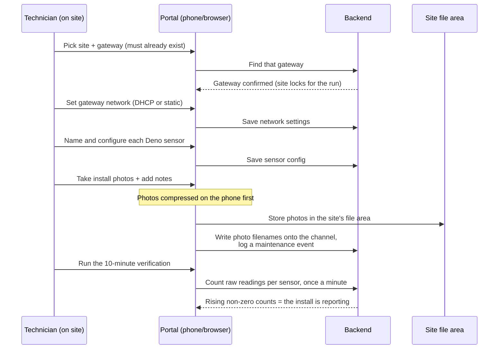

# Field Setup

Field Setup is the **on-site commissioning wizard** a technician uses to bring already-installed hardware online. Standing at the array, they confirm the gateway is present, set up its network, name and configure the Deno sensors hanging off it, snap installation photos, and run a short live-data test that proves the install is actually reporting. It's the bridge between "the box is bolted to the wall" and "this site is producing data we trust."

> **Reading this doc:** use the **Business / Developer** switch at the top. *Business* walks through what the technician does and what each step is for. *Developer* adds the route-based wizard architecture, every step's components and GraphQL calls, the sessionStorage cache, the verification internals, file references, and a terminology primer.

---

## Why this matters

A monitoring platform is only as good as the data coming in, and that data starts at a physical install in a field somewhere. Field Setup exists so a technician — often not an engineer — can stand on site and, in a guided flow, get the hardware configured and **prove** it's reporting before they drive away. Catching a dead sensor or a bad network setting on site is cheap; catching it a week later from the office means a second truck roll.

---

## How the data flows

---

## What it commissions (and what it does not)

It's important to be clear about scope:

- **It configures hardware that already exists.** The gateway and its Deno sensors must already be set up as records in the system (provisioned earlier — see [[site-builder]] and [[channels]]). Field Setup finds those records and fills in their real-world details.
- **It does not create the site, create channels, or flip the site to "live."** There's no "go live" button here. The wizard updates configuration, saves photos and notes, logs a maintenance event, and verifies data — but the site's lifecycle status is managed elsewhere.

*(This corrects an earlier version of this doc that described the wizard creating sites and moving them to "commissioning" — that behavior isn't in the product.)*

---

## The three steps

The wizard is organized as three plain stages, reached from a hub after the technician picks a site and gateway:

1. **Gateway Setup** — confirm the gateway, then set its network (DHCP or a static IP) and check its live readings.
2. **Deno Setup** — for each Deno sensor under that gateway: give it a name, set its auxiliary pyranometer orientation and serial, and upload the required installation photos.
3. **Verification Test** — run a 10-minute check that watches for incoming data from each sensor and confirms the install is reporting.

---

## What the technician does

A typical run:

1. Pick the **site** and the **gateway** (by serial / last 6 digits of its MAC). The wizard won't continue until it finds that gateway.
2. On **Gateway Setup**, choose DHCP or static networking, save it, and optionally peek at live readings.
3. On **Deno Setup**, work down the list of sensors — name each one, set its pyranometer details, and take the labeled photos (enclosure, antennas, alignment, etc.). Photos are converted and compressed on the phone before upload.
4. Add any **notes**; the wizard logs a maintenance event capturing the photos and notes.
5. Run the **Verification Test** and watch each sensor's data count climb. Non-zero counts mean data is flowing.

Once a gateway is chosen, the site is locked for the rest of the run so the technician can't accidentally switch sites mid-setup.

---

## What "verified" means

Verification is a **proof-of-life check, not a pass/fail score**. The wizard opens a 10-minute window and, once a minute, counts how many raw records each sensor has produced. A sensor showing a rising, non-zero count is reporting correctly. There's no automatic "85% = pass" grade — the count *is* the signal. (The UI shows a percent column, but that scoring isn't actually computed; treat it as cosmetic.)

Nothing special is saved when verification finishes — the real configuration was saved step by step along the way (network settings, sensor config, photos, notes, the maintenance event). Verification just confirms the result.

---

## The rules that matter

- **The gateway must already exist** before the wizard will proceed past the first step.
- **Sensors are matched to their gateway by an internal link**, not by physical port — so the list shows exactly the Denos already associated with that gateway.
- **IP is only editable for static networking;** DHCP keeps whatever address the gateway reports.
- **Photos need a site** and are filed under that site's photo storage.
- **The site locks after the gateway step** to prevent mid-wizard site switches.
- **Steps after the gateway check aren't strictly ordered** — a technician can jump between network, sensors, and verify; partial completion is possible.

---

## Wizard architecture {dev}

**No single orchestrator or shared wizard context.** The "wizard" is sibling routes under `field-setup/gateway-setup`, each a standalone page passing state forward via **URL query params** (`?serialNumber=`, `?channel=`, `?id=`) and reading shared selection from **Redux** (`state.header.siteSettings.site`) and **sessionStorage** (`assets`). Routing — `router.tsx:293-348`:

- `/field-setup` → `FieldSetupIntroPage` · `/field-setup/gateway-setup` → `FieldSetupPage` (gateway selector) · `.../list-setup` → `ListSetupPage` (3-card hub) · `.../networking-info` → `NetworkSettingsPage` · `.../deno-list` → `DenoListPage` · `.../gateway-live-data` → `LiveDataPage` · `.../setup` → `SetupPage` · `.../verify-installation` → `VerifyInstallationPage`.

> **UNCLEAR:** none of these routes is wrapped in `ProtectedRoute`/`CompanyRequiredRoute` (unlike settings). The only gating is the in-component `isGuestUser = !currentUser?.company` flag disabling the gateway `Select` (`FieldSetupDashboard.tsx:34`); backend company-scoping is the effective guard.

### Step gating {dev}
Advancement is imperative navigation, not a state machine. The only hard gate is the gateway selector: `FieldSetupDashboard.handleSubmit` fires `GET_CHANNEL { source: Gateway, serialNumber }`; only a truthy `gatewayResponse.channel` allows `navigate('list-setup?serialNumber=...')`, else `toast.error('Gateway not found...')` (`:112-146`). All later steps are URL-reachable with no precondition checks. `serialNumber` propagates by appending `?serialNumber=` to every navigation.

### SessionStorage cache {dev}
Key `assets`; shape `{ site, gateway, serialNumber }` (`FieldSetupDashboard.tsx:16-20`). Read lazily on mount, honored **only if** cached `site === currentSite` else re-seeded (`:36-51`). Written on every `selectedAssets` change (`:70-77`). Changing the Redux site resets it (`:55-68,148-155`). Never explicitly cleared (tab-session lifetime). Only `FieldSetupDashboard` uses it; other steps rely on the URL `serialNumber`. UNCLEAR: `gateway` and `serialNumber` hold the same value — storing both is vestigial.

---

## Steps (detailed) {dev}

### Step 0 — FieldSetupIntroForm — `intro/components/FieldSetupIntroForm.tsx` {dev}
Static 3-step overview + support phone + "START NOW" → `navigate('/field-setup/gateway-setup')` (`:82-86`). No inputs, no GraphQL.

### Step 1 — FieldSetupDashboard (gateway selector) — `overview/components/FieldSetupDashboard.tsx` {dev}
Form with a `Gateway` `Select` (from gateway channels of the current site) + free-text `Serial Number` (`:217-279`). `GET_CHANNELS { sites:[site], source: Gateway }` (`network-only`, skip when no site) populates the dropdown (`:93-105`); auto-selects first gateway's `config.serialNumber` (`:164-184`); a `serialNumber` URL param pre-fills and clears the dropdown (`:79-91`); guests have it disabled (`:34,236`). Validation: non-empty serial + must resolve to a `Gateway` channel via `GET_CHANNEL` (`:119-140`). Advance → `navigate('list-setup?serialNumber=...')` (`:137`).

### Step 1b — GatewayListSetup (hub) — `list-setup/components/GatewayListSetup.tsx` {dev}
Three cards → `networking-info` / `deno-list` / `verify-installation`, heading "Continue with <name>" (`:32-69`). `GET_CHANNEL { serialNumber }` for the name (`:17-22`). Router menu, no validation.

### Step 2a — NetworkSettingsForm — `network-settings/components/NetworkSettingsForm.tsx` {dev}
"Current Networking Info" card: Connection Type (DHCP/STATIC), IP (editable only when STATIC), read-only netmask/gateway/DNS/preamble/last-updated, buttons Refresh / Check live data / Upload images / Save (`:136-301`). Reads prefer live asset report (`GET_ASSET.asset.latestData.networkSettings`) over `channel.config.networkSettings` (`:57-65`); serial upper-cased (`:30-31`). Save → `UPDATE_CHANNEL` with the whole `config.gatewayConfig` block (`:67-106`), refetches `GET_CHANNELS`/`GET_CHANNEL`. Nav: "Check live data" → `gateway-live-data`; "Upload images" → `setup?channel=...` (`:173-286`).

### Step 2b — DenoListTable — `deno-list/components/DenoListTable.tsx` {dev}
Table of Deno channels under the gateway: editable name, read-only serial, last-updated, calibration date (hard-coded `'N/A'`), aux-pyranometer orientation `Select`, aux serial `Input`, actions (`:55-218`). Reads: `GET_CHANNEL { site, source: Gateway, serialNumber }` → gateway `_id` (`:33-41`); `GET_CHANNELS { site, source: Deno, gateway }` → rows (**linked by `config.gateway` ObjectId, not port**, `:43-51`; backend maps `filter.gateway`→`config.gateway`, `channels.service.ts:270-272`). Inline writes via `UPDATE_CHANNEL`: name on blur, aux orientation/serial (`:66-170`). No "Discover" button / no auto-scan. Nav: "Upload/Edit photos" → `setup?channel=<denoId>`; "Live Data" → `gateway-live-data?...` (`:199-210`).

### Step 2c — SetupForm (photos + notes + event) — `setup/components/SetupForm.tsx` {dev}
Full-screen modal: `ImageUpload` tiles (gateway vs Deno label sets, `:62-135`), notes `TextArea`, Save note / Create|Update Event / Close (`:270-382`). Reads `GET_CHANNEL { _id }` + `GET_EVENT { eventId: channel }` (`:27-42`). Save note → `UPDATE_CHANNEL { notes }` (`:139-162`). Event → builds `images` from `http`-prefixed URLs, `UPDATE_EVENT` if today's exists else `CREATE_EVENT` (`category: Maintenance`, title "Gateway/Deno Setup", 1-hour span) (`:164-253`); see [[events]].

#### ImageUpload — `components/ImageUpload.tsx` {dev}
**REST upload, not GraphQL** — Ant `Upload` POSTs `multipart/form-data` to `VITE_STORAGE_URL + '/denobox/upload'` with `Bearer <accessToken>`, body `{ site, folder: 'Photos' }` (`:139-150`); this is storage's `POST /storage/denobox/upload` (see [[storage]]). Client-side: rejects non-images, `.heic`→WebP via `heic2any`, compress (`maxSizeMB:1`, `maxWidthOrHeight:1920`), reject if still >1 MB, rename `<serial>-<DisplayName>-<timestamp>.<ext>` (`:51-192`). On done → `UPDATE_CHANNEL { images: { [key]: filename } }`; on removed → `{ [key]: null }` (`:193-224`). S3 holds bytes, channel doc holds the filename; `findOne` rehydrates to signed URLs (`channels.service.ts:712-721`).

### Step 2d — LiveDataView — `live-data/components/LiveDataView.tsx` {dev}
Read-only table of recent raw rows (S/N, timestamp in site tz, IRR avg, Aux, Tbom, RSSI, Vcap) + Refresh (`:58-130`). `GET_CHANNEL_RAW` (lazy, `network-only`), window default last 1h unless `start`/`end` params; filter by `channel` else `serialNumber` (`:20-50`). Resolver `device-data.resolver.ts:14-17` (see [[data-out]]).

### Step 3 — VerifyInstallationForm — `verify-installation/components/VerifyInstallationForm.tsx` {dev}
10-minute countdown `Timer` (600 s), Start/Pause/Resume/Stop, results table (serial, data count, `%` hard-coded `'0%'`, live-data action) (`:122-241`). Start opens `VerifyInstallationModal`, sets `startDate=now`, `endDate=now+1h`, `timerState='started'` (`:100-112`). Every minute (`time % 60 === 0`) `refetch()` on `GET_CHANNEL_DATA_COUNT` (`:68-72`); skip unless `startDate && endDate && timerState !== 'stopped'` (`:89-98`). Resolver `device-data.resolver.ts:19-22`.

#### FieldSettings (header site picker) — `components/FieldSettings.tsx` {dev}
Site `Select` (`GET_SITES`); selecting dispatches `updateSiteSettings({ site })`. **Disabled** on every route except `/field-setup` and `/field-setup/gateway-setup`, locking the site after the selector (`:22-71`).

---

## GraphQL operations used (traced to backend) {dev}

| Operation | What it does | Frontend caller | Backend resolver |
|---|---|---|---|
| `GET_SITES` | site dropdown | `FieldSettings.tsx:22` | sites resolver; see [[site]] |
| `GET_CHANNELS` | gateway dropdown; Deno list | `FieldSetupDashboard.tsx:93-105`, `DenoListTable.tsx:43-51` | `channels.resolver.ts:30-33` → `ChannelsService.findAll` |
| `GET_CHANNEL` | validate gateway; fetch by serial/`_id` | multiple | `channels.resolver.ts:35-38` → `findOne` (`channels.service.ts:704-724`) |
| `GET_ASSET` | live network report | `NetworkSettingsForm.tsx:47-55` | assets resolver; see [[assets]] |
| `UPDATE_CHANNEL` | persist net config, Deno config, notes, image filenames | multiple | `channels.resolver.ts:40-45` → `update` |
| `GET_EVENT`/`CREATE_EVENT`/`UPDATE_EVENT` | install Maintenance event | `SetupForm.tsx:37,48,52` | events resolver; see [[events]] |
| `GET_CHANNEL_RAW` | proof-of-life rows | `LiveDataView.tsx:42`, `LiveDataModal.tsx:29` | `device-data.resolver.ts:14-17`; see [[data-out]] |
| `GET_CHANNEL_DATA_COUNT` | per-Deno raw count in window | `VerifyInstallationForm.tsx:89` | `device-data.resolver.ts:19-22` → `findChannelDataCount` |
| REST `POST /storage/denobox/upload` | upload channel photo | `ImageUpload.tsx:142` | storage controller; see [[storage]] |

> **Resolver guards:** `channels`/`channel`/`updateChannel` and `channelRaw`/`channelDataCount` carry **no `@Roles`** — gated only by the global auth guard + service-layer company scoping.

---

## "Verified installation" logic {dev}

A **time-boxed data-presence check**, not a status flag. `VerifyInstallationForm` opens a 10-min window and once per minute counts raw records per Deno via `GET_CHANNEL_DATA_COUNT`; a non-zero count per serial is the de-facto pass (`:100-112,68-72,89-98`). Backend `findChannelDataCount` matches `channelRaw` where `metadata.denoMac != null`, `metadata.channel != null`, `metadata.dgwMac` matches the gateway serial (case-insensitive regex), `timestamp ∈ [start,end]`, groups by channel, joins to `source:"DENO"` channels (`device-data.service.ts:401-474`). **Nothing is persisted on the verify step** — config/photos/notes/event were saved earlier; there's no completion mutation or site-status write.

> **UNCLEAR:** the `%` column is literal `'0%'` (`:218-221`) and the modal promises "red %" pass/fail (`VerifyInstallationModal.tsx:34-46`), but no percentage is computed. UI copy, not behavior. Flag for review.

---

## Business rules (cited) {dev}

- **Gateway must exist as a `Gateway` channel** before proceeding — `FieldSetupDashboard.tsx:112-146`.
- **Serial lookups are case-insensitive substring** — `findOne` → `config.serialNumber: new RegExp(serial, 'i')` (`channels.service.ts:706-708`); form upper-cases first (`NetworkSettingsForm.tsx:30-31`).
- **Denos belong to a gateway via `config.gateway` (ObjectId)** — `DenoListTable.tsx:43-51`, `channels.service.ts:270-272`.
- **Network settings live on `config.gatewayConfig`** (no separate collection) — `NetworkSettingsForm.tsx:67-106`.
- **IP editable only for STATIC** — `:82-86,209-215`.
- **`update` requires the source-matching config sub-object** else `BadRequestException('Invalid config')` — `channels.service.ts:740-777`.
- **Deno orientation change alters its `channelId` prefix** (`1.1.2` GHI vs `1.1.1` POA) — `channels.service.ts:784-792`; see [[channels]]/[[device-types]].
- **Photos require a site**, stored under `denobox/<site>/Photos/` — `ImageUpload.tsx:144-150`.
- **Site picker locks after the gateway step** — `FieldSettings.tsx:48-52`.

## Data touched {dev}

- `channels.config.gatewayConfig` — IP allocation, network settings, model, preamble, serial — `NetworkSettingsForm.tsx:74-95`.
- `channels.config.denoConfig.auxPyranometer.{orientation,serialNumber}` and `channels.name` — `DenoListTable.tsx:66-170`.
- `channels.images.<key>` — filename per slot (bytes in S3), rehydrated to signed URL — `ImageUpload.tsx:198-219`, `channels.service.ts:712-721`.
- `channels.notes` — Setup modal — `SetupForm.tsx:145-152`.
- `channelraw` — **read only** by `GET_CHANNEL_RAW`/`GET_CHANNEL_DATA_COUNT` — `device-data.service.ts:200-474`.
- `events` — a Maintenance event per channel — `SetupForm.tsx:209-247`; see [[events]].
- S3 `denobox/<siteId>/Photos/...` — install photos; see [[storage]].
- `sessionStorage['assets']` — `{ site, gateway, serialNumber }`.

## Edge cases & gotchas {dev}

- **No site/channel creation, no status transition** — only edits pre-existing channels; can't proceed if gateway/Deno records don't exist.
- **No enforced step ordering after gateway validation** — all sub-routes URL-reachable; partial completion possible.
- **Cache only honored when site matches** — stale `assets` from another site discarded but not cleared (`FieldSetupDashboard.tsx:36-51`).
- **`serialNumber` propagation is by URL** — landing on a sub-route without it skips/empties queries.
- **Verify `%`/pass-fail not implemented** (hard-coded `'0%'`); only signal is a non-zero count.
- **Live-data is best-effort** — no "gateway not responding" gating beyond Apollo error.
- **HEIC/large-image handling is client-side and lossy** — convert/compress, reject if >1 MB, conversion failures `LIST_IGNORE`.
- **Upload + filename write are two calls** — a failed mutation after a successful upload orphans the S3 object.
- **Event includes only `http`-prefixed images** — freshly uploaded filename-only images may be excluded until a refetch resolves URLs (`SetupForm.tsx:171-207`).
- **No retry/queue on WiFi drop** — mutations fail with a toast and must be re-triggered.

---

## Solar & platform terminology {dev}

- **Gateway (Denobox / DAS)** — the on-site data acquisition box that collects sensor readings and backhauls them to the platform. Each gateway has a serial (last 6 of its MAC).
- **Deno / Deno sensor** — a Denowatts reference sensor measuring irradiance and temperature, linked to a gateway.
- **Pyranometer** — the instrument that measures solar irradiance. A Deno's *auxiliary* pyranometer can be oriented to plane-of-array (POA) or global-horizontal (GHI).
- **POA / GHI** — Plane-Of-Array (panel-facing) vs Global Horizontal irradiance; the orientation choice changes the channel's id prefix.
- **Channel** — a single configured data stream (a gateway or a Deno) the wizard reads and updates. See [[channels]].
- **RSSI** — radio signal strength between a Deno and its gateway; shown in live data as a link-quality check.
- **DHCP / static IP** — automatic vs fixed network addressing for the gateway.
- **Commissioning** — the process of bringing installed hardware online and proving it reports correctly — exactly what this wizard supports.
- **Raw data** — the unaggregated per-reading records used for the live-data and verification views. See [[data-out]].

For the full domain vocabulary, see [[solar-glossary]].

---

**Related flows:** [[site]] · [[site-builder]] · [[channels]] · [[data-out]] · [[storage]] · [[device-types]] · [[assets]] · [[events]] · [[portfolio]] · [[solar-glossary]]
