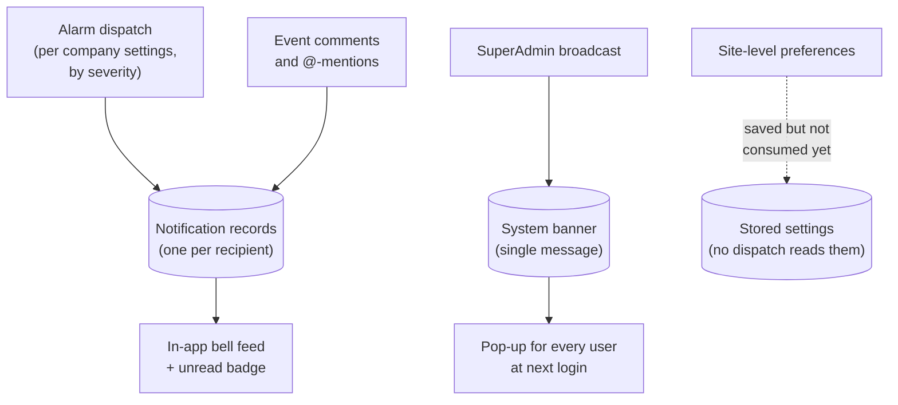

# Notification

Notifications are how the platform gets your attention. There are three kinds: the **in-app bell** in the header, which collects personal notifications (an alarm opened, someone mentioned you in a comment, a new event in a category you follow); **emails**, sent for tickets, alarms, event activity, and comment threads; and a **system-wide banner** that a platform administrator can broadcast to every user — shown as a pop-up the next time each person logs in.

> **Reading this doc:** use the **Business / Developer** switch at the top. *Business* explains the notification kinds, what triggers them, and who controls delivery. *Developer* adds the full GraphQL surface, the services, every schema and DTO shape, the complete trigger map, file references, and a solar-terminology primer.

---

## Why this matters

A monitoring platform is only useful if the right person hears about a problem while it's still happening. The notification system is the last mile: it decides whether an alarm becomes an email in a manager's inbox, a red badge on the bell, or silence. Company administrators tune that delivery per event type, so a Critical alarm can page everyone while routine notes stay quiet.

---

## How the data flows



A bell notification is always a per-recipient record fed by alarm dispatch or comment mentions; the system banner is a separate broadcast channel, and site-level preferences are a dead-end branch today.

---

## The three kinds of notification

- **In-app (the bell)** — each user has a private feed of notifications, newest first, with an unread badge. Clicking one deep-links to the relevant event; you can mark one or all as read. Nobody can see anyone else's notifications.
- **Email** — sent for new tickets (to the ticket's creator), ticket changes (with the list of what changed), alarm openings and closings, new events in subscribed categories, and comment activity on events you're involved in.
- **System banner** — a single platform-wide announcement. When an administrator turns it on (or edits it), every user sees it once as a pop-up at login; it won't reappear for them until the message is updated again.

---

## What triggers a notification

- **An alarm opens or closes** — the monitoring pipeline calls the platform, which notifies the people each connected company chose for that severity (Critical / High / Routine), by email and/or the bell. See [[webhooks]] and [[alarm-config]].
- **A new event is created** — for eligible event categories (tickets, maintenance, malfunctions, notes, and others), the company's settings decide who is told. See [[events]].
- **A ticket is created or changed** — the ticket's creator is emailed, with a change summary on updates.
- **Someone comments on an event** — everyone already in the conversation (creator, prior commenters, previously mentioned people) gets an email; anyone **@-mentioned** in the comment also gets a bell notification.
- **An administrator updates the system banner.**

---

## Who controls what

- **Company-level settings drive delivery.** Each company maintains a grid of rules — one per alarm severity and event category — choosing site managers and/or specific named users, and whether each rule sends email, in-app, or both, with a master on/off per rule. See [[settings]] and [[companies]].
- **Site-level preferences are saved but not yet active.** A site can record per-alarm-rule delivery preferences (channels, delays, extra emails), and the screen for it requires the Enterprise plan or an administrator — but the alarm and event dispatch paths do not read these preferences today. They appear to be groundwork for a future or partially built feature (flagged for review).
- **Each person has one personal preference of their own** — a switch on their Profile page for the daily status report email, plus a "Send Report Now" button that emails them a copy immediately. See *Per-user notification preferences* below and [[report]].
- **Only platform administrators (Super Admins)** can create or edit the system banner.

---

## When a notification actually gets sent

Each row on **Settings → Notification Management** has three parts.
**All three have to be set, or nothing is sent.**

| Part | Where it is | What it decides |
|---|---|---|
| Enabled | the toggle on the left | whether the row is used at all |
| Site Managers, Other Users | under "Targeted Users" | **who** is told |
| In App Notifications, Email | under "Delivery Method" | **how** they are told |

The system first works out who should be told. It takes the site managers if
Site Managers is ticked, plus anyone listed under Other Users. Then it looks at
the Email and In App boxes to decide how to reach those people.

**Ticking Email does not add anyone.** It does not send to every user in the
company. It only decides how the people you already picked are told. So Email
ticked with nobody picked sends nothing — and Site Managers ticked with neither
Email nor In App also sends nothing.

Every combination:

| Enabled | Site Managers | Email | In App | Site managers get |
|---|---|---|---|---|
| on | ✓ | ✓ | — | an email |
| on | ✓ | — | ✓ | a bell notification only, **no email** |
| on | ✓ | ✓ | ✓ | both |
| on | ✓ | — | — | **nothing** |
| on | — | ✓ | ✓ | nothing — nobody was picked |
| **off** | ✓ | ✓ | ✓ | **nothing** — the toggle overrides everything |

Other Users works the same way as Site Managers. It adds people to the same
list, and those people also need Email or In App ticked before they hear
anything.

Two emails ignore this screen completely:

- **Denowatts support** is copied on alarm emails when the alarm rule itself has
  "notify support" turned on. The boxes on this screen do not affect it.
  See [[alarm-config]].
- **Alarm emails check every company that can see the site**, not just this one.
  So a site manager may still be emailed through another company's settings,
  even when the row here is switched off. See [[alarm-config]], [[webhooks]] and
  [[site]].

---

## Per-user notification preferences

Separate from the company-wide grid, every user has their **own** preference record, edited on their Profile page. Today it holds a single switch: whether they receive the **daily status report email**. The record is created automatically the first time the page is opened — nobody has to be provisioned. The same card also carries a **Send Report Now** button that sends the caller a copy on demand, bypassing the schedule and the opt-in flag entirely.

This is the only notification setting an ordinary user controls for themselves; everything else is decided by their company's rules.

> **Now wired up (changed).** This preference used to be inert. The daily status report send path reads it: `getOptedInCompanyRecipients` and `getOptedInSuperAdminRecipients` both query `usernotifications` for `dailyStatusReport: true` and deliver only to those users — `denowatts-backend/src/report/services/report-daily-status.service.ts`.
>
> One subtlety survives: the scheduled job requires an **existing document** with the flag true. The schema default is `true`, but a user who has never opened their Profile page has no document at all and is therefore *excluded*, not defaulted in. Opening the Profile page fires the preference query, and that query upserts — so in practice anyone who has visited the page is opted in — `denowatts-backend/src/user-notification/user-notification.service.ts:14-23`.
>
> **Preferences saved before 2026-08-11 were stranded and have been recovered by a migration.** Removing the schema's explicit collection name made Mongoose fall back to its default pluralization, so the app silently switched from reading `user-notification` to a brand-new, empty `usernotifications` collection. Every preference saved before that — including deliberate "off" choices — was left behind, and because a *read* upserts with a default of `true`, simply opening the Profile page could re-subscribe someone who had turned the report off long ago. A migration merges the two collections and restores each user's last confirmed choice — see **The collection cutover and its migration** below.

---

## The rules that matter

- **Your bell is yours alone** — notifications are always scoped to the signed-in user.
- **Only active users are notified** — deactivated or deleted accounts are skipped everywhere.
- **A rule must be switched on to fire** — inactive company notification rules are ignored.
- **Choosing who and choosing how are two separate settings** — picking the people (site managers, other users) and picking the delivery (email, bell) are set independently, and both are needed. Picking people with no delivery method sends nothing. Picking a delivery method with nobody chosen also sends nothing. See *When a notification actually gets sent* above.
- **There is exactly one system banner** — creating a second one just returns the existing one; the banner reappears for users only when it is updated.
- **Delivery is best-effort** — if a notification or email fails to send, the action that triggered it (the comment, the event) still succeeds; failures are logged internally rather than shown to users.
- **There is no SMS or push notification** — delivery is email and the in-app bell only, and the bell updates when the app refreshes it, not in real time.

---

## Entry points {dev}

> Paths updated after the portal's move from `src/pages/dashboard/*` to the feature-based `src/features/*` tree and from react-router to TanStack Router (routes now live in `denowatts-portal/src/routes/`).

- In-app bell icon — `denowatts-portal/src/common/components/Header.tsx`
- Site Notifications tab — `denowatts-portal/src/features/site/notifications/NotificationsPage.tsx` (route `/site/:siteId/notifications`)
- Notification Management (company-wide) — `denowatts-portal/src/features/settings/notification-management/NotificationManagementPage.tsx` (route `/settings/notification-management`)
- System Notification admin — `denowatts-portal/src/features/settings/system-notification/SystemNotificationPage.tsx` (route `/settings/system-notification`)
- System Notification modal on login — `denowatts-portal/src/features/settings/system-notification/SystemNotificationModal.tsx`
- **Per-user preferences** — `denowatts-portal/src/features/profile/components/NotificationPreferences.tsx`, one card on the Profile page (route `/profile`, `denowatts-portal/src/routes/_dashboard/profile.tsx` → `denowatts-portal/src/features/profile/ProfilePage.tsx`)

---

## Per-user preferences module {dev}

Backend module `denowatts-backend/src/user-notification/` — a small, self-contained module (not `@Global()`), registered in `denowatts-backend/src/app.module.ts:167`.

### GraphQL surface — `denowatts-backend/src/user-notification/user-notification.resolver.ts`

```graphql
query    userNotificationPreferences: UserNotification!
mutation updateUserNotificationPreferences(input: UpdateUserNotificationInput!): UserNotification!
```

Both are scoped to the caller via `@CurrentUser()` — there is no way to read or write another user's preferences, and no role decorator is needed because the user id is never an argument — `:12-23`.

### Schema — `denowatts-backend/src/user-notification/schemas/user-notification.schema.ts`

Collection **`usernotifications`** — Mongoose's default pluralization. The schema previously pinned
`collection: "user-notification"` (singular, hyphenated); commit `dc78727d` removed that option, which
silently changed the collection the app reads and writes. `timestamps: true`.

| Field | Notes |
|---|---|
| `userId` | ObjectId ref `User`, **`unique: true`** — one preference document per user — `:16` |
| `dailyStatusReport` | Boolean, defaults `true` — `:24` |

### Service — `denowatts-backend/src/user-notification/user-notification.service.ts`

Both methods are a single `findOneAndUpdate` with `{ new: true, upsert: true, setDefaultsOnInsert: true }`, so the document is created on first read as well as first write — a user never has to be provisioned — `:14-37`. The read uses `$setOnInsert` so a plain fetch can never overwrite an existing preference — `:16-20`.

### DTO — `denowatts-backend/src/user-notification/dto/user-notification.input.ts`

`UpdateUserNotificationInput` is derived from the schema with `PartialType(OmitType(...))`, stripping `_id`, `userId`, `createdAt` and `updatedAt` — so a client cannot retarget the update at another user by passing `userId` — `:5-8`.

### The Profile page {dev}

`denowatts-portal/src/routes/_dashboard/profile.tsx` → `denowatts-portal/src/features/profile/ProfilePage.tsx`

The page was a single `ProfileForm.tsx` (name fields plus a delete-account card, both in one component). It is now a
two-column layout — a sticky read-only identity column on the left, and the editable sections stacked beside it in
order from routine to consequential:

| Component | Role |
|---|---|
| `ProfileIdentityCard.tsx` | Read-only "who am I": monogram, full name, role badge, email, company. The facts a user *cannot* change, kept as a stable reference point |
| `PersonalInfoCard.tsx` | First/last name behind an explicit **Edit** mode. Read mode renders plain values rather than disabled inputs, so the page never looks like an unfilled form; Save/Cancel exist only while editing. Email is shown here too, with a lock tooltip explaining it is the sign-in identity |
| `NotificationPreferences.tsx` | The daily-status-report toggle and **Send now** — the subject of this doc |
| `DangerZoneCard.tsx` | Account deletion, isolated in a `tone='danger'` card at the bottom |

`SectionCard.tsx` and `SettingRow.tsx` are the shared shell — a titled card with optional icon, header action and
footer, and a title/description/action row inside it. `utils.ts` holds `ROLE_META` (role → label + Tag colour) and
`getInitials(firstName, lastName, email)` for the avatar monogram.

Behaviour worth noting:

- **Deleting an account is a status change, not a delete.** `DangerZoneCard` confirms via an Antd modal, then sends
  `UPDATE_USER` with `status: UserStatus.Deleted` and calls the shared `useLogout()` so the session is revoked
  server-side and local state torn down — the user is signed out immediately.
  — `denowatts-portal/src/features/profile/components/DangerZoneCard.tsx:31-51`
- **Name edits refetch `GET_USER`** rather than patching the cache, so every consumer of the current user sees the
  new name — `denowatts-portal/src/features/profile/components/PersonalInfoCard.tsx:50-52`.
- **Names are trimmed and require at least 2 characters**
  — `denowatts-portal/src/features/profile/components/PersonalInfoCard.tsx:131-146`.

### Client — portal

Query `USER_NOTIFICATION_PREFERENCES` — `denowatts-portal/src/graphql/queries/notificationQueries.ts:34`; mutation `UPDATE_USER_NOTIFICATION_PREFERENCES` — `denowatts-portal/src/graphql/mutations/notificationMutations.ts:15`. The component writes the mutation result back into the Apollo cache so the toggle reflects the server's value — `denowatts-portal/src/features/profile/components/NotificationPreferences.tsx:21-33`.

### The collection cutover and its migration {dev}

`denowatts-backend/migrations/20260821150000-merge-user-notification-collections.js`

Commit `dc78727d` (2026-08-11) dropped `collection: "user-notification"` from the schema. Mongoose's default
pluralization for the `UserNotification` class is `usernotifications`, so from that deploy on the app read and
wrote a **different, empty collection** — no error, no data loss warning, just every pre-cutover preference
silently invisible.

Two properties of this module turned that into a behaviour change rather than a cosmetic one:

- `dailyStatusReport` defaults to **`true`**, and
- **both** `getMyPreferences` (a read) and `updatePreferences` upsert with `setDefaultsOnInsert`.

So merely opening the notification settings page after the cutover created a fresh document with the report
**enabled**, for a user whose last explicit choice may well have been to disable it — with no action on their part
that could be read as consent.

**Merge policy, keyed by `userId`:**

| Situation | Outcome |
|---|---|
| Only in old collection | Inserted into `usernotifications` as-is |
| Only in new collection | Left alone — already correct |
| In both, new doc is `false` | Keep new. `false` is never spuriously created; it only comes from an explicit choice |
| In both, new doc is `true` **and** `updatedAt !== createdAt` | Keep new — the edit proves a genuine post-cutover action |
| In both, new doc is `true` **and** never touched since creation | **Restore the old value.** Indistinguishable from the spurious upsert-default case, so the migration errs toward the user's last confirmed choice |

Duplicate `userId`s on either side keep the first seen and log the rest. The migration finishes by dropping
`user-notification`, which makes it **idempotent** — a re-run finds no old collection and no-ops — and also makes
it **irreversible**: `down()` throws, because once the collections are merged the old docs cannot be told apart
again.

> The tie-break rule is deliberately asymmetric: it would rather leave someone unsubscribed who wanted the email
> than keep emailing someone who had turned it off.

### Gotchas

- **Absence is not the schema default.** The schema defaults `dailyStatusReport` to `true`, but the scheduled send matches on `{ dailyStatusReport: true }` against existing documents only — a user with no document receives nothing. — `denowatts-backend/src/report/services/report-daily-status.service.ts`
- **The card is hidden for users without a company**, so such a user never gets a preference document and is silently excluded from the send — `denowatts-portal/src/features/profile/components/NotificationPreferences.tsx`.
- **"Send Report Now" ignores the toggle.** The on-demand mutation delivers to the caller regardless of their opt-in state — `denowatts-backend/src/report/resolvers/report-daily-status.resolver.ts`.
- **The upsert is not race-safe under concurrency** — two simultaneous first-time requests for the same user can both attempt an insert; the `unique` index on `userId` makes the loser fail with a duplicate-key error rather than returning the winner's document — `:16`.
- **The collection name is `usernotifications`**, Mongoose's default pluralization, since `dc78727d` dropped the explicit `collection` option. Anything written before 2026-08-11 lived in `user-notification` and was moved across by the migration below — `:7`.

---

## Notification types / channels {dev}

| Category | Channel | Trigger | Who receives |
|---|---|---|---|
| In-app | Bell icon in header | Alarm event created, event category triggered, comment mention | Site managers and/or `otherUsers` per company `NotificationSettings`; any user @-mentioned in a comment |
| Email | SendGrid (`DENOWATTS_HTML_EMAIL_TEMPLATE_ID`) | New ticket created, ticket updated, alarm event opened/closed, new comment on event | Ticket creator, event comment cycle participants, configured site managers / `otherUsers` |
| Email (alarm) | SendGrid (`ALARMED_EVENT_CREATED_TEMPLATE_ID`, `ALARMED_EVENT_CLOSED_TEMPLATE_ID`) | Alarm event opened or closed (via webhook) | Site managers and/or `otherUsers` per company `NotificationSettings`; optionally Denowatts support email |
| System banner | Modal on login | Super Admin sets `SystemNotification.status = true` | Every logged-in portal user (once per `updatedAt` change) |

---

## GraphQL API surface {dev}

### Queries

#### `paginateNotifications(input: NotificationInput): NotificationPaginateResponse`
- Resolver: `denowatts-backend/src/notification/notification.resolver.ts:17`
- Auth: any authenticated user (`@CurrentUser()` decorator)
- Input (`NotificationInput`): optional `limit: Int`, optional `page: Int` (both default 10 and 1 respectively in service)
- Returns `NotificationPaginateResponse` which extends `PaginateType(Notification)` plus `unreadCount: Int`
  - `docs`: array of `Notification` objects (all fields — see schema section)
  - `totalDocs`, `limit`, `totalPages`, `page`, `pagingCounter`, `hasPrevPage`, `hasNextPage`, `prevPage`, `nextPage`
  - `unreadCount`: count of unread notifications for the current user

#### `getSystemNotification: SystemNotification`
- Resolver: `denowatts-backend/src/notification/system-notification.resolver.ts:35`
- Auth: public (no role guard)
- Returns the single `SystemNotification` document, or `null` if none exists
- Fields: `_id`, `message: String`, `status: Boolean`, `updatedAt: Date`

### Mutations

#### `readNotifications(input: ReadNotificationsInput): String`
- Resolver: `denowatts-backend/src/notification/notification.resolver.ts:25`
- Auth: any authenticated user
- Input (`ReadNotificationsInput`):
  - `id?: ID` — mark a single notification by ID as read
  - `markAllRead?: Boolean` (default `false`) — mark every unread notification for the current user as read
- Returns a success message string, or `null`
- Throws `BadRequestException` on any DB error

#### `createSystemNotification(createSystemNotificationDto: CreateSystemNotificationDto): SystemNotification`
- Resolver: `denowatts-backend/src/notification/system-notification.resolver.ts:14`
- Auth: `@Roles(UserType.SUPER_ADMIN)` only
- Input (`CreateSystemNotificationDto`): `message: String` (required, picked from `SystemNotification.message`)
- Returns the new or existing `SystemNotification` document

#### `updateSystemNotification(updateSystemNotificationDto: UpdateSystemNotificationDto): SystemNotification`
- Resolver: `denowatts-backend/src/notification/system-notification.resolver.ts:22`
- Auth: `@Roles(UserType.SUPER_ADMIN)` only
- Input (`UpdateSystemNotificationDto`): partial `SystemNotification` minus `updatedAt`; `_id` is required (validated in resolver, throws `BadRequestException` if missing)
- Returns the updated `SystemNotification` document (`findByIdAndUpdate` with `{ new: true }`)

---

## Services {dev}

### NotificationService — `denowatts-backend/src/notification/notification.service.ts`

#### `createMany(createNotificationInputs: CreateNotificationInput[]): void`
- Calls `this.notificationModel.insertMany(createNotificationInputs)` — fire-and-forget, no `await`, no return value
- **Side effect:** no error handling; exceptions are silently swallowed
- Called by: `CommentsService`, `EventsService`, `WebhookService` (see Trigger map)

#### `paginateNotifications(input: NotificationInput, user: User): Promise<NotificationPaginateResponse>`
1. Destructures `limit` (default 10) and `page` (default 1) from input
2. Calls `this.notificationPaginateModel.paginate({ recipient: user._id }, { limit, page, sort: { createdAt: -1 }, lean: true })`
3. Calls `this.notificationModel.countDocuments({ recipient: user._id, read: false })` for `unreadCount`
4. Returns merged object: paginate result spread + `unreadCount`
- DB reads: `notifications` collection filtered by `recipient` (user `_id`), sorted newest-first
- DB reads: `notifications` collection count for `read: false`

#### `readNotifications(input: ReadNotificationsInput, user: User): Promise<string>`
- **Branch A — `input.markAllRead === true`:**
  - `notificationModel.updateMany({ recipient: user._id, read: false }, { read: true, readAt: new Date() })`
  - Returns `'All notifications marked as read successfully'`
- **Branch B — single notification:**
  - `notificationModel.updateOne({ _id: input.id, read: false }, { read: true, readAt: new Date() })`
  - Returns `'Notification read successfully'`
- Throws `BadRequestException` wrapping any DB error

---

### SystemNotificationService — `denowatts-backend/src/notification/system-notification.service.ts`

#### `create(createSystemNotificationDto: CreateSystemNotificationDto): Promise<SystemNotification>`
1. `this.systemNotificationModel.findOne()` — checks if any document exists
2. **If exists:** returns existing document immediately without creating a new one (singleton enforcement)
3. **If not exists:** `this.systemNotificationModel.create(dto)` — creates new document
- Business rule: **only one system notification may exist at any time**

#### `update(id: Types.ObjectId, updateSystemNotificationDto: UpdateSystemNotificationDto): Promise<SystemNotification>`
- `this.systemNotificationModel.findByIdAndUpdate(id, dto, { new: true })`
- Returns the updated document

#### `getOne(): Promise<SystemNotification | null>`
- `this.systemNotificationModel.findOne()` — returns the first (and expected only) document, or `null`

---

## Schemas {dev}

### Notification — `denowatts-backend/src/notification/schemas/notification.schema.ts`

| Field | Type | Required | Indexed | Purpose |
|---|---|---|---|---|
| `_id` | `ObjectId` | auto | yes (primary) | Document identifier |
| `recipient` | `ObjectId` (ref: `User`) | yes | no | The user who receives this notification |
| `sender` | `ObjectId` (ref: `User`) | no | no | The user who triggered the notification (optional) |
| `type` | `NotificationType` enum | no | no | Classification of the notification |
| `title` | `String` | no | no | Short human-readable summary |
| `message` | `String` | no | no | Full notification body (not currently populated by triggers) |
| `link` | `String` | no | no | Frontend URL to navigate to when clicked |
| `metadata` | `Mixed` (JSON) | no | no | Arbitrary extra data (e.g. `senderName`, `commentId`, `eventId`) |
| `read` | `Boolean` | no (default: `false`) | no | Whether the user has read this notification |
| `readAt` | `Date` | no | no | Timestamp when notification was marked read |
| `createdAt` | `Date` | no (auto via `timestamps`) | no | Creation timestamp |
| `updatedAt` | `Date` | no (auto via `timestamps`) | no | Last update timestamp |

**NotificationType enum values:** `MENTION`, `ADMIN`, `TICKET`, `MAINTENANCE`, `CRITICAL`, `HIGH`, `ROUTINE`, `LESSONS_LEARNED`, `MALFUNCTION`, `SITE_DIAGNOSTICS`, `DATA_CURATION`, `NOTES`

Schema note: `SchemaFactory.createForClass(Notification)` — no explicit indexes defined beyond the default `_id`. No `mongoose-paginate-v2` plugin call visible in this file; the `PaginateModel` injection at service level implies the plugin is applied globally or at module registration.

---

### SystemNotification — `denowatts-backend/src/notification/schemas/system-notification.schema.ts`

| Field | Type | Required | Indexed | Purpose |
|---|---|---|---|---|
| `_id` | `ObjectId` | auto | yes (primary) | Document identifier |
| `message` | `String` | yes | no | The banner message shown to all portal users |
| `status` | `Boolean` | no (default: `false`) | no | Whether the banner is currently visible/active |
| `updatedAt` | `Date` | auto (via `timestamps`) | no | Used by frontend to decide whether to re-show modal |

Note: This schema also decorates with `@InputType('SystemNotificationInput')` and `@ObjectType()` — dual-use pattern. `timestamps: true` adds both `createdAt` and `updatedAt` automatically.

---

## DTOs {dev}

### `CreateNotificationInput` — `denowatts-backend/src/notification/dto/notification.dto.ts`

Extends `OmitType(Notification, ['_id'], InputType)` — all `Notification` schema fields except `_id`.

| Field | Type | Validation | Purpose |
|---|---|---|---|
| `recipient` | `ObjectId` | `@IsMongoId()` | Target user |
| `sender` | `ObjectId` | `@IsMongoId()`, optional | Triggering user |
| `type` | `NotificationType` | `@IsEnum(NotificationType)`, optional | Notification category |
| `title` | `String` | `@IsString()` | Notification title |
| `message` | `String` | `@IsString()`, optional | Body text |
| `link` | `String` | `@IsString()`, optional | Deep link URL |
| `metadata` | `Mixed` | optional | Arbitrary JSON |
| `read` | `Boolean` | optional (default `false`) | Read state |
| `readAt` | `Date` | `@IsDate()`, optional | Read timestamp |

---

### `NotificationInput` — `denowatts-backend/src/notification/dto/notification.dto.ts`

Pagination-only input (all notification content fields are omitted, only `limit` and `page` remain):

| Field | Type | Validation | Purpose |
|---|---|---|---|
| `limit` | `Int` | optional | Page size (default 10 in service) |
| `page` | `Int` | optional | Page number (default 1 in service) |

---

### `ReadNotificationsInput` — `denowatts-backend/src/notification/dto/notification.dto.ts`

| Field | Type | Validation | Purpose |
|---|---|---|---|
| `id` | `ID` | optional | ID of a single notification to mark read |
| `markAllRead` | `Boolean` | optional, default `false` | When `true`, marks all unread for current user |

---

### `NotificationPaginateResponse` — `denowatts-backend/src/notification/dto/notification.dto.ts`

Extends `PaginateType(Notification)` (from `denowatts-backend/src/common/object-types/paginate-type.ts`) plus:

| Field | Type | Validation | Purpose |
|---|---|---|---|
| `unreadCount` | `Number` | nullable | Count of unread notifications for current user |

Paginate base fields: `docs`, `totalDocs`, `limit`, `totalPages`, `page`, `pagingCounter`, `hasPrevPage`, `hasNextPage`, `prevPage`, `nextPage`.

---

### `CreateSystemNotificationDto` — `denowatts-backend/src/notification/dto/dto.ts`

`PickType(SystemNotification, ['message'])` — only `message: String` (required).

---

### `UpdateSystemNotificationDto` — `denowatts-backend/src/notification/dto/dto.ts`

`PartialType(OmitType(SystemNotification, ['updatedAt']))` — optional `_id: ObjectId`, `message: String`, `status: Boolean`.

---

## Trigger map {dev}

### Trigger 1: Alarm event created (via webhook)
- **Where:** `denowatts-backend/src/webhooks/webhook.service.ts:422` — `processAlarm(dto)`
- **What fires it:** an external POST to the webhook endpoint when an alarm event is created or updated
- **Flow:**
  1. Loads the event with populated `site.managers` and `alarmConfig.notifySupport`
  2. Calls `loadCompaniesForAlarmNotification(eventSite)` — fetches the site owner company and all access companies in stable order
  3. Calls `collectAlarmNotificationRecipientIdSets(companies, event.severity, siteManagers)` — iterates each company's `notificationSettings` array, finds the active setting matching `event.severity` as a `NotificationEventType`, and collects:
     - email recipient user IDs (if `emailNotifications: true`)
     - in-app recipient user IDs (if `inAppNotifications: true`)
     - the in-app notification type label
     - Eligible users come from `siteManagers` (if `siteManagers: true`) and `otherUsers` list
  4. Fetches resolved user records (`status: ACTIVE`, `deletedAt: null`)
  5. **Email:** sends `ALARMED_EVENT_CREATED_TEMPLATE_ID` or `ALARMED_EVENT_CLOSED_TEMPLATE_ID` (depending on `event.endDate`) to all email recipients, plus optionally `asayeed@denowatts.com` as BCC, plus Denowatts support email if `alarmConfig.notifySupport && NODE_ENV === production`
  6. **In-app:** calls `notificationService.createMany(inAppNotificationsToCreate)` — one `Notification` document per in-app recipient with `type = inAppNotificationType`, `title = "New {type} event created: {event.title}"`, `link = /events-feed/{event._id}`, `metadata.eventId`, `metadata.senderName = "Trinity Trinity"` (hardcoded placeholder — _flag for review_)

### Trigger 2: Event (non-alarm) created
- **Where:** `denowatts-backend/src/events/events.service.ts:55` — `create(createEventInput, createdBy)`
- **What fires it:** any GraphQL mutation to create a new event
- **Flow:**
  1. If `category === TICKET`: sends `DENOWATTS_HTML_EMAIL_TEMPLATE_ID` email to the ticket creator (`createdBy.email`) with subject `"Ticket for {site.name}: {event.title}"`
  2. Checks `company.notificationSettings` for an active setting matching `event.category` within `EVENT_NOTIFICATION_CATEGORIES` (which covers: `TICKET`, `ADMIN`, `MAINTENANCE`, `LESSONS_LEARNED`, `MALFUNCTION`, `SITE_DIAGNOSTICS`, `DATA_CURATION`, `NOTES` — defined in `denowatts-backend/src/events/constants/index.ts`)
  3. If matching active setting found:
     - Collects `userIds` from `site.managers` (if `siteManagers: true`) and `otherUsers`
     - Deduplicates user IDs; fetches active users
     - **In-app** (if `inAppNotifications: true`): calls `notificationService.createMany(...)` — each notification has `type = setting.type`, `title = "New {type} event created: {event.title}"`, `link = /events-feed/{event._id}`, `metadata.eventId`, `metadata.senderName = "{creator.firstName} {creator.lastName}"`
     - **Email** (if `emailNotifications: true`): sends `DENOWATTS_HTML_EMAIL_TEMPLATE_ID` to all unique user emails with subject `"New {type} event created: {event.title}"`

### Trigger 3: Ticket updated
- **Where:** `denowatts-backend/src/events/events.service.ts:512` — `update(user, id, updateEventInput)`
- **What fires it:** any mutation that updates an event where `category === TICKET` and actual field changes are detected via `updatedDiff`
- **Channel:** **Email only** — sends `DENOWATTS_HTML_EMAIL_TEMPLATE_ID` to `event.createdBy.email` listing the changed fields (title, description, category, site, startDate, endDate, ticketStatus)
- No in-app notification fired on ticket update

### Trigger 4: Comment @-mention
- **Where:** `denowatts-backend/src/events/comments.service.ts:32` — `create(createCommentInput, user)`
- **What fires it:** any new comment containing `@[Full Name](userId)` mention syntax
- **Flow:**
  1. Regex extracts all `@[Name](24-hex-char ObjectId)` mentions from `createCommentInput.content`
  2. Deduplicates mention IDs; validates all mentioned users exist in DB (`status: ACTIVE`, `deletedAt: null`)
  3. **Email:** sends `DENOWATTS_HTML_EMAIL_TEMPLATE_ID` to all unique email addresses of event creator + all previous commenters + mentioned users (`getEventCommentCycleEmails`). Subject is `"${site.name}: Ticket Comment"` or `"${site.name}: Event Comment"` depending on category
  4. **In-app** (only for mentioned users, not full comment cycle): calls `notificationService.createMany(notifications)` — `type = MENTION`, `title = "{sender.firstName} {sender.lastName} mentioned you in a comment on {event.title}"`, `link = /events-feed/{event._id}`, `metadata.senderName`, `metadata.commentId`, `metadata.eventId`
  5. Errors are caught and sent to Sentry; the comment is still returned even if notifications fail

### Trigger 5: System notification banner
- **Where:** `denowatts-backend/src/notification/system-notification.service.ts` — updated via `updateSystemNotification` mutation
- **What fires it:** Super Admin toggles `status = true` and/or updates `message` via `/settings/system-notification`
- **Channel:** in-portal modal only
- **Frontend logic** (`denowatts-portal/src/App.tsx:120`):
  - On app load, queries `getSystemNotification`
  - If `status === true` AND (`no localStorage entry` OR `updatedAt > stored lastUpdated`): shows `SystemNotificationModal`
  - Closing the modal writes `{ status: false, lastUpdated: notification.updatedAt }` to `localStorage.systemNotificationStatus`
  - User will see the modal again only if Super Admin saves an update, advancing `updatedAt`

---

## Company-level notification settings (configuration path) {dev}

Stored in `Company.notificationSettings: NotificationSettings[]` — see `denowatts-backend/src/companies/schemas/company.schema.ts:41`.

Each `NotificationSettings` entry:

| Field | Type | Purpose |
|---|---|---|
| `id` | `Number` | Template ID (101–111, see UI template) |
| `type` | `NotificationEventType` | Alarm severity or event category |
| `siteManagers` | `Boolean` | Include all site managers as recipients |
| `inAppNotifications` | `Boolean` | Enable in-app delivery |
| `emailNotifications` | `Boolean` | Enable email delivery |
| `otherUsers` | `ObjectId[]` (ref: `User`) | Additional specific users to notify |
| `isActive` | `Boolean` | Master switch for this row |

UI template IDs:
- 101 = `CRITICAL` alarm, 102 = `HIGH` alarm, 103 = `ROUTINE` alarm
- 104 = `TICKET`, 105 = `ADMIN`, 106 = `MAINTENANCE`, 107 = `NOTES`, 108 = `DATA_CURATION`, 109 = `MALFUNCTION`, 110 = `SITE_DIAGNOSTICS`, 111 = `LESSONS_LEARNED`

Configured via `NotificationManagementPage` which calls `updateCompany` mutation with the full 11-row `notificationSettings` array. Saving filters out any `otherUsers` IDs that are no longer active before submitting.

---

## Site-level notification settings (configuration path) {dev}

Stored in `Site.notificationSettings: SiteNotificationSetting[]` — see `denowatts-backend/src/sites/schemas/site.schema.ts:109`.

Each entry:

| Field | Type | Purpose |
|---|---|---|
| `alarmConfig` | `ObjectId` (ref: `AlarmConfig`) | Which alarm config this rule targets |
| `channels` | `SiteNotificationMethod[]` | Delivery: `EMAIL_SITE_MANAGERS`, `APP`, `DAILY_REPORT` |
| `emails` | `String[]` | Explicit email addresses (optional) |
| `delay` | `SiteNotificationDelay` | `IMMEDIATE`, `TWO_HOURS`, or `NEXT_DAY` |

Configured via `NotificationsPage` (site tab) — available only to Super Admins or sites on the `ENTERPRISE` subscription plan. Saves by calling `UPDATE_SITE` mutation with the full `notificationSettings` array. The `EMAIL_SITE_MANAGERS` channel auto-populates the email list from `site.managers[].email` when checked.

**Note:** This site-level `SiteNotificationSetting` configuration is stored but its `channels` / `delay` fields are not visibly consumed by the current `WebhookService.processAlarm` or `EventsService.create` paths — those paths read from `Company.notificationSettings`. The site-level structure appears to be a legacy or partially-implemented feature. _Flag for human review._

---

## Data touched {dev}

- `notifications.recipient` — queried and filtered on every `paginateNotifications` call and `readNotifications` call — `denowatts-backend/src/notification/notification.service.ts`
- `notifications.read` — updated to `true` on mark-read mutations; counted for `unreadCount` — `denowatts-backend/src/notification/notification.service.ts`
- `notifications.readAt` — set to `new Date()` when marked read — `denowatts-backend/src/notification/notification.service.ts`
- `systemNotifications` (collection for `SystemNotification`) — singleton pattern enforced: `findOne()` before `create()`; `findByIdAndUpdate()` for updates — `denowatts-backend/src/notification/system-notification.service.ts`
- `companies.notificationSettings` — read by `EventsService` and `WebhookService` to determine recipients per event/alarm type; written by `updateCompany` mutation from `NotificationManagementPage` — `denowatts-backend/src/companies/schemas/company.schema.ts`
- `sites.notificationSettings` — read and written by the site Notifications tab; not consumed by current alarm/event notification dispatch paths — `denowatts-backend/src/sites/schemas/site.schema.ts`

---

## Business rules (cited) {dev}

- **In-app notifications are fire-and-forget:** `createMany` has no `await` and no error handling — a DB failure during bulk insert is silently ignored — `denowatts-backend/src/notification/notification.service.ts:20`
- **System notification is a singleton:** `create()` returns the existing record without creating a new one if any document already exists in the collection — `denowatts-backend/src/notification/system-notification.service.ts:15`
- **`readNotifications` ignores `read: true` documents:** both `updateMany` and `updateOne` filter on `read: false`, so already-read notifications are not re-touched — `denowatts-backend/src/notification/notification.service.ts:49–56`
- **Site-level notification requires Enterprise plan or Super Admin:** `NotificationsPage` renders a "Notification requires Enterprise subscription plan" message for non-enterprise, non-superadmin users — `denowatts-portal/src/features/site/notifications/components/Notifications.tsx:150`
- **Comment notifications only sent to @-mentioned users (in-app), but email goes to full comment cycle:** in-app `MENTION` notifications target only the explicitly mentioned user IDs; email goes to creator + all commenters + all mention users — `denowatts-backend/src/events/comments.service.ts:116–134`
- **Alarm-level in-app `senderName` is hardcoded:** webhook alarm processing uses `senderName: "Trinity Trinity"` in notification metadata — this appears to be a placeholder left over from development — `denowatts-backend/src/webhooks/webhook.service.ts:486`
- **Support email BCC is hardcoded:** `asayeed@denowatts.com` is always BCC'd on alarm notification emails in `WebhookService.processAlarm` — `denowatts-backend/src/webhooks/webhook.service.ts:512`
- **Support email delivery is environment-gated:** `buildSupportEmailRecipientsForAlarm` only respects `alarmConfig.notifySupport` in production; in non-production environments, support is always included — `denowatts-backend/src/webhooks/webhook.service.ts:196`
- **Targeting and delivery are independent AND-gates:** the recipient list is assembled from `siteManagers` + `otherUsers` *first*, then copied into the email set only `if (emailNotifications)` and the in-app set only `if (inAppNotifications)`. A setting with recipients but neither channel flag, or channel flags but no recipients, produces an empty set and sends nothing — `denowatts-backend/src/webhooks/webhook.service.ts:158-186` (alarms) and `denowatts-backend/src/events/events.service.ts:198-235` (non-alarm events)
- **`emailNotifications` is a channel switch, not an audience:** it never widens delivery beyond `siteManagers`/`otherUsers`; there is no code path that emails all users of a company — `denowatts-backend/src/webhooks/webhook.service.ts:177`, `denowatts-backend/src/events/events.service.ts:235`
- **Company notification settings require `isActive: true` to fire:** `collectAlarmNotificationRecipientIdSets` skips any setting where `isActive` is `false` — `denowatts-backend/src/webhooks/webhook.service.ts:148`
- **Mention syntax must be exact format:** the comment service only recognizes `@[Full Name](24-hex-char ObjectId)` format; other mention-like text is ignored — `denowatts-backend/src/events/comments.service.ts:44`
- **System notification modal shown once per `updatedAt` change:** `localStorage.systemNotificationStatus` stores the last `updatedAt` seen; modal re-appears only when the admin saves a newer update — `denowatts-portal/src/App.tsx:125`
- **`NotificationManagementPage` cleans stale user IDs on save:** `otherUserIds` entries that no longer correspond to active users in the company are stripped before calling `updateCompany` — `denowatts-portal/src/features/settings/notification-management/NotificationManagementPage.tsx:432`
- **`paginateNotifications` is scoped to the current user:** query filter is always `{ recipient: user._id }` — users cannot see each other's notifications — `denowatts-backend/src/notification/notification.service.ts:28`

---

## Edge cases & gotchas {dev}

- **No push / SMS:** the platform has no WebSocket subscription, push provider, or SMS integration for notifications. All real-time delivery is via email (SendGrid) or polling (`paginateNotifications` is polled on header mount with `refetch`).
- **`createMany` is void:** callers that call `notificationService.createMany(...)` without `await` cannot know if the insert succeeded. Failures are invisible.
- **Dual `@InjectModel` in NotificationService:** the service injects the same `Notification` model twice — once as `Model<Notification>` and once as `PaginateModel<NotificationDocument>`. This works because mongoose-paginate-v2 enriches the same model, but it's unusual and could cause confusion — `denowatts-backend/src/notification/notification.service.ts:15–17`
- **A rule can be fully targeted and completely silent:** `isActive: true` with `siteManagers: true` but `emailNotifications: false` and `inAppNotifications: false` is a valid, saveable configuration that delivers nothing. The UI gives no warning, and the row looks configured. This is the most common support question about the grid — see *When a notification actually gets sent* — `denowatts-backend/src/webhooks/webhook.service.ts:177-186`
- **Silent-configuration states, enumerated:** a company rule sends nothing when (a) `isActive: false`, (b) no delivery-method flag is set, (c) neither `siteManagers` nor `otherUsers` resolves to anyone, or (d) every resolved recipient is inactive or soft-deleted — the recipient query filters `status: ACTIVE, deletedAt: null` — `denowatts-backend/src/webhooks/webhook.service.ts:453-462`
- **Site `notificationSettings.channels/delay` not consumed by dispatch paths:** the per-site alarm notification configuration (channel method and delay) does not appear to be read by `WebhookService` or `EventsService`. Only `Company.notificationSettings` drives who gets notified and how. The per-site structure may be intended for future use or for a separate job that processes `DAILY_REPORT` / delayed notifications.
- **`EVENT_NOTIFICATION_CATEGORIES` does not include `CRITICAL`, `HIGH`, or `ROUTINE`:** those severity types are handled via the webhook alarm path, not the `EventsService.create` path — `denowatts-backend/src/events/constants/index.ts:25`
- **`@Roles(UserType.SUPER_ADMIN)` on system notification mutations:** any non-super-admin attempting `createSystemNotification` or `updateSystemNotification` will be rejected by the roles guard — `denowatts-backend/src/notification/system-notification.resolver.ts:13,22`
- **Comment error handling uses Sentry, not re-throw:** if the notification or email dispatch fails during comment creation, the error is captured to Sentry but the comment is still returned successfully — `denowatts-backend/src/events/comments.service.ts:136`
- **No `unreadCount` WebSocket push:** the bell badge count updates only when `paginateNotifications` is re-queried; there is no subscription or push mechanism to update counts in real time.

---

## Flow {dev}

1. **In-app notification created** — external trigger (alarm/event/comment) → `NotificationService.createMany()` — `denowatts-backend/src/notification/notification.service.ts:20`
2. **User opens bell icon** — `Header.tsx` queries `paginateNotifications({ limit: 10, page: 1 })` — `denowatts-portal/src/common/components/Header.tsx:237`
3. **Bell returns unread count** — `NotificationService.paginateNotifications()` returns paginated `docs` + `unreadCount` — `denowatts-backend/src/notification/notification.service.ts:24`
4. **User clicks a notification** — navigates to `notification.link` URL
5. **User marks read** — calls `readNotifications({ id })` or `readNotifications({ markAllRead: true })` — `denowatts-backend/src/notification/notification.resolver.ts:25`
6. **Mark read updates DB** — `NotificationService.readNotifications()` sets `read: true`, `readAt: now` — `denowatts-backend/src/notification/notification.service.ts:46`
7. **System notification on login** — `App.tsx` queries `getSystemNotification`; if active and not yet seen, shows `SystemNotificationModal` — `denowatts-portal/src/App.tsx:65`
8. **Admin edits system notification** — `/settings/system-notification` page calls `updateSystemNotification` mutation — `denowatts-backend/src/notification/system-notification.resolver.ts:22`

---

## Solar & platform terminology {dev}

- **In-app notification** — a `Notification` document targeted at one `recipient` user; surfaced in the header bell with an unread badge, deep-linking via its `link` field.
- **System notification (banner)** — the singleton `SystemNotification` document; when `status: true`, every user sees a modal once per `updatedAt` change (tracked in `localStorage`).
- **Notification settings (company)** — `Company.notificationSettings[]`: one row per alarm severity / event category choosing site managers and/or `otherUsers`, email and/or in-app, with an `isActive` master switch.
- **Notification settings (site)** — `Site.notificationSettings[]`: per-alarm-config channel/delay/email preferences; saved by the site Notifications tab but **not consumed** by current dispatch paths.
- **Severity** — `CRITICAL / HIGH / ROUTINE`; alarm notifications are routed by matching event severity to a company setting's `type`. See [[alarm-config]].
- **Alarm dispatch** — the webhook-triggered path that fans an alarm event out to email + in-app recipients. See [[webhooks]].
- **Mention** — `@[Full Name](userId)` markup in an event comment; produces an in-app `MENTION` notification for each valid mentioned user. See [[events]].
- **Comment cycle** — the email audience for a new comment: event creator + all prior commenters + all previously mentioned users.
- **Site manager** — a user attached to a site; the `siteManagers` flag on a setting includes all of them as recipients. See [[site]].
- **Unread count** — the bell badge number: count of the user's notifications with `read: false`.
- **SendGrid** — the transactional email provider behind every notification email (dynamic templates).
- **Fire-and-forget** — the dispatch style for in-app inserts and emails: not awaited, failures logged to Sentry, the triggering action still succeeds.

For the full domain vocabulary, see [[solar-glossary]].

---

**Related flows:** [[events]] · [[settings]] · [[webhooks]] · [[alarm-config]] · [[companies]] · [[site]] · [[report]] · [[users]] · [[system-logs]] · [[solar-glossary]] · [[email]]
