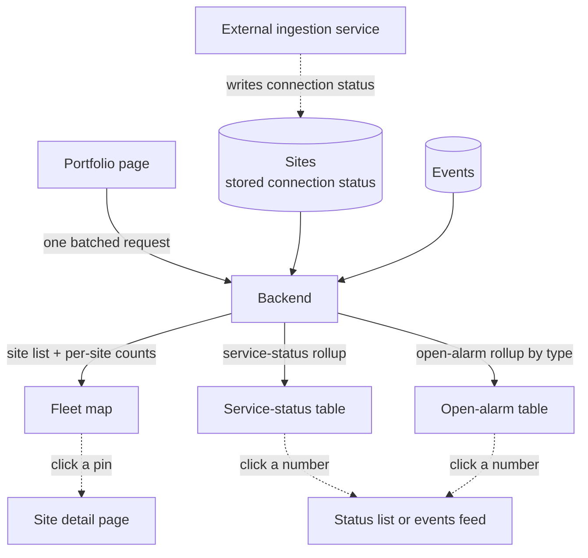

# Portfolio

The portfolio is the **fleet landing page** — the first thing a manager sees after signing in. It puts every site they can access on one interactive map, rolled up by lifecycle stage and by outstanding alarm work, so they can read fleet health, connectivity, and what needs attention at a glance, then click straight into a single site, the events feed, or fleet analytics.

> **Reading this doc:** use the **Business / Developer** switch at the top. *Business* explains what the page shows and why. *Developer* adds the queries, components, aggregation pipelines, map internals, file references, and a solar-terminology primer.

---

## Why this matters

A company may run dozens or hundreds of solar sites. Nobody can babysit each one. The portfolio answers the three questions an operations manager actually has, in one screen:

- **Is my fleet healthy?** — how many sites are live and reporting vs offline.
- **What's broken right now?** — which sites have critical alarms, flagged issues, or open tickets.
- **Where do I start?** — sort the noise into a short list of sites that genuinely need a human.

It's read-only by design: a control tower, not a control panel. Every number is a doorway into the page where you actually do the work.

---

## How the data flows

One screen, one request: the backend assembles all three feeds from the same site and event records, and every number on the page is a doorway to a deeper view.

---

## What you see

The landing page is two panels side by side:

- **Left — two rollup tables.** A *service-status* table (your fleet grouped by lifecycle stage) and an *open-alarm* table (outstanding alarms grouped by type).
- **Right — the fleet map.** Every site you can access, as a coloured pin at its real-world location.

The tables and the map are linked: clicking a number in a table can filter the map to just those sites, and clicking a pin opens that site.

---

## The fleet map

Each site is a coloured pin placed at its physical coordinates. The colour is a quick health read combining two things — *is it connected?* and *is it a fully-live site?*

- **Green** — connected **and** fully live (actively producing and learning its baseline). The "all good" state.
- **Blue** — connected, but not yet in the fully-live state (e.g. still commissioning). Reporting fine, just earlier in its lifecycle.
- **Red** — a fully-live site that has **lost connection**. The most urgent: it *should* be reporting and isn't.
- **Amber** — an early-lifecycle site that isn't connected yet. Expected, lower urgency.

If a site has no location on file, it simply doesn't appear on the map (it still counts in the tables). With no accessible sites, the map just recenters on the US with no pins — not an error.

---

## The two rollup tables

**Service-status table — "how much of my fleet is live and healthy?"**
Groups your sites by lifecycle stage — *Active & Learning, Active (not learning), Commissioning, Shipped, Ordered*, plus a **Total** row. For each stage it shows how many sites are **connected** vs **disconnected**, and how many have **flagged tasks**, **open tickets**, or **critical alarms**.

> Important: those task/ticket/alarm columns count **sites that have at least one**, not the total number of events. "3" in Critical Alarms means *3 sites have a critical alarm*, not 3 alarms.

**Open-alarm table — "what alarm work is outstanding?"**
One row per alarm type, showing its severity, how many alarm events are **new** (not yet acknowledged) vs **total open**, and how many **sites** are affected. It only counts alarms that are genuinely open and outstanding.

---

## Drilling in

Nothing on the portfolio is a dead end:

- **Click a map pin** → opens that site's detail page.
- **Click a Total / Connected / Disconnected number** → the full portfolio status list, pre-filtered to that group.
- **Click a Tasks / Open tickets / Critical alarms number** → the events feed, pre-filtered to the matching sites and severity.
- **Click the map-pin icon in a cell** → filters the *map* to just those sites.
- **Click a number in the open-alarm table** → the events feed, scoped to that alarm type and its affected sites.

The map filter and the alarm filter are mutually exclusive — picking one clears the other, so you're never looking at a confusingly double-filtered map.

---

## Who sees what

You only ever see **your own company's** sites. A site counts as yours if your company owns it or has been granted access to it. SUPER_ADMINs are the exception — they can see everything and optionally focus on one company.

If your account has no company assigned, the portfolio shows an **empty** fleet (zero rows, no pins) rather than an error — so a half-set-up account fails softly. The portfolio page also requires a company to open at all (again, SUPER_ADMINs excepted).

---

## The rules that matter

- **You see your company's sites only** — enforced on the server, not just hidden in the UI. No company assigned → empty portfolio, not an error.
- **Lifecycle stages are always shown in a fixed order**, with empty stages shown as zeros so the table shape never jumps around. *Quoted* sites are left out entirely; *Discontinued* sites aren't included in the Total.
- **Task/ticket/alarm columns count affected sites, not events.**
- **The open-alarm table counts only open, ungrouped alarms** — resolved, archived, or grouped alarms don't inflate the numbers.
- **Partially-connected sites** are treated as "not connected" for the map colour, and are counted in the Total but in neither the Connected nor Disconnected column.
- **The fleet-analytics sub-pages (Energy KPIs, Triage, Irradiation) are currently placeholder screenshots**, not live charts. Real fleet charting lives in the Analytics feature. *(Honest status — flagged for the team.)*

---

## Entry points & routes {dev}

- `/portfolio` (map landing) plus analytics sub-routes `/portfolio/energy-kpis`, `/portfolio/triage`, `/portfolio/irradiation` — `denowatts-portal/src/router.tsx:92-125`.
- The detailed list view lives at `/status/portfolio` — `denowatts-portal/src/router.tsx:235-236`.
- The whole `/portfolio` subtree is wrapped in `CompanyRequiredRoute` — `denowatts-portal/src/router.tsx:94`.

---

## GraphQL API surface {dev}

The portfolio landing page issues **one batched query**, `PortfolioPageData`, that bundles three independent server-side resolvers (`sites`, `portfolioStatusSummary`, `alarmStatusSummary`) into a single network round trip with `fetchPolicy: 'no-cache'` — `denowatts-portal/src/graphql/queries/portfolioQueries.ts:49-90`, `denowatts-portal/src/pages/dashboard/portfolio/PortfolioPage.tsx:42-49`.

### Queries {dev}

- **`PortfolioPageData($sitesFilter: FilterSitesInput, $statusInput: PortfolioStatusSummaryInput!, $alarmInput: AlarmStatusSummaryInput!)`** — the batched landing-page fetch; wraps the three queries below — `portfolioQueries.ts:53-90`. Variables are assembled from the Redux `sitesFilter` (`{ sitesFilter, statusInput: sitesFilter ?? {}, alarmInput: { company: sitesFilter?.company } }`) — `PortfolioPage.tsx:33-40`.
- **`sites(filter: FilterSitesInput): [SiteResponse]`** — every accessible site for the map plus per-site event counts. Fields: `_id, name, serviceStatus, connectionStatus, flaggedEventCount, openTicketEventCount, criticalAlarmEventCount, location { coordinates }` — `portfolioQueries.ts:58-69`. `FilterSitesInput` = `{ managers?, tags?, company?, packageExpiresAt?, showDeleted?, showNotes? }` — `denowatts-backend/src/sites/dto/site.input.ts:91-139`. Resolver `SitesResolver.find` → `SitesService.find` — `sites.resolver.ts:41-44`, `sites.service.ts:142-305`. No `@Roles()` → any authenticated user; scoping in the service.
- **`portfolioStatusSummary(input: PortfolioStatusSummaryInput!): [PortfolioStatusSummaryResponse]`** — service-status rollup. One row per `SiteServiceStatus` (minus `QUOTED`) plus a synthetic `TOTAL`. Fields: `_id, orderNo, total, connected, disconnected, flaggedEventCount, openTicketEventCount, criticalAlarmEventCount` — `portfolioQueries.ts:70-79`, type `site.input.ts:531-580`. Input `{ company?, managers?, tags? }` — `site.input.ts:582-608`. Resolver `SitesResolver.getPortfolioStatusSummary` → `SitesService.getPortfolioStatusSummary` — `sites.resolver.ts:82-90`, `sites.service.ts:852-1016`.
- **`alarmStatusSummary(input: AlarmStatusSummaryInput!): [AlarmStatusSummaryResponse]`** — open-alarm rollup, one row per **alarm config**. Fields: `_id, name, severity, siteCount, sites, unacknowledgedCount, totalOpenAlarmEvents` — `portfolioQueries.ts:80-88`, type `denowatts-backend/src/alarm-config/dto/alarm-status.input.ts:5-47`. Input `{ company? }` — `alarm-status.input.ts:49-58`. Resolver `AlarmConfigResolver.getAlarmStatusSummary` (`@AllRoles()`, overriding class-level `@Roles(SUPER_ADMIN)`) → `AlarmConfigService.getAlarmStatusSummary` — `alarm-config.resolver.ts:14,59-65`, `alarm-config.service.ts:77-228`.

A **standalone** `AlarmStatusSummary($input)` document is also exported (`portfolioQueries.ts:13-24`), but the landing page uses the batched `PortfolioPageData`; the standalone one isn't referenced by the components read here.

### Mutations {dev}

None. The portfolio is read-only; all writes (notes, acknowledging alarms, ticket changes) happen on the destination pages it links to.

---

## Frontend components — `denowatts-portal/src/pages/dashboard/portfolio/` {dev}

### PortfolioPage — `PortfolioPage.tsx` {dev}
The landing container. Reads `sitesFilter`/`theme` from Redux (`:29,73-74`), memoizes the three-part query variables (`:33-40`), fires `PORTFOLIO_PAGE_DATA` with `fetchPolicy: 'no-cache'` + `notifyOnNetworkStatusChange: true` (`:42-49`), and splits the response into `sites`/`portfolioStatusSummary`/`alarmStatusSummary` (null-filtered, `:51-71`). Holds the two mutually-exclusive filter states `activeMapFilter`/`activeOpenAlarmFilter` (`:76-79`); setting one clears the other (`:116,134`). `filteredSites` (`:137-220`) is the single source the map renders from:
- **open-alarm** filter active → keep sites whose `_id` is in the matching `alarmStatusSummary` row's `sites[]` (`:160-179`).
- **portfolio-status** filter active → keep sites whose `serviceStatus` matches (`TOTAL`=all), then narrow by clicked column (`flags`→`flaggedEventCount>0`, `openTickets`→`openTicketEventCount>0`, `criticalAlarms`→`criticalAlarmEventCount>0`, or `connectionStatus`) (`:185-214`).
- no filter → all sites pass (`:182-184`).
Coordinates normalized to drop non-numeric entries (`:147-157`). Two-column grid: tables left, map right (`:226-266`). While `portfolioLoading` → `PortfolioPageSkeleton` (`:222-224`).

### PortfolioPageSkeleton — `PortfolioPageSkeleton.tsx` {dev}
Static Ant-Design `Skeleton` mirroring the layout; its column list differs slightly from the live tables (omits "Open tickets") — cosmetic — `:4-19`.

### PortfolioSummaryTable — `components/PortfolioSummaryTable.tsx` {dev}
Service-status rollup. Columns: **Service Status, Total, Connected, Disconnected, Tasks (flags), Open tickets, Critical Alarms** (`:201-524`). Rows forced into fixed order `[ACTIVE_AND_LEARNING, ACTIVE_NOT_LEARNING, COMMISSIONING, SHIPPED, ORDERED, TOTAL]`, zero-filling missing statuses; `TOTAL` from the backend `TOTAL` row; **`QUOTED` dropped** (`:526-587`). Each non-zero cell: a "Show on map" pin calling `onMapFilterChange` (`:102-161`); and a destination — **Total/Connected/Disconnected** are `<Link>`s to `/status/portfolio` carrying `serviceStatus`/`connectionStatus` in router `state` (`:222-340`); **Tasks/Open tickets/Critical Alarms** `dispatch(setEventFilters(...))` + `updateSiteSettings(...)` + `navigate('/events-feed')` (`:350-522`). `OPEN_TICKET_STATUSES = [New, InProgress, AwaitingCustomer]` (`:36-41`).

### OpenAlarmStatusSummaryTable — `components/OpenAlarmStatusSummaryTable.tsx` {dev}
Open-alarm rollup, one row per alarm config. Columns: **Alarm Status (name), Severity, New (unacknowledgedCount), Total (totalOpenAlarmEvents), Site Count** (`:162-319`). Severity colour-coded (CRITICAL=red, HIGH=orange, else slate) (`:29-39`). **Site Count** cell lifts `OpenAlarmMapFilter = { configId, severity, columnKey }` (`:280-285`). Numeric cells navigate to `/events-feed` after `dispatch(setEventFilters({ alarmConfig, openAlarms: true, site: [...] }))` (`:204-318`). Only rows with a `name` render (`:321-334`).

### PortfolioMapCard — `components/PortfolioMapCard.tsx` {dev}
The interactive map (see Map rendering). Receives already-filtered `sites`, `isDarkMode`, `hasActiveFilter`, `onResetFilter`. Floating "Reset Filter" button only when filtered (`:239-248`); clicking a marker navigates to `/site/:siteId` (`:204-209,235`).

### portfolioStyles.ts {dev}
Shared Tailwind class constants and the `GOOGLE_MAPS_DARK_STYLES` array for dark mode.

### Analytics sub-pages — `energy-kpis/EnergyKPIsPage.tsx`, `triage/TriagePage.tsx`, `irradiation/IrradiationPage.tsx` {dev}
**Static image placeholders.** Each renders one `` pointing at an external S3 (`dropovercl.s3.amazonaws.com`) screenshot — no query, no Redux, no charting (`:1-13` each). As written they **fetch nothing**. Real fleet charting lives in [[analytics]].

### PortfolioStatusView / `/status/portfolio` — outside this folder {dev}
The detailed list the summary links to lives at `denowatts-portal/src/pages/dashboard/status/portfolio-status/PortfolioStatusPage.tsx` (route `router.tsx:235-236`). UNCLEAR: its exact query/poll interval not re-read this pass; an earlier draft claimed `GET_SITES` with `showNotes: true` + `pollInterval: 60000` — verify before relying. See [[status]].

---

## Backend aggregation logic {dev}

### `sites` feed — `SitesService.find` `sites.service.ts:142-305` {dev}
- **Scoping (`:162-178`):** non-SuperAdmin no `company` → `[]`; non-SuperAdmin with company → `$or: [{ owner: company }, { 'accesses.company': company }]`; SuperAdmin with `filter.company` → same `$or`; SuperAdmin no filter → all. Soft-deleted excluded unless `showDeleted` (`:146-148`). Optional `managers`/`tags` (`:150-160`).
- **Event counts:** a single `$lookup` into `events` runs a `$facet` with `totalFlag` (`flaggedBy != null`), `totalAlarm` (`isAlarm != null`, `severity = CRITICAL`, `acknowledgedBy = null`, `endDate = null`), `totalOpenTicket` (`category = TICKET`, not closed/deleted/archived), surfaced as `flaggedEventCount`/`criticalAlarmEventCount`/`openTicketEventCount` (`:185-292`). Sorted by `name` (`:300-302`).

### `portfolioStatusSummary` feed — `SitesService.getPortfolioStatusSummary` `sites.service.ts:852-1016` {dev}
- **Scoping (`:867-881`):** same pattern; non-SuperAdmin without a company short-circuits to `buildPortfolioSummaryResponse({})` (all-zero rows, `:874`). **Note:** unlike `find`, this pipeline does **not** add `deletedAt: null` — soft-deleted sites not explicitly excluded. UNCLEAR if intentional.
- **Pipeline (`:883-1001`):** `$match` scoped → three correlated `$lookup`s into `events`, each `$limit: 1` (presence only) → `$addFields` booleans `hasFlaggedEvent`/`hasOpenTicketEvent`/`hasCriticalAlarmEvent` (`:949-957`) → `$group` by `$serviceStatus` producing `total`, `connected`/`disconnected` (conditional sums on `connectionStatus`), and the three counts (sum of booleans = **count of sites with ≥1 such event**).
- **Shaping — `buildPortfolioSummaryResponse` (`:1018-1072`):** fixed list over `Object.values(SiteServiceStatus)` **excluding `QUOTED`**, each with an `orderNo` (ACTIVE_AND_LEARNING=1 … ORDERED=5, TOTAL=6, DISCONTINUED=7, QUOTED=8), zero-filling absent statuses. Synthetic `TOTAL` sums every row **except `DISCONTINUED`** (`:1044-1069`).

### `alarmStatusSummary` feed — `AlarmConfigService.getAlarmStatusSummary` `alarm-config.service.ts:77-228` {dev}
- **Scoping (`:78-98`):** resolve target `company` (SuperAdmin→`filter.company`; non-admin→own; none → `[]`). If resolved, call `SitesService.getAllSites({ company }, user)` for accessible `siteIds`, then constrain the alarm lookup to them. `getAllSites` expands to *access companies* via `getSitesAccessCompanies` (`sites.service.ts:787-841`).
- **Pipeline (`:100-225`):** from `alarmConfigModel` (every config) → `$lookup` into `events` on `alarmConfig = config._id`, matching only **open** alarms (`isAlarm = true`, no `isAlarmGroup`, no `endDate`, no `deletedAt`, no `archivedAt`, and `site ∈ siteIds` if scoped) (`:107-167`) → `$addFields`: `sites` = `$setUnion` of distinct site ids, `siteCount` = its size, `totalOpenAlarmEvents` = count, `unacknowledgedCount` = events with `acknowledgedBy` missing/null (`:171-208`). Sorted by config `order` (`:209-213`). One row per config (zero-open configs still appear with zeros).

---

## Map rendering {dev}

- **Library:** Google Maps via `@react-google-maps/api` (`GoogleMap`, `MarkerF`, `useJsApiLoader`) — `PortfolioMapCard.tsx:9,80-84`. Key from `import.meta.env.VITE_GOOGLE_MAPS_API_KEY`.
- **Coordinate order:** markers from `site.location.coordinates`, a `[longitude, latitude]` array — `const [lng, lat] = coords` (`:90-104`). Matches the backend schema (default `[-71.114086, 42.731131]`) — `denowatts-backend/src/sites/schemas/site.schema.ts:302-306,470`. Sites with <2 coords or non-numeric values skipped (`:91-97`).
- **Marker colour — `getColorForSite` (`:46-56`):** a 2×2 of connection × service status: CONNECTED+ACTIVE_AND_LEARNING → green `#4D8F48`; CONNECTED+other → blue `#3F87C6`; not-CONNECTED+ACTIVE_AND_LEARNING → red `#D94C40`; not-CONNECTED+other → amber `#FEB969`. `PARTIALLY_CONNECTED` and `DISCONNECTED` treated identically. Hover title = name + `getCategoryLabel` (`:58-71,233`).
- **Marker icon:** inline SVG teardrop pin tinted with the colour, data-URI encoded (`:131-161`).
- **Bounds/fit:** with markers → `fitBounds`; with zero markers → recenter on US centroid `{ lat: 39.8283, lng: -98.5795 }` zoom 5 (`:178-202`); initial render US centroid zoom 4 (`:227-228`).
- **Dark mode:** `GOOGLE_MAPS_DARK_STYLES` applied via 75 ms-debounced `setOptions` on theme flip (`:166-176`).
- **Load/error:** "Loading map…" until `isLoaded`; "Unable to load Google Maps. Please verify the API key." on `loadError` (`:213-220`).

---

## Business rules (cited) {dev}

- **Portfolio routes require a company; SuperAdmin bypasses** — `CompanyRequiredRoute.tsx:32-49`. UI guard; the real boundary is backend scoping.
- **Backend scoping is by `owner` OR `accesses.company`** on every feed — `sites.service.ts:162-178,867-881`, `alarm-config.service.ts:78-98`. A non-SuperAdmin's `company` filter is ignored; the service always uses *their* company.
- **No company → empty, not error** — `find`→`[]`, status summary→all-zero rows, alarm summary→`[]` — `sites.service.ts:164,873-875`, `alarm-config.service.ts:82-83`.
- **Fixed, zero-filled rows; `QUOTED` excluded everywhere** — `sites.service.ts:1031-1032`, `PortfolioSummaryTable.tsx:529,547-554`.
- **`TOTAL` excludes `DISCONTINUED`** — `sites.service.ts:1044-1045`.
- **Status-summary event counts are per-site presence flags** (`$limit: 1`) — `sites.service.ts:898,921,943,984-998`.
- **Alarm summary counts only open, ungrouped alarms** — `alarm-config.service.ts:119-156`.
- **Map filter and alarm filter are mutually exclusive** — `PortfolioPage.tsx:116,134`.

## Data touched {dev}

- **`sites.location.coordinates`** — `[longitude, latitude]`; sole marker source — `site.schema.ts:302-306`.
- **`sites.serviceStatus`** (7 values incl. `QUOTED`/`DISCONTINUED`) — `$group` key + half of marker colour — `site.schema.ts:14-22,475-481`.
- **`sites.connectionStatus`** (`CONNECTED`/`PARTIALLY_CONNECTED`/`DISCONNECTED`, default `DISCONNECTED`) — connected/disconnected columns + other half of colour — `site.schema.ts:24-28,573-581`.
- **`sites.owner`, `sites.accesses.company`** — company-scoping fields — `sites.service.ts:168,870-871`.
- **`sites.managers`, `sites.tags`** — optional narrowing — `sites.service.ts:150-160,855-865`.
- **`sites.subscriptions.portfolioAnalytics`** (`{ startDate, endDate }`) — tracked but **read nowhere** in these feeds — `site.schema.ts:404-414`.
- **`events` collection** — per-site flagged/ticket/critical presence + per-config open alarms; key fields `site, flaggedBy, isAlarm, severity, acknowledgedBy, endDate, category, ticketStatus, alarmConfig, isAlarmGroup, deletedAt, archivedAt` — `sites.service.ts:883-948`, `alarm-config.service.ts:100-225`.
- **`alarmconfigs` collection** — alarm-summary row set; `name, severity, order` — `alarm-config.service.ts:100,209-223`.

## Edge cases & gotchas {dev}

- **No accessible sites:** all-zero rows; map recenters on US centroid zoom 5; not an error — `sites.service.ts:873-875`, `PortfolioMapCard.tsx:183-187`.
- **Sites without coordinates:** dropped from the map silently; still in summary counts — `PortfolioMapCard.tsx:91-97`.
- **`PARTIALLY_CONNECTED` invisible in colour** and counted in `total` but neither connected nor disconnected — `PortfolioMapCard.tsx:48-55`, `sites.service.ts:962-983`.
- **`fetchPolicy: 'no-cache'`** — every visit/refilter is a fresh server hit; no "last refreshed" timestamp — `PortfolioPage.tsx:47`.
- **Filter state is ephemeral** — component `useState`, not URL/Redux; leaving loses it — `PortfolioPage.tsx:76-79`.
- **Soft-deleted sites:** excluded in `find`/`getAllSites` but not in `getPortfolioStatusSummary` — possible discrepancy between map/list and rollup. UNCLEAR — `sites.service.ts:883-884` vs `:146-148,808`.
- **Analytics sub-pages are non-functional placeholders** (static S3 images).
- **`portfolioAnalytics` subscription is dead data** here — stored, never gated on — `site.schema.ts:412-414`.

---

## Solar & platform terminology {dev}

- **Site** — one physical solar installation being monitored. The unit a pin represents. See [[site]].
- **Fleet / portfolio** — all the sites one company (or one viewer) can see, taken together.
- **Service status** — a site's lifecycle stage: *Quoted → Ordered → Shipped → Commissioning → Active (Not Learning) → Active & Learning*, plus *Discontinued*. "Active & Learning" is the fully-live state where the system has enough data to model expected output.
- **Connection status** — whether the site's hardware is currently reporting: *Connected*, *Partially connected* (some channels reporting), or *Disconnected*.
- **Learning** — the period where the platform builds a site's expected-performance baseline from incoming data; until then it can't fully judge under-performance.
- **Flag / task** — a site issue someone has marked for follow-up.
- **Ticket** — a tracked work item with a status (New, In Progress, Awaiting Customer, …).
- **Alarm** — an automatically-raised condition (e.g. under-performance, comms loss) with a severity; "open" means unresolved, "unacknowledged" means no one has claimed it yet. See [[alarm-config]].
- **Access company** — a company granted visibility into another company's sites; portfolio scoping unions the owner company with these. See [[companies]].

For the full domain vocabulary (irradiance, POA, performance ratio, EPI, kWh/kWp, inverter, etc.), see [[solar-glossary]].

---

**Related flows:** [[authentication]] · [[site]] · [[companies]] · [[alarm-config]] · [[analytics]] · [[status]] · [[users]] · [[solar-glossary]]
