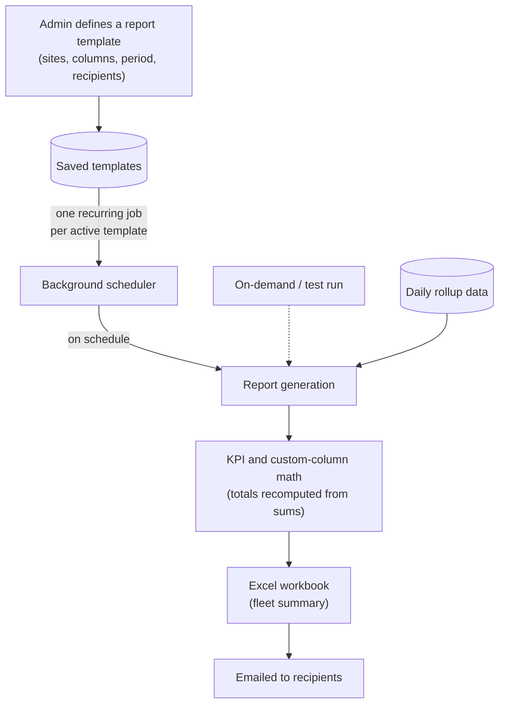

# Report

A **report** is a scheduled (or on-demand) performance summary for a fleet of solar sites. You build a reusable **report template** — pick the sites, the columns (metrics, KPIs, site properties, custom formula columns), how rows are grouped, the reporting period, and who should receive it — and the platform generates the report on schedule, renders it to an Excel workbook, and emails it to the recipients. The same engine also powers the on-screen fleet summary tables on the Portfolio and Analytics dashboards.

> **Reading this doc:** use the **Business / Developer** switch at the top. *Business* explains what report templates are, how scheduling and delivery work, and the rules behind the numbers. *Developer* adds the full GraphQL/REST surface, the services and aggregation pipelines, every schema, DTO, and utility, the background-job lifecycle, file references, and a solar-terminology primer.

---

## Why this matters

Reports are how performance leaves the platform and lands in stakeholders' inboxes. An asset manager who never logs in still gets a monthly Excel showing how every site performed — production, expected production, availability, performance indices. Because the numbers come from the same daily rollup data that powers the dashboards, the emailed report and the on-screen view always agree. Getting templates right (the correct sites, period, and KPI math) is what makes those numbers trustworthy.

---

## How the data flows



On-demand and test runs follow the same generation path as scheduled runs — only the trigger differs.

---

## Report templates — what goes in a report

A template is a saved definition of a report. It captures:

- **Sites** — either a fixed list, or "all sites" (resolved fresh each time the report runs, so new sites are picked up automatically; optionally filtered by service status).
- **Columns** — any mix of:
  - **Metrics and KPIs** — measured values (energy produced, expected energy, losses) and calculated indices (EPI, BEPI, energy/equipment availability).
  - **Site properties** — descriptive columns such as AC nameplate, DC capacity, state, module model, inverter model, mount type, owner, tags, managers, latest site note.
  - **Custom columns** — your own formula built from metrics, site properties, numbers, and arithmetic operators, with a label and unit you choose.
- **Grouping** — rows per site, or bucketed by day / week / month / year (with subtotal rows per period), and an optional secondary grouping by a site attribute (manager, state, owner, mount type, etc.).
- **Reporting period** — a rolling window such as "yesterday", "previous 7/30/90 days", "this month", "previous month", "previous 12 months", "this year", or "previous year", resolved at run time.
- **Recipients & schedule** — named users, plus optionally every site's managers; and when to send it.

---

## Scheduling and delivery

- **Frequencies:** daily, every Monday, first day of month, last day of month, first day of year, last day of year — at a chosen hour and minute (UTC).
- Scheduled runs are executed by the platform's background job scheduler; jobs survive server restarts and are re-registered on boot. See [[agenda]].
- A double calendar guard ensures the report only actually generates on the correct day and at the correct time, even if the underlying schedule fires more broadly.
- The report renders to an **Excel workbook** (styled headers, subtotal rows, a grand-total row, and traffic-light coloring on key availability/performance columns) and is emailed to recipients as an attachment.
- You can also send a **test email** on demand to preview a template; the test snapshot is kept for one hour and then automatically discarded.
- A "last N days" period option exists in the data model but is not yet implemented — it currently falls back to "yesterday".

---

## Custom columns and KPI math

- **Custom columns** are formulas evaluated per row. If any input is missing for a row, the cell is left blank rather than silently shown as zero.
- **KPI totals are recomputed, not averaged.** The grand-total row re-evaluates each KPI formula from the summed base metrics — avoiding the statistical error of averaging percentages across sites.
- **Default aggregation follows the unit:** quantities (kWh, MWh, mm…) are summed; rates and temperatures (%, °C, W/m²…) are averaged; KPIs always use formula re-evaluation. A template can override this per column.
- **Capacities are shown in MW** (AC nameplate and DC capacity), even though they are stored internally in kW.
- If a site has no measured predicted energy for the period, the predicted value falls back to the site's monthly energy model, prorated to the portion of the month covered.

---

## Who can do what

- **Super-admins** see and manage every company's templates; everyone else (managers, admins) sees only their own company's.
- **"All sites" depends on who created the template:** for a super-admin creator it means every site on the platform; for anyone else it means only their company's sites.
- The company list and managers list used in the report filters are **super-admin only**; the site list is available to super-admins, admins, and managers, scoped to their company access.

---

## The rules that matter

- **Inactive templates never send.** A template's schedule can be switched off without deleting it; the runtime checks the flag before generating.
- **Reports fire at an exact UTC hour:minute** on the scheduled day — recipients in other timezones should account for this.
- **Test report snapshots expire after one hour.**
- **The staging environment never schedules report jobs** (so test deployments can't email real recipients on a schedule).
- **Excel coloring applies to two KPI columns only** (equipment availability and EPI): below 50 is pink, 50–94 yellow, 95 and above green.
- **Deleting a template also cancels its scheduled job**, so no orphaned reports keep sending.

---

## Entry points {dev}

The report module is consumed from two directions:
- **Reports micro-app** (separate URL): GraphQL queries/mutations `reportTemplates`, `createReportTemplate`, `updateReportTemplate`, `removeReportTemplate`, `sendTestEmail`, `reportGetAllSites`, `reportGetManagers`, `reportCompanies`, `reportMetrics`. Frontend types confirmed in `denowatts-portal/src/graphql/__generated__/graphql.ts`.
- **Portfolio and internal dashboard pages** (`denowatts-portal/src/pages/dashboard/portfolio/`, `denowatts-portal/src/pages/dashboard/analytics/`): call `POST /api/report/fleet/summary/new`, `POST /api/report/fleet/summary`, `POST /api/report/metrics`, and `POST /api/report/fleet/summary/excel` directly via REST.

---

## GraphQL API surface {dev}

### Queries

#### `reportTemplates(filter: FilterReportTemplateInput, user: CurrentUser): PaginatedReportTemplates`
- Resolver: `denowatts-backend/src/report/resolvers/report-template.resolver.ts`
- Service: `ReportTemplateService.find(filter, user)`
- `FilterReportTemplateInput` fields: `company? (String)`, `limit? (Float)`, `page? (Float)`, `searchText? (String)`
- `PaginatedReportTemplates` fields: `data: [ReportTemplateResponse]`, `totalCount: Int`, `page: Int`, `limit: Int`
- Non-super-admin users are restricted to their own company's templates.

#### `reportGetAllReportTemplates(user: CurrentUser): [ReportTemplateListItem]`
- Resolver: `denowatts-backend/src/report/resolvers/report-template.resolver.ts`
- Service: `ReportTemplateService.getAllReportTemplates(user)`
- Returns minimal list (id + name) for dropdown selectors.

#### `reportTemplate(input: FindOneReportTemplateInput, user: CurrentUser): ReportTemplateResponse`
- `FindOneReportTemplateInput`: `_id (ObjectId!)`
- Returns full populated template. Throws `NotFoundException` if not found; `ForbiddenException` if non-super-admin accesses another company's template.
- Populates: `sites`, `company`, `metrics`, `notificationSettings.otherUsers`, `createdBy`.

#### `reportTestTemplate(input: FindOneTestReportTemplateInput, user: CurrentUser): TestReportTemplateResponse`
- `FindOneTestReportTemplateInput`: `_id (ObjectId!)`
- Fetches a `TestReportTemplate` document (TTL 1 hour). Checks expiry and company access.

#### `reportGetAllSites(input?: ReportAllSiteInput): [ReportAllSiteResponse]`
- `@Roles(UserType.SUPER_ADMIN, UserType.MANAGER, UserType.ADMIN)`
- `ReportAllSiteInput` fields: `company? (String)`, `managers?[] (String)`, `tags?[] (String)`, `mountTypes?[] (MountType)`
- `ReportAllSiteResponse`: `_id`, `name`, `serviceStatus`
- Respects company access (owner OR accesses.company), filters by managers/tags/mountTypes.
- Resolver: `denowatts-backend/src/report/resolvers/report-site.resolver.ts`

#### `reportGetSiteTags(input?: ReportSiteTagsInput): [ReportSiteTagsResponse]`
- `ReportSiteTagsInput`: `siteOwnerAndAccesses?[] (String)`, `company? (String)`
- `ReportSiteTagsResponse`: `_id`, `name`, `siteTags?[]`
- Always includes the denowatts.com company regardless of filter.
- Resolver: `denowatts-backend/src/report/resolvers/report-site.resolver.ts`

#### `reportGetManagers(filter?: ReportManagersInput): [ReportManagersResponse]`
- `@Roles(UserType.SUPER_ADMIN)`
- `ReportManagersInput`: `siteOwnerAndAccesses?[] (String)`, `company? (String)`
- `ReportManagersResponse`: `_id`, `firstName`, `lastName`, `company?`
- Filters by company access chain, excludes DELETED users.
- Resolver: `denowatts-backend/src/report/resolvers/report-user.resolver.ts`

#### `reportCompanies: [ReportCompanyResponse]`
- `@Roles(UserType.SUPER_ADMIN)`
- `ReportCompanyResponse`: `_id (String)`, `name (String)`
- Returns all companies with id + name only (for company filter dropdown in reports app).
- Resolver: `denowatts-backend/src/report/resolvers/report-company.resolver.ts`

#### `reportMetrics(input: MetricsInput): MetricsResponseDto`
- `MetricsInput`: `type (String: 'site'|'channel')`, `site[] (String IDs)`, `start (String)`, `end (String)`, `channels?[] (String)`, `interval? (String)`
- `MetricsResponseDto`: `metrics: [Metric]`
- Discovers metric keys present in rollup docs for given sites/channels and date range. Falls back to all KPIs for site type when no data.
- Resolver: `denowatts-backend/src/report/resolvers/report-metrics.resolver.ts`

### Mutations

#### `createReportTemplate(createReportTemplateInput: CreateReportTemplateInput): ReportTemplate`
- `CreateReportTemplateInput`: all `ReportTemplate` fields except `_id`, `createdAt`, `updatedAt`, `createdBy`.
- Service: `ReportTemplateService.create(input, user)` — saves to MongoDB, then if `notificationSettings.isActive`, calls `addRepeatableReportForTemplate(templateId, settings)` to schedule an Agenda repeatable job.
- Resolver: `denowatts-backend/src/report/resolvers/report-template.resolver.ts`

#### `updateReportTemplate(updateReportTemplateInput: UpdateReportTemplateInput): ReportTemplate`
- `UpdateReportTemplateInput`: `PartialType(Omit(CreateReportTemplateInput))` + required `_id: String`. All fields optional except `_id`.
- Service: `ReportTemplateService.update(id, input, user)` — saves changes, then re-schedules the Agenda job (cancel old + create new).

#### `removeReportTemplate(id: ID!): Boolean`
- Service: `ReportTemplateService.remove(id, user)` — deletes the template document, then calls `removeRepeatableReportForTemplate(id)` to cancel all Agenda jobs (both per-template name and legacy `generate-daily-report` name).

#### `sendTestEmail(sendTestEmailInput?: SendTestEmailInput): String`
- `SendTestEmailInput`: `PartialType(Omit(CreateReportTemplateInput))` + optional `_id`, optional `startDate (String)`, optional `endDate (String)`.
- Service: `ReportTemplateService.sendTestEmail(input, user)`:
  1. Resolves recipients (otherUsers + optional isSiteManagers).
  2. Creates a `TestReportTemplate` document with `expiresAt = now + 1 hour` (MongoDB TTL auto-deletes).
  3. For `FLEET` type: generates Excel via `FleetExcelService.buildFleetSummaryExcel()`.
  4. Sends via SendGrid with optional Excel attachment.
  5. Returns confirmation string.

### REST endpoints
Handled by `denowatts-backend/src/report/report.controller.ts` (`/api/report`):

| Method | Path | Handler | Description |
|---|---|---|---|
| POST | `/api/report/fleet/summary/new` | `getFleetSummary()` | Ad-hoc fleet summary — delegates to `FleetSummaryService.getFleetSummary()` |
| POST | `/api/report/fleet/summary` | `getFleetSummaryNew()` | Ad-hoc fleet summary (newer pipeline) — `ReportService.getFleetSummaryNew()` |
| POST | `/api/report/metrics` | `getAvailableMetrics()` | Discovers available metric keys for a site/date range |
| POST | `/api/report/fleet/summary/excel` | streams buffer | Generates and streams xlsx with `Content-Disposition: attachment` header |

---

## Services {dev}

### `ReportService` — `denowatts-backend/src/report/report.service.ts`

Core orchestration service. Handles scheduling lifecycle and the "new" fleet aggregation pipeline.

#### `isScheduleDueOnDay(schedule: ScheduleFrequency, utcNow: Date): boolean`
Calendar guard used by the Agenda job processor to skip runs on wrong days:
- `DAILY` → always `true`
- `EVERY_MONDAY` → `utcNow.getUTCDay() === 1`
- `FIRST_DAY_OF_MONTH` → `utcNow.getUTCDate() === 1`
- `LAST_DAY_OF_MONTH` → `utcNow.getUTCDate()` equals the last day of the current UTC month
- `FIRST_DAY_OF_YEAR` → month=0 && date=1
- `LAST_DAY_OF_YEAR` → month=11 && date=31

#### `isTemplateDueNow(settings: NotificationSettings, now: Date): boolean`
Returns `true` only when `now.getUTCHours() === settings.hour`, `now.getUTCMinutes() === settings.minute`, AND `isScheduleDueOnDay` returns true.

#### `buildCronFromSettings(settings: NotificationSettings): string`
Maps `ScheduleFrequency` to a cron string:
- `DAILY` → `0 <hour> * * *`
- `EVERY_MONDAY` → `0 <hour> * * 1`
- `FIRST_DAY_OF_MONTH` → `0 <hour> 1 * *`
- `LAST_DAY_OF_MONTH` → `0 <hour> 28-31 * *` (fires on 28–31; `isScheduleDueOnDay` guards the actual last day)
- `FIRST_DAY_OF_YEAR` → `0 <hour> 1 1 *`
- `LAST_DAY_OF_YEAR` → `0 <hour> 31 12 *`

#### `getEmailDateWindowFromType(dateRangeType: DateRangeType, now: Date): DateWindow`
Resolves `DateRangeType` enum to `{startDate: Date, endDate: Date}`:
- `YESTERDAY` → yesterday UTC 00:00 to 23:59:59.999
- `PREVIOUS_7_DAYS` → 7 days ago to yesterday (inclusive)
- `PREVIOUS_30_DAYS` → 30 days ago to yesterday
- `PREVIOUS_90_DAYS` → 90 days ago to yesterday
- `THIS_MONTH` → 1st of current month to now
- `PREVIOUS_MONTH` → 1st to last day of previous month
- `PREVIOUS_12_MONTHS` → 12 months ago (1st of that month) to yesterday
- `THIS_YEAR` → Jan 1 of current year to now
- `PREVIOUS_YEAR` → Jan 1 to Dec 31 of previous year
- `LAST_N_DAYS` → logs a warning and falls back to `YESTERDAY` (unimplemented)

#### `addRepeatableReportForTemplate(templateId, settings): Promise<void>`
- No-op in `staging` environment.
- Cancels any existing job named `templateId`, then calls `agenda.every(cron, templateId, { reportTemplateId: templateId })`.

#### `removeRepeatableReportForTemplate(templateId): Promise<void>`
- Cancels job by per-template name.
- Also cancels legacy `generate-daily-report` name for backward compatibility.

#### `queueReportForTemplate(templateId): Promise<void>`
Fires `agenda.now(templateId, { reportTemplateId: templateId })` for an immediate one-off run.

#### `getSiteAlarmsReport(companyId, siteIds?): Promise<SiteAlarmRow[]>`
Aggregates active events by site: matches `endDate: null`, `deletedAt: null`; groups by site; counts `criticalCount` (severity=CRITICAL) and `unacknowledgedCount` (acknowledgedAt=null).

#### `getFleetSummaryNew(input: FleetSummaryInputNew, user?): Promise<FleetSummaryResponse>`
Newer fleet aggregation path:
1. Validates `siteIds` non-empty.
2. Calls `resolveMetricIdentifiers(metricIdentifiers, metricModel)` — resolves ObjectId/name → canonical name + unit + isKpi.
3. Builds `PipelineReportMetric[]` with `resolveFleetMetricAggregation()`.
4. Resolves KPI expression strings.
5. Calls `getMergedSiteAggregationPipeline(...)` — faceted MongoDB aggregation on `SiteDailyRollup`.
6. Post-processes headers/details/subtotals from `$facet` output.
7. Enriches rows with site properties via `buildSitePropertyMaps()` + `applyRowSiteProperties()`.
8. Applies custom column expressions via shunting-yard evaluation.
9. Computes grand total via `computeFleetSummaryNumericTotals()`.

#### `getMergedSiteAggregationPipeline(...): PipelineStage[]`
7-stage MongoDB aggregation on `sitedailyrollups`:
1. `$match` — filter by `site $in siteObjectIds`, date range.
2. `$lookup` sites — join site document.
3. `$addFields groupKey` — for `sites` groupBy use `$site`; for dates/week/month/year use `$dateToString` with format string; for GroupByColumnType use the corresponding site field.
4. `$lookup` sitedailyrollups — self-join to accumulate rollups for the group window.
5. Time-bucket `$group` — bucket by groupKey.
6. `$facet` — three sub-pipelines: `headers` (site metadata), `details` (aggregated metrics), `subtotals` (one subtotal per group period).
7. `$project` — final shaping.

#### `getMergedFleetTotalsPipeline(...): PipelineStage[]`
Grand total pipeline: per-site group (sum across dates) → master group (sum across sites). Aliases `acNameplate`, `dcCapacity`, `powerRate` from `NUMERIC_SITE_PROPERTIES`.

#### `getAvailableMetrics(input: MetricsInput): Promise<MetricsResponseDto>`
Discovers metric keys in `SiteDailyRollup` documents for given sites/channels/dates. Falls back to all KPI metrics for the site type when no data exists for the range.

---

### `FleetSummaryService` — `denowatts-backend/src/report/services/fleet-summary.service.ts`

Legacy fleet summary (called by `POST /api/report/fleet/summary/new`).

#### `getFleetSummary(input, user?): Promise<FleetSummaryResponse>`
Two code paths based on `input.groupBy`:

**Path A — `GroupByType.sites` (or no groupBy):**
1. `buildFleetSummaryAggregationPipeline(siteObjectIds, startDate, endDate, metricNames)` — site-grouped aggregation.
2. `buildFleetSummarySiteMetaMap(sites)` — fetches company names for owner field.
3. `processFleetSummaryData(aggregatedData, siteMap, startDate, endDate)` — computes per-site KPIs.
4. Applies KPI expressions; applies site properties and custom columns; computes grand total.

**Path B — `GroupByType.dates|week|month|year`:**
1. `buildFleetSummaryByDateAggregationPipeline(...)`.
2. `processFleetSummaryByDateAndSiteData(...)`.
3. `insertDatePeriodSubtotalRows()`.
4. Applies KPI expressions; computes grand total.

#### `applyKpiExpressionsToRows(rows, kpiExpressionsByName): void`
Multi-pass evaluation: iterates expressions repeatedly until no more can be resolved (handles cascading KPI dependencies where KPI B depends on KPI A).

#### `applyCustomColumnsToRows(rows, fullSummary, customColumns): void`
Per-row evaluation via `evaluateCustomColumnExpression()` (shunting-yard), plus fleet total using AGG (formula on sums, not sum of per-row values).

---

### `ReportTemplateService` — `denowatts-backend/src/report/services/report-template.service.ts`

#### `onApplicationBootstrap(): Promise<void>`
On server start: queries all active templates (`notificationSettings.isActive = true`), calls `defineJobForTemplate(templateId)` + `addRepeatableReportForTemplate(templateId, settings)` for each. Ensures Agenda jobs survive server restarts.

#### `create(input, user): Promise<ReportTemplate>`
Saves template, sets `createdBy = user._id`, schedules Agenda job if `notificationSettings.isActive`.

#### `findById(id, user): Promise<ReportTemplate>`
Throws `NotFoundException` if not found. Non-super-admin: throws `ForbiddenException` if `template.company !== user.company`.
Populates: `sites (name serviceStatus)`, `company (name)`, `metrics (name displayName unit isKpi expression)`, `notificationSettings.otherUsers (_id firstName lastName email)`, `createdBy (_id firstName lastName)`.

#### `update(id, input, user): Promise<ReportTemplate>`
Applies partial update, then cancels + re-creates Agenda job.

#### `remove(id, user): Promise<boolean>`
Deletes template document + cancels Agenda jobs.

#### `sendTestEmail(input, user): Promise<string>`
1. Resolves recipients.
2. Creates `TestReportTemplate` with `expiresAt = Date.now() + 3600000` (1 hour TTL).
3. Generates Excel for FLEET type.
4. Sends via SendGrid.
5. Returns success string.

---

### `FleetExcelService` — `denowatts-backend/src/report/services/fleet-excel.service.ts`

#### `buildFleetSummaryExcel(input, user?): Promise<Buffer>`
1. Normalizes column-indexed vs. legacy metric/property inputs.
2. Calls `resolveMetricIdentifiers()` — one or two DB queries.
3. Calls `ReportService.getFleetSummaryNew()`.
4. Calls `buildFleetExcelBuffer()` → returns Excel `Buffer`.

---

### `ReportSiteService` — `denowatts-backend/src/report/services/report-site.service.ts`

#### `getAllSites(filter, currentUser): Promise<ReportAllSiteResponse[]>`
Builds query respecting `currentUser.company` (owner OR accesses.company). Optional filters: `managers` ($in), `tags` ($elemMatch), `mountTypes` (blocks[].info.mountType).

#### `getSiteTags(filter, currentUser): Promise<ReportSiteTagsResponse[]>`
Returns companies with their `siteTags[]`. Always includes the Denowatts company.

---

### `ReportCompanyService` — `denowatts-backend/src/report/services/report-company.service.ts`

#### `find(): Promise<ReportCompanyResponse[]>`
Returns all company documents with only `_id` and `name` (lean query).

---

### `ReportUserService` — `denowatts-backend/src/report/services/report-user.service.ts`

#### `findManagers(filter, currentUser): Promise<ReportManagersResponse[]>`
Filters users with manager/admin role, applies company access chain, excludes DELETED users.

---

## Schemas {dev}

### `ReportTemplate` — `denowatts-backend/src/report/schemas/report-template.schema.ts`
Collection: `reporttemplates`

| Field | Type | Required | Index | Notes |
|---|---|---|---|---|
| `name` | String | Yes | text | Template name; text index for search |
| `type` | ReportTemplateType | Yes | 1 | Values: `FLEET` (only current type) |
| `sites` | [ObjectId ref Site] | No | 1 | Empty when `isAllSites=true` |
| `company` | ObjectId ref Company | No | 1 | Owning company; null = system/super |
| `isAllSites` | Boolean | No | — | Resolves sites dynamically at run time |
| `servicesStatus` | String | No | — | Filter for `isAllSites` resolution |
| `metrics` | [ReportTemplateMetric] | No | — | Embedded subdocs (no `_id`) |
| `siteProperties` | [ReportTemplateSiteProperty] | No | — | Embedded subdocs |
| `customColumns` | [ReportTemplateCustomColumn] | No | — | Embedded subdocs |
| `groupBy` | GroupByType | No | — | Row grouping dimension |
| `groupByColumn` | GroupByColumnType | No | — | Secondary grouping dimension |
| `notificationSettings` | ReportTemplateNotificationSettings | No | — | Schedule + recipient config |
| `dateRangeType` | DateRangeType | No | — | Dynamic date range for scheduled runs |
| `createdBy` | ObjectId ref User | No | — | Set on create |
| `createdAt` / `updatedAt` | Date | — | — | Mongoose timestamps |

**`ReportTemplateMetric`** subdoc (no `_id`):
| Field | Type | Notes |
|---|---|---|
| `metric` | ObjectId ref Metric | — |
| `columnIndex` | Number | Display order |
| `aggregationMethod` | MetricAggregationMethod | NONE, SUM, AVG, AGG |

**`ReportTemplateSiteProperty`** subdoc (no `_id`):
| Field | Type | Notes |
|---|---|---|
| `key` | String | e.g. `acNameplate`, `state`, `moduleModel` |
| `columnIndex` | Number? | Optional display order |
| `aggregationMethod` | MetricAggregationMethod | — |

**`ReportTemplateCustomColumnExpressionItem`** subdoc:
| Field | Type | Notes |
|---|---|---|
| `type` | CustomColumnExpressionItemType | NUMBER, OPERATOR, METRIC, SITE_PROPERTY |
| `metric` | ObjectId ref Metric | When type=METRIC |
| `operator` | String | When type=OPERATOR |
| `value` | Number | When type=NUMBER |
| `siteProperty` | String | When type=SITE_PROPERTY |

**`ReportTemplateCustomColumn`** subdoc:
| Field | Type | Notes |
|---|---|---|
| `id` | String | Client-assigned stable ID |
| `label` | String | Column header |
| `columnIndex` | Number | Display order |
| `unit` | String? | Unit string for header |
| `description` | String? | Tooltip text |
| `aggregationMethod` | MetricAggregationMethod | Default: AGG |
| `expression` | [ExpressionItem] | Ordered token list |

**`ReportTemplateNotificationSettings`** subdoc:
| Field | Type | Notes |
|---|---|---|
| `isSiteManagers` | Boolean? | Include site managers as recipients |
| `otherUsers` | [ObjectId ref User] | Named additional recipients |
| `isActive` | Boolean? | Whether scheduled email is enabled |
| `schedule` | ScheduleFrequency? | Frequency enum |
| `hour` | Number? | UTC send hour (0–23) |
| `minute` | Number? | UTC send minute (0–59) |

### Enums — `denowatts-backend/src/report/schemas/report-template.schema.ts`

**`MetricAggregationMethod`**: `NONE` | `SUM` | `AVG` | `AGG`

**`ReportTemplateType`**: `FLEET`

**`GroupByType`**: `sites` | `dates` | `week` | `month` | `year`

**`GroupByColumnType`**: `SITES_MANAGER` | `SITE_TAGS` | `SOLAR_MODULE_MODEL` | `INVERTER_MODEL` | `MOUNT_TYPE` | `STATE` | `OWNER` | `ENERGY_ACCOUNTING`

**`ScheduleFrequency`**: `DAILY` | `EVERY_MONDAY` | `FIRST_DAY_OF_MONTH` | `LAST_DAY_OF_MONTH` | `FIRST_DAY_OF_YEAR` | `LAST_DAY_OF_YEAR`

**`MountType`**: `ROOFTOP` | `GROUND_FIXED` | `CARPORT` | `SINGLE_AXIS_TRACKER`

**`CustomColumnExpressionItemType`**: `NUMBER` | `OPERATOR` | `METRIC` | `SITE_PROPERTY`

**`DateRangeType`**: `YESTERDAY` | `PREVIOUS_7_DAYS` | `PREVIOUS_30_DAYS` | `PREVIOUS_90_DAYS` | `THIS_MONTH` | `PREVIOUS_MONTH` | `PREVIOUS_12_MONTHS` | `THIS_YEAR` | `PREVIOUS_YEAR` | `LAST_N_DAYS`

**`NUMERIC_SITE_PROPERTIES`** constant: `new Set(['acNameplate', 'dcCapacity', 'powerRate'])` — site property keys with numeric values used for total-row aggregation.

### `TestReportTemplate` — `denowatts-backend/src/report/schemas/test-report-template.schema.ts`
Collection: `testreporttemplates`

| Field | Type | Notes |
|---|---|---|
| `payload` | Mixed | Full template payload snapshot |
| `createdBy` | ObjectId ref User | — |
| `company` | ObjectId ref Company? | Optional |
| `expiresAt` | Date | TTL index `expires: 0` — MongoDB deletes at `expiresAt` |

Documents created with `expiresAt = new Date(Date.now() + 3600000)` (1 hour).

---

## DTOs & Types {dev}

### `denowatts-backend/src/report/dto/fleet-filter.dto.ts`

**`FleetSummaryMetricDto`**: `metric: string`, `aggregationMethod?: MetricAggregationMethod`

**`FleetSummaryNewMetricDto`**: `metric: string` (required), `aggregationMethod: MetricAggregationMethod` (required)

**`FleetSummaryMetricWithColumnIndexDto`**: extends `FleetSummaryNewMetricDto` + `columnIndex: number`

**`FleetSummarySitePropertyDto`**: `key: string`, `columnIndex?: number`, `aggregationMethod?: MetricAggregationMethod`

**`FleetSummaryCustomColumnExpressionItemDto`**: `type`, `operator?`, `metric?`, `value?`, `siteProperty?`

**`FleetSummaryCustomColumnDto`** / **`FleetSummaryCustomColumnNewDto`**: `id`, `label`, `columnIndex?`, `unit?`, `description?`, `aggregationMethod`, `expression[]`

**`FleetSummaryResponse`**: `data: FleetSummaryRow[]`, `total: Record<string, number|null|boolean>`, `kpiTotalsSourceRows?: FleetSummaryRow[]`

**`FleetSummaryInput`** (legacy): `siteIds: string[] (@ArrayNotEmpty)`, `startDate: string`, `endDate: string`, `metrics: FleetSummaryMetricDto[]`, `groupBy?: GroupByType`, `groupByColumn?: GroupByColumnType`, `siteTags?: string[]`, `siteProperties?: FleetSummarySitePropertyDto[]`, `includeKpiTotalsSourceRows?: boolean`, `customColumns?: FleetSummaryCustomColumnDto[]`

**`FleetSummaryInputNew`** (newer path): same but `metrics?` optional; `siteIds` validated `@ArrayNotEmpty()`

**`FleetSummaryExcelInput`**: extends `FleetSummaryInputNew` + `sitePropertiesWithColumnIndex?: FleetSummarySitePropertyDto[]`, `metrics?: FleetSummaryMetricWithColumnIndexDto[]`

### `denowatts-backend/src/report/dto/metrics-input.dto.ts`
**`MetricsInput`**: `type: string`, `site: string[]`, `start: string`, `end: string`, `channels?: string[]`, `interval?: string`

### `denowatts-backend/src/report/dto/report-template.input.ts`
**`ReportTemplateResponse`** (GraphQL ObjectType — fully populated): `_id`, `name`, `type`, `sites: [ReportTemplateSiteResponse]`, `company`, `isAllSites`, `servicesStatus`, `metrics`, `siteProperties`, `customColumns`, `groupBy`, `groupByColumn`, `notificationSettings`, `dateRangeType`, `createdBy`, `createdAt`, `updatedAt`

**`CreateReportTemplateInput`**: all ReportTemplate fields except `_id`, `createdAt`, `updatedAt`, `createdBy`

**`UpdateReportTemplateInput`**: `PartialType(Omit(CreateReportTemplateInput))` + required `_id: String`

**`SendTestEmailInput`**: `PartialType(Omit(CreateReportTemplateInput))` + optional `_id?`, `startDate?`, `endDate?`

### `denowatts-backend/src/report/types/index.ts`
**`ReportMetric`**: `_id`, `name`, `isKpi`, `expression?`, `isRemovable`, `aggregationMethod`

**`ReportSite`**: `_id`, `name`, `serviceStatus`, `acNameplate?`, `dcCapacity?`, `location?`, `blocks?[]`, `managers?[]`, `moduleModel?`, `inverterModel?`, `predictedEnergyModel?`, `company?`, `siteTags?[]`, `powerRate?`, `energyAccounting?`

### `denowatts-backend/src/report/types/report-service.types.ts`
**`GenerateDailyReportJobData`**: `{ reportTemplateId: string }`

**`DateWindow`**: `{ startDate: Date; endDate: Date }`

**`PipelineReportMetric`**: `{ name: string; aggregationMethod: MetricAggregationMethod; isKpi?: boolean; unit?: string }`

---

## Utility functions {dev}

### `build-mongo-expr.util.ts` — `denowatts-backend/src/report/utils/build-mongo-expr.util.ts`

#### `buildMongoArithExpr(expression: string): unknown`
Converts arithmetic expression string to a MongoDB operator tree for use in aggregation `$project`/`$addFields`. Uses `mathjs.parse()` AST walk — no `eval()`.

Operator mappings:
- `+` → `{ $add: [left, right] }`
- `-` → `{ $subtract: [left, right] }`
- `*` → `{ $multiply: [left, right] }`
- `/` → `{ $divide: [left, right] }` — wrapped in `$let` zero-guard (returns 0 if divisor=0)
- `^` → `{ $pow: [left, right] }`
- `%` → `{ $mod: [left, right] }`
- `sqrt(x)` → `{ $sqrt: x }`
- `abs(x)` → `{ $abs: x }`
- `round(x)` → `{ $round: [x, 0] }`
- `floor(x)` → `{ $floor: x }`
- `ceil(x)` → `{ $ceil: x }`
- `$fieldName` symbol → `"$fieldName"` (MongoDB field reference via `f_fieldName` placeholder)

Input normalization: `×→*`, `÷→/`, `{[→(`, `}]→)`. Returns `0` on parse failure.

---

### `calculation.ts` — `denowatts-backend/src/report/utils/calculation.ts`

#### `calculateEquation(equation: string): number`
Runtime arithmetic evaluation for non-MongoDB contexts:
- Safety check: strips chars `0-9 . + - * / ( ) ^ % e E (space)`. Returns 0 if anything remains (invalid characters).
- Evaluates via `new Function('return ' + processed)()`.
- Returns 0 for non-finite results or any exception.

---

### `custom-column-eval.util.ts` — `denowatts-backend/src/report/utils/custom-column-eval.util.ts`

#### `getNumericFromRow(row, metricKey): number | null`
Looks up metric value: direct key → alias fallback (`nrgpredicted → nrgProducedPred`) → case-insensitive scan. Returns `null` if not found or non-finite.

#### `evaluateCustomColumnExpression(row, expression): number | null`
Shunting-yard infix evaluation. Token types: NUMBER, OPERATOR, PAREN, METRIC, SITE_PROPERTY.
Operator precedence: `^`=3, `*/`=2, `+-`=1.
Returns `null` if any operand is missing or result is non-finite (div-by-zero → null, not Infinity).

---

### `excel-generator.util.ts` — `denowatts-backend/src/report/utils/excel-generator.util.ts`

#### `ExcelGeneratorUtil.generateFleetSummaryExcel(...): Buffer`
Builds Excel workbook with `xlsx-js-style`.

**Column ordering:** by `columnIndex`; tie-breaking: customColumn > metric > siteProperty.

**Cell styles:**
- Header row: background `#1F4E79` (navy), white bold text
- Subtotal rows: background `#EDF0F5` (light grey)
- Grand total row: background `#2F5597` (dark blue), white bold text

**Value-band fills** (applied to `rAvailabilityEquipment` and `rEpi` only):
- Value < 50: `#FCE4EC` (pink)
- 50 ≤ value < 95: `#FFF9C4` (yellow)
- value ≥ 95: `#D5F5E3` (green)

**Total row aggregation:** SUM by default; AVG for rate/temperature units; AGG for KPIs (re-evaluate formula). Explicit `aggregationMethod` overrides unit-based default. Columns keyed `_drb_date_range` are skipped.

#### `ExcelGeneratorUtil.generateFileName(templateName, startDate, endDate?): string`
Sanitizes template name, formats as `<Name> - (MM-DD-YYYY - MM-DD-YYYY).xlsx`.

---

### `fleet-aggregation.util.ts` — `denowatts-backend/src/report/utils/fleet-aggregation.util.ts`

#### `CORE_REQUIRED_METRICS`
Constant set of metric names always fetched (required as KPI inputs): `nrgProduced`, `nrgExpected`, `pwrLssBias`, `pwrLssShade`, `pwrLssVegetation`, `pwrLssSoiling`, `pwrLssSnow`, `pwrLssGeospacial`, and others.

#### `buildFleetSummaryAggregationPipeline(siteObjectIds, startDate, endDate, metricNames): PipelineStage[]`
Site-grouped aggregation on `sitedailyrollups`: `$match` → `$group by site ($sum metrics)` → `$lookup site` → `$project`.

#### `buildFleetSummaryByDateAggregationPipeline(siteObjectIds, startDate, endDate, metricNames, groupBy): PipelineStage[]`
Date+site grouped: `$match` → `$addFields dateGroup ($dateToString format)` → `$group by {site, dateGroup}` → `$lookup site` → `$sort`.

`GROUP_BY_DATE_FORMAT` mappings:
- `dates` → `'%Y-%m-%d'`
- `week` → `'%Y-W%V'` (ISO week number)
- `month` → `'%Y-%m'`
- `year` → `'%Y'`

#### `processFleetSummaryData(aggregatedData, siteMap, startDate, endDate): FleetSummaryRow[]`
Calls `computeAdjustedExpected()` and `computePredictedWithFallback()` per row. Computes KPIs: `rEpi`, `rBepi`, `rEpiInService`, `rAvailabilityEnergy`, `rAvailabilityEquipment`, `rBaselineInsolation`.

#### `computeAdjustedExpected(data): number`
```
nrgExpectedPrime  (if set)
  OR
nrgExpected - (pwrLssBias + pwrLssShade + pwrLssVegetation + pwrLssSoiling + pwrLssSnow + pwrLssGeospacial)
```

#### `computePredictedWithFallback(data, site, start, end): number`
If `data.nrgProducedPred` is 0/missing: falls back to `site.predictedEnergyModel.monthlyEnergyModel[month]` prorated by the fraction of the month covered by `[start, end]`. Returns 0 if neither source has data.

---

### `fleet-excel-prep.util.ts` — `denowatts-backend/src/report/utils/fleet-excel-prep.util.ts`

#### `buildFleetExcelBuffer(params: FleetExcelBuildParams): Buffer`
Builds `metricUnitsForExcel` map, resolves custom column expression metric ObjectId refs to names via `idToNameMap`, sets custom column aggregation to AGG, delegates to `ExcelGeneratorUtil.generateFleetSummaryExcel()`.

---

### `fleet-kpi-from-sums.util.ts` — `denowatts-backend/src/report/utils/fleet-kpi-from-sums.util.ts`

#### `sumNumericFieldsAcrossRows(rows): Record<string, number>`
Sums all finite numeric fields across all rows. Output used as base-metric sums input for AGG total-row KPI re-evaluation.

---

### `fleet-period-subtotals.util.ts` — `denowatts-backend/src/report/utils/fleet-period-subtotals.util.ts`

#### `fleetSummaryUsesPeriodSubtotals(groupByType): boolean`
Returns `true` for `dates`, `week`, `month`, `year`. Returns `false` for `sites`.

#### `insertDatePeriodSubtotalRows(rows, aggregationMethods, kpiExpressionsByName): FleetSummaryRow[]`
Inserts one subtotal row (flagged `_isSubtotal: true`) after each block of rows sharing the same `dateGroup`. Subtotals use KPI AGG (formula on group sums), not sum of per-row KPI values.

#### `insertGroupByColumnSubtotalRows(rows, aggregationMethods, kpiExpressionsByName): FleetSummaryRow[]`
Same logic but groups by group-by-column value (e.g., after all rows with `state = 'California'`).

---

### `fleet-summary-totals.util.ts` — `denowatts-backend/src/report/utils/fleet-summary-totals.util.ts`

#### `computeFleetSummaryNumericTotals(rows, aggregationMethods, rowsForKpiUnderlyingSums?, avgDenominatorOverride?): Record<string, number|null>`
Computes grand total row:
- **`KEYS_NEVER_SUM`**: set of non-numeric key names (e.g., `siteName`, `_id`) always skipped.
- **SUM**: sum of all finite row values.
- **AVG**: uses `avgDenominatorOverride` if provided, else counts non-null rows.
- **AGG**: calls `sumNumericFieldsAcrossRows(rowsForKpiUnderlyingSums ?? rows)` → re-evaluates KPI formula. Falls back to SUM if formula fails.
- **NONE**: produces `null` in total row.

---

### `kpi-calculations.util.ts` — `denowatts-backend/src/report/utils/kpi-calculations.util.ts`

All functions return raw (unrounded) `number | null`. Null is returned when inputs are falsy/zero.

#### `calculateEPI(produced, expected): number | null`
`(produced / expected) * 100` — null if produced or expected falsy/zero.

#### `calculateBEPI(produced, predicted): number | null`
`(produced / predicted) * 100` — null if produced or predicted falsy/zero.

#### `calculateEPIInService(produced, expected, outageLoss): number | null`
`expectedInService = expected - (outageLoss || 0)` → `(produced / expectedInService) * 100` — null if produced or expected falsy/zero, or if `expectedInService <= 0`.

#### `calculateEnergyAvailability(expected, outageLoss, undeterminedLoss): number | null`
`totalLoss = (outageLoss||0) + (undeterminedLoss||0)` → `((expected - totalLoss) / expected) * 100` — null if expected falsy/zero.

#### `calculateEquipmentAvailability(availableCount, unavailableCount): number | null`
`total = (availableCount||0) + (unavailableCount||0)` → `(availableCount||0) / total * 100` — null if total=0.

#### `calculateBaselineInsolation(insPoaRef, insPredicted): number | null`
`(insPoaRef / insPredicted) * 100` — null if either argument falsy/zero.

---

### `metric-resolution.util.ts` — `denowatts-backend/src/report/utils/metric-resolution.util.ts`

#### `resolveMetricIdentifiers(identifiers: string[], metricModel): Promise<ResolvedMetrics>`
Resolves mixed ObjectId strings + plain metric names in 1–2 DB queries:
1. Splits into `ids[]` (valid ObjectIds) and `plainNames[]`.
2. If `ids.length > 0`: `Metric.find({ _id: $in ids })` — populates `idToNameMap`, `idToUnitMap`, `names`, `displayNames`, `units`, `isKpiByName`.
3. Appends `plainNames` to `names[]` as-is.
4. If `plainNames.length > 0`: `Metric.find({ name: $in plainNames })` — back-fills metadata for plain names.

Returns: `{ names, displayNames, units, idToNameMap, idToUnitMap, isKpiByName }`.

---

### `site-property-maps.util.ts` — `denowatts-backend/src/report/utils/site-property-maps.util.ts`

#### Conversion constant
`KW_TO_MW = 1/1000` — `blocks[].info.acNameplate` and `dcCapacity` stored in kW in DB; exposed in MW throughout the report module.

#### `sumSiteBlocksAcNameplateMw(site): number`
`sum(blocks[i].info.acNameplate) * (1/1000)` — returns 0 if no blocks.

#### `sumSiteBlocksDcCapacityMw(site): number`
`sum(blocks[i].info.dcCapacity) * (1/1000)`

#### `getSiteBlockModuleModels(site): string[]`
Deduplicated array of `blocks[i].module.model` values.

#### `getSiteBlockInverterModels(site): string[]`
Deduplicated array of `blocks[i].inverter.model` values.

#### `getSiteBlockMountTypes(site): string[]`
Deduplicated array of mount type labels: `ROOFTOP→"Rooftop"`, `GROUND_FIXED→"Ground Fixed"`, `CARPORT→"Carport"`, `SINGLE_AXIS_TRACKER→"Single Axis Tracker"`. Unknown values pass through unchanged.

#### `buildSitePropertyMaps(sites, siteObjectIds, flags, eventModel, userModel): Promise<SitePropertyMaps>`
Builds all lookup maps in one async pass. No redundant site query (uses already-loaded lean documents):
- Block-based properties (acNameplate, dcCapacity, moduleModels, inverterModels, mountTypes, state, lastCommissionedAt, commercialOperationDate) — no extra DB query.
- If `flags.includeNote`: one `Event.aggregate()` query — matches `category=NOTES`, `endDate=null`, `deletedAt=null`, `archivedAt=null`, `channel=null`; groups by site; picks `$first` (latest by `createdAt`) for title + description; joins with `" – "`.
- If `flags.includeSiteManagers`: one `User.find()` for all unique manager IDs. Every site guaranteed an entry (empty array if no managers).

#### `applyRowSiteProperties(row, siteId, maps, flags, siteMetaMap): void`
Mutates `row` in-place with site property values from the pre-built maps. `owner`, `tags`, `powerRate`, `energyAccounting` come from `siteMetaMap` (built by `buildFleetSummarySiteMetaMap`).

---

### `units-aggregation.util.ts` — `denowatts-backend/src/report/utils/units-aggregation.util.ts`

#### `UNITS_BY_AGGREGATION`
```
AVG: %, °, °C, C, db, deg, Hz, kPa, kVA, kW/m², m/s, m/s², mm/h, MVARh, V, W/m²
SUM: A, Ah, hr, kg, kg/m^3, kJ/kg, kVAR, kW, kWh/m², mm, MWh, Ohm, s
```

#### `getDefaultAggregationForUnit(unit): MetricAggregationMethod`
AVG if unit in `UNITS_BY_AGGREGATION.AVG`; else SUM.

#### `resolveMetricAggregationMethod(explicit, unit): MetricAggregationMethod`
Returns `explicit` if it is a valid enum value; else falls back to `getDefaultAggregationForUnit(unit)`.

#### `resolveFleetMetricAggregation(metricName, unit, explicit, isKpi?): MetricAggregationMethod`
1. Explicit value wins.
2. If `isKpi === true` → AGG (KPIs must not be averaged).
3. Else → `resolveMetricAggregationMethod(undefined, unit)`.

#### `coerceMetricAggregationMethod(value: unknown): MetricAggregationMethod | undefined`
Normalizes string/enum to `MetricAggregationMethod`. Accepts `'SUM'`, `'AVG'`, `'AGG'`, `'NONE'` (case-insensitive). Returns `undefined` for unrecognized values.

---

## Business rules (cited) {dev}

- **Super-admin sees all companies' templates.** Non-super-admin (MANAGER, ADMIN) sees only their company's templates. — `denowatts-backend/src/report/services/report-template.service.ts`
- **Staging environment skips job scheduling.** `addRepeatableReportForTemplate` is a no-op when `NODE_ENV === 'staging'`. — `denowatts-backend/src/report/report.service.ts`
- **Per-template Agenda job naming.** Each template's job is stored under name `templateId` (its ObjectId string), enabling independent lifecycle management. — `denowatts-backend/src/report/report.processor.ts`
- **Agenda jobs re-registered on boot.** All active templates have handlers re-registered in `onApplicationBootstrap` to survive server restarts. — `denowatts-backend/src/report/services/report-template.service.ts`
- **Dual calendar guard.** The cron fires broadly; `isScheduleDueOnDay` + `isTemplateDueNow` in the processor apply a secondary check to ensure the report only generates on the correct calendar day and time. — `denowatts-backend/src/report/report.service.ts`
- **`LAST_N_DAYS` not implemented.** Falls back to YESTERDAY with a warning log. — `denowatts-backend/src/report/report.service.ts`
- **`isAllSites` resolution by role.** Super-admin creator → all sites platform-wide. Non-super-admin creator → only their company's sites (optionally filtered by `servicesStatus`). — `denowatts-backend/src/report/report.processor.ts`
- **Inactive templates are skipped at runtime.** The Agenda handler checks `template.notificationSettings.isActive` before generating. — `denowatts-backend/src/report/report.processor.ts`
- **KPI grand totals use AGG (formula re-evaluation), not row-average.** Prevents the statistical error of averaging percentages. — `denowatts-backend/src/report/utils/fleet-summary-totals.util.ts`
- **KPI `%` unit does not trigger AVG.** `resolveFleetMetricAggregation` intercepts `isKpi=true` and returns AGG before the unit-based check. — `denowatts-backend/src/report/utils/units-aggregation.util.ts`
- **Custom columns default to AGG.** Formula always re-evaluated at fleet level from base metric sums. — `denowatts-backend/src/report/utils/fleet-excel-prep.util.ts`
- **acNameplate and dcCapacity stored in kW, exposed in MW.** All fleet outputs divide by 1000. — `denowatts-backend/src/report/utils/site-property-maps.util.ts`
- **Missing operands in custom column return null, not 0.** Prevents silent partial computation. — `denowatts-backend/src/report/utils/custom-column-eval.util.ts`
- **Division by zero in MongoDB pipeline returns 0.** `$let` zero-guard wraps all division. — `denowatts-backend/src/report/utils/build-mongo-expr.util.ts`
- **Division by zero in JS evaluation returns null.** — `denowatts-backend/src/report/utils/custom-column-eval.util.ts`
- **Test report templates auto-expire after 1 hour.** MongoDB TTL index on `testreporttemplates.expiresAt`. — `denowatts-backend/src/report/schemas/test-report-template.schema.ts`
- **`_drb_date_range` columns never rendered to Excel.** Internal date-range marker skipped. — `denowatts-backend/src/report/utils/excel-generator.util.ts`
- **Value-band coloring applies only to `rAvailabilityEquipment` and `rEpi`.** Thresholds: <50 pink, 50–94 yellow, ≥95 green. — `denowatts-backend/src/report/utils/excel-generator.util.ts`
- **`MetricAggregationMethod.NONE` in total row produces null.** Frontend must handle null. — `denowatts-backend/src/report/utils/fleet-summary-totals.util.ts`

---

## Data touched {dev}

- **`sitedailyrollups`** — primary read source for all fleet aggregations. Queried by `site $in`, date range, metric names + `CORE_REQUIRED_METRICS`. — `denowatts-backend/src/report/utils/fleet-aggregation.util.ts`, `denowatts-backend/src/report/report.service.ts`
- **`siterollups`** — monthly rollup; used as fallback source for predicted energy model. — `denowatts-backend/src/report/report.module.ts`
- **`channelraws`** / **`channelrollups`** — registered in module; used by `getAvailableMetrics` for channel-level metric discovery. — `denowatts-backend/src/report/report.module.ts`
- **`sites`** — read for metadata (name, location, blocks, managers, company, siteTags, serviceStatus, predictedEnergyModel). `blocks[].info.acNameplate` and `dcCapacity` stored in kW. — `denowatts-backend/src/report/utils/site-property-maps.util.ts`
- **`metrics`** — read by `resolveMetricIdentifiers` (name/displayName/unit/isKpi) and `getAvailableMetrics`. — `denowatts-backend/src/report/utils/metric-resolution.util.ts`
- **`events`** — read by `buildSitePropertyMaps` (latest NOTES event per site) and `getSiteAlarmsReport` (active alarms). — `denowatts-backend/src/report/utils/site-property-maps.util.ts`, `denowatts-backend/src/report/report.service.ts`
- **`reporttemplates`** — full CRUD. Indexes: `name: text`, `type: 1`, `sites: 1`, `company: 1`. — `denowatts-backend/src/report/schemas/report-template.schema.ts`
- **`testreporttemplates`** — written by `sendTestEmail`, read by `reportTestTemplate`, auto-deleted after 1 hour. — `denowatts-backend/src/report/schemas/test-report-template.schema.ts`
- **`companies`** — read for name by `ReportCompanyService.find()` and `buildFleetSummarySiteMetaMap`. — `denowatts-backend/src/report/services/report-company.service.ts`
- **`users`** — read for recipient resolution, site manager details, template population. — `denowatts-backend/src/report/services/report-user.service.ts`, `denowatts-backend/src/report/utils/site-property-maps.util.ts`
- **Agenda jobs collection (MongoDB)** — `agenda.every()` / `agenda.now()` / `agenda.cancel()`. Job documents stored with `name = templateId`. — `denowatts-backend/src/report/report.service.ts`

---

## Edge cases & gotchas {dev}

- **Legacy job name collision.** Before per-template naming, all templates shared job name `generate-daily-report`. `removeRepeatableReportForTemplate` cancels both old name and new `templateId` name to prevent ghost jobs. — `denowatts-backend/src/report/report.service.ts`
- **Mixed ObjectId/name metric identifiers.** `FleetSummaryExcelInput` accepts either MongoDB ObjectId strings or plain metric names in the same array. `resolveMetricIdentifiers` handles the mix in 1–2 DB queries. — `denowatts-backend/src/report/utils/metric-resolution.util.ts`
- **`LAST_DAY_OF_MONTH` cron fires on days 28–31.** Pattern `0 <h> 28-31 * *` fires for months with fewer than 31 days on non-last days (e.g., Feb 28). `isScheduleDueOnDay` prevents generation on those non-last days. — `denowatts-backend/src/report/report.service.ts`
- **Predicted energy fallback.** If `nrgProducedPred = 0` in the rollup, BEPI computation uses `site.predictedEnergyModel.monthlyEnergyModel[month]` prorated by date overlap fraction. Both sources absent → BEPI = null. — `denowatts-backend/src/report/utils/fleet-aggregation.util.ts`
- **`nrgExpectedPrime` shortcut.** If set on a rollup row, `computeAdjustedExpected` uses it directly instead of computing `nrgExpected - sum(losses)`. — `denowatts-backend/src/report/utils/fleet-aggregation.util.ts`
- **Helper-only metrics.** Custom column expressions may reference metrics not in the visible columns. Those metrics are fetched as "helper-only", used for the formula, then stripped from output rows. — `denowatts-backend/src/report/services/fleet-summary.service.ts`
- **`calculateEquation` uses `new Function()`.** A character allowlist check runs first; any disallowed character causes silent return of 0. This is a defence mechanism but note: the function returns 0 without any error/log, which could obscure configuration mistakes. — `denowatts-backend/src/report/utils/calculation.ts`
- **`sendTestEmail` does not schedule.** Creates a TTL document + sends immediately; has no interaction with Agenda. — `denowatts-backend/src/report/services/report-template.service.ts`
- **Excel column ordering tie-breaking.** Columns at the same `columnIndex` follow priority: customColumn > metric > siteProperty. — `denowatts-backend/src/report/utils/excel-generator.util.ts`
- **`reportGetSiteTags` always includes Denowatts company.** Even when the requester's company filter would exclude it. — `denowatts-backend/src/report/services/report-site.service.ts`
- **Empty `sites[]` is valid when `isAllSites=true`.** Sites are resolved dynamically at job execution time. — `denowatts-backend/src/report/report.processor.ts`
- **`avgDenominatorOverride` for weighted AVG.** Callers can supply a custom denominator for AVG-method columns where row count does not equal the effective site count. — `denowatts-backend/src/report/utils/fleet-summary-totals.util.ts`

---

## Queue / background jobs {dev}

### Job scheduler: Agenda (MongoDB-backed)
Library: `@nestjs/agenda`. Jobs persisted in MongoDB.
Processor: `denowatts-backend/src/report/report.processor.ts`

### Job naming
- **Per-template name:** `templateId` (the template's MongoDB ObjectId string) — `reportJobName(templateId) = templateId`
- **Legacy name:** `generate-daily-report` — single shared name used before per-template naming

### Job registration
`defineJobForTemplate(templateId)` calls `agenda.define(templateId, handler)` — idempotent (safe to call multiple times).

### Repeatable job lifecycle
1. **Create:** `agenda.every(cronString, templateId, { reportTemplateId: templateId })`
2. **Update:** cancel old (`agenda.cancel({ name: templateId })`), then re-create.
3. **Delete:** cancel by templateId AND by legacy `generate-daily-report` name.

### Immediate one-off
`queueReportForTemplate(templateId)` → `agenda.now(templateId, { reportTemplateId: templateId })`

### Job payload type
`{ reportTemplateId: string }` (`GenerateDailyReportJobData`)

### `handleDailyReportGeneration(job)` execution steps
1. Extract `reportTemplateId` from `job.attrs.data`.
2. Fetch full template.
3. Guard: `!template.notificationSettings?.isActive` → skip.
4. Guard: `!isScheduleDueOnDay(schedule, utcNow)` → skip (wrong calendar day).
5. Guard: `!isTemplateDueNow(settings, utcNow)` → skip (wrong hour:minute).
6. `resolveSiteIdsForTemplate(template)` → `string[]`.
7. Collect recipients: `otherUsers[].email` + (if `isSiteManagers`) manager emails.
8. `getEmailDateWindowFromType(dateRangeType, utcNow)` → `{ startDate, endDate }`.
9. If `type === FLEET`: `FleetExcelService.buildFleetSummaryExcel(...)` → `Buffer`.
10. If not staging: send SendGrid email with optional Excel attachment.

---

## Solar & platform terminology {dev}

- **Report template** — a saved definition of a fleet report: sites, columns, grouping, period, schedule, recipients. The unit this module manages.
- **Fleet summary** — the tabular output (one row per site or per period) produced from daily rollup data; rendered as inline table data or Excel.
- **KPI (key performance indicator)** — a calculated percentage index (EPI, BEPI, availability) defined by a formula over base metrics; always aggregated by re-evaluating the formula on sums (AGG), never averaged.
- **EPI (Energy Performance Index)** — produced energy ÷ expected energy × 100; the headline "did the site do what the weather said it should" number.
- **BEPI (Baseline EPI)** — produced energy ÷ predicted (modeled) energy × 100; compares against the pre-construction energy model rather than measured weather.
- **Energy / Equipment availability** — percentage of expected energy not lost to outages, and percentage of equipment-hours the gear was available, respectively.
- **Site daily rollup** — the pre-aggregated per-site per-day metric document that all fleet reporting reads from; reports never touch raw channel data directly.
- **Adjusted expected energy** — expected energy minus identified losses (bias, shade, vegetation, soiling, snow, geospatial), or a pre-computed override when present.
- **Site property** — a descriptive site attribute used as a report column (AC nameplate, state, module model, mount type, managers, tags…). Capacities are stored in kW but reported in MW.
- **Custom column** — a user-defined formula column built from metrics, site properties, numbers, and operators; evaluated per row and re-evaluated from sums for totals.
- **Aggregation method** — how a column is totalled: SUM, AVG, AGG (formula re-evaluation), or NONE (blank total).
- **Agenda** — the MongoDB-backed background job scheduler that runs scheduled report generation. See [[agenda]].

For the full domain vocabulary, see [[solar-glossary]].

---

**Related flows:** [[portfolio]] · [[analytics]] · [[settings]] · [[metrics]] · [[agenda]] · [[authentication]] · [[solar-glossary]]
