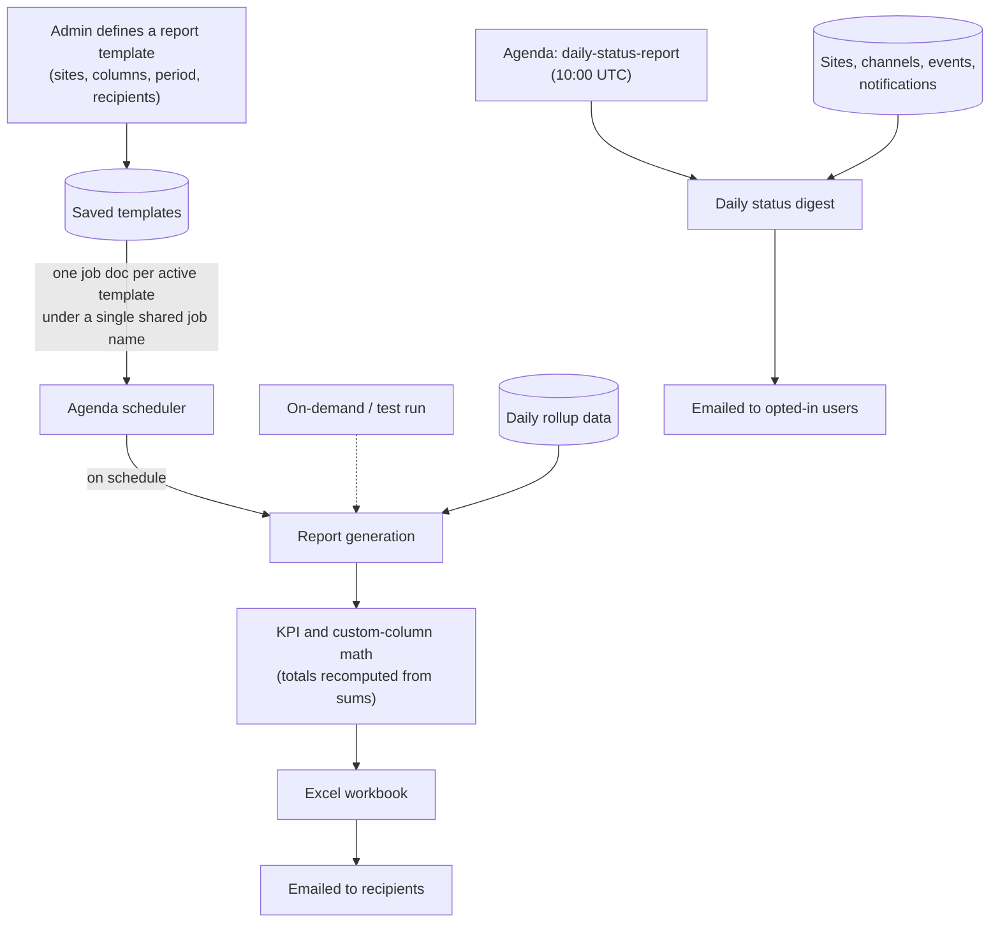

# Report

The report module ships two distinct products.

A **report** is a scheduled (or on-demand) performance summary for a fleet of solar sites. You build a reusable **report template** — pick the sites, the columns (metrics, KPIs, site properties, custom formula columns), how rows are grouped, the reporting period, and who should receive it — and the platform generates the report on schedule, renders it to an Excel workbook, and emails it to the recipients. The same engine powers the on-screen fleet tables.

A **daily status report** is a fixed-format operational digest emailed every morning: how many sites and channels are disconnected, how many alarms/tickets/tasks are open, and how long each has been that way. Nobody configures it — you opt in and it arrives.

> **Reading this doc:** use the **Business / Developer** switch at the top. *Business* explains what report templates are, how scheduling and delivery work, what the daily status report contains, and the rules behind the numbers. *Developer* adds the full GraphQL surface, the services and aggregation pipelines, every schema, DTO, and utility, the background-job lifecycle, file references, and a solar-terminology primer.

---

## Why this matters

Reports are how performance leaves the platform and lands in stakeholders' inboxes. An asset manager who never logs in still gets a monthly Excel showing how every site performed — production, expected production, availability, performance indices. Because the numbers come from the same daily rollup data that powers the dashboards, the emailed report and the on-screen view always agree.

The daily status report covers the other half of the job: not "how did the fleet perform" but "what needs attention today, and how long has it been ignored". Its whole design is the staleness question — every count is bucketed by 1+, 7+, and 30+ days.

---

## How the data flows

```mermaid
flowchart TD
    ADMIN["Admin defines a report template<br/>(sites, columns, period, recipients)"] --> TPL[("Saved templates")]
    TPL -->|"one job doc per active template<br/>under a single shared job name"| SCHED["Agenda scheduler"]
    SCHED -->|"on schedule"| GEN["Report generation"]
    ONDEMAND["On-demand / test run"] -.-> GEN
    ROLLUP[("Daily rollup data")] --> GEN
    GEN --> KPI["KPI and custom-column math<br/>(totals recomputed from sums)"]
    KPI --> XLS["Excel workbook"]
    XLS --> EMAIL["Emailed to recipients"]

    SCHED2["Agenda: daily-status-report<br/>(10:00 UTC)"] --> DSR["Daily status digest"]
    OPS[("Sites, channels, events,<br/>notifications")] --> DSR
    DSR --> DSREMAIL["Emailed to opted-in users"]
```

On-demand and test runs follow the same generation path as scheduled runs — only the trigger differs.

---

## Report templates — what goes in a report

A template is a saved definition of a report. It captures:

- **Sites** — either a fixed list, or "all sites" (resolved fresh each time the report runs, so new sites are picked up automatically; optionally filtered by service status).
- **Columns** — a single ordered list. Every column carries its own position, sort direction, and aggregation method, and is one of four kinds:
  - **Metric** — a measured value (energy produced, expected energy, losses).
  - **KPI** — a calculated index (EPI, BEPI, energy/equipment availability).
  - **Site property** — a descriptive column such as AC nameplate, DC capacity, state, module model, inverter model, mount type, owner, tags, managers, PPA rate, latest site note.
  - **Custom** — your own formula built from metrics, site properties, numbers, and arithmetic operators, with a label and unit you choose.
- **Grouping** — rows per site, or bucketed by day / week / month / year (with subtotal rows per period), and an optional secondary grouping by a site attribute (manager, state, owner, mount type, tags, energy accounting).
- **Reporting period** — a rolling window such as "yesterday", "previous 7/30/90 days", "this month", "previous month", "previous 12 months", "this year", or "previous year", resolved at run time.
- **Recipients & schedule** — named users, plus optionally every site's managers; and when to send it.

> **Changed in this version.** Columns used to be three separate lists (metrics, custom columns, site properties) that the renderer interleaved by index. They are now one unified `columns[]` array where order, sort, and aggregation live on the column itself. Existing templates are converted by a one-time migration, and the code still dual-reads the legacy shape.

---

## Scheduling and delivery

- **Frequencies:** daily, every Monday, first day of month, last day of month, first day of year, last day of year — at a chosen hour and minute (UTC).
- Scheduled runs are executed by the platform's background job scheduler; jobs survive server restarts and are re-registered on boot. See [[agenda]].
- A double calendar guard ensures the report only actually generates on the correct day and at the correct time, even if the underlying schedule fires more broadly.
- The report renders to an **Excel workbook** (styled headers, subtotal rows, a grand-total row, and traffic-light coloring on key availability/performance columns) and is emailed to recipients as an attachment.
- If the workbook is too large for the email provider's message-size budget, the email still sends — as a **link-only email without the attachment** — rather than failing outright.
- You can also send a **test email** on demand to preview a template; the test snapshot is kept for one hour and then automatically discarded.
- **Editing a template does not send a report.** It only updates when the next recurring run happens.
- Templates using the "last N days" period are **never scheduled**, because an unattended send has no way to know what N is. The period still works for on-screen and on-demand use.
- Whether any scheduled report email goes out at all is governed by a single environment switch (`SEND_REPORT_SCHEDULE_MAIL`), checked at send time.

---

## Custom columns and KPI math

- **Custom columns** are formulas evaluated per row. If any input is missing for a row, the cell is left blank rather than silently shown as zero.
- **KPI totals are recomputed, not averaged.** The grand-total row re-evaluates each KPI formula from the summed base metrics — avoiding the statistical error of averaging percentages across sites.
- **Default aggregation follows the unit:** quantities (kWh, MWh, mm…) are summed; rates and temperatures (%, °C, W/m²…) are averaged; KPIs always use formula re-evaluation. A template can override this per column.
- **Ratio metrics are scaled to percentages.** Metrics whose name follows the ratio convention (a leading `r` followed by a capital, e.g. `rEpi`, `rBepi`, `rPR`) are stored as ratios (0.85) but multiplied by 100 for display.
- **Capacities are shown in MW** (AC nameplate and DC capacity), even though they are stored internally in kW.
- If a site has no measured predicted energy for the period, the predicted value falls back to the site's monthly energy model, prorated to the portion of the month covered.

---

## The daily status report

A fixed-format email, sent at **10:00 UTC** every day, covering the previous UTC calendar day. It is not configurable — there is no template, no column picker, no schedule setting. Users opt in or out with a single toggle on their profile, and can send themselves a copy on demand.

Every row is a count bucketed into three cumulative columns — **1+ Days**, **7+ Days**, **30+ Days** — so a 45-day-old item counts in all three. The point is not the number, it is how long it has been true.

**Status table**

| Row | What it counts | Scope |
|---|---|---|
| Disconnected Sites | Sites currently disconnected, bucketed by time since last report | Live sites only |
| Disconnected Channels | Channels currently disconnected, same bucketing | Live sites only |
| Critical Alarms (Open) | Unacknowledged, still-open critical alarms, by alarm start date | Live sites only |
| Tickets (New) | Tickets in NEW status, by creation date | Live sites only |
| Tickets (In Progress) | Tickets in IN_PROGRESS status, by creation date | Live sites only |
| Open Tasks | Flagged, still-open events, by creation date | All sites |
| Unread Mentions | The recipient's own unread mention notifications | n/a — per recipient |

**"Live sites only"** means the site's service status is Active & Learning or Active Not Learning. A site still
being Ordered, Shipped or Commissioned — or one that has been Discontinued — is not something anyone can act
on in a disconnection or alarm row, so it is left out of those counts. The New Sites table below deliberately
does the opposite: it exists precisely to surface sites that are *not* live yet.

**Performance table** — a single count: sites where yesterday's EPI differs from the trailing 7-day EPI by more than 10%.

**New sites table** — sites with an outstanding customer setup task, sites in commissioning, and sites tagged for capacity testing.

Every row carries a **View** button that deep-links into the portal with the matching filter already applied (the events feed filtered to open alarms, the ticket feed filtered by status, notifications filtered to mentions, the portfolio filtered by EPI delta).

Notes on the rules:

- **Only live sites appear in the status table.** Disconnections, critical alarms and tickets are counted for sites in an active service status; Open Tasks still counts across every site.
- **Unread Mentions counts from day zero.** Every other row needs an item to be at least a day old before it appears; a mention counts the moment it is created, otherwise today's mentions would be invisible in all three columns.
- **Emails are sent one recipient at a time**, never as a shared `to:` list — recipients never see each other's addresses, and each person's Unread Mentions count is genuinely their own.
- **Opt-in is explicit.** A user with no saved preference document is *excluded* from the scheduled send, not defaulted in. (The profile UI seeds the document as enabled on first visit, so the practical default is on for anyone who opens the page.)
- **Super-admins get an all-sites edition.** They are excluded from any company's report and receive a separate singleton report covering every non-deleted site.
- **The whole pipeline only runs in production.** In any other environment the job handlers are never registered.
- **A failed send to one recipient does not stop the rest** — failures are logged and reported to Sentry individually.

---

## Who can do what

- **Super-admins** see and manage every company's templates; everyone else (managers, admins) sees only their own company's.
- **"All sites" depends on who created the template:** for a super-admin creator it means every site on the platform; for anyone else it means only their company's sites.
- Non-super-admins may only build templates over sites their company can access; the site list is validated on create.
- The company list and managers list used in the report filters are **super-admin only**; the site list is available to super-admins, admins, and managers, scoped to their company access.
- For the daily status report, a **super-admin always gets the all-sites edition**, even if the client sends a company id.

---

## The rules that matter

- **Inactive templates never send.** A template's schedule can be switched off without deleting it; the runtime checks the flag before generating.
- **Reports fire at an exact UTC hour:minute** on the scheduled day — recipients in other timezones should account for this.
- **Test report snapshots expire after one hour.**
- **Excel coloring applies to two KPI columns only** (equipment availability and EPI): below 50 is pink, 50–94 yellow, 95 and above green.
- **Deleting a template also cancels its scheduled job**, so no orphaned reports keep sending.
- **Exporting a report to Excel is recorded in the audit trail.** See [[audit-trail]].

---

## Entry points {dev}

- **Reports micro-app** (separate URL, not in `denowatts-portal`): the whole GraphQL surface below — template CRUD, the `reports` query, and the `reportExcel` mutation.
- **Portal profile page** — `denowatts-portal/src/routes/_dashboard/profile.tsx` renders `denowatts-portal/src/features/profile/components/NotificationPreferences.tsx`, which owns the daily-status-report opt-in toggle and the "Send Report Now" button. Operations live in `denowatts-portal/src/graphql/mutations/notificationMutations.ts`.

> **Breaking change.** The REST surface is gone. `denowatts-backend/src/report/report.controller.ts` was deleted along with `POST /api/report/fleet/summary`, `POST /api/report/fleet/summary/new`, `POST /api/report/metrics`, and `POST /api/report/fleet/summary/excel`. Everything is GraphQL now — `reports` returns the row data, `reportExcel` returns a base64 workbook. No caller in `denowatts-portal` referenced these endpoints.

---

## GraphQL API surface {dev}

### Queries

#### `reports(input: ReportInput): JSON`
- Resolver: `denowatts-backend/src/report/resolvers/reports.resolver.ts`
- Service: `ReportService.getReportNew(input, user)`
- Returns a `JSON` scalar (`{ data: ReportRow[], total: Record<string, number|null|boolean> }`) because the row shape varies with the selected columns.
- Replaces the former `POST /api/report/fleet/summary/new`.

#### `reportTemplates(filter: FilterReportTemplateInput, user: CurrentUser): PaginatedReportTemplates`
- Resolver: `denowatts-backend/src/report/resolvers/report-template.resolver.ts`
- Service: `ReportTemplateService.find(filter, user)`
- `FilterReportTemplateInput` fields: `company? (String)`, `limit? (Float)`, `page? (Float)`, `searchText? (String)`
- Non-super-admin users are restricted to their own company's templates.

#### `reportGetAllReportTemplates(user: CurrentUser): [ReportTemplateListItem]`
- Service: `ReportTemplateService.getAllReportTemplates(user)` — minimal id+name list for dropdowns.

#### `reportTemplate(input: FindOneReportTemplateInput, user: CurrentUser): ReportTemplateResponse`
- Service: `ReportTemplateService.findById(id, user)`. Columns are enriched with resolved display metadata before serialization (`resolveTemplateColumns`).

#### `reportTestTemplate(input: FindOneTestReportTemplateInput, user: CurrentUser): TestReportTemplateResponse`
- Service: `ReportTemplateService.findTestTemplateById(id, user)`.

#### `reportGetAllSites(input?: ReportAllSiteInput): [ReportAllSiteResponse]`
#### `reportGetSiteTags(input?: ReportSiteTagsInput): [ReportSiteTagsResponse]`
- Resolver: `denowatts-backend/src/report/resolvers/report-site.resolver.ts`; service `denowatts-backend/src/report/services/report-site.service.ts`.

#### `reportGetManagers(filter?: ReportManagersInput): [ReportManagersResponse]`
- Resolver: `denowatts-backend/src/report/resolvers/report-user.resolver.ts`; super-admin only.

#### `reportCompanies: [ReportCompanyResponse]`
- Resolver: `denowatts-backend/src/report/resolvers/report-company.resolver.ts`; super-admin only.

#### `reportMetrics(input: MetricsInput): MetricsResponseDto`
- Resolver: `denowatts-backend/src/report/resolvers/report-metrics.resolver.ts`; service `ReportService.getAvailableMetrics`.

### Mutations

#### `reportExcel(input: ReportExcelInput): ReportExcelResult`
- Resolver: `denowatts-backend/src/report/resolvers/reports.resolver.ts`
- Service: `ReportExcelService.buildReportExcel(input, user)`
- Returns `{ fileName: String!, base64: String! }` — the workbook is base64-encoded in the response body, not served from a URL.
- Records an `report.exported` audit-trail event with the file name.

#### `createReportTemplate(createReportTemplateInput: CreateReportTemplateInput): ReportTemplate`
#### `updateReportTemplate(updateReportTemplateInput: UpdateReportTemplateInput): ReportTemplate`
#### `removeReportTemplate(id: ID!): Boolean`
#### `sendTestEmail(sendTestEmailInput?: SendTestEmailInput): String`
- Resolver: `denowatts-backend/src/report/resolvers/report-template.resolver.ts`; service `denowatts-backend/src/report/services/report-template.service.ts`.

#### `sendDailyStatusReport(input: DailyStatusReportInput): String`
- Resolver: `denowatts-backend/src/report/resolvers/report-daily-status.resolver.ts`
- `DailyStatusReportInput { companyId: ID }` — optional, and **required to be absent-tolerant only for super-admins**: a `SUPER_ADMIN` caller always gets the all-sites edition regardless of what they sent; any other caller without `companyId` gets a `BadRequestException`.
- Always delivers to the authenticated caller's own email (the resolver supplies it; the client cannot choose a recipient).

---

## Services {dev}

### `ReportService` — `denowatts-backend/src/report/report.service.ts`
The scheduling brain plus the report aggregation engine (~2,550 lines). The former `FleetSummaryService` and the `fleet-*` utilities were folded into this file; row assembly, subtotals, and totals now happen inside one MongoDB aggregation rather than in Node.

- `isScheduleDueOnDay(schedule, utcNow): boolean` — calendar-day gate per `ScheduleFrequency`.
- `isTemplateDueNow(settings, now): boolean` — checks `isActive`, then hour/minute (clamped 0–23 / 0–59), then the day gate.
- `buildCronFromSettings(settings): string` *(private)* — hour/minute treated as UTC directly. `LAST_DAY_OF_MONTH` deliberately emits `28-31 * *` and defers to the day gate.
- `isEmailSchedulableDateRangeType(dateRangeType): boolean` — false for `LAST_N_DAYS`; such templates are never scheduled or generated unattended.
- `getEmailDateWindowFromType(dateRangeType, now): DateWindow` — resolves the window from the type alone; payload dates are ignored for email generation.
- `addRepeatableReportForTemplate(templateId, settings, dateRangeType?)` — no-op when the send flag is off, the template is inactive, or the range type isn't schedulable. Otherwise cancels any existing doc and upserts one job doc under the shared `report-email` name, keyed by a custom top-level `reportTemplate` field.
- `removeRepeatableReportForTemplate(templateId)` — deletes by `{ name: REPORT_JOB, reportTemplate: id }` (Agenda's `cancel()` cannot filter on the custom field).
- `removePendingJobsForTemplate(templateId)` — delegates to the above; one delete covers recurring and one-off docs.
- `purgeLegacyReportJobs(): Promise<number>` — boot migration; cancels leftover `generate-daily-report` docs.
- `removeLegacyTemplateJob(templateId): Promise<number>` — boot migration; cancels the old per-template-named doc, and the return count is how the migration detects what still needs moving.
- `getSiteAlarmsReport(companyId, siteIds?)` — active-alarm rollup.
- `getReportNew(input: ReportInputNew, user?): Promise<ReportResponse>` — the engine. Adapts `columns[]`, resolves metric names→ObjectIds, builds and runs the aggregation, applies the active sort, returns `{ data, total }`.
- `getSitePropertiesPipeline(siteIds, siteProperties)` / `getSitePropertiesTotalsPipeline(...)` — site-property lookup stages, replacing the deleted `site-property-maps.util.ts`.
- `getExpressionString(...)` — builds KPI expressions for the pipeline via `buildMongoArithExpr`.
- `getAvailableMetrics(input: MetricsInput): Promise<MetricsResponseDto>` — metric discovery for the column picker.
- Module-level exports: `REPORT_DATE_PERIOD_SORT_ID` (`"date"`), `buildReportSortStage(...)`, `metricStringsToObjectIds(ids)`.

#### The `getReportNew` aggregation pipeline {dev}

One pipeline produces the whole grid — detail rows, per-group header rows and per-group subtotal rows — already
interleaved and sorted, so Node does no row assembly.

| # | Stage | What it does |
|---|---|---|
| 1 | `$match` | Restrict to the requested site ids. |
| 2 | lookups | Site properties, metrics, performance data. |
| 3 | `$group` | One bucket per (site × period): sum metrics, carry the site-level fields the projection needs. |
| 4 | `$addFields` | Tag detail rows (`isSubtotal:false`, `isGroupHeader:false`, `_sortRank:1`) and compute `__sortValue`. |
| 5 | `$group` + `$project` + `$unwind` + `$replaceRoot` | Bucket each group, `$push` its detail rows, then emit `[header, ...details, subtotal]`. |
| 6 | `$sort` | `_sortRank` first (headers pinned to 0, details 1, subtotals 2), then `__sortValue`. |
| 7 | `$project` | Final column shape; internal fields dropped. |

Two changes in this refactor both exist to keep large reports from failing outright:

- **Stage 5 was a `$facet`, and `$facet` has a hard 100 MB ceiling.** It ran three independent branches
  (`headers` / `details` / `subtotals`) and `$concatArrays`'d them — but `$facet` materialises its entire output
  into a *single document*, capped at 100 MB. A day- or week-grouped report over a large fleet (~425 sites × 365
  days ≈ 129k rows) overflowed that cap and the whole aggregation failed. Grouping per bucket and pushing the
  rows instead buffers only one group at a time and has no such ceiling. Site grouping with no date periods has
  neither headers nor subtotals, so its detail rows skip stage 5 entirely and stream straight through.
  — `denowatts-backend/src/report/report.service.ts:1812-1890`
- **Subtotal accumulators are namespaced with a `__subtotal_` prefix.** Metric names are user-defined, and the
  subtotal accumulators now share a document with the detail rows they were pushed alongside — without the prefix
  a metric called e.g. `acNameplate` would shadow the accumulator of the same name. The final `$project` maps them
  back to their public names. — `denowatts-backend/src/report/report.service.ts:1336-1340`
- **Stage 3 only carries the site fields the final `$project` actually reads.** Every field the `$group` carries is
  copied once per (site × period) bucket, so pulling through a field nobody projected multiplies its cost by the
  number of periods. Each site property is now gated on a `needs*` flag derived from `siteProperties`. Two fields
  get special treatment: only `location.state` is carried rather than the whole location subdocument, and `blocks`
  — the heaviest site field — is reduced at group time to three short deduped string arrays (`moduleModels`,
  `inverterModels`, `mountTypes`) instead of a full copy of every block per bucket.
  — `denowatts-backend/src/report/report.service.ts:1342-1358`, `:1753-1790`

> Sort behaviour is unchanged: under site grouping the subtotal row still carries the sentinel group key
> `"zzzzzzzzzz"` so it sorts last within its period, exactly as the `$facet` version did.

### `ReportExcelService` — `denowatts-backend/src/report/services/report-excel.service.ts`
Orchestrates the Excel download from the unified `columns[]` input: `adaptColumnsToEngineInputs` → `resolveMetricIdentifiers` (including metrics referenced *only* inside custom-column formulas) → `ReportService.getReportNew` → `buildReportExcelBuffer`. A top-level `activeSort` (e.g. sort by site name, which is not a column) overrides the columns-derived sort. Returns `{ buffer, fileName }`.

### `ReportTemplateService` — `denowatts-backend/src/report/services/report-template.service.ts`
- `onApplicationBootstrap()` — one-time, self-limiting, never-throwing migration to the shared `report-email` job: purge legacy `generate-daily-report` docs, then for each active template, remove its old per-template-named doc and re-create it under the shared name. Only templates that still carried an old doc are touched, so it is a cheap no-op once migrated. Skipped entirely when the send flag is off. Errors are logged and sent to Sentry per template.
- `create(input, user)` — non-super-admins are restricted to sites their company can access.
- `find(filter, user)` / `getAllReportTemplates(user)` / `findById(id, user)` / `findTestTemplateById(id, user)`.
- `resolveTemplateColumns(...)` *(private)* — attaches display metadata to each column for the GraphQL response; for legacy ObjectId column ids it maps back to the metric name.
- `update(id, input, user)` — permission check, then reschedule on the recurring cadence. **No immediate send on edit.**
- `remove(id, user)` — permission check, delete, cancel jobs.
- `sendTestEmail(input, user)` — writes a TTL snapshot document and sends immediately; no Agenda interaction. Uses the same unified-columns path as the scheduled send, and the same oversized-attachment fallback. The send throws on provider failure so the mutation cannot report success for a message that was never accepted.

### `ReportDailyStatusService` — `denowatts-backend/src/report/services/report-daily-status.service.ts`
Builds and sends the daily digest (~745 lines, most of it inline email HTML).
- `sendDailyStatusReport(input, recipientEmail?)` — company-scoped. Throws `NotFoundException` if the company id is missing or unknown.
- `sendAllSitesDailyStatusReport(recipientEmail?)` — the super-admin, every-site counterpart.
- `buildAndSendReport(scope, recipientEmail?)` *(private)* — queries sites, channels, events (alarms/tickets/tasks), computes the buckets, resolves recipients, then fans out one email per recipient via `Promise.allSettled`. The site query is split into two id lists: `siteIds` (every non-deleted site in scope) and `activeSiteIds` (those whose `serviceStatus` is `ACTIVE_AND_LEARNING` or `ACTIVE_NOT_LEARNING`). Disconnected sites/channels, critical alarms and tickets query `activeSiteIds`; Open Tasks queries `siteIds`; the EPI and new-site counts run over the full `sites` array — `denowatts-backend/src/report/services/report-daily-status.service.ts:169-245`.
- `bucketByDaysSince(entities, getDate, minThreshold = 1)` *(private)* — the shared cumulative bucketer. A missing date is treated as infinitely stale. Unread mentions pass `0`.
- `getOptedInCompanyRecipients` / `getOptedInSuperAdminRecipients` / `getRecipientByEmail` *(private)* — audience resolution.
- `countSitesWithDailyEpiExceedingWeek(sites)` *(private)* — counts sites where `kpi.day.epi` exceeds `kpi.week.epi` by more than 10%; sites missing either value are skipped.
- `countNewSitesByStatus(sites)` *(private)* — customer task (any setup step not `COMPLETED`, or no steps at all), commissioning, and capacity-testing (site tag matching `/capacity.*test/i`).
- The remainder renders two parallel HTML structures — a desktop table and a stacked mobile card layout — toggled by a media query in `render-email-layout.ts`. They are genuinely different markup, not a CSS reflow.

### `ReportSiteService` · `ReportCompanyService` · `ReportUserService`
Filter-list providers for the template builder — `denowatts-backend/src/report/services/report-site.service.ts`, `report-company.service.ts`, `report-user.service.ts`.

### Removed services
`FleetSummaryService` (`services/fleet-summary.service.ts`) and `FleetExcelService` (`services/fleet-excel.service.ts`) no longer exist. Their responsibilities live in `ReportService.getReportNew` and `ReportExcelService` respectively.

---

## Schemas {dev}

### `ReportTemplate` — `denowatts-backend/src/report/schemas/report-template.schema.ts`

#### `ReportTemplateColumn` — the unified column
| Field | Type | Notes |
|---|---|---|
| `id` | String, required | Metric name, custom-column id, or site-property key |
| `type` | `ReportColumnType`, required | `METRIC` / `KPI` / `CUSTOM` / `SITE_PROPERTY` |
| `columnIndex` | Number, required | Ordering position |
| `sort` | Number, default `null` | `1` asc, `-1` desc, `null` unsorted |
| `aggregationMethod` | `MetricAggregationMethod`, default `SUM` | Total-row behaviour |
| `label` | String, default `null` | CUSTOM columns; metric/site-property labels resolve at render |
| `unit` | String, default `null` | CUSTOM columns |
| `description` | String, default `null` | CUSTOM columns |
| `expression` | `[ReportColumnExpressionItem]` | CUSTOM columns only |

`ReportColumnExpressionItem` — `{ type: CustomColumnExpressionItemType, metric?: String, operator?: String, value?: Float, siteProperty?: String }`. Note `metric` is the metric **name**, used directly as the row lookup key.

`ReportTemplateActiveSort` — `{ id, type, direction }`, where `id` is a row field rather than a column: `name` (site name) or `date` (date period).

#### Enums
| Enum | Values |
|---|---|
| `ReportColumnType` | `METRIC`, `KPI`, `CUSTOM`, `SITE_PROPERTY` |
| `MetricAggregationMethod` | `NONE`, `SUM`, `AVG`, `AGG` |
| `ReportTemplateType` | `FLEET` |
| `GroupByType` | `sites`, `dates`, `week`, `month`, `year` |
| `GroupByColumnType` | `SITES_MANAGER`, `SITE_TAGS`, `SOLAR_MODULE_MODEL`, `INVERTER_MODEL`, `MOUNT_TYPE`, `STATE`, `OWNER`, `ENERGY_ACCOUNTING` |
| `ScheduleFrequency` | `DAILY`, `EVERY_MONDAY`, `FIRST_DAY_OF_MONTH`, `LAST_DAY_OF_MONTH`, `FIRST_DAY_OF_YEAR`, `LAST_DAY_OF_YEAR` |
| `DateRangeType` | `YESTERDAY`, previous 7/30/90 days, `THIS_MONTH`, `PREVIOUS_MONTH`, previous 12 months, `THIS_YEAR`, `PREVIOUS_YEAR`, `LAST_N_DAYS` |
| `MountType` | `ROOFTOP`, `GROUND_FIXED`, `CARPORT`, `SINGLE_AXIS_TRACKER` |
| `CustomColumnExpressionItemType` | `metric`, `operator`, `number`, `site_property` |

### `TestReportTemplate` — `denowatts-backend/src/report/schemas/test-report-template.schema.ts`
Snapshot document for test sends. `expiresAt: Date` carries `expires: 0`, a MongoDB TTL index — the document is removed once that timestamp passes (one hour after creation).

### `UserNotification` — `denowatts-backend/src/user-notification/schemas/user-notification.schema.ts`
`{ userId: ObjectId (unique, ref User), dailyStatusReport: Boolean (default true) }`. The schema default is `true`, but the scheduled job only includes users who have an actual document with the flag set — absence excludes.

---

## DTOs & Types {dev}

### `denowatts-backend/src/report/dto/report-filter.dto.ts` *(new — replaces `fleet-filter.dto.ts`)*
- `ReportInputNew` (GraphQL `ReportInput`) — `siteIds: [String]!`, `startDate`, `endDate`, `groupBy?`, `groupByColumn?`, `siteTags?`, `columns?: [ReportTemplateColumn]`, `activeSort?`.
- `ReportExcelInput` — same plus `fileName?`.
- `ReportExcelResult` — `{ fileName, base64 }`.
- `ReportActiveSortDto` (GraphQL `ReportActiveSortInput`) — `{ id, type, direction: 1 | -1 }`.
- Engine-facing shapes: `ReportNewMetricDto`, `ReportMetricWithColumnIndexDto`, `ReportSitePropertyDto`, `ReportSitePropertyWithColumnIndexDto`, `ReportCustomColumnDto`, `ReportCustomColumnExpressionItemDto`, `ReportResponse` (`{ data: ReportRow[], total }`).

### `denowatts-backend/src/report/dto/daily-status-report.input.ts` *(new)*
`DailyStatusReportInput { companyId?: ID }` — validated with `@IsMongoId()`.

### Other DTOs
`metrics-input.dto.ts`, `metrics-response.dto.ts`, `report-template.input.ts`, `report-site.input.ts`, `report-user.input.ts`, `report-company.input.ts`.

### Types
`denowatts-backend/src/report/types/` was split out of a single `index.ts` into focused modules: `report.types.ts`, `report-service.types.ts`, `excel-shapes.ts`, `email-attachment.types.ts`, `error-shapes.ts`, `math-node.types.ts`, `metric-doc.types.ts`, `site-property.types.ts`, `site-query.types.ts`, `report-site-query.types.ts`, `report-user.types.ts`.

### Removed DTOs
`dto/fleet-filter.dto.ts` and `dto/fleet-summary.dto.ts` are deleted.

---

## Utility functions {dev}

### `build-mongo-expr.util.ts`
`buildMongoArithExpr(expression: string, metricName?: string): unknown`
Parses an expression string with **mathjs in Node** and emits a native MongoDB operator tree — MongoDB never executes JavaScript (this replaced a `$function` + `eval()` pattern).
- `$field` references are swapped for mathjs-safe placeholders *before* operator normalization, so an `x` inside a field name is never mistaken for multiply.
- Normalizes `×`/`x`/`X` → `*`, `÷` → `/`, `{ [` → `(`, `} ]` → `)`.
- Division is wrapped in a `$let` zero/null guard returning `0` (`$divide` throws on zero).
- Unary minus becomes `$multiply: [-1, x]`.
- Supported functions: `sqrt`, `abs`, `round`, `floor`, `ceil`, `min`, `max`. Anything unrecognised — including an unparseable expression — silently yields `0`.
- **New:** when `metricName` matches `/^r[A-Z]/`, the whole result is multiplied by 100, converting a stored ratio to a displayed percentage.

### `report-columns-adapter.util.ts` *(new)*
`adaptColumnsToEngineInputs(columns: ReportTemplateColumn[]): AdaptedColumnInputs`
Pure function splitting the unified `columns[]` into the engine's column-indexed inputs (`metricsWithColumnIndex`, `sitePropertiesWithColumnIndex`, `customColumns`) and resolving `activeSort` as **the lowest-`columnIndex` column with a non-null `sort`**. Name↔ObjectId resolution happens downstream; expression refs pass through verbatim.

### `units-aggregation.util.ts`
- `UNITS_BY_AGGREGATION` — units that default to AVG (`%`, `°C`, `Hz`, `kPa`, `kVA`, `kW/m²`, `m/s`, `V`, `W/m²`, …) vs SUM (`A`, `Ah`, `kWh/m²`, `kW`, `mm`, `MWh`, `s`, …).
- `getDefaultAggregationForUnit(unit)` — AVG if the unit is in the AVG set, else SUM.
- `resolveMetricAggregationMethod(explicit, unit)` — explicit wins, else infer from unit.
- `resolveReportMetricAggregation(metricName, unit, explicit, isKpi?)` — explicit wins; **otherwise `isKpi === true` returns AGG before the unit check**, so a KPI carrying a `%` unit is never averaged. *(Renamed from `resolveFleetMetricAggregation`.)*
- `coerceMetricAggregationMethod(value)` — normalizes loose API/DB strings to enum members.

### `xlsx-writer.util.ts` *(new)*
A minimal sheet writer replacing the previous third-party path: `SheetCell`, `CompatSheet`, `ColumnWidth`, `CellMerge`, `encodeCell({r,c})`, `rowsToSheet(rows)`, `writeSheetToBuffer(request)`.

### `excel-generator.util.ts`
`ExcelGeneratorUtil` — header styling, group headers, subtotal and grand-total rows, column widths, and `generateFileName(name, startDate, endDate?)`.
- `fillStyleForValueBand(n)` *(private)* — `< 50` pink, `50 – <95` yellow, `>= 95` green; **negatives and null/undefined fall into the low (pink) band**.
- Value-band fills apply to `rAvailabilityEquipment` and `rEpi` **only**, and are applied after row styling so row colors survive. Group-header rows are excluded.

### `report-excel-prep.util.ts` *(renamed from `fleet-excel-prep.util.ts`)*
`buildReportExcelBuffer(params)` — assembles the workbook from report rows, resolved metric metadata, and raw custom-column definitions.

### `site-property-meta.util.ts` *(new)*
`resolveSitePropertyDisplayName(key)` with a canonical label map (`acNameplate` → "AC Nameplate (MW)", `powerRate` → "PPA Rate ($/kWh)", `lastCommissionedAt` → "End of Commissioning", …) and `humanizeSitePropertyKey(key)` as the camelCase fallback. Shared by the Excel header builder and the column-metadata resolver so both render identical text.

### `site-manager-emails.util.ts` *(new)*
`collectActiveSiteManagerEmails(siteModel, userModel, siteIds)` — deduplicates manager ids **as strings** (two `ObjectId` instances with the same hex are distinct objects) and returns emails of `ACTIVE` managers only.

### `custom-column-eval.util.ts`
`getNumericFromRow(row, metricKey)` and `evaluateCustomColumnExpression(row, expression)` — per-row formula evaluation. A missing operand returns `null`, not `0`; division by zero returns `null`.

### `metric-resolution.util.ts`
`resolveMetricIdentifiers(identifiers, metricModel)` — accepts a mix of ObjectId strings and metric names in one array and returns `{ displayNames, units, isKpiByName, idToNameMap, idToUnitMap }`.

### Schedule switches
- `report-schedule-mail.util.ts` — `isReportScheduleMailEnabled(configService)`: reads `SEND_REPORT_SCHEDULE_MAIL`, true unless the value is exactly `"false"` (case/whitespace-insensitive). This **replaced `NODE_ENV` gating, whose drift had silently stopped every scheduled send**.
- `daily-status-report-schedule.util.ts` — `isDailyStatusReportEnabled(configService)`: `NODE_ENV === "production"` only. Deliberately simpler than the report switch.

### Removed utilities
`calculation.ts` (and its `new Function()` evaluator), `fleet-aggregation.util.ts`, `fleet-kpi-from-sums.util.ts`, `fleet-period-subtotals.util.ts`, `fleet-summary-totals.util.ts`, `kpi-calculations.util.ts`, `site-property-maps.util.ts`, and the barrel `utils/index.ts` are all deleted. Their behaviour now lives inside the `getReportNew` aggregation pipeline.

### Migration
`denowatts-backend/src/report/migrations/unify-report-columns.migration.ts` — a one-time, idempotent script converting legacy templates (`metrics[]` + `customColumns[]` + `siteProperties[]`) into unified `columns[]`. Builds an ObjectId→`{name, isKpi}` map from the `metrics` collection so legacy ObjectId references become metric names, and classifies each column as `METRIC`/`KPI`/`CUSTOM`/`SITE_PROPERTY`. Run manually:
`node --env-file=.env src/report/migrations/unify-report-columns.migration.ts`

Two `migrate-mongo` migrations also landed alongside this work: `migrations/20260811110136-backfill-audit-visibility.js` and `migrations/20260813160500-rename-channel-write-config-messages.js`.

---

## Business rules (cited) {dev}

- **Super-admin sees all companies' templates.** Non-super-admin (MANAGER, ADMIN) sees only their company's. — `denowatts-backend/src/report/services/report-template.service.ts`
- **A single environment flag governs every scheduled report email.** `SEND_REPORT_SCHEDULE_MAIL`, checked at *run* time as well as at scheduling time, so a job persisted while it was on still sends nothing when it is off. — `denowatts-backend/src/report/utils/report-schedule-mail.util.ts`, `denowatts-backend/src/report/report.processor.ts`
- **One shared Agenda job name backs every scheduled report.** `report-email`, with one persisted doc per template keyed by a custom top-level `reportTemplate` field. *(Was: one job name per template id.)* — `denowatts-backend/src/report/report-jobs.constants.ts`, `denowatts-backend/src/report/report.service.ts`
- **Boot migrates old job docs and purges legacy ones.** `generate-daily-report` docs are cancelled; per-template-named docs are re-created under the shared name. Never throws. — `denowatts-backend/src/report/services/report-template.service.ts`
- **Dual calendar guard.** The cron fires broadly; `isScheduleDueOnDay` + `isTemplateDueNow` gate the actual generation to the right day and hour:minute. — `denowatts-backend/src/report/report.service.ts`
- **`LAST_N_DAYS` templates are never scheduled.** They have no fixed window for an unattended send; the processor also re-checks at fire time in case an older job doc still exists. — `denowatts-backend/src/report/report.service.ts`
- **Editing a template never triggers an immediate send.** It only reschedules the recurring run. — `denowatts-backend/src/report/services/report-template.service.ts`
- **`isAllSites` resolution by role.** Super-admin creator → all sites platform-wide. Non-super-admin creator → only their company's sites (optionally filtered by `servicesStatus`). — `denowatts-backend/src/report/report.processor.ts`
- **Inactive templates are skipped at runtime.** — `denowatts-backend/src/report/report.processor.ts`
- **KPI grand totals use AGG (formula re-evaluation), not row-average.** — `denowatts-backend/src/report/utils/units-aggregation.util.ts`
- **KPI `%` unit does not trigger AVG.** `resolveReportMetricAggregation` intercepts `isKpi=true` and returns AGG before the unit check. — `denowatts-backend/src/report/utils/units-aggregation.util.ts`
- **Ratio-named metrics are scaled ×100.** `/^r[A-Z]/` on the metric name drives it, inside the generated Mongo expression. — `denowatts-backend/src/report/utils/build-mongo-expr.util.ts`
- **acNameplate and dcCapacity stored in kW, exposed in MW.** — `denowatts-backend/src/report/report.service.ts`, `denowatts-backend/src/report/utils/site-property-meta.util.ts`
- **Missing operands in a custom column return null, not 0.** — `denowatts-backend/src/report/utils/custom-column-eval.util.ts`
- **Report rows are assembled inside MongoDB, not in Node**, and the group/subtotal stage is deliberately *not* a `$facet` — `$facet`'s 100 MB single-document cap failed day- and week-grouped reports over large fleets. — `denowatts-backend/src/report/report.service.ts:1812-1890`
- **The aggregation carries only the site properties the report actually asked for.** Anything else would be duplicated once per period bucket. — `denowatts-backend/src/report/report.service.ts:1342-1357`
- **Division by zero returns 0 in the Mongo pipeline, null in JS evaluation.** — `denowatts-backend/src/report/utils/build-mongo-expr.util.ts`, `denowatts-backend/src/report/utils/custom-column-eval.util.ts`
- **Test report templates auto-expire after 1 hour** via a MongoDB TTL index. — `denowatts-backend/src/report/schemas/test-report-template.schema.ts`
- **Value-band coloring applies only to `rAvailabilityEquipment` and `rEpi`;** `<50` pink, `50–94` yellow, `≥95` green, with negatives and nulls in the low band. — `denowatts-backend/src/report/utils/excel-generator.util.ts`
- **An oversized Excel attachment degrades to a link-only email** rather than a rejected send. — `denowatts-backend/src/report/report.processor.ts`, `denowatts-backend/src/report/services/report-template.service.ts`
- **A SendGrid failure fails the Agenda job.** The send is awaited and throws, so failures surface via Sentry and `failedAt` instead of being swallowed. — `denowatts-backend/src/report/report.processor.ts`
- **Excel export is audited.** `reportExcel` records a `report.exported` event. — `denowatts-backend/src/report/resolvers/reports.resolver.ts`

### Daily status report
- **Production only.** Neither job handler is registered unless `NODE_ENV === "production"`. — `denowatts-backend/src/report/utils/daily-status-report-schedule.util.ts`
- **One job name per audience.** `daily-status-report` (one doc per company, distinguished by `data.companyId`, concurrency 5) and the singleton `daily-status-report-all-sites` (concurrency 1). Both `repeatEvery("0 10 * * *", { timezone: "UTC", skipImmediate: true })`, 10-minute lock lifetime. — `denowatts-backend/src/report/daily-status-report-jobs.constants.ts`, `denowatts-backend/src/report/report-daily-status.processor.ts`
- **A company's first site creates its job immediately.** A `SITE_CREATED` event triggers `ensureDailyStatusReportJob` rather than waiting for the next boot; `unique(..., { insertOnly: true })` makes creation atomic so the boot loop and the event cannot race. — `denowatts-backend/src/report/report-daily-status.processor.ts`
- **Opt-in is explicit and document-backed.** Users without a `UserNotification` document are excluded from the scheduled send even though the schema default is `true`. — `denowatts-backend/src/report/services/report-daily-status.service.ts`
- **Disconnection, alarm and ticket rows count only sites in an active service status** (`ACTIVE_AND_LEARNING` / `ACTIVE_NOT_LEARNING`); a site in Ordered / Shipped / Commissioning / Discontinued isn't actionable there. Open Tasks is *not* filtered this way and still counts across every site in scope. — `denowatts-backend/src/report/services/report-daily-status.service.ts:169-245`
- **Super-admins are excluded from company reports** even if they have a `company` set, and receive the all-sites edition instead. — `denowatts-backend/src/report/services/report-daily-status.service.ts`
- **One email per recipient, never a shared `to:` list** — protects addresses and keeps per-user mention counts correct. Sent via `Promise.allSettled`, so one failure doesn't block the rest; each rejection is logged and sent to Sentry. — `denowatts-backend/src/report/services/report-daily-status.service.ts`
- **Unread mentions bucket from day 0**, every other row from day 1. — `denowatts-backend/src/report/services/report-daily-status.service.ts`
- **A missing `lastReportedAt` counts as infinitely stale**, landing in all three buckets. — `denowatts-backend/src/report/services/report-daily-status.service.ts`
- **The on-demand mutation always sends to the caller.** The recipient email is filled by the resolver from the authenticated user, never from client input. — `denowatts-backend/src/report/resolvers/report-daily-status.resolver.ts`
- **Every scheduled run is written to the system log** as a `SCHEDULE_JOB` action with SUCCESS/FAILED status. — `denowatts-backend/src/report/report-daily-status.processor.ts`, see [[system-logs]]

---

## Data touched {dev}

- **`sitedailyrollups`** — primary read source for report aggregation, queried by `site $in`, date range, and metric ids. — `denowatts-backend/src/report/report.service.ts`
- **`siterollups`** — monthly rollup; fallback source for the predicted energy model. — `denowatts-backend/src/report/report.module.ts`
- **`channelraws`** / **`channelrollups`** — used by `getAvailableMetrics` for channel-level metric discovery. — `denowatts-backend/src/report/report.module.ts`
- **`sites`** — metadata (name, location, blocks, managers, company, tags, serviceStatus, predictedEnergyModel) for report columns; and `connectionStatus`, `lastReportedAt`, `kpi.day.epi`, `kpi.week.epi`, `setupStatus`, `tags` for the daily status report. — `denowatts-backend/src/report/report.service.ts`, `denowatts-backend/src/report/services/report-daily-status.service.ts`
- **`channels`** — `connectionStatus` + `lastReportedAt` for the disconnected-channels row. — `denowatts-backend/src/report/services/report-daily-status.service.ts`
- **`metrics`** — read by `resolveMetricIdentifiers` and `getAvailableMetrics`; also read by the unify-columns migration to map ObjectIds back to names. — `denowatts-backend/src/report/utils/metric-resolution.util.ts`
- **`events`** — latest NOTES event per site and active alarms for report columns; critical alarms, tickets (`ticketStatus`), and flagged open tasks for the daily status report. — `denowatts-backend/src/report/report.service.ts`, `denowatts-backend/src/report/services/report-daily-status.service.ts`
- **`notifications`** — unread `MENTION` notifications per recipient. — `denowatts-backend/src/report/services/report-daily-status.service.ts`
- **`usernotifications`** — the `dailyStatusReport` opt-in flag, one document per user (`userId` unique). — `denowatts-backend/src/user-notification/schemas/user-notification.schema.ts`
- **`reporttemplates`** — full CRUD; `columns[]` is now the canonical column store. — `denowatts-backend/src/report/schemas/report-template.schema.ts`
- **`testreporttemplates`** — written by `sendTestEmail`, TTL-deleted after 1 hour. — `denowatts-backend/src/report/schemas/test-report-template.schema.ts`
- **`companies`** — read for name/scope. — `denowatts-backend/src/report/services/report-company.service.ts`
- **`users`** — recipient resolution, manager emails, opt-in audience. — `denowatts-backend/src/report/services/report-user.service.ts`, `denowatts-backend/src/report/utils/site-manager-emails.util.ts`
- **Agenda jobs collection** — docs under names `report-email`, `daily-status-report`, `daily-status-report-all-sites`, plus legacy `generate-daily-report` docs purged at boot. — `denowatts-backend/src/report/report.service.ts`, `denowatts-backend/src/report/report-daily-status.processor.ts`

---

## Edge cases & gotchas {dev}

- **The REST API is gone.** Any external consumer still calling `/api/report/fleet/summary*` or `/api/report/metrics` is broken; there is no controller left in the module. — `denowatts-backend/src/report/report.module.ts`
- **`reports` returns an untyped `JSON` scalar.** Row shape varies with selected columns, so there is no GraphQL type-checking on the response — clients must know the column contract. — `denowatts-backend/src/report/resolvers/reports.resolver.ts`
- **Excel arrives as base64 in the GraphQL response**, not a download URL, so a large workbook inflates the response body by ~33%. — `denowatts-backend/src/report/resolvers/reports.resolver.ts`
- **Agenda strips custom top-level fields from the in-memory job.** The processor reads `reportTemplate` back from Mongo by job id rather than from `job.attrs`. — `denowatts-backend/src/report/report.processor.ts`
- **`removeRepeatableReportForTemplate` cannot use `agenda.cancel()`.** Agenda's cancel can't filter on the custom `reportTemplate` field, so jobs are deleted directly. — `denowatts-backend/src/report/report.service.ts`
- **`LAST_DAY_OF_MONTH` cron fires on days 28–31.** `isScheduleDueOnDay` suppresses generation on the non-last days. — `denowatts-backend/src/report/report.service.ts`
- **Mixed ObjectId/name metric identifiers.** Legacy templates carry ObjectIds where new ones carry names; `resolveMetricIdentifiers` and `resolveTemplateColumns` both handle the mix. — `denowatts-backend/src/report/utils/metric-resolution.util.ts`
- **Helper-only metrics.** Custom-column formulas may reference metrics that aren't visible columns; they are resolved and fetched anyway, then excluded from output. — `denowatts-backend/src/report/services/report-excel.service.ts`
- **A built-in sort overrides the column sort.** Sorting by site name or date period arrives as a top-level `activeSort` and wins over the lowest-index sorted column. — `denowatts-backend/src/report/services/report-excel.service.ts`, `denowatts-backend/src/report/utils/report-columns-adapter.util.ts`
- **`buildMongoArithExpr` fails silently.** An unparseable expression, unknown operator, or unknown function returns `0` with no log — a malformed KPI shows as zero rather than an error. — `denowatts-backend/src/report/utils/build-mongo-expr.util.ts`
- **`MetricAggregationMethod.NONE` produces a null total.** Clients must render null, not `0`. — `denowatts-backend/src/report/utils/units-aggregation.util.ts`
- **`sendTestEmail` does not schedule anything.** TTL document + immediate send only. — `denowatts-backend/src/report/services/report-template.service.ts`
- **`reportGetSiteTags` always includes the Denowatts company**, even when the requester's company filter would exclude it. — `denowatts-backend/src/report/services/report-site.service.ts`
- **Empty `sites[]` is valid when `isAllSites=true`** — sites resolve at job execution time. — `denowatts-backend/src/report/report.processor.ts`
- **The daily status report's EPI row label says "degradation" but the code counts overperformance.** `countSitesWithDailyEpiExceedingWeek` increments when `(dailyEpi - weekEpi) / |weekEpi| * 100 > 10` — i.e. yesterday's EPI is *more than* 10% **above** the 7-day average — while the rendered label reads "more than 10% degradation from 7D average". Either the label or the comparison is wrong. **Flagged for human review.** — `denowatts-backend/src/report/services/report-daily-status.service.ts`
- **The profile UI seeds the opt-in on first visit.** The card is hidden entirely for a user with no company, so such a user never gets a preference document and is silently excluded from the send. — `denowatts-portal/src/features/profile/components/NotificationPreferences.tsx`
- **The daily status report's day buckets use whole-day `diff`.** An item created 23 hours ago is 0 days old and appears in no column. — `denowatts-backend/src/report/services/report-daily-status.service.ts`

---

## Queue / background jobs {dev}

### Scheduler
Agenda (MongoDB-backed), via `AgendaService`. See [[agenda]].

### Job names and constants
| Constant | Value | Notes |
|---|---|---|
| `REPORT_JOB` | `report-email` | One shared name; one doc per template keyed by `reportTemplate` |
| `GENERATE_DAILY_REPORT_JOB` | `generate-daily-report` | Legacy; **no handler is ever registered**, retained only so boot can purge it |
| `REPORT_JOB_LOCK_LIFETIME_MS` | 15 min | FLEET reports can run for minutes |
| `DAILY_STATUS_REPORT_JOB` | `daily-status-report` | Per-company doc via `data.companyId`, concurrency 5 |
| `DAILY_STATUS_REPORT_ALL_SITES_JOB` | `daily-status-report-all-sites` | Singleton, concurrency 1 |
| `DAILY_STATUS_REPORT_JOB_LOCK_LIFETIME_MS` | 10 min | Several collection queries per company |

Sources: `denowatts-backend/src/report/report-jobs.constants.ts`, `denowatts-backend/src/report/daily-status-report-jobs.constants.ts`

### Scheduled-report lifecycle
1. **Create/update:** `addRepeatableReportForTemplate` → guard on the send flag, `isActive`, and `isEmailSchedulableDateRangeType` → delete existing docs → `create(REPORT_JOB)`, set `attrs.reportTemplate`, `unique({ name, reportTemplate })`, `repeatEvery(cron, { timezone: "UTC", skipImmediate: true })`, `save()`.
2. **Delete:** `removeRepeatableReportForTemplate` → `deleteJobs({ name: REPORT_JOB, reportTemplate: id })`.
3. **Boot:** purge legacy docs, then migrate any per-template-named doc onto the shared name.

### `handleDailyReportGeneration(job)` — `denowatts-backend/src/report/report.processor.ts`
1. Read `reportTemplate` from the job doc in Mongo (Agenda strips it from the in-memory job).
2. Guard: `isReportScheduleMailEnabled` — off means send nothing, even for previously persisted jobs.
3. Fetch the template; guard `notificationSettings.isActive`.
4. Guard: `isEmailSchedulableDateRangeType` (an older `LAST_N_DAYS` job could still exist).
5. Guard: `isScheduleDueOnDay` — the calendar gate for over-firing crons.
6. Resolve site ids (`isAllSites` + `servicesStatus`, else `template.sites`).
7. Collect recipients; add active site-manager emails when `isSiteManagers`.
8. `getEmailDateWindowFromType(dateRangeType, utcNow)`.
9. Build the Excel workbook from the unified `columns[]` (dual-reading legacy docs).
10. Attach if within the provider size budget, else fall back to a link-only email.
11. Send — awaited and throwing, so failures hit Sentry and Agenda's `failedAt`.

### Daily status report lifecycle — `denowatts-backend/src/report/report-daily-status.processor.ts`
- `onModuleInit`: bail unless production → define both handlers → `siteModel.distinct("owner")` and ensure a job doc per company → ensure the singleton all-sites doc.
- `@OnEvent(SITE_CREATED)`: ensure the new company's job immediately.
- Both run at `0 10 * * *` UTC with `skipImmediate: true`; every run writes a `SCHEDULE_JOB` system log and reports failures to Sentry before rethrowing.

---

## Solar & platform terminology {dev}

- **Report template** — a saved definition of a fleet report: sites, columns, grouping, period, schedule, recipients.
- **Column** — one entry in a template's unified `columns[]`, of kind METRIC, KPI, SITE_PROPERTY, or CUSTOM, carrying its own order, sort, and aggregation method.
- **KPI (key performance indicator)** — a calculated percentage index (EPI, BEPI, availability) defined by a formula over base metrics; aggregated by re-evaluating the formula on sums (AGG), never averaged.
- **EPI (Energy Performance Index)** — produced energy ÷ expected energy × 100; the headline "did the site do what the weather said it should" number.
- **BEPI (Baseline EPI)** — produced energy ÷ predicted (modeled) energy × 100; compares against the pre-construction energy model rather than measured weather.
- **Energy / Equipment availability** — percentage of expected energy not lost to outages, and percentage of equipment-hours the gear was available, respectively.
- **Site daily rollup** — the pre-aggregated per-site per-day metric document that all report aggregation reads from; reports never touch raw channel data directly.
- **Adjusted expected energy** — expected energy minus identified losses (bias, shade, vegetation, soiling, snow, geospatial), or a pre-computed override when present.
- **Site property** — a descriptive site attribute used as a report column. Capacities are stored in kW but reported in MW.
- **Custom column** — a user-defined formula column; evaluated per row and re-evaluated from sums for totals.
- **Aggregation method** — how a column is totalled: SUM, AVG, AGG (formula re-evaluation), or NONE (blank total).
- **Ratio metric** — a metric named `r` + capital (e.g. `rEpi`) stored as a 0–1 ratio and displayed ×100 as a percentage.
- **Day bucket** — the daily status report's cumulative 1+/7+/30+ day staleness columns.
- **Agenda** — the MongoDB-backed background job scheduler. See [[agenda]].

For the full domain vocabulary, see [[solar-glossary]].

---

**Related flows:** [[portfolio]] · [[analytics]] · [[settings]] · [[metrics]] · [[agenda]] · [[authentication]] · [[audit-trail]] · [[system-logs]] · [[events]] · [[notification]] · [[users]] · [[solar-glossary]] · [[email]]
