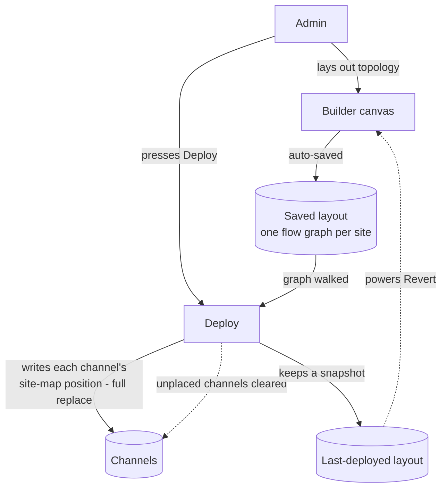

# Site Builder

The **Site Builder** (shown in the product as the "Virtual Site Builder") is a drag-and-drop canvas where an administrator draws a solar site's layout — benchmark sensors, solar blocks, inverters, meters, transformer, grid connection, batteries — as connected boxes, then assigns the site's data channels onto those boxes. Pressing **Deploy** stamps each channel with its place in that layout (its zone, device type, and whether it's a test point), which is how the rest of the platform knows each data stream's logical role in the plant.

It sits between two neighbouring features: Field Setup commissions the physical hardware, and the Channels feature configures each individual data stream — Site Builder is purely about the *logical layout* and the *channel-to-role mapping* of a site that already exists.

> **Reading this doc:** use the **Business / Developer** switch at the top. *Business* explains what the canvas does, how building and deploying work, and the rules that matter. *Developer* adds the full GraphQL surface, the deploy engine internals, every schema and DTO shape, the frontend graph mechanics, file references, and a terminology primer.

---

## Why this matters

Charts, status views, and analyses downstream need to know whether a given data stream is a benchmark irradiance sensor, an inverter, the production meter, or a battery coupling. That knowledge isn't in the raw data — it comes from the layout an administrator draws here and deploys onto the channels. A site that's never been deployed (or deployed wrong) leaves its channels without a role, and anything that groups data by region or device works with less context.

---

## How the data flows

Drawing only touches the saved layout; nothing reaches the channels until Deploy walks the graph and stamps — or clears — every channel's position.

---

## Building the layout

There is no multi-step wizard — it's a single live canvas:

- **Pick a site**, and the canvas loads its saved layout. If the site has never been laid out, a sensible **default template** is generated automatically from the site's energy-model blocks, with the site's active channels pre-placed onto the right boxes.
- **Drag devices** from a palette onto the canvas, connect them with lines, move them around (positions snap to a grid), and edit titles and notes. Battery **couplings** can be created in batches and snapped onto an existing connection.
- **Drag channels** from the sidebar onto a device box. A channel can only land on a compatible box — an irradiance benchmark channel can't be dropped onto an inverter, for example; mismatches are rejected with a message.
- **Edits save automatically** about a second after you stop making changes — there's no explicit Save button to remember.
- A **Sync** action realigns the canvas with the site's energy-model blocks if those have changed since the layout was drawn, and a **Revert** action restores the last deployed layout.

---

## Deploying the layout

Deploy is the moment the drawing becomes real: every channel placed in the layout gets its position written onto it, and — importantly — **every channel not in the layout has its position cleared**. Deploy is a full replace, not a merge. The platform also keeps a snapshot of what was deployed and when, which powers the Revert action and the "changes since last deploy" indicator that enables or disables the Deploy button. (Mechanically, the deploy action itself lives in the channels feature — see [[channels]].)

---

## Who can do what

Site Builder is **Admin and SuperAdmin only, end to end** — regular users can't open the page, and the underlying operations reject them too.

---

## The rules that matter

- **One layout per site** — each site has exactly one builder record.
- **You can't deploy an empty canvas** — a saved layout with at least one device box is required.
- **Deploy is a full replace** — removing a channel from the layout and re-deploying clears that channel's position.
- **Deploying a layout whose boxes hold no channels wipes every channel's position** — a valid (if drastic) way to reset a site's mapping.
- **Channel placement is type-checked** — benchmark, inverter, and meter boxes each only accept matching channel kinds.
- **Last save wins** — two people editing the same site at once will silently overwrite each other; there's no merge.
- **Only active channels are auto-placed** when the default template is generated.

---

## Entry points {dev}

UI — Site detail page tab "Virtual Site Builder", route `/site/:siteId/site-builder` — `denowatts-portal/src/pages/dashboard/site/site-builder/SiteBuilderPage.tsx`. Registered in `denowatts-portal/src/router.tsx:163-170`, wrapped in `<NonUserRoute>` (Admin/SuperAdmin only). It is one of the 15 site sub-pages described in [[site]].

> Note on naming: the backend NestJS module is `site-builder` (`denowatts-backend/src/site-builder/`). The portal folder is also `site-builder`. The site's general tab label is "Virtual Site Builder". All three refer to the same feature.

---

## Build flow overview {dev}

The Site Builder has **no multi-step wizard** — it is a single live canvas with autosave. The lifecycle is:

1. **Select a site** — the canvas reads the currently-selected site from Redux `state.header.siteSettings.site` (set by `SiteSettings`, see [[site]]). Nothing renders until a site is chosen.
2. **Bootstrap / hydrate the graph** (`useSiteBuilderBootstrap`):
   - Fetch the saved `SiteBuilder` row for this site via `siteBuilder(siteId)` query (`fetchPolicy: 'no-cache'`).
   - If `flow` (or, failing that, `lastDeployData`) exists → hydrate the Redux graph from it (`hydrateBuilderState`).
   - If neither exists → **auto-generate a default template** from the site's `blocks` (`generateTemplate`), then **pre-populate channels** onto the template nodes by matching channel-id prefixes (`applyTemplatePrepopulation`).
3. **Edit the graph** (all client-side, in Redux `siteBuilder` slice):
   - Drag palette **elements** (device types) onto the canvas, or drag **couplings** (DC/AC storage nodes) which can be batch-created and snapped onto an existing edge.
   - Drag **channels** (single or multi-select) from the sidebar onto a device node — validated against the node's allowed channel-id prefix.
   - Draw/remove **edges**, move nodes (snapped to a 10px grid), edit node title/notes/channels, delete nodes (template MODULE nodes are locked).
4. **Autosave** — a 1200ms debounced autosave persists the live graph to `SiteBuilder.flow` via `updateSiteBuilder` whenever there are unsaved changes (and not mid-deploy). Manual save happens implicitly through the same path.
5. **Sync with blocks (optional)** — if the site's `blocks` (Energy Model) drift from the canvas's MODULE+INVERTER pairs, a "Sync" action adds/removes block node pairs to match (`computeBlockDiff` → `applyBlockDiff`).
6. **Revert (optional)** — reset the canvas to the last deployed layout (`lastDeployData`), or to the freshly-generated template if nothing was ever deployed.
7. **Deploy** — runs the backend `configChannelSiteMap` mutation, which reads `SiteBuilder.flow`, writes `siteMap` onto each mapped channel (and nulls it on unmapped channels), then snapshots the deployed graph into `SiteBuilder.lastDeployData` + `lastDeployAt`.

The backend `site-builder` module is intentionally thin: it is a **per-site key-value store of the flow graph** (one document per site, `findOne`/`upsert`). All graph-building intelligence lives in the frontend; all the "apply to channels" intelligence lives in the **channels** service's `configChannelSiteMap`, not in the site-builder service.

---

## GraphQL API surface {dev}

### Query: `siteBuilder(siteId: ID!): SiteBuilder` (nullable)
- Resolver — `denowatts-backend/src/site-builder/site-builder.resolver.ts:13-21`
- Guard — `@Roles(SUPER_ADMIN, ADMIN)` (`roles.decorator.ts`)
- **Arg:** `siteId: ID` (Mongo `Types.ObjectId`).
- **Returns** the full `SiteBuilder` document for that site (see schema below) or `null` if none exists, with `flow.nodes.channels.channel` and `lastDeployData.nodes.channels.channel` **populated** to `{ _id, name, channelId }` (`SiteBuilderChannelSummary`).
- Delegates to `SiteBuilderService.findBySiteId(siteId)`.
- Frontend query — `denowatts-portal/src/graphql/queries/siteBuilderQueries.ts` (`GET_SITE_BUILDER`); selects `_id, site, flow{…}, lastDeployData{…}, lastDeployAt, createdAt, updatedAt`.

### Mutation: `updateSiteBuilder(input: UpdateSiteBuilderInput!): SiteBuilder`
- Resolver — `site-builder.resolver.ts:23-30`
- Guard — `@Roles(SUPER_ADMIN, ADMIN)`
- **Input:** `UpdateSiteBuilderInput` (see DTO below). Key field is `site` (required); `flow`, `lastDeployData`, `lastDeployAt` optional.
- **Returns** the upserted `SiteBuilder` (same populated shape as the query).
- Delegates to `SiteBuilderService.update(input)` — a `findOneAndUpdate({ site }, { $set: input }, { new: true, upsert: true })`.
- Frontend mutation — `denowatts-portal/src/graphql/mutations/siteBuilderMutations.ts` (`UPDATE_SITE_BUILDER`). Called in three ways by `SiteBuilderPage`:
  - `persistFlowPayload` / autosave → `{ site, flow }` only.
  - `persistDeployFlow` → `{ site, flow, lastDeployData, lastDeployAt }`.
  - Backend also calls `SiteBuilderService.update` directly inside `configChannelSiteMap` with `{ site, lastDeployData, lastDeployAt }`.

### Mutation: `configChannelSiteMap(configChannelSiteMapInput: ConfigChannelSiteMapInput!): String`
- **This is the "Deploy" button.** It lives in the **channels** module, not site-builder.
- Resolver — `denowatts-backend/src/channels/resolvers/channels.resolver.ts:58-62`
- Guard — `@Roles(SUPER_ADMIN, ADMIN)`
- **Input:** `ConfigChannelSiteMapInput { site: ID }` (`denowatts-backend/src/channels/dto/update-channel.input.ts:34-39`).
- **Returns** a status string (`"Deploy workflow successfully!"`).
- Delegates to `ChannelsService.configChannelSiteMap(input)` (`channels.service.ts:1020-1104`).
- Frontend mutation — `denowatts-portal/src/graphql/mutations/siteBuilderMutations.ts:63-67` (`CONFIG_CHANNEL_SITE_MAP`). Defined in the *site-builder* mutation file even though the resolver lives in channels.

There are **no other** site-builder GraphQL operations. No create/delete mutation exists — the row is upserted by `updateSiteBuilder` and never deleted by this module.

---

## Services {dev}

### SiteBuilderService — `denowatts-backend/src/site-builder/site-builder.service.ts`

Injects `Model<SiteBuilderDocument>` (the `SiteBuilder` Mongoose model). Exported from `SiteBuilderModule` so `ChannelsService` can consume it.

#### `findBySiteId(siteId: Types.ObjectId): Promise<SiteBuilder | null>`
- `siteBuilderModel.findOne({ site: siteId })`.
- `.populate('flow.nodes.channels.channel', '_id name channelId')` and the same for `lastDeployData.nodes.channels.channel` — turns the stored channel `ObjectId` refs into `{ _id, name, channelId }` summaries.
- `.lean().exec()` — returns a plain object (not a hydrated doc).
- **DB read:** `sitebuilders` collection by `site`; `$lookup`-style populate into `channels` (selecting only `_id, name, channelId`).
- **Side effects:** none. **Throws:** nothing explicit (Mongoose errors propagate).

#### `update(input: UpdateSiteBuilderInput): Promise<SiteBuilder | null>`
- `siteBuilderModel.findOneAndUpdate({ site: input.site }, { $set: input }, { new: true, upsert: true })` with the same two `.populate(...)` calls and `.lean().exec()`.
- **Upsert semantics:** if no row exists for `site`, one is created; otherwise the provided fields are `$set`. Because the whole `input` is `$set`, callers send only the fields they want to change (e.g. autosave sends `{ site, flow }`; deploy adds `lastDeployData`/`lastDeployAt`).
- **DB write:** upsert into `sitebuilders` keyed by `site` (which is `unique`, so at most one doc per site).
- **Side effects:** none beyond the write. **Throws:** logs via `this.logger.error("Error updating site builder config", …)` and **re-throws** the original error.

> Gotcha: `$set: input` shallow-replaces `flow` wholesale (the whole `SiteBuilderFlowData` object), so partial node/edge edits are not possible at the API layer — the client always sends the entire flow graph.

### ChannelsService.configChannelSiteMap — `denowatts-backend/src/channels/services/channels.service.ts:1020-1104`

This is the deploy engine. It consumes `SiteBuilderService.findBySiteId` and writes onto the `channels` collection.

#### `configChannelSiteMap(input: ConfigChannelSiteMapInput): Promise<string>`
Step-by-step:
1. `siteBuilder = await this.siteBuilderService.findBySiteId(input.site)`.
2. **Guard:** if `!siteBuilder?.flow?.nodes?.length` → `throw new BadRequestException("Site builder data not found")`. So **you must have a saved `flow` with at least one node before you can deploy.**
3. Build `mappingByChannelId: Map<channelId, { region?, testPoint?, device? }>`:
   - Iterate `siteBuilder.flow.nodes`; skip nodes with no `channels`.
   - For each channel entry, resolve the channel id from `channelEntry.channel`, which may be a raw `ObjectId`, a populated `{ _id }`, or a string. Skip if not a valid `ObjectId`.
   - Set the map entry to `{ region: node.region, testPoint: channelEntry.testPoint === true, device: node.device }`. **If the same channel appears on multiple nodes, the last one wins** (Map overwrite).
4. **Empty-mapping branch:** if the map is empty (nodes had no channels) → `channelModel.updateMany({ site }, { $set: { siteMap: null } })` (clear every channel's siteMap) and `return "Deploy workflow successfully!"` early — it does **not** snapshot `lastDeployData`/`lastDeployAt` in this branch (`channels.service.ts:1063-1071`).
5. `mappedObjectIds = [...keys].map(id => new ObjectId(id))`.
6. **Bulk set:** `channelModel.bulkWrite([...])` — one `updateOne` per mapped channel, filtered by `{ _id, site }`, `$set: { siteMap }`. The `site` in the filter ensures a channel is only updated if it really belongs to this site (cross-site channel ids are silently ignored).
7. **Clear the rest:** `channelModel.updateMany({ site, _id: { $nin: mappedObjectIds } }, { $set: { siteMap: null } })` — any channel in the site **not** in the deployed graph has its `siteMap` reset to `null`.
8. **Snapshot the deploy:** `lastDeployData = this.serializeSiteBuilderFlowForDeploy(siteBuilder.flow)` then `await this.siteBuilderService.update({ site, lastDeployData, lastDeployAt: new Date() })`. Returns `"Deploy workflow successfully!"`.
- **DB reads:** `sitebuilders` (via `findBySiteId`). **DB writes:** `channels.siteMap` (bulkWrite + updateMany), and `sitebuilders.lastDeployData` / `.lastDeployAt` (via `SiteBuilderService.update`).
- **Side effects:** mutates every channel in the site (sets or nulls `siteMap`); writes the deploy snapshot back onto the site-builder row.
- **Throws:** `BadRequestException("Site builder data not found")` when there is no saved flow with nodes.

#### `serializeSiteBuilderFlowForDeploy(flow)` (private) — `channels.service.ts:77-…`
- Maps the populated `flow` back into a `SiteBuilderFlowDataInput` whose `channels[].channel` are re-converted to bare `ObjectId`s (dropping the populated `{ name, channelId }` summary) and filtering out any channel that doesn't resolve to a valid `ObjectId`. Edges are copied through. This is what gets stored as `lastDeployData`, so the "last deployed" snapshot is stored with unpopulated channel refs (and re-populated on read by `findBySiteId`).

---

## Schemas {dev}

All in `denowatts-backend/src/site-builder/schemas/site-builder.schema.ts`. Every nested class is `@Schema({ _id: false })` (embedded subdocuments, no own ids). The collection is `sitebuilders`.

### SiteBuilder — `site-builder.schema.ts:105-156` (collection `sitebuilders`, `timestamps: true`)
| Field | Type | Required | Indexed | Purpose |
|---|---|---|---|---|
| `_id` | ObjectId | auto | PK | Document id (GraphQL `ID`). |
| `site` | ObjectId → `Site` | yes | **unique** | The site this builder config belongs to. Unique index ⇒ exactly one builder row per site. |
| `flow` | `SiteBuilderFlowData` | no | — | The current (working / autosaved) graph: nodes + edges. |
| `lastDeployData` | `SiteBuilderFlowData` | no | — | Snapshot of the graph as of the last successful deploy. Used for Revert and "changes since last deploy" detection. |
| `lastDeployAt` | Date | no | — | Timestamp of the last successful deploy. Shown as "Last deployed" in the sidebar. |
| `createdAt` | Date | auto | — | Mongoose timestamp. |
| `updatedAt` | Date | auto | — | Mongoose timestamp. |

### SiteBuilderFlowData — `site-builder.schema.ts:89-103`
| Field | Type | Required | Purpose |
|---|---|---|---|
| `nodes` | `[SiteBuilderFlowNode]` | no | Device nodes in the graph. |
| `edges` | `[SiteBuilderFlowEdge]` | no | Connections between nodes. |

### SiteBuilderFlowNode — `site-builder.schema.ts:35-67`
| Field | Type | Required | Purpose |
|---|---|---|---|
| `id` | string | **yes** | Client-generated node id (e.g. `vsb-node-1`). |
| `title` | string | no | Display label (e.g. `Block 1`, `AC Meter`). |
| `x` | number | no | Canvas X (grid-snapped, rounded on save). |
| `y` | number | no | Canvas Y. |
| `channels` | `[SiteBuilderFlowNodeChannel]` | no | Channels assigned to this node. |
| `region` | string | no | Logical zone — one of `VsbRegion` (`BENCHMARK`, `SOLAR_BLOCK`, `DISTRIBUTION`, `DC_STORAGE`, `AC_STORAGE`). Stored as free string. |
| `device` | string | no | Element type — one of `VsbElementType` (`HORIZONTAL_BENCHMARK`, `POA_BENCHMARK`, `MODULE`, `INVERTER`, `DC_METER`, `AC_METER`, `TRANSFORMER`, `BATTERY`, `TRACKER`, `RECLOSER`, `GRID`, `COUPLING`). Stored as free string. |

### SiteBuilderFlowNodeChannel — `site-builder.schema.ts:20-33`
| Field | Type | Required | Purpose |
|---|---|---|---|
| `channel` | ObjectId → `Channel` | **yes** | The mapped channel. Populated to `SiteBuilderChannelSummary` on read. |
| `testPoint` | boolean | yes (default `false`) | `true` = benchmark / test metering; `false` = production. Propagated to `channel.siteMap.testPoint` on deploy. |

### SiteBuilderFlowEdge — `site-builder.schema.ts:69-87`
| Field | Type | Required | Purpose |
|---|---|---|---|
| `id` | string | **yes** | Client-generated edge id (e.g. `vsb-edge-1`). |
| `source` | string | **yes** | Source node `id`. |
| `target` | string | **yes** | Target node `id`. |
| `relationship` | string | no | Optional edge label/type (unused by current UI; carried through verbatim). |

### SiteBuilderChannelSummary — `site-builder.schema.ts:5-18` (read-only projection)
| Field | Type | Required | Purpose |
|---|---|---|---|
| `_id` | ObjectId | yes | Channel id. |
| `name` | string | no | Channel name (populated). |
| `channelId` | string | no | Human channel id like `3.1.1` (populated). Drives prefix-based validation/pre-population on the frontend. |

### Channel.siteMap (write target) — `denowatts-backend/src/channels/schemas/channel.schema.ts:174-216`
The deploy writes onto the `channels` collection's `siteMap` subdocument (`ChannelSiteMap`):
| Field | Type | Purpose |
|---|---|---|
| `region` | string | Copied from the node's `region`. |
| `testPoint` | boolean | Copied from the channel entry's `testPoint`. |
| `device` | string | Copied from the node's `device`. |

`channel.siteMap` is `null` for channels not present in the deployed graph. See [[channels]] for the full Channel schema.

---

## DTOs {dev}

All in `denowatts-backend/src/site-builder/dto/site-builder.input.ts`. They are derived from the schema classes via `PickType`/`OmitType`, so the schema is the source of truth for field types.

### SiteBuilderFlowNodeChannelInput — `site-builder.input.ts:11-20`
| Field | Type | Validation | Purpose |
|---|---|---|---|
| `channel` | ID | `@IsMongoId()` | Channel ObjectId to assign. |
| `testPoint` | Boolean | `@IsBoolean()` | Benchmark vs production flag. |

### SiteBuilderFlowNodeInput — `site-builder.input.ts:22-31`
`PickType(SiteBuilderFlowNode, ['id','title','x','y','region','device'])` plus:
| Field | Type | Validation | Purpose |
|---|---|---|---|
| `id` | string | (from schema) | Node id. |
| `title`,`x`,`y`,`region`,`device` | per schema | optional | Node display/zone/device. |
| `channels` | `[SiteBuilderFlowNodeChannelInput]` | `@IsOptional()` | Assigned channels. |

### SiteBuilderFlowEdgeInput — `site-builder.input.ts:33-38`
`PickType(SiteBuilderFlowEdge, ['id','source','target','relationship'])` — same fields as the edge schema; `relationship` optional.

### SiteBuilderFlowDataInput — `site-builder.input.ts:40-53`
`OmitType(SiteBuilderFlowData, ['nodes','edges'])` re-adding:
| Field | Type | Validation | Purpose |
|---|---|---|---|
| `nodes` | `[SiteBuilderFlowNodeInput]` | `@IsOptional()` | Graph nodes. |
| `edges` | `[SiteBuilderFlowEdgeInput]` | `@IsOptional()` | Graph edges. |

### UpdateSiteBuilderInput — `site-builder.input.ts:55-75`
`OmitType(SiteBuilder, ['_id','createdAt','updatedAt','flow','lastDeployData','lastDeployAt'])` re-adding:
| Field | Type | Validation | Purpose |
|---|---|---|---|
| `site` | ObjectId | `@IsMongoId()` | **Required** key — which site's builder to upsert. |
| `flow` | `SiteBuilderFlowDataInput` | `@IsOptional()` | New working graph. |
| `lastDeployData` | `SiteBuilderFlowDataInput` | `@IsOptional()` | Deploy snapshot (set by deploy path only). |
| `lastDeployAt` | Date | `@IsOptional()` | Deploy timestamp (set by deploy path only). |

### ConfigChannelSiteMapInput — `denowatts-backend/src/channels/dto/update-channel.input.ts:34-39`
| Field | Type | Validation | Purpose |
|---|---|---|---|
| `site` | ID | `@IsMongoId()` | Site whose channels' `siteMap` to (re)compute from its saved flow. |

---

## Frontend: how the graph is built (implementation detail) {dev}

State lives in the Redux `siteBuilder` slice (`denowatts-portal/src/store/slices/siteBuilderSlice.ts`). `VsbRegion` and `VsbElementType` are defined there as const string maps (UPPER_SNAKE). Region↔element mapping is `REGION_BY_ELEMENT_TYPE` (slice:116-128).

- **Default template** (`buildTemplate`, slice:228-349): lays out fixed spine nodes left→right at computed X columns — Horizontal Benchmark (x=180) → POA Benchmark (380) → AC Meter "production meter" (1180) → Transformer (1400) → Recloser (1620) → Grid (1840). For each site block it adds a `MODULE` node (x=620, titled `Block N`) and an `INVERTER` node (x=900), both stamped with `blockNumber`, `capacityKw`, and block `note`. `generateTemplate` is dispatched only when no saved flow/lastDeployData exists.
- **Channel pre-population** (`applyTemplatePrepopulation`, `useSiteBuilderBootstrap.ts:192-365`): partitions the site's **ACTIVE** channels by `channelId` prefix and auto-assigns them:
  - `1.1.1` → POA Benchmark node(s) (grouped by exact `channel.blocks` set; extra POA nodes are spawned per distinct block-set), `testPoint=true`.
  - `1.1.2` and `1.3.2` → Horizontal Benchmark node, `testPoint=false`.
  - `3.1` → the inverter node of the matching `block`, `testPoint=false`.
  - `5.2.1` → the first AC Meter node, `testPoint=true`.
  - Then auto-wires edges: benchmark chain (Horizontal→each POA), distribution chain (AC Meter→Transformer→Recloser→Grid), per-block Module→Inverter→AC Meter, and POA→Module for matching block sets.
- **Channel drop validation** (`channelZoneValidation.ts`): a channel may only be dropped on a node whose `device` allows that channel-id prefix — `POA_BENCHMARK`⇒`1.1.1`, `HORIZONTAL_BENCHMARK`⇒`1.1.2`|`1.3.2`, `INVERTER`⇒`3.1`, `AC_METER`⇒`5.2.1`. Other device types have no prefix restriction. A mismatch shows a toast and is rejected. Duplicate assignment to the same node is also rejected.
- **Block drift sync** (`computeBlockDiff` / `applyBlockDiff`): compares the site's `blocks` to the canvas's MODULE+INVERTER pairs. The "Sync" action adds missing block pairs (auto-assigning matching inverter channels), removes pairs for deleted blocks, and de-duplicates extra pairs; channels on removed nodes are returned to the available list.
- **Autosave** (`SiteBuilderPage.tsx`): 1200ms debounce (`AUTOSAVE_DEBOUNCE_MS`); only fires when there is a site, editing is enabled, there are unsaved changes vs the canvas's initial snapshot, and no deploy is in flight. Autosave sends `{ site, flow }` and fails silently (toast-less) since manual Save/Deploy remain available.
- **Unsaved / revert / deploy gating:** the page maintains JSON snapshots (`lastSavedSnapshot`, `initialCanvasSnapshot`, `deployBaselineSnapshot`) to compute `hasUnsavedChanges`, `canRevert`, and `hasChangesSinceLastDeploy` (which enables/disables the Deploy button). Revert restores `lastDeployData` (or regenerates the template if never deployed) and persists it. Deploy flushes autosave first, then calls `configChannelSiteMap`, then writes `lastDeployData`/`lastDeployAt` via `updateSiteBuilder`.
- **Couplings** (DC/AC storage join nodes): dragged from sidebar pills; a modal batch-creates 1–50 (`MAX_COUPLING_BATCH_COUNT`) coupling nodes. On node drag-stop a coupling can snap onto the nearest non-coupling edge within 64px (`insertCouplingOnEdge`), splicing itself into that connection.

---

## Business rules (cited) {dev}

- **Admin/SuperAdmin only, end to end.** Frontend route guard `NonUserRoute` redirects `UserType.User` to `/not-found` — `denowatts-portal/src/views/ProtectedRoute/NonUserRoute.tsx:31-33`. Backend `siteBuilder` query, `updateSiteBuilder` mutation, and `configChannelSiteMap` mutation are all `@Roles(SUPER_ADMIN, ADMIN)` — `site-builder.resolver.ts:13,23` and `channels.resolver.ts:58`.
- **Exactly one builder row per site.** `SiteBuilder.site` is `unique` — `site-builder.schema.ts:112-117`. `update` upserts on `{ site }`.
- **You cannot deploy without a saved flow.** `configChannelSiteMap` throws `BadRequestException("Site builder data not found")` if `flow.nodes` is empty — `channels.service.ts:1023-1025`. The frontend also disables Deploy when there are no changes since last deploy (`hasChangesSinceLastDeploy`) — `SiteBuilderPage.tsx:1385-1386`.
- **Deploy is full-replace, not incremental.** Every channel in the site is touched: mapped channels get `siteMap` set; all others get `siteMap: null` — `channels.service.ts:1085-1093`. Removing a channel from the graph and re-deploying clears its `siteMap`.
- **Cross-site channels are ignored on deploy.** Bulk updates and the clear-pass both filter by `{ site }`, so a stray channel id from another site never gets written — `channels.service.ts:1077-1082`.
- **Last-node-wins for duplicate channel mappings.** Building `mappingByChannelId` overwrites earlier entries — `channels.service.ts:1055`.
- **`flow` is stored whole.** `update` uses `$set: input`, so the client must send the entire flow graph every save — `site-builder.service.ts:34`.
- **Channel-to-node prefix rules** restrict which channels land on benchmark/inverter/AC-meter nodes — `channelZoneValidation.ts` (frontend only; the backend does not re-validate prefixes on deploy).
- **Only ACTIVE channels are auto-pre-populated** in the default template — `useSiteBuilderBootstrap.ts:82-83` (`ChannelStatus.Active`).
- **Template MODULE nodes are deletion-locked** in the UI (`isFixedSolarElement` ⇒ `MODULE`); template block inverters with a `blockNumber` are also locked — `SiteBuilderPage.tsx:835-843`.

## Data touched {dev}

- **`sitebuilders.site`** — unique key linking the builder row to a site — `site-builder.schema.ts`.
- **`sitebuilders.flow`** — the working graph; written on every autosave/save (`updateSiteBuilder` → `$set`) — `site-builder.service.ts`.
- **`sitebuilders.lastDeployData` / `.lastDeployAt`** — deploy snapshot + timestamp; written by both the deploy path (`persistDeployFlow`) and inside `configChannelSiteMap` — `channels.service.ts:1095-1101`.
- **`channels.siteMap` (`{ region, device, testPoint }`)** — set per mapped channel on deploy; nulled for unmapped channels in the site — `channels.service.ts:1075-1093`, `channel.schema.ts:214-216`. This is the **only** durable cross-collection effect of the feature.
- **`channels` (read)** — `name`, `channelId`, `blocks`, `status` are read on the frontend (`GET_CHANNELS` filtered by `sites: [siteId]`) for the palette, validation, and template pre-population.
- **`sites.blocks` (read)** — drives the default template and the block-drift sync — read via `GET_SITE` on the frontend.

## Edge cases & gotchas {dev}

- **No-op deploy still rewrites everything.** Even if nothing changed, a deploy runs the full bulkWrite + clear-pass over all site channels and re-stamps `lastDeployData`/`lastDeployAt`. The Deploy button is disabled when `hasChangesSinceLastDeploy` is false to avoid this, but the backend itself does not short-circuit.
- **Empty-flow-with-nodes-but-no-channels clears all siteMaps.** If you deploy a graph whose nodes carry no channel assignments, `mappingByChannelId` is empty and the service nulls every channel's `siteMap` (early-return branch) — `channels.service.ts:1063-1071`. So an "empty" deploy is a valid way to wipe all site maps.
- **`flow` is replaced wholesale on save.** Concurrent edits from two tabs will last-write-wins clobber each other; there is no merge or optimistic-concurrency check.
- **Autosave failures are silent.** A failed autosave shows no toast (`runAutosave` swallows errors) — the user only finds out via the persistent "Unsaved changes" indicator. Deploy first calls `flushAutosave`, so a deploy will retry the save.
- **`siteBuilder` query is `no-cache`.** The frontend always refetches the row (Apollo can otherwise keep the previous site's data after the site switches); the bootstrap guards against hydrating a mismatched `row.site !== currentSite`.
- **Populated vs raw channel refs.** Reads populate `channel` to `{ _id, name, channelId }`; `lastDeployData` is stored with raw `ObjectId` refs (via `serializeSiteBuilderFlowForDeploy`) and re-populated on read. The deploy mapping code defensively handles all three shapes (ObjectId | populated object | string).
- **`relationship` on edges is carried but unused.** The schema/DTO support it and it round-trips, but the current UI does not set or read it.
- **No site-builder row is ever deleted.** Deleting a site (soft-delete, see [[site]]) does not remove its `sitebuilders` row; the unique index would block creating a second one if a site were ever hard-recreated with the same id (not a real scenario given soft-delete).
- **Pre-population assumes a specific channel-id taxonomy** (`1.1.1`, `1.1.2`, `1.3.2`, `3.1`, `5.2.1`). Sites whose channels use a different `channelId` convention will get an empty/partial template and require fully manual mapping. See [[channels]] / [[solar-glossary]] for the channel-id scheme.

---

## Solar & platform terminology {dev}

- **Flow / node graph** — the canvas layout: device **nodes** (boxes) connected by **edges** (lines), stored whole as `SiteBuilder.flow`.
- **Region** — the logical zone a node belongs to: `BENCHMARK`, `SOLAR_BLOCK`, `DISTRIBUTION`, `DC_STORAGE`, or `AC_STORAGE`; copied to `channel.siteMap.region` on deploy.
- **Element / device type** — what a node represents: horizontal/POA benchmark, module, inverter, DC/AC meter, transformer, battery, tracker, recloser, grid, or coupling.
- **POA benchmark vs horizontal benchmark** — reference irradiance measured in the plane of the array (POA) vs on the horizontal (GHI); each accepts only its matching channel-id prefix (`1.1.1` vs `1.1.2`/`1.3.2`).
- **Test point** — a per-channel flag marking benchmark/test metering rather than production data; propagated to `channel.siteMap.testPoint` on deploy.
- **Block** — one MODULE + INVERTER pair generated from the site's energy-model `blocks`; the "Sync" action keeps canvas pairs aligned with the site's blocks.
- **Coupling** — a DC/AC storage join node that can be batch-created and snapped onto an existing edge, splicing into the connection.
- **siteMap** — the `{ region, device, testPoint }` subdocument written onto each channel by Deploy; `null` for channels outside the deployed graph.
- **Deploy** — the `configChannelSiteMap` mutation (in the channels module) that full-replaces every channel's `siteMap` from the saved flow and snapshots `lastDeployData`/`lastDeployAt`.
- **Autosave** — the 1200ms-debounced `updateSiteBuilder` call that persists the whole flow graph on every pause in editing.
- **Channel-id prefix taxonomy** — the dotted `channelId` prefixes (`1.1.1`, `1.1.2`, `1.3.2`, `3.1`, `5.2.1`) that drive drop validation and template pre-population.

For the full domain vocabulary, see [[solar-glossary]].

---

**Related flows:** [[site]] · [[channels]] · [[field-setup]] · [[assets]] · [[solar-glossary]]
