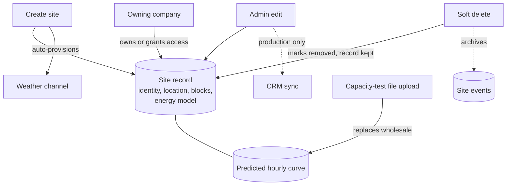

# Site

A **site** is one solar installation — a single PV system at a real location. It's the central record everything else in the platform hangs off: channels, hardware assets, alarms, analytics, reports, and stored files all belong to a site. If the portfolio is the fleet view, a site is the single plant you drill into.

> **Reading this doc:** use the **Business / Developer** switch at the top. *Business* explains what a site is, what it holds, and who can do what with it. *Developer* adds the full API surface, the large `SitesService`, every schema field, the access-control internals, file references, and a solar-terminology primer.

---

## Why this matters

The site record is the anchor of the whole product. Get it right and every downstream feature works; get it wrong and alarms misfire, reports miscalculate, and the map shows the wrong thing. It carries:

- **What the plant physically is** — capacity, panel and inverter layout, tilt and orientation, losses.
- **Where it is** — address, coordinates, and timezone (which every timestamp depends on).
- **Who owns and can see it** — the owning company plus any other companies granted access.
- **How well it should perform** — the predicted and learned energy models the platform compares real output against.
- **Where it is in its life** — from quoted, to shipped, to commissioning, to fully live.

Because so much depends on it, editing a site is tightly controlled (see *Who can see and edit a site*).

---

## How the data flows

The site record is the hub; creating, editing, uploading to, or deleting it each ripples out to a different spoke.

---

## What a site holds

A site record groups into a few plain ideas:

- **Identity** — name, a customer-facing id, and lifecycle status.
- **Location** — address, map coordinates, altitude, and the IANA timezone.
- **The physical system ("blocks")** — one or more blocks describing the actual hardware: DC capacity, AC nameplate, how many modules and inverters, tilt and azimuth, tracker settings, and the various loss factors that make performance predictions realistic.
- **People & companies** — the owning company, the EPC (builder) and O&M (maintenance) companies, a project manager, and a list of site managers.
- **The energy model** — a *predicted* model (what the plant should produce, often from an uploaded capacity-test file or design report) and a *learned* model (what the platform has figured out from real data over time).
- **Performance KPIs** — pre-computed week/month/year scores like EPI and energy availability.
- **Operational settings** — subscriptions, per-alarm notification rules, the commissioning checklist, and which device the platform trusts for the "power produced" number (inverter vs meter).

---

## The site detail hub

Opening a site lands on a tabbed hub. Each tab is owned by a different feature, so this doc covers the site-level ones and points you to the rest:

| Tab / page | What it shows | Covered by |
|---|---|---|
| **Overview** | KPI scores, connection/alarm/flag/ticket badges, a map, the site plan, and access/tags/managers | this doc |
| **General Info** | The editable site record (admins) or a read-only view (everyone else) | this doc |
| **Energy Model** | Predicted vs learned model and monthly tables | this doc |
| **Setup Tracker** | The commissioning checklist | this doc |
| **Capacity Test** | A wizard that runs a formal performance test | this doc · [[tests]] |
| **Learned Shade Profile / Benchmark Alignment** | Shading heatmap and model calibration | this doc |
| **Live View / Channels / Channel Map** | Live readings and channel configuration | [[channels]] |
| **Hardware / Services** | Asset inventory and service records | [[assets]] |
| **Virtual Site Builder** | Drag-and-drop topology canvas (hidden from read-only users) | [[site-builder]] |
| **Denobox** | File browser for the site's stored files | [[storage]] |
| **Energy Accounting** | Charts (this tab actually renders the Analytics page) | [[analytics]] |
| **Notifications** | Per-alarm notification rules | [[alarm-config]] |

---

## Who can see and edit a site

**Seeing.** A non-admin only sees a site if their company **owns** it or has been **granted access** to it. This is enforced on the server — there's no way to open a site you're not entitled to (trying throws a "not allowed" error rather than pretending it doesn't exist). A user with no company assigned sees no sites. SUPER_ADMINs see everything.

**Editing.** Who can change what is split by role:

- **SUPER_ADMIN** can create sites, delete them, and edit every field.
- **Everyone else** (admins included) can only edit a narrow set — site managers, tags, the physical block layout, and the predicted energy model. The General Info form is read-only for them.

Sites are never hard-deleted: deleting a site just marks it removed and archives its events, so history is preserved for audit.

---

## What happens behind the scenes

A few automatic behaviors are worth knowing because they affect data:

- **New sites get a weather feed.** Creating a site automatically provisions one "Weather (Remote)" channel so weather data starts flowing immediately.
- **Timezone follows the map.** When an admin moves a site's coordinates, the platform auto-detects the correct timezone — important because every reading and report is interpreted in the site's local time.
- **Capacity-test files reshape the prediction.** Uploading an 8760-hour capacity-test file replaces the site's predicted hourly curve with the parsed values.
- **Energy-model reports are read by AI.** Uploading a monthly energy-model PDF runs it through an extraction step that pulls out the 12 monthly rows.
- **Live sites sync to the CRM.** In production, admin edits to key fields push the site to HubSpot so sales/ops records stay current.

---

## The rules that matter

- **You only see your company's sites** (owned or access-granted) — enforced on the server; no company → no sites; SUPER_ADMIN sees all.
- **Only SUPER_ADMINs create or delete sites.** Everyone else can edit just managers, tags, blocks, and the predicted energy model.
- **Deleting is soft.** The record stays, marked removed, and its events are archived.
- **Moving a site's coordinates re-detects its timezone** (admins only).
- **A new site always starts with one weather channel.**
- **Catalog hardware can't vanish under a site.** An inverter or module spec in the shared catalog can't be deleted while any site still uses it.
- **Capacity-test upload is destructive to the predicted curve** — it replaces the site's predicted hourly rows wholesale.

---

## Entry points & routes {dev}

Site detail hub at route `/site/:siteId?` — `denowatts-portal/src/router.tsx:127`. Reached from the portfolio map, the status list, or direct URL. The hub layout is `denowatts-portal/src/pages/dashboard/site/components/SiteTabsLayout.tsx`. The whole `/site/:siteId?` subtree is wrapped by `CompanyRequiredRoute` (`router.tsx:127-225`).

---

## GraphQL API surface {dev}

All operations live in four resolvers. Auth/role decorators (`@Roles`, `@AllRoles`, `@CurrentUser`) from `denowatts-backend/src/common/decorators/`. Unless a `@Roles` is shown, the operation has no role gate but the service still scopes by company.

### SitesResolver — `resolvers/sites.resolver.ts` {dev}

| Operation | Type | Input | Returns | Role | Line |
|---|---|---|---|---|---|
| `createSite(createSiteInput)` | Mutation | full Site minus `_id` | `Site` | `SUPER_ADMIN` | `sites.resolver.ts:35-39` |
| `sites(filter)` | Query | managers/tags/company/packageExpiresAt/showDeleted/showNotes | `[SiteResponse]` (Site + event counts) | any (scoped) | `:41-44` |
| `site(id)` | Query | site id | `SingleSiteResponse` (owner/PM/managers populated) | any (scoped; Forbidden on mismatch) | `:46-52` |
| `updateSite(updateSiteInput)` | Mutation | `_id` + partial site | `Site` | `@AllRoles()`; service narrows field set | `:54-59` |
| `getMonthlyEnergyModelReport(...)` | Mutation | `siteId`, `file` (denobox PDF) | `[MonthlyEnergyModelReportResponse]` | any | `:61-66` |
| `runCapacityTest(runCapacityTestInput)` | Mutation | large test-config DTO | `CapacityTestResponse` | any | `:68-71` |
| `getAllSites(input)` | Query | company/managers/tags | `[AllSiteResponse]` | any (scoped) | `:73-80` |
| `portfolioStatusSummary(input)` | Query | company/managers/tags | `[PortfolioStatusSummaryResponse]` | any (scoped) | `:82-90` |
| `deleteSite(id)` | Mutation | site id | `Site` (soft-deleted) | `SUPER_ADMIN` | `:92-96` |
| `paginateSites(filter)` | Query | filters + page/limit/name/task sort | `SitePaginateResponse` | any (scoped) | `:98-104` |
| `latestSecurityCameraImage(input)` | Query | `site` id | `LatestSecurityCameraImageResponse` | any | `:106-112` |

### InvertersResolver / ModulesResolver — global equipment catalogs {dev}
Not site-scoped, no role decorators. Inverters: `inverters`, `inverter`, `createInverter` (rejects duplicate manufacturer+model), `updateInverter`, `deleteInverter` (blocked if any site uses it), `paginateInverters` — `inverters.resolver.ts:18-47`. Modules mirror this over the PV-module catalog — `modules.resolver.ts:18-47`.

### EnergyModelLearnedResolver — `resolvers/energy-model-learned.resolver.ts` {dev}
Per-site learned-model snapshots (`learned` collection): `energyModelLearnedList(siteId)` (sorted `date` desc), `createEnergyModelLearned` (rejects duplicate site+version+date), `updateEnergyModelLearned`, `deleteEnergyModelLearned` — `:14-32`.

**Frontend GraphQL documents** (`denowatts-portal/src/graphql/`): `GET_SITES`, `GET_SITE`, `PAGINATE_SITES`, `GET_INVERTERS`, `GET_MODULES`, `GET_ENERGY_MODEL_REPORT`, `GET_LATEST_SECURITY_CAMERA_IMAGE` (`queries/siteQueries.ts`); `UPDATE_SITE`, `DELETE_SITE`, `RUN_CAPACITY_TEST` (`mutations/siteMutations.ts`). `GET_SITE` (operation name `Site`) is what every sub-page fires with `variables: { id: currentSite }`.

---

## Services {dev}

### SitesService — `services/sites.service.ts` {dev}
The largest service in the codebase. Injects three Mongoose accessors for the same `Site` model (`Model`, `PaginateModel`, `AggregatePaginateModel`), `sitePredictedModel`, and collaborators `StorageService`, `OpenAIService`, `HttpService`, `ConfigService`, `HubSpotService`, `GoogleMapsService`, and (via `forwardRef`) `EventsService`/`ChannelsService` — `:93-113`.

#### `create(createSiteInput)` {dev}
Creates the site, then auto-provisions a `Weather (Remote)` channel via `ChannelsService.create(..., true)` (`:115-129`). Writes: insert `sites` + one `channels` doc. `BadRequestException` on failure (`:132-135`).

#### `find(user, filter?)` {dev}
Excludes `deletedAt != null` unless `showDeleted` (`:146-148`). Optional `managers`/`tags` `$in`; optional `subscriptions.capacityTest.endDate <= packageExpiresAt` (`:150-183`). **Scoping:** non-SuperAdmin no company → `[]`; else `$or: [{ owner: company }, { 'accesses.company': company }]`; SuperAdmin may opt into `filter.company` (`:162-178`). `$lookup` into `events` with a `$facet`: `totalFlag`, `totalAlarm` (CRITICAL/unacked/open), `totalOpenTicket`, plus NOTES counts when `showNotes` (`:185-245`). `$addFields` surfaces `flaggedEventCount`/`criticalAlarmEventCount`/`openTicketEventCount`; sort by `name` (`:247-304`).

#### `findOne(filter?, user?, internal=false)` {dev}
`internal=true` → raw `findOne` with no scoping/populate (`:308-310`). Else populates owner/projectManager/managers, filters `deletedAt: null`, injects company `$or` for non-admins (`:312-342`); throws `ForbiddenException("You are not allowed to access this site")` on no match (`:344`).

#### `update(id, input, shouldUpdateHubSpot=true, user?)` {dev}
Loads site (`BadRequestException` if missing, `:355-357`). **SUPER_ADMIN path:** if `location.coordinates` changed, fetch new `timezone` from Google Maps; deep-merge `location`/`predictedEnergyModel` (`:362-393`). **Non-admin path:** payload restricted to `{ managers, tags, blocks, predictedEnergyModel }` (`:394-401`); the resolver passes `shouldUpdateHubSpot = user.type === SUPER_ADMIN` (`sites.resolver.ts:58`). `findByIdAndUpdate(..., { new, runValidators })` (`:403-406`). **Side effects:** HubSpot sync if `shouldUpdateHubSpot && NODE_ENV=production` and a tracked field changed (`:408-420`); `uploadCapacityTest` if `capacityTestFile` set (`:422-424`); `restoreArchivedSiteEvents` if `deletedAt === null` (`:426-428` — runs on *every* live-site save, see gotchas).

#### `softDelete(id)` {dev}
Throws if missing/already deleted; sets `deletedAt`; then `eventsService.archiveSiteEvents(_id)` (`:433-460`). Sentry-captures and rethrows on error (`:461-464`).

#### `uploadCapacityTest(site)` {dev}
Reads `denobox/<siteId>/<capacityTestFilePath>` from S3, parses XLSX (`:541-545`); computes DC-weighted rear-side averages across blocks (`:550-571`); converts each row's local date/hour to UTC via site `timezone` (default `America/New_York`) (`:573-615`); builds `sitepredicted` docs (`metadata.type="OPERATING"`, `irrRpoaEff`/`irrTpoaEff` from rear-side factors) (`:617-679`); **`deleteMany({"metadata.site": site._id})` then `bulkWrite` inserts** (`:681-682`). `BadRequestException("Invalid 8760 Capacity Test File.")` on failure (`:683-686`).

#### `getMonthlyEnergyModelReport(id, input)` {dev}
Loads site, reads `denobox/<siteId>/<input.file>` PDF, calls **`OpenAIService.extractMonthlyEnergyModel(pdfBuffer)`** (`:689-702`). External: **OpenAI** — text search over the PDF, up to 12 monthly rows; on failure returns a 12-row `{Month}` skeleton (`openai.service.ts:271-293`). `BadRequestException` on read failure.

#### `runCapacityTest(input)` {dev}
Builds payload from `RunCapacityTestInput` (`trc_option_*` only when `trcOption=MANUAL`; `filter_option_*` only when `filterOption=MANUAL`), POSTs to `CAPACITY_TEST_API_URL` (TLS verification **disabled** via custom Agent) with `PYTHON_SERVER_SECRET` (`:704-744`); returns a presigned `denobox/<siteId>/<data.filename>` URL (`:746-753`). External: **Python capacity-test API**, **S3**. `InternalServerErrorException` with upstream message (`:754-765`). See [[tests]].

#### Other methods {dev}
`findByIds` (`:138-140`), `updateHubSpotSite` (maps fields to `p_sites`, sums `blocks[].info.acNameplate`; errors swallowed to Sentry, `:467-538`), `formatServiceStatus` (`COMMISSIONING` → `""`, `:768-785`), `getSitesAccessCompanies` (`:787-802` — see gotcha), `getAllSites` (dropdown, `:804-841`), `searchAssetsSites` (`:843-850`), `getPortfolioStatusSummary` (`:852-1016`, feeds [[portfolio]]), `findByPaginate` (incl. task-based sort via `aggregatePaginate`, `:1074-1247`), `getLatestSecurityCameraImage` (`:1250-1256`, see [[storage]]).

### InvertersService / ModulesService — `services/inverters.service.ts`, `services/modules.service.ts` {dev}
CRUD over the global catalogs; `create`/`update` reject duplicate (manufacturer, model); **`delete` is guarded** — `$lookup`s `sites` on `blocks.inverter._id` / `blocks.module._id` and throws `BadRequestException` listing site names if in use (`inverters.service.ts:58-100`, `modules.service.ts:59-101`).

### EnergyModelLearnedService — `services/energy-mode-learned.service.ts` {dev}
`find(siteId)` validates the site, returns `learned` docs filtered to the site's `energyAccountingVersion` (default `1.0`), sorted `date` desc (`:22-37`). `create` rejects duplicate (site, version, date), stamps `version` from the site (`:39-66`). `update`/`delete` standard (`:68-97`).

---

## Schemas {dev}

### Site — `schemas/site.schema.ts` (collection `sites`, `timestamps: true`) {dev}
Indexes: `location` → **2dsphere**, `name` → **text** (`:686-692`).

| Field | Type | Required | Indexed | Purpose / notes |
|---|---|---|---|---|
| `name` | String | yes | text | Site name (`:459-461`) |
| `location` | SiteLocation | no | 2dsphere | address/city/state/zip/type(`Point`)/coordinates `[lon,lat]` (default `[-71.114086, 42.731131]`)/altitude (`:463-473`) |
| `serviceStatus` | enum | yes | — | QUOTED, ORDERED, SHIPPED, COMMISSIONING, ACTIVE_AND_LEARNING, ACTIVE_NOT_LEARNING, DISCONTINUED (`:475-481`) |
| `owner` | ObjectId → Company | no | — | Owning company (`:483-488`); see [[companies]] |
| `epcCompany` / `oAndMCompany` | String | no | — | EPC / O&M company names (free text) (`:490-502`) |
| `projectManager` | ObjectId → User | no | — | Primary contact (`:504-506`); see [[users]] |
| `commercialOperationDate` | Date | no | — | COD (`:508-514`) |
| `customId` | String | no | — | Customer-facing id (`:524-529`) |
| `timezone` | String | no | — | IANA tz; auto-set from coordinates (`:552-557`) |
| `blocks` | [SiteBlock] | default `[]` | — | Physical PV config (`:559-564`) |
| `accesses` | [SiteAccess] | default `[]` | `accesses.company` | Cross-company access grants (`:566-571`) |
| `connectionStatus` | enum | default DISCONNECTED | — | CONNECTED / PARTIALLY_CONNECTED / DISCONNECTED (`:573-581`) |
| `kpi` | KPI | no | — | week/month/year × EPI/epiInService/bepi/availability (`:587-589`) |
| `predictedEnergyModel` | PredictedEnergyModel | no | — | capacityTestFile(+Path), energyModelReport[], monthly models (`:591-596`) |
| `managers` | [ObjectId → User] | no | `$in` | Site managers (`:606-611`) |
| `tags` | [String] | no | `$in` | Labels (`:613-618`) |
| `subscriptions` | SiteSubscriptions | no | `subscriptions.capacityTest.endDate` | plan + analytics/capacityTest windows (`:620-625`) |
| `notificationSettings` | [SiteNotificationSetting] | no | — | Per-alarm-config rules (`:627-633`); see [[alarm-config]] |
| `energyAccountingVersion` | String | no | — | Which `learned` version is read (`:635-640`) |
| `setupStatus` | [SetupStatus] | no | — | Commissioning steps (`:652-657`) |
| `powerProducedFrom` | enum (INVERTER/METER) | default METER | — | Which channel produces power figures (`:659-668`) |
| `deletedAt` | Date | default null | — | Soft-delete timestamp (`:670-675`) |
| `opcServerSettings` | OpcServerSettings | no | — | OPC connection settings (`:677-682`) |

Embedded sub-docs: `SiteNotificationSetting` (`:105-136`; `alarmConfig`, `channels` = EMAIL_SITE_MANAGERS/APP/DAILY_REPORT, `emails?`, `delay` = IMMEDIATE/TWO_HOURS/NEXT_DAY), `KPIData`/`KPI` (`:143-263`), `MonthlyEnergyModel` (`:182-207`), `PredictedEnergyModel` (`:211-246`), `SiteLocation` (`:269-313`), `SetupStep`/`SetupStatus` (`:317-373`), `SiteSubscriptions` (`:378-419`), `OpcServerSettings` (`:424-448`).

### SiteAccess — `schemas/site-access.schema.ts` {dev}
The cross-company access grant embedded in `Site.accesses` — **the join that lets a non-owner company view a site.** `company` (ObjectId → Company, queried as `accesses.company`), `companyName` (denormalized for display) — `:11-22`.

### SiteBlock — `schemas/site-block.shema.ts` {dev}
`{ info: BlockInfo, module?, inverter? }` (`:218-230`). `BlockInfo` (`:65-213`) is the full physical/electrical config: `blockNumber`, `acMaxOutput(Unit)`, `dcCapacity`, `acNameplate`, `quantityOfModules`, `modulesPerString`, rear-side factors, inverter count, ohmic/age/LID/mismatch/quality losses, `azimuth`, `tilt`, tracker params (`tracker`/`backtrack`/`maxAngle`/`groundCoverRatio`), `albedo`, `mountType`, `surfaceDesc`, `temperatureCoefficient`, `inverterEfficiency`, `bifacialityFactor`, etc. `BlockModule`/`BlockInverter` (`:33-60`) embed `{ _id, manufacturer, model }` referencing the global catalogs.

### Other schemas {dev}
`SitePredicted` (collection `sitepredicted`) — hourly predicted time-series from `uploadCapacityTest` (`site-predicted.schema.ts:18-57`). `EnergyModelLearned` (collection `learned`) — per-site learned-model snapshots with loss/derate factors (`energy-model-learned.schema.ts:10-109`). `Inverter` / `Module` — global equipment spec catalogs (`inverter.schema.ts:8-99`, `module.schema.ts:9-85`).

---

## Access control model {dev}

Non-`SUPER_ADMIN` site visibility is computed server-side from two fields: **`owner`** (owning company) and **`accesses[]`** (additional companies granted access). Every list/single query injects `$or: [{ owner: user.company }, { 'accesses.company': user.company }]` (`sites.service.ts:166-178, 337-341, 869-872, 1118`). No company → nothing. SUPER_ADMIN bypasses but can opt into `filter.company`. A single-site mismatch throws `ForbiddenException` (`:344`) — no soft "not found".

`getSitesAccessCompanies` is meant to broaden this to companies sharing a portfolio (used by `getAllSites`), but its implementation looks buggy — see gotchas. Referenced by [[companies]] (owner/accesses), [[users]] (scoping company, managers/PM), [[alarm-config]] (`notificationSettings[].alarmConfig`).

---

## DTOs {dev}

`CreateSiteInput` = `OmitType(Site, ["_id"])` (`dto/site.input.ts:142`). `UpdateSiteInput` = `PartialType(OmitType(Site,["blocks"]))` + required `_id` + re-declared `location`/`blocks`/`accesses`/`connectionStatus` (`:151-181`). `FilterSitesInput` = managers?/tags?/company?/packageExpiresAt?/showDeleted?/showNotes? (`:92-139`). `FilterSitesPaginateInput` adds page/limit/name/`taskSortId`/`taskSortOrder`/sortBy* (`:610-696`). `AllSiteInput`/`PortfolioStatusSummaryInput` (`:500-608`). `MonthlyEnergyModelReportInput` = `siteId`+`file`; response has `Month`,`GlobHor`,`GlobInc`,`GlobEff`,`EArray`,`E_Grid`,`PR`,… (`:277-319`). `RunCapacityTestInput` — large; required `siteId`/`startDate`/`endDate`/`soiling`/`shadeAllowance`/`primaryTest`(astm/iec); conditional `trcOption*`/`filterOption*` via `@ValidateIf` (`:321-489`). `LatestSecurityCameraImageInput/Response` (`dto/security-camera.input.ts`). Inverter/Module/EnergyModelLearned DTOs follow OmitType/PartialType patterns; learned `version` is server-stamped, never client-set.

---

## Site sub-pages (frontend, detailed) {dev}

Route tree under `/site/:siteId?` (`router.tsx:127-225`), wrapped by `CompanyRequiredRoute`. **Tabbed** (inside `SiteTabsLayout`, `components/SiteTabsLayout.tsx:20-30`): Overview, Live View, Denobox, General Info, Hardware/Services, Energy Model, Channel Config, Site Builder (`nonUserOnly`), Setup Tracker.

| Sub-page | Route | Covered by |
|---|---|---|
| Site Overview | `/site/:siteId` (index) — `overview/SitePage.tsx` | this doc |
| Live View | `/site/:siteId/live-view` | [[channels]] |
| Setup Tracker | `/site/:siteId/site-setup-tracker` | this doc |
| General Info | `/site/:siteId/general-info` (SuperAdmin → editable `SiteInfoForm`; else read-only `SiteInfoDisplay`, `:170-181`) | this doc |
| Hardware / Services | `/site/:siteId/hardware-services` | [[assets]] |
| Energy Model | `/site/:siteId/energy-model` | this doc |
| Virtual Site Builder | `/site/:siteId/site-builder` (`nonUserOnly` + `NonUserRoute`) | [[site-builder]] |
| Channels | `/site/:siteId/channels` | [[channels]] |
| Denobox | `/site/:siteId/denobox/*` | [[storage]] |
| Capacity Test | `/site/:siteId/capacity-test` | [[tests]] |
| Channel Map | `/site/:siteId/channel-map` | [[channels]] |
| Learned Shade Profile | `/site/:siteId/learned-shade-profile` | this doc |
| Benchmark Alignment | `/site/:siteId/benchmark-alignment` | this doc |
| Energy Accounting | `/site/:siteId/energy-accounting` (**renders `AnalyticsPage`**, `router.tsx:211-215`) | [[analytics]] |
| Notifications | `/site/:siteId/notifications` | [[alarm-config]] |

**Site selection plumbing.** `SiteSettings.tsx` reads the URL `:siteId`, validates it against the user's `GET_SITES` list, dispatches `updateSiteSettings({ site })` to Redux; sub-pages read the id from Redux, not `useParams()`. An id not in the list silently redirects to `/site` and clears Redux (`components/SiteSettings.tsx:108-207`).

---

## Business rules (cited) {dev}

- `createSite`/`deleteSite` require `SUPER_ADMIN` — `sites.resolver.ts:35,92`.
- `updateSite` is `@AllRoles()`; non-admin payload restricted to `managers/tags/blocks/predictedEnergyModel` — `sites.service.ts:394-401`.
- Company scoping `$or: [owner, accesses.company]` on every non-admin query — `:166-178, 337-341`.
- Coordinate change (SUPER_ADMIN) → auto-fetch timezone — `:362-379`.
- Soft-delete sets `deletedAt` and archives the site's events — `:447-458`.
- New site → one `Weather (Remote)` API channel — `:120-128`.
- HubSpot sync only when `shouldUpdateHubSpot && NODE_ENV=production` and a tracked field changed — `:408-420`.
- `capacityTestFile` set → re-parse 8760 file into `sitepredicted` (delete-then-bulk-insert) — `:422-424, 681-682`.
- Inverter/Module catalog rows can't be deleted while referenced by any site's blocks — `inverters.service.ts:70-97`, `modules.service.ts:71-98`.
- Learned `version` stamped from `site.energyAccountingVersion` (default `1.0`); duplicate (site, version, date) rejected — `energy-mode-learned.service.ts:48-61`.

## Data touched {dev}

- `sites` — read/written by every method; aggregated for event counts + portfolio summary.
- `channels` — one Weather channel inserted on create (`sites.service.ts:120`); see [[channels]].
- `events` — `$lookup`ed for counts; `archivedAt` set on delete, cleared on update (`events.service.ts:724-750`).
- `sitepredicted` — deleted+bulk-inserted by `uploadCapacityTest` (`:681-682`).
- `learned` — per-site learned models.
- Inverter/Module catalogs — global, referenced from `blocks.inverter`/`blocks.module`.
- S3/Denobox (`denobox/<siteId>/...`) — read for capacity test / energy model; presigned download URLs; see [[storage]].
- HubSpot `p_sites` — synced on prod SUPER_ADMIN updates (`:467-533`).

## Edge cases & gotchas {dev}

- **`update` calls `restoreArchivedSiteEvents` on every live-site save** (`deletedAt === null`, true for all live sites) — `sites.service.ts:426-428`. **Verified harmless:** the only writer of `archivedAt` in the backend is site soft-deletion (`archiveSiteEvents`), so on a live site the restore matches zero events and is a no-op; it only takes effect on site un-delete, which is the intended behavior. Optional hardening: gate it on the actual deleted→live transition.
- **`getSitesAccessCompanies` likely doesn't expand cross-company access** — `findByIds([company])` queries `sites._id IN [companyId]`, which essentially never matches; result is almost always just `[company]` — `:787-802`. Flag for review.
- **Capacity-test parse is destructive** — `deleteMany`s the site's `sitepredicted` rows before re-inserting; a parse error aborts before the delete — `:681-686`.
- **OpenAI energy-model extraction degrades silently** — any failure returns a 12-row `{Month}` skeleton, no values — `openai.service.ts:276-292`.
- **`runCapacityTest` disables TLS verification** to the Python service (`rejectUnauthorized: false`) — `:741-743`.
- **`formatServiceStatus` omits COMMISSIONING** (returns `""`) → commissioning sites sync an empty status to HubSpot — `:768-785`.
- **Default coordinates** `[-71.114086, 42.731131]` (Massachusetts) on a site created without coordinates; timezone is auto-set only on a SUPER_ADMIN coordinate *change* — `site.schema.ts:303-306, 470`.
- **`internal=true` `findOne` bypasses scoping/populate** — never expose to user input — `:308-310`.
- **Energy Accounting tab is really Analytics** — mounts `AnalyticsPage` — `router.tsx:213`.
- **`SiteAccess.companyName` is denormalized** — can drift from the Company's `name` on rename — `site-access.schema.ts:20-22`.

---

## Solar & platform terminology {dev}

- **Block** — one physical sub-array of a site with its own tilt, orientation, module/inverter types, and capacity. A site has one or more blocks.
- **DC capacity / AC nameplate** — the panel-side rating (kW DC) vs the inverter/grid-side rating (kW AC). Their ratio (DC:AC) drives expected clipping.
- **Tilt / azimuth** — the angle panels are tilted up from horizontal, and the compass direction they face.
- **Tracker** — mounting that rotates panels to follow the sun (vs fixed-tilt); brings extra params like ground-cover ratio and backtracking.
- **Module / inverter** — the PV panel and the device that converts its DC to grid AC. Specs live in shared global catalogs and are referenced by each block.
- **Energy model** — the site's expected output. *Predicted* comes from design data / a capacity-test file; *learned* is what the platform infers from real measurements over time.
- **Capacity test** — a formal performance test comparing measured output to expected, often producing an 8760-hour (one value per hour of the year) reference curve. See [[tests]].
- **KPI / EPI / BEPI** — performance scores. EPI (Energy Performance Index) ≈ actual ÷ expected energy; BEPI is a baseline variant; the site stores week/month/year rollups.
- **Service status** — lifecycle stage (Quoted → Ordered → Shipped → Commissioning → Active Not Learning → Active & Learning; plus Discontinued).
- **Connection status** — whether the site's hardware is currently reporting (Connected / Partially / Disconnected).
- **COD** — Commercial Operation Date, when the plant officially began commercial production.
- **EPC / O&M** — the company that *built* the plant (Engineering, Procurement, Construction) and the company that *maintains* it (Operations & Maintenance).
- **Denobox** — the on-site data logger; also the name of the site's file store. See [[storage]].

For the full domain vocabulary, see [[solar-glossary]].

---

**Related flows:** [[authentication]] · [[portfolio]] · [[companies]] · [[users]] · [[channels]] · [[assets]] · [[site-builder]] · [[storage]] · [[alarm-config]] · [[analytics]] · [[tests]] · [[solar-glossary]]
