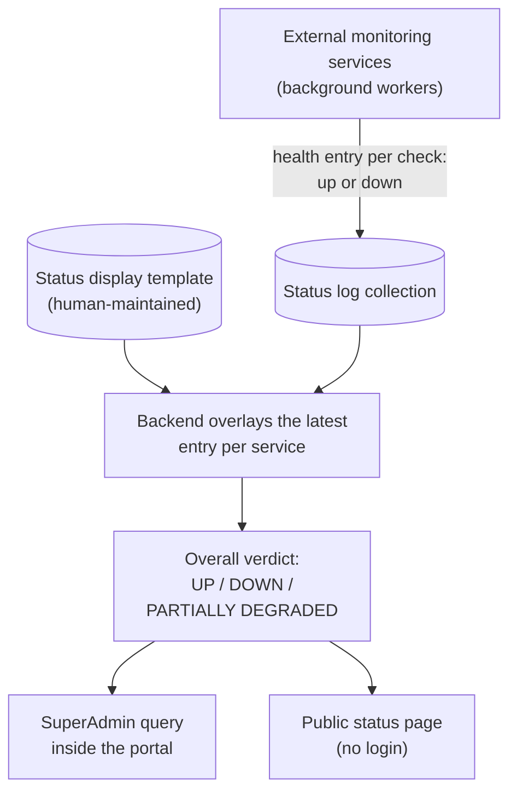

# Status Logs

**Status Logs** is the health record behind the platform's own "System Status" — is Denowatts itself running properly? The platform's monitoring services record a result for every health check they run on each backend service (data ingest, data curation, charting, alarming, remote management, and so on): up or down, at what time. This module reads the latest result for each service and rolls them all up into a single verdict — **UP**, **DOWN**, or **PARTIALLY DEGRADED** — which also feeds the public status page customers can check.

This is the *infrastructure* health layer. It's a different concept from the green/red dots showing whether a site's hardware is reporting — that's the Status dashboard, covered in [[status]].

> **Reading this doc:** use the **Business / Developer** switch at the top. *Business* explains what gets logged, how the overall verdict is computed, and who can see it. *Developer* adds the GraphQL and REST surfaces, the service internals and aggregations, every schema and DTO shape, file references, and a terminology primer.

---

## Why this matters

When data looks wrong or charts go blank, the first question is whether the problem is at the solar site or in the platform itself. Status Logs answers the platform half of that question: it's the source of truth for "is our own machinery healthy?", both for SuperAdmins inside the portal and for customers via the public status page.

---

## How the data flows

A templated service with no log at all is assumed healthy — only an explicit "down" entry turns it red.

---

## What gets logged

Each log entry says: a named service (optionally a finer-grained sub-service, such as a specific external data feed) was checked at a given time, and it was either up or down. Entries can also note how long the check took and whether the job overran its expected window. These logs are **recorded by the platform's monitoring services** — separate background workers, not this application. This module only reads them.

---

## How the overall verdict is computed

A human-maintained **template** lists which services and sub-services should appear on the status display, with their friendly names and descriptions. The module takes that template, overlays the most recent log for each entry, and rolls it up:

- everything up → **UP**
- everything down → **DOWN**
- a mix of up and down → **PARTIALLY DEGRADED**
- a template with no services at all counts as **DOWN**

---

## The optimistic default

A service in the template with **no log at all is treated as healthy** — only an explicit "down" record turns it red. That keeps brand-new services from showing as failures before their first check, but it has a flip side: if a monitoring worker silently dies and stops writing logs, the service it watched keeps showing green. Spotting a fully-dead monitor requires noticing the absence of fresh logs, not a red indicator.

---

## Who can see it

- The full rolled-up system status inside the portal is **SuperAdmin only**. (The header indicator that was meant to show it is currently switched off in the product.)
- The simpler per-service lookups are **public, with no login** — they exist to power the external public status page.

---

## Entry points {dev}
- **GraphQL** — `systemStatus` query, SuperAdmin only. Intended consumer is the green/yellow/red dot in the portal header (`denowatts-portal/src/common/components/Header.tsx:933-979`), wired via `SYSTEM_STATUS` (`denowatts-portal/src/graphql/queries/systemNotificationQueries.ts:14`). **Note: this consumer is currently commented out** (the `useQuery(SYSTEM_STATUS, …)` call at `Header.tsx:228-231` and the JSX block are commented), so at present nothing in the portal actively calls it.
- **REST** (legacy / service-to-service) — three `@Public()` endpoints under `/status-logs` (`denowatts-backend/src/status-logs/status-logs.controller.ts`). These have **no auth and no role guard** and appear to exist for an external/public status page (the header links out to `https://status.denowatts.com`, `Header.tsx:947`).

---

## GraphQL API surface {dev}

### Queries

#### `systemStatus: SystemStatusResponse`
- Resolver: `StatusLogsService.getSystemStatus()` via `StatusLogsResolver.getSystemStatus()` — `denowatts-backend/src/status-logs/status-logs.resolver.ts:11-15`
- **Guard:** `@Roles(UserType.SUPER_ADMIN)` (`status-logs.resolver.ts:11`). The `RolesGuard` throws `ForbiddenException(USER_NOT_AUTHORIZED)` for non-SuperAdmins; any user whose `type === SUPER_ADMIN` passes (`denowatts-backend/src/common/guards/roles.guard.ts:34-40`).
- **Input:** none.
- **Return type `SystemStatusResponse`** (`denowatts-backend/src/status-logs/dto/system-status.output.ts:52-68`):

  | Field | GraphQL type | Nullable | Source |
  |---|---|---|---|
  | `_id` | `ID` | no | `settings._id` (the SYSTEM_STATUS settings doc) stringified |
  | `setting` | `String` | no | `settings.setting` (`'SYSTEM_STATUS'`), `''` fallback |
  | `lastUpdated` | `Date` | no | `settings.lastUpdated`, `new Date()` fallback |
  | `status` | `SystemStatus` enum | no | computed overall status |
  | `services` | `[ServiceStatus]` | no | template services with `.status` overlaid from logs |

- **`SystemStatus` enum** (`system-status.output.ts:3-11`): `UP`, `DOWN`, `PARTIALLY_DEGRADED`.
- **`ServiceStatus`** (`system-status.output.ts:31-50`): `name: String!`, `displayName?: String`, `interval?: Float`, `description?: String`, `subServices?: [SubServiceStatus]`, `status: Boolean!`.
- **`SubServiceStatus`** (`system-status.output.ts:13-29`): `name?: String`, `displayName?: String`, `interval?: Float`, `description?: String`, `status: Boolean!`.
  - Generated frontend types confirm the shapes — `denowatts-portal/src/graphql/__generated__/graphql.ts:5698-5706` (`ServiceStatus`), `:6465-6472` (`SubServiceStatus`), `:6504-6517` (`SystemStatus` enum + `SystemStatusResponse`).

There are **no mutations or subscriptions** in this module. The module is read-only; nothing here writes status logs (see Edge cases).

### REST endpoints (`@Public()`, controller prefix `status-logs`)

`denowatts-backend/src/status-logs/status-logs.controller.ts` — the whole controller is `@Public()` (`status-logs.controller.ts:7`), so `JwtAuthGuard` short-circuits to `return true` and no JWT is required (`denowatts-backend/src/common/guards/auth.guard.ts:29-31`). No `@Roles` decorator → `RolesGuard` returns `true` because `requiredRoles` is undefined (`roles.guard.ts:23`).

| Method + path | Handler | Input | Returns |
|---|---|---|---|
| `GET /status-logs` | `findLatestStatusLog` (`controller.ts:12-15`) | `@Query() StatusLogsInput` (`{ name? }`) | `StatusLog` (single) |
| `GET /status-logs/template` | `findStatusLogsTemplate` (`controller.ts:17-20`) | none | `SystemStatusTemplateResponse` (raw settings doc + computed `status`/`services`) |
| `POST /status-logs/latest` | `findLatestStatusLogs` (`controller.ts:22-25`) | `@Body() LatestStatusLogsInput` (`{ names? }`) | `StatusLog[]` |

---

## Services {dev}

### StatusLogsService — `status-logs.service.ts`

Injects two Mongoose models (`status-logs.module.ts:11-14`): `StatusLog` → collection `statuslogs` (default Mongoose pluralization), and `Settings` → collection `settings` (explicit, `settings.schema.ts:6`). Extends Day.js with the `utc` plugin at import time (`status-logs.service.ts:11`) though UTC is not actually used in any method.

Three local TypeScript helper types (not schemas) describe the loosely-typed settings doc: `StatusTemplateService`, `SystemStatusSetting`, `SystemStatusTemplateResponse` (`status-logs.service.ts:13-32`).

#### `findLatestStatusLog(input: StatusLogsInput): Promise<StatusLog>` — `:43-62`
- Builds query: `{ $or: [{ 'metadata.service': input.name }, { 'metadata.subService': input.name }] }` — matches a log where the requested `name` is either the service **or** the sub-service (`:44-46`).
- **DB read:** `statusLogModel.findOne(query).sort({ timestamp: -1 })` — newest matching log (`:49`).
- **Throws** `ServiceUnavailableException` (503) if no log found: `No status log found for '<name>'` (`:51-53`).
- **Throws** `ServiceUnavailableException` (503) if the latest log's `status` is falsy: `'<name>' is currently unavailable. Last checked: <timestamp>` (`:55-59`).
- Returns the latest log only when `status` is truthy.
- **Gotcha:** `input.name` is optional and unvalidated for presence; if omitted, the `$or` matches logs where `metadata.service`/`metadata.subService` equals `undefined` — effectively finds nothing → 503.

#### `private calculateSystemStatuses(services): Promise<{ services, overallStatus }>` — `:69-155`
Shared core used by both `getStatusLogsTemplate` and `getSystemStatus`. Given the template's services array, it overlays the latest live status and computes the overall rollup.
- If `services.length === 0` → returns `{ services: [], overallStatus: DOWN }` (`:73-78`). **An empty template counts as DOWN.**
- Flattens all service names + sub-service names into `allNames` (`:81-84`).
- **DB read (aggregation)** on `statuslogs` (`:86-112`):
  1. `$match`: `metadata.service ∈ allNames` OR `metadata.subService ∈ allNames`.
  2. `$sort`: `timestamp: -1`.
  3. `$group` by `{ service, subService }`, keeping `$first` doc (the newest per service+subService pair).
  4. `$replaceRoot` to return the full newest doc per pair.
- Builds a `Map` keyed by `service` or `service:subService` (`:114-119`).
- For each template service: `service.status = map.get(name)?.status ?? true`. **Missing log defaults to `true` (UP).** Increments `upCount`/`downCount` (`:124-130`).
- For each sub-service: `subService.status = map.get(`service:subService`)?.status ?? true`; again missing → UP; updates counts (`:131-141`).
- **Overall rollup** (`:144-149`):
  - start `UP`;
  - if `upCount > 0 && downCount > 0` → `PARTIALLY_DEGRADED`;
  - else if `downCount > 0` → `DOWN`;
  - else (all up) stays `UP`.
- **Mutation side effect:** mutates the passed-in `services` objects in place (sets `.status` on each). Callers rely on this.

#### `getStatusLogsTemplate(): Promise<SystemStatusTemplateResponse>` — `:157-182`
Backs `GET /status-logs/template`.
- **DB read:** `settingsModel.findOne({ setting: 'SYSTEM_STATUS' }).lean()` (`:158-161`).
- **Throws** `NotFoundException` (404) `Status Logs Template Not Found` if absent (`:163-165`).
- Calls `calculateSystemStatuses(template.services ?? [])` (`:168-171`).
- Returns the **raw settings doc spread** (`...statusTemplate`) plus overrides: `lastUpdated = new Date()` (always "now", not the doc's stored value), `status = overallStatus`, `services = updatedServices` (`:174-181`).
- **Note:** because it spreads the raw lean doc, the REST `/template` response includes **all** extra fields stored on the settings document (whatever the human author put there), unlike the GraphQL response which is shaped strictly by `SystemStatusResponse`.

#### `getSystemStatus(): Promise<SystemStatusResponse>` — `:184-208`
Backs the GraphQL `systemStatus` query.
- **DB read:** `settingsModel.findOne({ setting: 'SYSTEM_STATUS' }).lean()` (`:185`).
- **Throws** `NotFoundException` (404) `Status Logs Template Not Found` if absent (`:187-189`).
- Calls `calculateSystemStatuses(settings.services ?? [])` (`:195-196`).
- Returns a **strictly-shaped** object (`:199-205`): `_id` (stringified), `setting` (or `''`), `lastUpdated` (doc's `lastUpdated` or `new Date()` — **differs from `/template`, which always uses `new Date()`**), `status`, `services`.

#### `getLatestStatusLogs(input: LatestStatusLogsInput): Promise<StatusLog[] | []>` — `:210-246`
Backs `POST /status-logs/latest`. Returns the newest log for each requested name.
- `names = input.names || []`; if empty → returns `[]` immediately, no DB call (`:211-215`).
- **DB read (aggregation)** identical pipeline shape to `calculateSystemStatuses` (`:217-243`): `$match` on `metadata.service`/`metadata.subService` ∈ `names` → `$sort timestamp:-1` → `$group` by `{service, subService}` taking `$first` → `$replaceRoot`. Returns the deduped newest-per-pair logs.
- No throws; empty result returns `[]`.

**Module wiring:** `StatusLogsService` is exported (`status-logs.module.ts:18`) and imported by `MetricsModule`. However `MetricsService` only injects the shared `Settings` model (for the unrelated `METRIC_PREFIX` setting at `denowatts-backend/src/metrics/metrics.service.ts:359`); it does **not** call any `StatusLogsService` method. No other module consumes status-logs logic.

---

## Schemas {dev}

### StatusLog — `schemas/status-logs.schema.ts`
`@Schema({ timestamps: true })` → Mongoose adds `createdAt`/`updatedAt` automatically (`:72`). Also an `@ObjectType()` for GraphQL. Collection: `statuslogs` (default pluralization; not overridden).

| Field | Type | Required | Indexed | Purpose / notes |
|---|---|---|---|---|
| `_id` | `ObjectId` (GraphQL `ID`) | auto | yes (PK) | Document id. `@IsMongoId()`. `:74-76` |
| `timestamp` | `Date` | **yes** | no explicit index | When the health check ran; all queries sort on this (`-1`). `@Prop({ required: true })`, validated `@IsString()` (note: typed `Date` but validator is `IsString` — mismatch). `:78-81` |
| `metadata` | `StatusLogMetadata` (sub-doc) | **yes** | no | Embedded `{ service, subService }`. `@Prop({ required: true, type: StatusLogMetadataSchema })`. `:83-90` |
| `status` | `boolean` | **yes** | no | Up (`true`) / down (`false`). `:92-95` |
| `runtime` | `number` | optional | no | Execution time of the check (units not enforced). `@Prop({ nullable: true })`. `:97-101` |
| `overrun` | `boolean` | optional | no | Whether the job exceeded its expected window/SLA. `:103-107` |
| `createdAt` | `Date` | auto | no | Mongoose timestamp; exposed in GraphQL. `:109-110` |
| `updatedAt` | `Date` | auto | no | Mongoose timestamp; exposed in GraphQL. `:111-113` |

**No `@Schema`-level or `@Prop`-level indexes are declared.** Every read sorts by `timestamp: -1` and matches on `metadata.service`/`metadata.subService`; on a large collection this implies a collection scan + in-memory sort unless an index exists at the DB level (not defined in code — flag for review).

#### StatusLogMetadata (embedded sub-document) — `:48-69`
`@Schema({ _id: false })` (no own `_id`), dual `@InputType('StatusLogMetadataInput')` + `@ObjectType()`.

| Field | Type | Required | Purpose / notes |
|---|---|---|---|
| `service` | `StatusLogService` enum | **yes** (`@Prop({ required: true, enum: StatusLogService })`) | The top-level service name. GraphQL field is `nullable: true` but the Mongo prop is required — divergence between GraphQL contract and DB constraint. `@IsEnum`. `:52-58` |
| `subService` | `StatusLogSubService` enum | optional (`@Prop({ nullable: true, enum: ... })`) | Optional finer-grained sub-service. `@IsEnum` (applied even though optional). `:60-66` |

**`StatusLogService` enum** (`:15-30`): `DATA_INGEST`, `DATA_QUEUE`, `DATA_CURATION`, `DAILY_DATA_CURATION`, `DATA_ARCHIVING`, `CHARTS`, `REMOTE_MANAGEMENT`, `PORTAL`, `ALARMING`, `RM_SERVICE_STATUS`, `API_GET`, `FTP_POST`. (A commented-out `*DATA_ANALYTICS` placeholder exists at `:21`.)
**`StatusLogSubService` enum** (`:32-35`): `ALSOENERGY`, `NYSERDA`.

> Caveat: the service's aggregations/queries match on `metadata.service`/`metadata.subService` against **arbitrary strings** from the `SYSTEM_STATUS` settings template (`service.name`), not against these enums. The enums constrain what producers may write; the template's `name` values must equal those stored strings for the overlay map to hit.

### Settings — `schemas/settings.schema.ts`
`@Schema({ strict: false, collection: 'settings' })` with an **empty class body** (`:4-8`). Deliberately schemaless: the document holds arbitrary keys. The status-logs module reads only the doc where `setting === 'SYSTEM_STATUS'`. Expected (untyped) shape consumed by the service (`status-logs.service.ts:19-24`, `26-32`):
- `_id` — ObjectId
- `setting: 'SYSTEM_STATUS'` — discriminator
- `lastUpdated: Date`
- `services: StatusTemplateService[]` — each `{ name, status?, subServices?: [{ name, status? }] }`, plus presentational fields surfaced by GraphQL (`displayName`, `interval`, `description`) that live on the doc.

The same `settings` collection is shared with other features (e.g. `METRIC_PREFIX` used by `MetricsService`); the `setting` field is the discriminator.

---

## DTOs {dev}

### StatusLogsInput — `dto/status-logs.input.ts:3-7`
| Field | Type | Validation | Purpose |
|---|---|---|---|
| `name` | `string?` | `@IsOptional()`, `@IsString()` | Service or sub-service name to look up the single latest log for (`GET /status-logs?name=…`). |

### LatestStatusLogsInput — `dto/status-logs.input.ts:9-14`
| Field | Type | Validation | Purpose |
|---|---|---|---|
| `names` | `string[]?` | `@IsOptional()`, `@IsArray()`, `@IsString({ each: true })` | Batch of service/sub-service names for `POST /status-logs/latest`; empty/absent → `[]`. |

### Output DTOs (GraphQL `@ObjectType`s) — `dto/system-status.output.ts`
`SystemStatus` (enum), `SubServiceStatus`, `ServiceStatus`, `SystemStatusResponse` — fields documented in the GraphQL API surface section above.

---

## Business rules (cited) {dev}
- **`systemStatus` is SuperAdmin-only** — `@Roles(UserType.SUPER_ADMIN)` on the resolver; non-SuperAdmins get `ForbiddenException` (403). `status-logs.resolver.ts:11`, `common/guards/roles.guard.ts:34-40`.
- **All REST endpoints are unauthenticated** — `@Public()` controller bypasses JWT entirely; intended for an external public status page. `status-logs.controller.ts:7`, `common/guards/auth.guard.ts:29-31`.
- **Missing log ⇒ assumed UP** — a template service/sub-service with no matching log defaults to `status = true`. `status-logs.service.ts:125,134`.
- **Empty template ⇒ DOWN** — if the `SYSTEM_STATUS` doc has no services, overall status is `DOWN`. `status-logs.service.ts:73-78`.
- **Overall rollup precedence** — any mix of up & down ⇒ `PARTIALLY_DEGRADED`; all-down ⇒ `DOWN`; all-up ⇒ `UP`. `status-logs.service.ts:144-149`.
- **Latest-per-service semantics** — aggregations sort `timestamp: -1` then `$group … $first`, so exactly the newest log per `(service, subService)` pair wins. `status-logs.service.ts:96-110, 227-242`.
- **`findLatestStatusLog` returns only healthy logs** — if the newest matching log has `status: false`, it raises 503 rather than returning the (down) record. `status-logs.service.ts:55-59`.
- **Missing template ⇒ 404** — `getSystemStatus`/`getStatusLogsTemplate` throw `NotFoundException` if no `SYSTEM_STATUS` settings doc exists. `status-logs.service.ts:163-165, 187-189`.
- **`lastUpdated` differs by endpoint** — GraphQL `systemStatus` returns the doc's stored `lastUpdated` (falling back to now); REST `/template` always returns `new Date()`. `status-logs.service.ts:176` vs `:202`.

## Data touched {dev}
- `statuslogs` (read-only) — every method reads; the module never writes:
  - `statuslogs.timestamp` — sort key (desc) for "latest" selection.
  - `statuslogs.metadata.service`, `statuslogs.metadata.subService` — match keys (`$or` / `$in`) and `$group` keys.
  - `statuslogs.status` — boolean used for rollup and 503 gating.
  - (`runtime`, `overrun`, `createdAt`, `updatedAt` are returned on `StatusLog` REST responses but unused in logic.)
- `settings` (read-only) — `findOne({ setting: 'SYSTEM_STATUS' })`:
  - `settings.services[]` (`.name`, `.subServices[].name`, plus `displayName`/`interval`/`description`) — the display template.
  - `settings.lastUpdated`, `settings._id`, `settings.setting` — surfaced in the response.

## Edge cases & gotchas {dev}
- **No producers in this codebase.** Nothing in `denowatts-backend` writes to `statuslogs` or maintains the `SYSTEM_STATUS` settings doc (grep for inserts returns only this module's own files). Logs are presumably written by **external/standalone background services** (data-ingest, curation, charting, alarming workers) and the template is human-maintained in the DB. Treat this module as a pure read/aggregation layer. **Flag for human review** to confirm where producers live.
- **Frontend consumer is dormant.** The portal's `systemStatus` usage in `Header.tsx` (the status dot, intended to poll every 5 min and link to `status.denowatts.com`) is **commented out** (`Header.tsx:228-231` query, `:933-979` JSX). The query/types still ship in `__generated__/graphql.ts`. So today the GraphQL query is defined and reachable but not actively consumed by the UI.
- **Missing-data optimism.** Because absent logs default to UP, a service that has *never* reported (or whose producer died and stopped writing) shows green, not red — only an explicit `status: false` log turns it down. This can mask a fully-dead producer.
- **`timestamp` validator/type mismatch.** Field is `Date` but decorated `@IsString()` (`status-logs.schema.ts:80-81`). Cosmetic for reads; could bite if a write path ever validated this DTO.
- **GraphQL nullability vs DB requiredness.** `StatusLogMetadata.service` is `nullable: true` in GraphQL but `required: true` in Mongo (`status-logs.schema.ts:52-58`); a writer can never omit it, but the GraphQL contract implies it could be null.
- **No indexes declared in code.** Hot path sorts every matching doc by `timestamp` desc; on a high-volume log collection this needs a DB-side compound index (e.g. `{ 'metadata.service': 1, 'metadata.subService': 1, timestamp: -1 }`) — not present in the schema. Flag for review.
- **Enum drift risk.** Overlay matching is string-based against the template's `name` values, independent of `StatusLogService`/`StatusLogSubService`. If a template `name` doesn't exactly equal what producers write, that service silently stays UP (default).
- **`/template` leaks raw settings fields.** Because `getStatusLogsTemplate` spreads the lean settings doc, any extra keys stored on the `SYSTEM_STATUS` document are returned verbatim over the public REST endpoint.

## Solar & platform terminology {dev}

- **Status log** — one health-check result document in `statuslogs`: `{ timestamp, metadata: { service, subService }, status, runtime?, overrun? }`.
- **Service / sub-service** — the named unit being checked (e.g. `DATA_INGEST`, `CHARTS`, `ALARMING`); a sub-service is a finer-grained dependency such as `ALSOENERGY` or `NYSERDA`.
- **SYSTEM_STATUS template** — the human-maintained `settings` document (`setting: 'SYSTEM_STATUS'`) listing which services/sub-services to display, with `displayName`/`interval`/`description`.
- **Overlay** — the act of stamping each template entry with the newest matching log's `status`; missing log ⇒ `true` (UP).
- **Rollup** — the overall verdict: all up ⇒ `UP`, all down ⇒ `DOWN`, mixed ⇒ `PARTIALLY_DEGRADED`, empty template ⇒ `DOWN`.
- **Latest-per-pair semantics** — `$sort timestamp:-1` + `$group $first` per `(service, subService)`, so exactly the newest log wins.
- **Public status page** — the external page at `status.denowatts.com` served by the unauthenticated `@Public()` REST endpoints.
- **Producer** — whatever writes the logs; none exist in this codebase — logs are recorded by the platform's external monitoring services.
- **`runtime` / `overrun`** — optional fields noting how long a check took and whether it exceeded its expected window/SLA.
- **`settings` collection** — a schemaless shared collection discriminated by the `setting` field (also holds `METRIC_PREFIX` for metrics).

For the full domain vocabulary, see [[solar-glossary]].

---

**Related flows:** [[status]] · [[channels]] · [[events]] · [[authentication]] · [[solar-glossary]]
