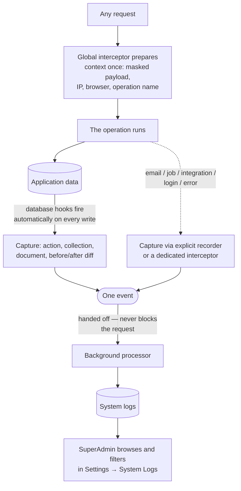

# System Logs (developer audit log)

**System Logs** is the platform's exhaustive technical record. Every database write, every sign-in attempt, every outbound email, every background job, every third-party integration call, every device-data API request and every uncaught server error lands here — automatically, as a side effect of the thing itself, with no feature code required to remember to log it.

> **Reading this doc:** use the **Business / Developer** switch at the top. *Business* explains what is captured, who can read it, and its limits. *Developer* adds the global Mongoose-plugin mechanics, every hook and emitter, masking, the GraphQL surface, schema and index design, file references, and a terminology primer.

> **This module was renamed.** It was previously `activity-logs`; the module is now `denowatts-backend/src/system-logs/` and the Mongo collection was renamed `activitylogs` → `systemlogs` by a one-time idempotent migration — `denowatts-backend/src/system-logs/migrations/rename-collection.migration.ts:1-12`. The old `activity-logs.md` doc is superseded by this one.

> **Not the same thing as [[audit-trail]].** System Logs is the developer log — high-volume, technical, SuperAdmin-only. The Audit Trail is the curated, business-readable feed of ~53 named actions, readable by company admins. They are separate features with separate pages and separate collections, and each deliberately excludes the other's collection from its own logging — `denowatts-backend/src/system-logs/events/system-log.events.ts:14-23`.

---

## Why this matters

When something went wrong and nobody knows why, this is the record of last resort. It answers "did that email actually send?", "what did the request body look like?", "which job failed at 3am?", "was that a 401 or a 500?", and "what exactly did this document look like before the change?" — questions the business-facing trail deliberately doesn't carry.

---

## How an entry is created



The key property: **nobody has to remember to log a data change.** The database hooks are installed fleet-wide on every collection at boot, so recording is a side effect of the write itself.

---

## What gets recorded

Eleven kinds of operation — `denowatts-backend/src/system-logs/events/system-log.events.ts:47-59`:

| Action | Source |
|---|---|
| `CREATE` / `UPDATE` / `DELETE` | The global database hooks — every write, every collection |
| `LOGIN` / `SIGNUP` | The auth interceptor |
| `EMAIL` | Outbound email |
| `SCHEDULE_JOB` | Background and cron jobs (report generation, QuickBooks token refresh) |
| `WEBHOOK` | Inbound webhook calls. See [[webhooks]] |
| `INTEGRATION` | Outbound third-party calls (HubSpot, QuickBooks, DocuSeal, S3) |
| `V3_API` | Inbound device-data API calls. See [[data-out]] |
| `ERROR` | Uncaught internal server errors, via the global exception filter |

**Operation and outcome are separate dimensions.** Each entry pairs one action with a `SUCCESS` or `FAILED` status, so a `LOGIN` or an `EMAIL` can be either — rather than being two different action names — `:25-30`.

> This is a change from the old model. Legacy rows that encoded the outcome in the action name (`LOGIN_SUCCESS`, `EMAIL_FAILED`, `JOB_RUN`, …) are rewritten to the action+status pair by an idempotent migration that runs on every boot — `denowatts-backend/src/system-logs/system-logs.service.ts:232-270`.

`V3_API` entries are unusual and worth knowing about: those calls are API-key-authenticated, not user calls, so "actioned by" is the **masked API key** rather than a user, and the entity is the queried **Site** rather than a user — `denowatts-backend/src/system-logs/events/system-log.events.ts:38-42`.

---

## What an entry tells you

- **What happened** — the action, the outcome, and a human-readable summary (e.g. *"Updated site (name, status)"*).
- **Who** — the acting user, when there was one.
- **What was touched** — the collection and document id, plus a name for that document **resolved live at query time** so it reflects reality today.
- **The change** — a before/after diff for data writes, and the previous values of the updated fields.
- **The request** — the masked inbound payload, the IP, the browser, and the GraphQL operation or REST route.
- **A status code** — `201`/`200`/`204` for creates/updates/deletes, the thrown HTTP status for failed logins, and the upstream or outcome code for integrations and jobs.

---

## Who can see it

**SuperAdmins only.** The entire resolver is `@Roles(UserType.SUPER_ADMIN)` — `denowatts-backend/src/system-logs/system-logs.resolver.ts:13`. This is stricter than [[audit-trail]], which company admins can also read.

---

## The rules that matter

- **Logging never breaks or slows the operation being logged.** Capture emits an event and returns; a background listener does the write, and swallows any failure — `denowatts-backend/src/system-logs/system-log.processor.ts:32-56`, `denowatts-backend/src/system-logs/audit.service.ts:59-63`.
- **Secrets are masked before anything is stored.** Passwords collapse entirely to `*****`; long tokens, API keys and secrets keep four head and four tail characters so they stay identifiable without being exposed — `denowatts-backend/src/system-logs/events/system-log.events.ts:129-173`.
- **Token-refresh operations are never logged at all** — `:147-148`.
- **`password`, `_id`, `__v`, `createdAt` and `updatedAt` are never diffed.**
- **The log never logs itself.** `systemlogs` and `auditevents` are excluded at both the emit site and the persist site — belt and braces — `:14-23`, `denowatts-backend/src/system-logs/system-log.processor.ts:35-36`.
- **Entries are immutable by convention** — no code path updates an audit row. `updatedAt` is kept anyway (it simply mirrors `createdAt`) because dropping it would null the GraphQL field the portal expects — `denowatts-backend/src/system-logs/schemas/system-logs.schema.ts:28-32`.
- **A 400 Bad Request on login or signup is not audited at all** — invalid credentials, validation rejections, duplicate emails and unverified emails are client-side input noise. The original error is always re-thrown unchanged, so skipping the audit never affects the response — `denowatts-backend/src/auth/interceptors/auth-audit.interceptor.ts:33-41`.

---

## Entry points {dev}

| Surface | Route | Guard | File |
|---|---|---|---|
| Settings → System Logs | `/settings/system-logs` | `requireSuperAdmin` | `denowatts-portal/src/routes/_dashboard/settings/system-logs.tsx:5-9` |

Portal feature: `denowatts-portal/src/features/settings/system-logs/SystemLogsPage.tsx`.

---

## API surface {dev}

`denowatts-backend/src/system-logs/system-logs.resolver.ts` — read-only, `@Roles(UserType.SUPER_ADMIN)`.

```graphql
query systemLogs(filter: SystemLogPaginateFilterInput!): SystemLogPaginateResponse!
query systemLogFilterOptions: SystemLogFilterOptions!
query systemLogStats: SystemLogStats!
```

`SystemLogPaginateFilterInput` — `denowatts-backend/src/system-logs/dto/system-log.input.ts:13-69`: `page` (default 1), `limit` (default **10**), `search`, `target`, `action` (`LogActionType`), `userTypes` (`[UserType]`), `status` (`SystemLogStatus`), a status-code filter, `startDate`, `endDate`.

`SystemLogStats` returns four buckets — all-time, last 30 days, last 7 days, and since start of today — each with `total` / `success` / `failed` — `:77-100`.

`SystemLogFilterOptions` returns the distinct collections present plus every possible action and status value — `:107-117`.

---

## Capture layer {dev}

### 1 — Global Mongoose plugin (data writes)

Registered fleet-wide as a **connection plugin** at bootstrap, so it applies to every schema on the connection — `denowatts-backend/src/app.module.ts:126` (`connection.plugin(SystemLogService.apply)`).

`SystemLogService.apply(schema)` installs matched pre/post hook pairs — `denowatts-backend/src/system-logs/system-logs.service.ts:520-607`:

| Pre (captures "before") | Post (emits) |
|---|---|
| `save` → stashes `getChanges()` on `$locals` | `save` → `CREATE` if new, `UPDATE` if changed |
| `updateOne`, `findOneAndUpdate`, `replaceOne`, `findOneAndReplace` → snapshot via `captureQuerySnapshot` | same four → `UPDATE` |
| — | `deleteOne`, `findOneAndDelete` → `DELETE` |

> **The before-snapshot is stashed per-operation, not in shared static state.** Document hooks use `$locals`; query hooks use a symbol on the Mongoose `Query` object (`SYSTEM_LOG_QUERY_STATE`). The comment records why: shared static state **raced across concurrent requests** — `denowatts-backend/src/system-logs/events/system-log.events.ts:107-112`, `denowatts-backend/src/system-logs/system-logs.service.ts:521-525`.

Because the plugin runs outside Nest's DI container, the service exposes a **static bridge** (`SystemLogService.eventEmitter`) set once in the constructor, so the hooks can reach the emitter — `:208-231`.

Diffs are computed with `deep-object-diff`'s `detailedDiff`; for updates, the previous values of exactly the updated keys are extracted into `before` — `:495-513`.

### 2 — Global request interceptor (context only)

`SystemLogInterceptor` is registered as an `APP_INTERCEPTOR` — `denowatts-backend/src/system-logs/system-logs.module.ts:37-38`. It prepares one transport-agnostic context per request (masked payload, `skip` flag, IP, user-agent, and the GraphQL operation name or REST route) and stashes it on the request under a **symbol**, which keeps it off enumerable/serializable request surfaces — `denowatts-backend/src/system-logs/interceptors/system-log.interceptor.ts:28-34`, `denowatts-backend/src/system-logs/events/system-log.events.ts:101-105`.

> It deliberately **does not emit** audit events itself. Data-change auditing stays with the Mongoose hooks, which have the diff — so there is exactly one log per change rather than a duplicate from the request layer — `denowatts-backend/src/system-logs/interceptors/system-log.interceptor.ts:16-25`.

### 3 — `AuditService.record()` (non-DB activity)

For work that never touches Mongo and so is invisible to the hooks — emails, background jobs, external integrations. Emits the same `SYSTEM_LOG_CAPTURED` event, always sets `changes: null`, defaults the actor to the request user (null for background jobs), and never throws — `denowatts-backend/src/system-logs/audit.service.ts:31-64`.

The module is `@Global()`, so any service can inject `AuditService` without module wiring — `denowatts-backend/src/system-logs/system-logs.module.ts:17-19`.

### 4 — Dedicated interceptors and the exception filter

| Emitter | File |
|---|---|
| `AuthAuditInterceptor` (`LOGIN` / `SIGNUP`) | `denowatts-backend/src/auth/interceptors/auth-audit.interceptor.ts` |
| `WebhookAuditInterceptor` (`WEBHOOK`) | `denowatts-backend/src/webhooks/interceptors/webhook-audit.interceptor.ts` |
| `DeviceDataAuditInterceptor` (`V3_API`) | `denowatts-backend/src/data-out/interceptors/device-data-audit.interceptor.ts` |
| Global exception filter (`ERROR`) | `denowatts-backend/src/common/exception-filters/sentry-exception.filter.ts` |

> **Why auth auditing is an interceptor, not service code:** an interceptor wraps the *whole* handler pipeline including the `ValidationPipe`, so its `catchError` sees class-validator rejections (malformed email, missing password) that throw before the resolver is ever reached — `denowatts-backend/src/auth/interceptors/auth-audit.interceptor.ts:25-31`.

---

## Persist layer {dev}

`SystemLogProcessor` listens with `@OnEvent(SYSTEM_LOG_CAPTURED, { async: true })` — the `async: true` flag lets `@nestjs/event-emitter` run the handler **without the emitter awaiting it**, so the triggering request is never blocked — `denowatts-backend/src/system-logs/system-log.processor.ts:14-56`.

It re-checks the self-logging exclusion list (defense in depth), defaults `status` to `SUCCESS`, and swallows every error — `:35-55`.

---

## Read pipeline {dev}

Two fields are **not persisted** and are resolved at query time — `denowatts-backend/src/system-logs/schemas/system-logs.schema.ts:75-90`:

- **`documentName`** — a human-readable label for `documentId`, looked up live in the target collection (or read from the log's own stored data for deletes, where the document is gone).
- **`referenceNames`** — names for the ObjectId references found inside `changes` / `before`, keyed by raw id string, so the portal shows "Acme Solar" rather than a bare Mongo id.

Six collections have hand-tuned lookups with specific `.select()` fields — `sites`, `users`, `channels`, `assets`, `companies`, `energymodels` (which joins through to its parent site). Any other target with a `documentId` still resolves, through a generic collection-name fallback — `denowatts-backend/src/system-logs/system-logs.service.ts:55-70`.

Some `target` values are category labels rather than real collection names, so an override map routes their `documentId` to the right collection — `auth` → `users`, `error` → `users`, `docuseal` → `quotes`. Renaming the targets instead would break the Collection column's grouping — `:72-84`.

---

## Schema {dev}

`denowatts-backend/src/system-logs/schemas/system-logs.schema.ts` — collection **`systemlogs`**, `timestamps: true`.

| Field | Notes |
|---|---|
| `target` | The collection name, or a category label (`auth`, `error`, `email`, `docuseal`, …) |
| `action` | `LogActionType` |
| `status` | `SUCCESS` / `FAILED`, defaults `SUCCESS` |
| `event` | Human-readable summary |
| `user`, `documentId` | ObjectIds |
| `documentName`, `referenceNames` | **Not persisted** — resolved at query time |
| `payload` | Masked inbound payload; null for `AuditService` entries |
| `changes`, `before` | Diff and previous values; null for `AuditService` entries |
| `context` | `ip`, `userAgent`, `origin` — an `_id`-less sub-schema, the single source of truth for the shape |
| `statusCode` | HTTP/outcome code |

Six indexes, all `createdAt: -1` compound — `:147-159`: `{createdAt}`, `{action, createdAt}`, `{status, createdAt}`, `{user, createdAt}`, `{documentId, createdAt}`, and `{target, documentId, createdAt}` for "every change to Site X".

---

## Data touched {dev}

- `systemlogs.*` — inserted by the processor; **updated once at boot** by the legacy-action normalization migration — `denowatts-backend/src/system-logs/system-logs.service.ts:240-270`.
- `users`, `sites`, `channels`, `assets`, `companies`, `energymodels` — read-only live label lookups — `denowatts-backend/src/system-logs/system-logs.module.ts:22-30`.
- **Every other collection on the connection** — hooked for CREATE/UPDATE/DELETE capture, except `systemlogs` and `auditevents`.

---

## Edge cases & gotchas {dev}

- **The hooks only cover document- and query-level operations.** `insertMany`, `updateMany`, `deleteMany`, `bulkWrite` and raw driver calls have **no hooks registered**, so bulk operations leave no trace — `denowatts-backend/src/system-logs/system-logs.service.ts:520-607`.
- **`post("save")` classifies by change count.** A save whose `getChanges()` is empty is logged as `CREATE`; a genuine no-op re-save of an existing document could be misclassified — `:544-555`.
- **Masking is key-name-based, not value-based.** A secret stored under an unrecognized key name (not matching `password`/`token`/`secret`/`apikey`/`authorization`/`credential`/`privatekey`/`clientsecret`/`sessionkey`) is persisted in the clear — `denowatts-backend/src/system-logs/events/system-log.events.ts:134-145`.
- **Full payloads are stored.** `payload`, `changes` and `before` are `Mixed` with no size cap, so a large mutation body is persisted whole. High-volume `V3_API` and CRUD traffic makes this collection the fastest-growing in the database, and **there is no TTL or retention policy** — flag for human review.
- **`documentName` and `referenceNames` cost a lookup per page.** They are resolved live on every read, so a page of logs spanning many collections fans out into several queries.
- **Live name resolution rewrites history.** A renamed site shows its *current* name against an old log entry — deliberate, but it means the label is not evidence of what the record was called at the time.
- **The boot migration runs on every start.** It is idempotent and matches nothing once normalized, but it is still an `updateMany` sweep over a very large collection at every deploy — `denowatts-backend/src/system-logs/system-logs.service.ts:232-270`.
- **The static `eventEmitter` bridge is process-global.** It is set in the service constructor; hooks that fire before the module is instantiated would find it `undefined` — `:208-231`.
- **Immutability is convention only.** Nothing prevents an update or delete of a log row, and the boot migration itself writes to them — `denowatts-backend/src/system-logs/schemas/system-logs.schema.ts:28-32`.
- **Default page size is 10** here, versus 25 in [[audit-trail]] — `denowatts-backend/src/system-logs/dto/system-log.input.ts:18`.

---

## Solar & platform terminology {dev}

- **System log** — the technical audit entry described here; distinct from the business-facing [[audit-trail]] event.
- **Global Mongoose plugin** — a function applied to every schema on the connection, used here to install the CRUD hooks fleet-wide without per-module wiring.
- **Pre/post hook** — Mongoose lifecycle callbacks around a write; the pre-hook captures "before", the post-hook emits the entry.
- **`$locals` / query symbol** — per-document and per-query stashes used instead of shared static state, which raced across concurrent requests.
- **Detailed diff** — the `added` / `updated` / `deleted` breakdown produced by `deep-object-diff`.
- **Masking** — redacting secrets before persistence: full for passwords, partial (`abcd***wxyz`) for long tokens.
- **`V3_API`** — the API-key-authenticated device-data REST API (`channel-raw`, `channel-rollup`, `site-rollup`, `site-daily-rollup`); its log rows are keyed to a Site, not a User. See [[data-out]].
- **Agenda** — the MongoDB-backed job scheduler whose runs are logged as `SCHEDULE_JOB`. See [[agenda]].
- **DocuSeal / HubSpot / QuickBooks** — third-party integrations whose outbound calls are logged as `INTEGRATION`. See [[quote]] and [[webhooks]].
- **Denobox** — the site gateway whose S3 file operations surface as `INTEGRATION` entries. See [[storage]].

For the full domain vocabulary, see [[solar-glossary]].

---

**Related flows:** [[audit-trail]] · [[authentication]] · [[webhooks]] · [[data-out]] · [[agenda]] · [[notification]] · [[storage]] · [[quote]] · [[settings]] · [[users]] · [[solar-glossary]]
